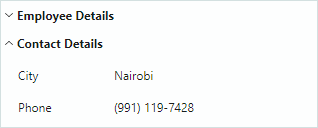

# Data Binding and Row Creation

This topic shows how to bind a PropertyGrid to a single and multiple objects. The control automatically generates rows for public properties of the bound object(s) by default. You can disable automatic row generation, create rows manually, customize row options, and specify row templates.

## Bind to One Object

Use the `PropertyGridControl.SelectedObject` property to bind the control to a single object. When bound, the control automatically displays the object's properties.

### Example

The following example binds a PropertyGrid to a _MyBusinessObject_ object defined in a ViewModel.


``` xml
xmlns:mxpg="https://schemas.eremexcontrols.net/avalonia/propertygrid"
xmlns:local="using:PropertyGridTest"

<Window.DataContext>
    <local:SampleViewModel/>
</Window.DataContext>

<mxpg:PropertyGridControl 
    Name="propertyGridControl1"
    SelectedObject="{Binding MyBusinessObject}"
    BorderThickness="1"
    UseModernAppearance="True" 
    Margin="5"/>
```

``` csharp
using CommunityToolkit.Mvvm.ComponentModel;

public partial class SampleViewModel : ViewModelBase
{
    [ObservableProperty]
    MyBusinessObject myBusinessObject;
}

public partial class MyBusinessObject : ViewModelBase
{
    [ObservableProperty]
    string text = "Sample text";

    [ObservableProperty]
    double borderSize = 5;

    [property: Category("Font")]
    [ObservableProperty]
    string fontFamily = FontManager.Current.DefaultFontFamily.Name;

    [property: Category("Font")]
    [ObservableProperty]
    double fontSize = 14;

    [property: Category("Font")]
    [ObservableProperty]
    bool isBold = true;

    [property: Category("Font")]
    [ObservableProperty]
    bool isItalic;

    [property: Category("Alignment")]
    [ObservableProperty]
    HorizontalAlignment horizontalAlignment = HorizontalAlignment.Center;

    [property: Category("Alignment")]
    [ObservableProperty]
    VerticalAlignment verticalAlignment;

    [ObservableProperty]
    Point location = new Point(11, 22);
}

public class ViewModelBase : ObservableObject
{
}
```

## Bind to Multiple Objects

The `PropertyGridControl` can display and edit properties that two or more objects have in common. Assign a list of these objects to the `PropertyGridControl.SelectedObjects` property. This causes the control to only display matching properties (those that have the same name and data type).

``` xml
xmlns:mxpg="https://schemas.eremexcontrols.net/avalonia/propertygrid"

<mxpg:PropertyGridControl>
    <mxpg:PropertyGridControl.SelectedObjects>
        <local:MyList>
            <local:MyBusinessObject1/>
            <local:MyBusinessObject2/>
        </local:MyList>
    </mxpg:PropertyGridControl.SelectedObjects>
</mxpg:PropertyGridControl>
```
``` csharp
public class MyList : List<object>
{        
}
```

## Row Creation

After you bind PropertyGrid to an object(s), the control's default behavior is to automatically generate rows to display and edit properties of the bound object(s). The control automatically generates the following row types during the control's initialization:

- Data rows (`PropertyGridRow` objects) are generated for all public properties. These rows display the names and values of bound properties.
  
  

- Category rows (`PropertyGridCategoryRow` objects) are generated from `System.ComponentModel.CategoryAttribute` attributes applied to underlying public properties. Corresponding data rows are grouped within these category rows.

  

PropertyGrid provides the following row customizaton features:

- Disabling automatic row generation with the `PropertyGridControl.AutoGenerateRows` property.
- Manual row creation.
- Using Annotation attributes to customize row options.
- Specifying data templates to render individual rows.
- Generating rows from a collection of row View Models (`RowsSource`)

See the following topic for more information: [Rows](rows.md).

