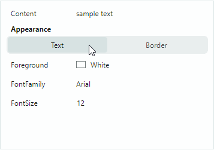
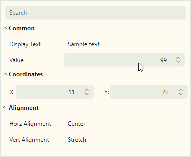

# PropertyGrid Rows

PropertyGrid can automatically create rows for properties exposed by the bound object(s) (see [`PropertyGridControl.SelectedObject`](../../API/Eremex.AvaloniaUI.Controls.PropertyGrid/PropertyGridControl/SelectedObject.md) and [`PropertyGridControl.SelectedObjects`](../../API/Eremex.AvaloniaUI.Controls.PropertyGrid/PropertyGridControl/SelectedObjects.md)). 
Automatic row generation is enabled by default. 
You can disable automatic row generation with the [`PropertyGridControl.AutoGenerateRows`](../../API/Eremex.AvaloniaUI.Controls.PropertyGrid/PropertyGridControl/AutoGenerateRows.md) option, and then create rows manually.


PropertyGrid supports three row types:

- Regular (data) rows ([`PropertyGridRow`](../../API/Eremex.AvaloniaUI.Controls.PropertyGrid/PropertyGridRow.md)) — Display the names and values of bound properties.
  
  

- Category rows ([`PropertyGridCategoryRow`](../../API/Eremex.AvaloniaUI.Controls.PropertyGrid/PropertyGridCategoryRow.md)) — Used to group other rows into categories. Users can collapse and expand category rows to hide/show their children.
  
  

- Tab rows ([`PropertyGridTabRow`](../../API/Eremex.AvaloniaUI.Controls.PropertyGrid/PropertyGridTabRow.md)) — Used to organize rows into a tabbed UI. Tab rows do not support the collapse/expand feature.
  
  

## Create Rows

With the automatic row generation feature enabled, an empty PropertyGrid control creates data and category rows based on the information retrieved from the bound object:

- Regular rows are created for all public properties.
- Category rows are generated from `System.ComponentModel.CategoryAttribute` attributes applied to underlying public properties. Corresponding data rows are grouped within these categories.

If any row has been manually added to the control (for instance, in XAML), automatic row generation is not in effect. Set the [`PropertyGridControl.AutoGenerateRows`](../../API/Eremex.AvaloniaUI.Controls.PropertyGrid/PropertyGridControl/AutoGenerateRows.md) property to `false` to forcibly disable automatic row generation.

Use the `PopulateRows` method to generate data and category rows from the bound object(s) in code-behind. This method clears the existing row collection before new rows are added.

You can apply specific Data Annotation attributes to a bound object's properties to control the presence, display name, and read-only status of generated PropertyGrid rows. See the following section for more details: [Use Attributes to Customize Row Settings](#use-attributes-to-customize-row-settings).

The [`PropertyGridControl.Rows`](../../API/Eremex.AvaloniaUI.Controls.PropertyGrid/PropertyGridControl/Rows.md) collection allows you to access the control's rows, add and delete individual items.

### Create Data Rows

Use [`PropertyGridRow`](../../API/Eremex.AvaloniaUI.Controls.PropertyGrid/PropertyGridRow.md) objects to create data rows. To add data rows at the root level, add [`PropertyGridRow`](../../API/Eremex.AvaloniaUI.Controls.PropertyGrid/PropertyGridRow.md) objects to the [`PropertyGridControl.Rows`](../../API/Eremex.AvaloniaUI.Controls.PropertyGrid/PropertyGridControl/Rows.md) collection.

The main settings of the [`PropertyGridRow`](../../API/Eremex.AvaloniaUI.Controls.PropertyGrid/PropertyGridRow.md) class include:

- [`PropertyGridRow.FieldName`](../../API/Eremex.AvaloniaUI.Controls.PropertyGrid/PropertyGridRow/FieldName.md) — Gets or sets the name of the public property to which the row is bound.
- [`PropertyGridRow.Caption`](../../API/Eremex.AvaloniaUI.Controls.PropertyGrid/PropertyGridRowBase/Caption.md) — Gets or sets the row's header. For auto-generated rows, the [`Caption`](../../API/Eremex.AvaloniaUI.Controls.PropertyGrid/PropertyGridRowBase/Caption.md) property contains the property's display name.
- [`PropertyGridRow.AllowEditing`](../../API/Eremex.AvaloniaUI.Controls.PropertyGrid/PropertyGridRow/AllowEditing.md) — Gets or sets whether value edit operations are enabled.
- [`PropertyGridRow.EditorProperties`](../../API/Eremex.AvaloniaUI.Controls.PropertyGrid/PropertyGridRow/EditorProperties.md) — Allows you to assign a custom in-place editor to the row's value. See [Data Editing](data-editing.md).

#### Example

The following XAML code creates three data rows ([`PropertyGridRow`](../../API/Eremex.AvaloniaUI.Controls.PropertyGrid/PropertyGridRow.md) objects), and binds them to fields of the object assigned to the control's data context.

``` xml
xmlns:mxpg="https://schemas.eremexcontrols.net/avalonia/propertygrid"

<mxpg:PropertyGridControl x:Name="pGrid1" SelectedObject="{Binding}" Grid.Column="1">
    <mxpg:PropertyGridRow FieldName="Caption">
    </mxpg:PropertyGridRow>
    <mxpg:PropertyGridRow FieldName="OrderNo">
    </mxpg:PropertyGridRow>
    <mxpg:PropertyGridRow FieldName="InvoiceNo">
    </mxpg:PropertyGridRow>
</mxpg:PropertyGridControl>
```

#### Example

The following example creates data rows in code-behind:

``` xml
xmlns:mxpg="https://schemas.eremexcontrols.net/avalonia/propertygrid"

<mxpg:PropertyGridControl x:Name="pGrid1" AutoGenerateRows="False" 
 SelectedObject="{Binding}" Grid.Column="1">
</mxpg:PropertyGridControl>
```
``` csharp
using Eremex.AvaloniaUI.Controls.PropertyGrid;

pGrid1.Rows.Add(new PropertyGridRow() { FieldName = "Caption" });
pGrid1.Rows.Add(new PropertyGridRow() { FieldName = "OrderNo" });
pGrid1.Rows.Add(new PropertyGridRow() { FieldName = "InvoiceNo" });
```

### Create Category Rows

PropertyGrid can generate category rows from `System.ComponentModel.CategoryAttribute` attributes applied to underlying public properties. Corresponding data rows are grouped in these category rows.

You can disable automatic row generation and create a custom set of data rows and category rows. Use [`PropertyGridCategoryRow`](../../API/Eremex.AvaloniaUI.Controls.PropertyGrid/PropertyGridCategoryRow.md) objects to define category rows. Add [`PropertyGridCategoryRow`](../../API/Eremex.AvaloniaUI.Controls.PropertyGrid/PropertyGridCategoryRow.md) objects to the [`PropertyGridControl.Rows`](../../API/Eremex.AvaloniaUI.Controls.PropertyGrid/PropertyGridControl/Rows.md) collection to display them at the root level.

The main settings of the [`PropertyGridCategoryRow`](../../API/Eremex.AvaloniaUI.Controls.PropertyGrid/PropertyGridCategoryRow.md) class include:

- [`PropertyGridCategoryRow.Rows`](../../API/Eremex.AvaloniaUI.Controls.PropertyGrid/PropertyGridCategoryRow/Rows.md) — The collection of rows displayed as a category row's children. Typically, you add data rows ([`PropertyGridRow`](../../API/Eremex.AvaloniaUI.Controls.PropertyGrid/PropertyGridRow.md) objects) to this collection.
- [`PropertyGridCategoryRow.Caption`](../../API/Eremex.AvaloniaUI.Controls.PropertyGrid/PropertyGridRowBase/Caption.md) — Gets or sets the category row's display name. For auto-generated category rows, this property returns the `CategoryAttribute`'s value.

#### Example

The following XAML code creates two category rows (_Name_ and _Details_). They have one and two data rows as children, respectively.

``` xml
xmlns:mxpg="https://schemas.eremexcontrols.net/avalonia/propertygrid"
<mxpg:PropertyGridControl x:Name="pGrid1" SelectedObject="{Binding}" Grid.Column="1">
    <mxpg:PropertyGridCategoryRow Caption="Name">
        <mxpg:PropertyGridRow FieldName="Caption">
        </mxpg:PropertyGridRow>
    </mxpg:PropertyGridCategoryRow>
    <mxpg:PropertyGridCategoryRow Caption="Details">
        <mxpg:PropertyGridRow FieldName="OrderNo">
        </mxpg:PropertyGridRow>
        <mxpg:PropertyGridRow FieldName="InvoiceNo">
        </mxpg:PropertyGridRow>
    </mxpg:PropertyGridCategoryRow>
</mxpg:PropertyGridControl>
```

#### Example
The following example creates category rows, and places data rows to the created categories in code-behind.

``` xml
xmlns:mxpg="https://schemas.eremexcontrols.net/avalonia/propertygrid"

<mxpg:PropertyGridControl x:Name="pGrid1" AutoGenerateRows="False" 
 SelectedObject="{Binding}" Grid.Column="1">
</mxpg:PropertyGridControl>
```
``` csharp
using Eremex.AvaloniaUI.Controls.PropertyGrid;

PropertyGridCategoryRow categoryRowName = new PropertyGridCategoryRow() 
{ 
    Caption = "Name" 
};
pGrid1.Rows.Add(categoryRowName);
categoryRowName.Rows.Add(new PropertyGridRow() 
{ 
    FieldName = "Caption" 
});

PropertyGridCategoryRow categoryRowDetails = new PropertyGridCategoryRow() 
{ 
    Caption = "Details" 
};
pGrid1.Rows.Add(categoryRowDetails);
categoryRowDetails.Rows.Add(new PropertyGridRow() { FieldName = "OrderNo" });
categoryRowDetails.Rows.Add(new PropertyGridRow() { FieldName = "InvoiceNo" });
```

## Create Tab Rows

A tab row ([`PropertyGridTabRow`](../../API/Eremex.AvaloniaUI.Controls.PropertyGrid/PropertyGridTabRow.md)) allows you to group rows into a tabbed UI. It consists of a header, tab switcher and client area. When a user selects a tab, the client area displays a set of properties that corresponds to the selected tab. The following image demonstrates a PropertyGrid control with two tab rows (_Appearance_ and _Layout_):


The control populates the tab collection from the tab row's children ([`PropertyGridTabRowItem`](../../API/Eremex.AvaloniaUI.Controls.PropertyGrid/PropertyGridTabRowItem.md) objects). Each [`PropertyGridTabRowItem`](../../API/Eremex.AvaloniaUI.Controls.PropertyGrid/PropertyGridTabRowItem.md) object defines a collection of rows associated with this tab.

### Example

The following example creates the _Appearance_ tab row that consists of two tabs (_Text_ and _Border_). Each tab displays its own set of properties when selected.



``` xml
xmlns:mxpg="https://schemas.eremexcontrols.net/avalonia/propertygrid"
xmlns:mxe="https://schemas.eremexcontrols.net/avalonia/editors"

<UserControl.Resources>
    <DataTemplate x:Key="spinEditorTemplate1">
        <mxe:SpinEditor x:Name="PART_Editor" HorizontalContentAlignment="Stretch"/>
    </DataTemplate>
    <DataTemplate x:Key="spinEditorTemplate2">
        <mxe:SpinEditor x:Name="PART_Editor" HorizontalContentAlignment="Stretch" 
         Increment="0.1"/>
    </DataTemplate>
</UserControl.Resources>

<mxpg:PropertyGridControl x:Name="propertyGrid" 
                          SelectedObject="{Binding}" 
                          UseModernAppearance="True" 
                          ImmediatePostEditor="True" 
                          BorderThickness="1,0" Grid.Column="1"
                          ShowSearchPanel="False"
                          >
    <mxpg:PropertyGridRow FieldName="Content"/>

    <mxpg:PropertyGridTabRow Caption="Appearance">
        <mxpg:PropertyGridTabRowItem Header="Text">
            <mxpg:PropertyGridRow FieldName="Foreground"/>
            <mxpg:PropertyGridRow FieldName="FontFamily">
                <mxpg:PropertyGridRow.EditorProperties>
                    <mxe:ComboBoxEditorProperties 
                        IsTextEditable="False" 
                        ItemsSource="{Binding Source={x:Static FontManager.Current}, 
                         Path=SystemFonts}" 
                        ValueMember="Name" DisplayMember="Name"/>
                </mxpg:PropertyGridRow.EditorProperties>
            </mxpg:PropertyGridRow>
            <mxpg:PropertyGridRow FieldName="FontSize" 
             CellTemplate="{StaticResource spinEditorTemplate1}"/>

        </mxpg:PropertyGridTabRowItem>

        <mxpg:PropertyGridTabRowItem Header="Border">
            <mxpg:PropertyGridRow FieldName="Background"/>
            <mxpg:PropertyGridRow FieldName="Opacity" 
             CellTemplate="{StaticResource spinEditorTemplate2}"/>
            <mxpg:PropertyGridRow FieldName="BorderThickness" 
             CellTemplate="{StaticResource spinEditorTemplate1}"/>
            <mxpg:PropertyGridRow FieldName="BorderBrush"/>
        </mxpg:PropertyGridTabRowItem>
    </mxpg:PropertyGridTabRow>
</mxpg:PropertyGridControl>
```

## Use Attributes to Customize Row Settings

You can apply attributes to properties of a bound object to customize the visibility status, view and behavior settings for corresponding rows in the PropertyGridControl. The following attributes are supported:

### `Browsable` Attribute
The `System.ComponentModel.BrowsableAttribute` attribute controls the presence of PropertyGrid rows that correspond to specific properties in the bound object. To prevent individual rows from being created apply the **Browsable(false)** attribute to related properties.

``` csharp
public partial class MyBusinessObject : ObservableObject
{
    [Browsable(false)]
    public string Caption {
        get;set;
    }
}
```

### `Category` Attribute

The `System.ComponentModel.CategoryAttribute` attribute sets the name of the category for a property. When PropertyGrid encounters this attribute applied to a property, the control creates a category row with the specified category name, and places a corresponding data row within this category row.

``` csharp
[Category("Title")]
public string Caption {
    get;set;
}
```

### `DisplayName` Attribute

The `System.ComponentModel.DisplayNameAttribute` attribute assigns a custom display name to a property. When this attribute is specified, the PropertyGrid control uses this display name for captions of corresponding rows.

``` csharp
[DisplayName("Name")]
public string Caption {
    get;set;
}
```

### `ReadOnly` Attribute

The `System.ComponentModel.ReadOnlyAttribute` attribute marks a property as read-only, and prevents edit operations on a corresponding row in the PropertyGrid control.

``` csharp
[ReadOnly(true)]
public string OrderId {
    get; set;
}
```

### `TypeConverter` Attribute

The `System.ComponentModel.TypeConverterAttribute` attribute allows you to  associate a `TypeConverter` object (a `System.ComponentModel.TypeConverter` descendant) with a property.PropertyGrid uses this converter to convert between display values and edit values. The type converter's functionality is invoked in the following cases:

- When the control is about to display a value in a cell, or when the cell's edit value is changed. The `TypeConverter` converts the cell's edit value to a display value.
- When a user edits a cell and then moves focus away to another cell. The `TypeConverter` performs backward conversion.

## Custom Row Templates

A data row's default rendering consists of the header and value regions. 

You can use the `CellTemplate` property to specify a template used to render row value regions. See the following topics for more information: [Data Editing](data-editing.md) and [Custom Editors](custom-editors.md)

Use the [`PropertyGridRow.RowTemplate`](../../API/Eremex.AvaloniaUI.Controls.PropertyGrid/PropertyGridRow/RowTemplate.md) property to render entire rows (the header and value regions) in a custom manner. This property specifies a custom row template.

### Example - Custom Row Template

The following code binds a PropertyGrid to a _MyBusinessObject_ object that has the _BorderSize_ and _Location_ properties of the `Integer` and `Point` types respectively. The code defines three [`PropertyGridRow`](../../API/Eremex.AvaloniaUI.Controls.PropertyGrid/PropertyGridRow.md) objects, two of which use custom templates. The templates contain custom controls to present and edit the _BorderSize_ and _Location_ properties.


The row template for the _BorderSize_ property displays a label, slider and [`SpinEditor`](../../API/Eremex.AvaloniaUI.Controls.Editors/SpinEditor.md). The slider and editor are bound to the target _BorderSize_ property.

The row template to edit the _Location_ property contains two labels and two [`SpinEditor`](../../API/Eremex.AvaloniaUI.Controls.Editors/SpinEditor.md)s. The corresponding [`PropertyGridRow`](../../API/Eremex.AvaloniaUI.Controls.PropertyGrid/PropertyGridRow.md) object is bound to the _Location_ property, while the [`SpinEditor`](../../API/Eremex.AvaloniaUI.Controls.Editors/SpinEditor.md)s are bound to the _X_ and _Y_ nested fields. An alternative option is to use the _Location.X_ and _Location.Y_ binding paths for the editors.

``` xml
xmlns:mxpg="https://schemas.eremexcontrols.net/avalonia/propertygrid"
xmlns:mxe="https://schemas.eremexcontrols.net/avalonia/editors"

<Window.DataContext>
    <local:SampleViewModel/>
</Window.DataContext>

<mxpg:PropertyGridControl
            x:Name="propertyGrid1" 
            SelectedObject="{Binding Path=MyBusinessObject}"
            UseModernAppearance="True"
            Margin="10"
            BorderThickness="1"
            ShowSearchPanel="False"
            >
            
    <mxpg:PropertyGridCategoryRow Caption="Common">
                
        <mxpg:PropertyGridRow FieldName="Text" />
                
        <mxpg:PropertyGridRow>
            <mxpg:PropertyGridRow.RowTemplate>
                <DataTemplate>
                    <Grid ColumnDefinitions="Auto, 2*, *" Margin="18,5,5,5">
                        <TextBlock Text="Border Size: "  VerticalAlignment="Center" 
                         Classes="PropertyGridRow_Modern"/>
                        <Slider Value="{Binding BorderSize, 
                         Converter={local:MyDoubleToIntConverter}}" 
                         Maximum="500" Focusable="False" Margin="0,0,5,0" Grid.Column="1" />
                        <mxe:SpinEditor EditorValue="{Binding BorderSize}" Maximum="500" 
                         Minimum="0" Grid.Column="2" />
                    </Grid>
                </DataTemplate>
            </mxpg:PropertyGridRow.RowTemplate>
        </mxpg:PropertyGridRow>
    </mxpg:PropertyGridCategoryRow>
            
    <mxpg:PropertyGridCategoryRow Caption="Coordinates">
        <mxpg:PropertyGridRow FieldName="Location">
            <mxpg:PropertyGridRow.RowTemplate>
                <DataTemplate>
                    <Grid ColumnDefinitions="*, 20, *"  Margin="18,5,5,5" Grid.Column="0">
                        <Grid ColumnDefinitions="Auto, *" >
                            <TextBlock Text="X:" HorizontalAlignment="Right" 
                             Classes="PropertyGridRow_Modern" VerticalAlignment="Center"/>
                            <mxe:SpinEditor EditorValue="{Binding X}" Minimum="0" 
                             Maximum="10000" Grid.Column="1" VerticalAlignment="Center"/>
                        </Grid>
                        <Grid ColumnDefinitions="Auto, *" Grid.Column="2">
                            <TextBlock Text="Y:" HorizontalAlignment="Right" 
                             Classes="PropertyGridRow_Modern" VerticalAlignment="Center"/>
                            <mxe:SpinEditor EditorValue="{Binding Y}" Minimum="0" 
                             Maximum="10000" Grid.Column="1" VerticalAlignment="Center"/>
                        </Grid>
                    </Grid>
                </DataTemplate>
            </mxpg:PropertyGridRow.RowTemplate>
        </mxpg:PropertyGridRow>
    </mxpg:PropertyGridCategoryRow>
</mxpg:PropertyGridControl>
```
``` csharp
using System.Drawing;
using CommunityToolkit.Mvvm.ComponentModel;

public partial class SampleViewModel : ViewModelBase
{
    [ObservableProperty]
    MyBusinessObject myBusinessObject = new MyBusinessObject();
}
public partial class MyBusinessObject : ViewModelBase
{
    [ObservableProperty]
    string text = "Sample text";

    [ObservableProperty]
    double borderSize = 5;

    [ObservableProperty]
    string fontFamily = FontManager.Current.DefaultFontFamily.Name;

    [ObservableProperty]
    double fontSize = 14;

    [ObservableProperty]
    Point location = new Point(11, 22);
}

public class ViewModelBase : ObservableObject
{
}
```

## Generate Rows from a Collection of Row View Models (MVVM)
 
PropertyGrid allows you to use the MVVM design pattern to populate the control with rows, and initialize the rows from View Models. 

The following PropertyGrid properties support the MVVM design pattern:
 
- [`PropertyGridControl.RowsSource`](../../API/Eremex.AvaloniaUI.Controls.PropertyGrid/PropertyGridControl/RowsSource.md) — The source of row View Models that will be rendered as root rows.  
- [`PropertyGridCategoryRow.RowsSource`](../../API/Eremex.AvaloniaUI.Controls.PropertyGrid/PropertyGridExpandableRowBase/RowsSource.md) — The source of row View Models that will be rendered as a category row's children.
- [`PropertyGridControl.RowsDataTemplates`](../../API/Eremex.AvaloniaUI.Controls.PropertyGrid/PropertyGridControl/RowsDataTemplates.md) — The collection of Data Templates that define [`PropertyGridRow`](../../API/Eremex.AvaloniaUI.Controls.PropertyGrid/PropertyGridRow.md) and [`PropertyGridCategoryRow`](../../API/Eremex.AvaloniaUI.Controls.PropertyGrid/PropertyGridCategoryRow.md) objects used to render corresponding row View Models from the `RowsSource` collections.

### Example 

The following tutorial demonstrates the MVVM approach to populating rows. This example initializes PropertyGrid rows from View Models, and creates the UI shown below:



The example creates the _Common_, _Coordinates_ and _Alignment_ category rows ([`PropertyGridCategoryRow`](../../API/Eremex.AvaloniaUI.Controls.PropertyGrid/PropertyGridCategoryRow.md) objects) from _CategoryRowViewModel_ objects. 

The View Models below are used to create regular rows within category rows:

- _DefaultRowViewModel_ — A ViewModel that corresponds to the default row (a [`PropertyGridRow`](../../API/Eremex.AvaloniaUI.Controls.PropertyGrid/PropertyGridRow.md) object with default settings). The default row's value data type determines the type of the in-place editor. The _DefaultRowViewModel_ object is used to create the _Display Text_, _Horz Alignment_ and _Vert Alignment_ rows.

- _NumericSpinEditorRowViewModel_ — A ViewModel that corresponds to a PropertyGrid row with an embedded SpinEditor. This View Model is used to create the _Value_ row.

- _PointEditorViewModel_ — A ViewModel that corresponds to a PropertyGrid row with a custom row template. This row template displays two SpinEditors and two labels arranged in a line to present and edit values of the `Point` data type.

Steps:

1. Define a target business object whose data needs to be displayed/edited in the PropertyGrid. Bind this object to the control with the [`PropertyGridControl.SelectedObject`](../../API/Eremex.AvaloniaUI.Controls.PropertyGrid/PropertyGridControl/SelectedObject.md) member.

    ``` csharp
    public partial class MyBusinessObject : ViewModelBase
    {
        [ObservableProperty]
        string text = "Sample text";

        [ObservableProperty]
        int value = 99;

        [ObservableProperty]
        double borderSize = 5;

        [property: Category("Font")]
        [ObservableProperty]
        string fontFamily = FontManager.Current.DefaultFontFamily.Name;

        [property: Category("Font")]
        [ObservableProperty]
        double fontSize = 14;

        [property: Category("Font")]
        [ObservableProperty]
        bool isBold = true;

        [property: Category("Font")]
        [ObservableProperty]
        bool isItalic;

        [property: Category("Alignment")]
        [ObservableProperty]
        HorizontalAlignment horizontalAlignment = HorizontalAlignment.Center;

        [property: Category("Alignment")]
        [ObservableProperty]
        VerticalAlignment verticalAlignment;

        [ObservableProperty]
        Point location = new Point(11, 22);
    }

    ```

    ``` xml
    xmlns:mxpg="https://schemas.eremexcontrols.net/avalonia/propertygrid"

    <mxpg:PropertyGridControl
        SelectedObject="{Binding MyBusinessObject}"
        ...
        >
        ...
    </mxpg:PropertyGridControl>
    ```

2. Create row View Model classes that contain settings used to initialize PropertyGrid rows (for instance, settings used to initialize a row's [`PropertyGridRow.FieldName`](../../API/Eremex.AvaloniaUI.Controls.PropertyGrid/PropertyGridRow/FieldName.md) and [`PropertyGridRow.Caption`](../../API/Eremex.AvaloniaUI.Controls.PropertyGrid/PropertyGridRowBase/Caption.md) properties). Each row View Model typically exposes a unique set of properties and features. A View Model for category rows should expose an `IEnumerable` object that contains child row View Models.

    ``` csharp
    // A View Model that corresponds to regular data rows.
    public class DefaultRowViewModel
    {
        // The path to a target object's property.
        public string? FieldName { get; set; }

        // The property's display name.
        public string? Caption { get; set; }
    }

    // A View Model that corresponds to category rows.
    public class CategoryRowViewModel
    {
        // The category's display name.
        public string? Caption { get; set; }

        // Child row View Models that will be rendered as child rows.
        public IEnumerable? Items { get; set; }
    }

    // A View Model that corresponds to a data row with an embedded SpinEditor 
    // used to edit numeric values.
    public class NumericSpinEditorRowViewModel
    {
        public string? FieldName { get; set; }

        public string? Caption { get; set; }

        // The minimum allowed value for the SpinEditor.
        public int? MinValue { get; set; }
        // The maximum allowed value for the SpinEditor.
        public int? MaxValue { get; set; }
    }

    // A View Model for a data row that uses two standalone SpinEditors 
    // to edit values of the Point data type.
    // This data row will be created from a custom row template.
    public class PointEditorViewModel
    {
        public string? FieldName { get; set; }
    }
    ```

3. Create an `IEnumerable` object that stores row View Model instances in the order that PropertyGrid should use to display corresponding rows.

    ``` csharp
    public partial class SampleViewModel : ViewModelBase
    {
        [ObservableProperty]
        IEnumerable myRowSource = GetMyRowSource();

        public static IEnumerable GetMyRowSource()
        {
            return new List<object>
                {
                    new CategoryRowViewModel()
                    {
                        Caption = "Common",
                        Items = new List<object>
                        {
                            new DefaultRowViewModel() 
                            { 
                                FieldName = "Text", Caption = "Display Text" 
                            },
                            new NumericSpinEditorRowViewModel() 
                            { 
                                FieldName = "Value", Caption = "Value", 
                             MinValue=1, MaxValue=100 
                            },
                        }
                    },

                    new CategoryRowViewModel()
                    {
                        Caption = "Coordinates",
                        Items = new List<object>
                        {
                            new PointEditorViewModel() 
                            { 
                                FieldName = "Location" 
                            }
                        }
                    },

                    new CategoryRowViewModel()
                    {
                        Caption = "Alignment",
                        Items = new List<object>
                        {
                            new DefaultRowViewModel() 
                            { 
                                FieldName = "HorizontalAlignment", 
                                Caption = "Horz Alignment" 
                            },
                            new DefaultRowViewModel() 
                            { 
                                FieldName = "VerticalAlignment", 
                             Caption = "Vert Alignment" 
                            },
                        }
                    }
                };
        }
    }
    ```

4. Set the [`PropertyGridControl.RowsSource`](../../API/Eremex.AvaloniaUI.Controls.PropertyGrid/PropertyGridControl/RowsSource.md) property to the created `IEnumerable` object.

    ``` xml
    xmlns:local="using:PropertyGridSample"
    xmlns:mxpg="https://schemas.eremexcontrols.net/avalonia/propertygrid"

    <Window.DataContext>
        <local:SampleViewModel/>
    </Window.DataContext>

    <mxpg:PropertyGridControl
        SelectedObject="{Binding MyBusinessObject}"
        RowsSource="{Binding MyRowSource}"
        ...
        >
    ...
    </mxpg:PropertyGridControl>
    ```

5. Use the [`PropertyGridControl.RowsDataTemplates`](../../API/Eremex.AvaloniaUI.Controls.PropertyGrid/PropertyGridControl/RowsDataTemplates.md) collection to create Data Templates that map row View Models to PropertyGrid rows. Each Data Template should define [`PropertyGridRow`](../../API/Eremex.AvaloniaUI.Controls.PropertyGrid/PropertyGridRow.md) or [`PropertyGridCategoryRow`](../../API/Eremex.AvaloniaUI.Controls.PropertyGrid/PropertyGridCategoryRow.md) object, and initialize the row's settings using the information contained in a corresponding row View Model.  

    When you define a [`PropertyGridCategoryRow`](../../API/Eremex.AvaloniaUI.Controls.PropertyGrid/PropertyGridCategoryRow.md) object, set the [`PropertyGridCategoryRow.RowsSource`](../../API/Eremex.AvaloniaUI.Controls.PropertyGrid/PropertyGridExpandableRowBase/RowsSource.md) property to a source of child row View Models.

    ``` xml
    <mxpg:PropertyGridControl
        ...>
        <mxpg:PropertyGridControl.RowsDataTemplates>
            <DataTemplates>
                <DataTemplate DataType="local:CategoryRowViewModel">
                    <mxpg:PropertyGridCategoryRow 
                        Caption="{Binding Path=Caption}"
                        RowsSource="{Binding Path=Items}"/>
                </DataTemplate>
                <DataTemplate DataType="local:DefaultRowViewModel">
                    <mxpg:PropertyGridRow 
                        FieldName="{Binding Path=FieldName}" 
                        Caption="{Binding Path=Caption}"/>
                </DataTemplate>

                <DataTemplate DataType="local:NumericSpinEditorRowViewModel">
                    <mxpg:PropertyGridRow FieldName="{Binding Path=FieldName}">
                        <mxpg:PropertyGridRow.EditorProperties >
                            <mxe:SpinEditorProperties 
                                Minimum="{Binding MinValue}" 
                                Maximum="{Binding MaxValue}"/>
                        </mxpg:PropertyGridRow.EditorProperties>
                    </mxpg:PropertyGridRow>
                </DataTemplate>
                <DataTemplate DataType="local:PointEditorViewModel">
                    <mxpg:PropertyGridRow 
                        FieldName="{Binding Path=FieldName}" 
                        RowTemplate="{DynamicResource ResourceKey=pointEditorTemplate}"/>
                </DataTemplate>
            </DataTemplates>
        </mxpg:PropertyGridControl.RowsDataTemplates>
    </mxpg:PropertyGridControl>
    ```

    !!! tip
    
        Avalonia UI supports a hierarchical search for target `DataTemplate`s against the logical tree. Besides using the [`RowsDataTemplates`](../../API/Eremex.AvaloniaUI.Controls.PropertyGrid/PropertyGridControl/RowsDataTemplates.md) property, you can define templates in the `DataTemplates` collection of the control's parent (parents), `Window` or `Application` object.

6. Define the custom _pointEditorTemplate_ template to render the [`PropertyGridRow`](../../API/Eremex.AvaloniaUI.Controls.PropertyGrid/PropertyGridRow.md) that corresponds to the _PointEditorViewModel_ object.  

    ``` xml
    <Window.Resources>
        <DataTemplate x:Key="pointEditorTemplate">
            <Grid ColumnDefinitions="*, 20, *"  Margin="18,5,5,5" Grid.Column="0">
                <Grid ColumnDefinitions="Auto, *" >
                    <TextBlock Text="X:" HorizontalAlignment="Right" 
                     Classes="PropertyGridRow_Modern" VerticalAlignment="Center"/>
                    <mxe:SpinEditor EditorValue="{Binding X}" Minimum="0" Maximum="10000" 
                     Grid.Column="1" VerticalAlignment="Center"/>
                </Grid>
                <Grid ColumnDefinitions="Auto, *" Grid.Column="2">
                    <TextBlock Text="Y:" HorizontalAlignment="Right" 
                     Classes="PropertyGridRow_Modern" VerticalAlignment="Center"/>
                    <mxe:SpinEditor EditorValue="{Binding Y}" Minimum="0" Maximum="10000" 
                     Grid.Column="1" VerticalAlignment="Center"/>
                </Grid>
            </Grid>
        </DataTemplate>
    </Window.Resources>
    ```

#### Complete Code

Below you can find the full code of the tutorial.

``` xml
xmlns:mxpg="https://schemas.eremexcontrols.net/avalonia/propertygrid"
xmlns:local="using:PropertyGridSample"

<Window.DataContext>
    <local:SampleViewModel/>
</Window.DataContext>

<Window.Resources>
    <DataTemplate x:Key="pointEditorTemplate">
        <Grid ColumnDefinitions="*, 20, *"  Margin="18,5,5,5" Grid.Column="0">
            <Grid ColumnDefinitions="Auto, *" >
                <TextBlock Text="X:" HorizontalAlignment="Right" 
                 Classes="PropertyGridRow_Modern" VerticalAlignment="Center"/>
                <mxe:SpinEditor EditorValue="{Binding X}" Minimum="0" Maximum="10000" 
                 Grid.Column="1" VerticalAlignment="Center"/>
            </Grid>
            <Grid ColumnDefinitions="Auto, *" Grid.Column="2">
                <TextBlock Text="Y:" HorizontalAlignment="Right" 
                 Classes="PropertyGridRow_Modern" VerticalAlignment="Center"/>
                <mxe:SpinEditor EditorValue="{Binding Y}" Minimum="0" Maximum="10000" 
                 Grid.Column="1" VerticalAlignment="Center"/>
            </Grid>
        </Grid>
    </DataTemplate>
</Window.Resources>

<mxpg:PropertyGridControl
    Background="FloralWhite" BorderThickness="1"
    SelectedObject="{Binding MyBusinessObject}"
    RowsSource="{Binding MyRowSource}"
    UseModernAppearance="true"
    Margin="10">

    <mxpg:PropertyGridControl.RowsDataTemplates>
        <DataTemplates>
            <DataTemplate DataType="local:CategoryRowViewModel">
                <mxpg:PropertyGridCategoryRow 
                    Caption="{Binding Path=Caption}"
                    RowsSource="{Binding Path=Items}"/>
            </DataTemplate>
            <DataTemplate DataType="local:DefaultRowViewModel">
                <mxpg:PropertyGridRow 
                    FieldName="{Binding Path=FieldName}" 
                    Caption="{Binding Path=Caption}"/>
            </DataTemplate>

            <DataTemplate DataType="local:NumericSpinEditorRowViewModel">
                <mxpg:PropertyGridRow FieldName="{Binding Path=FieldName}">
                    <mxpg:PropertyGridRow.EditorProperties >
                        <mxe:SpinEditorProperties 
                            Minimum="{Binding MinValue}" 
                            Maximum="{Binding MaxValue}"/>
                    </mxpg:PropertyGridRow.EditorProperties>
                </mxpg:PropertyGridRow>
            </DataTemplate>
            <DataTemplate DataType="local:PointEditorViewModel">
                <mxpg:PropertyGridRow 
                    FieldName="{Binding Path=FieldName}" 
                    RowTemplate="{DynamicResource ResourceKey=pointEditorTemplate}"/>
            </DataTemplate>
        </DataTemplates>
    </mxpg:PropertyGridControl.RowsDataTemplates>
</mxpg:PropertyGridControl>
```

``` csharp
using Eremex.AvaloniaUI.Controls.Common;
using Avalonia.Layout;
using System.Drawing;
using CommunityToolkit.Mvvm.ComponentModel;

namespace PropertyGridSample;

public partial class SampleViewModel : ViewModelBase
{
    [ObservableProperty]
    IEnumerable myRowSource = GetMyRowSource();

    [ObservableProperty]
    MyBusinessObject myBusinessObject = new MyBusinessObject();

    public static IEnumerable GetMyRowSource()
    {
        return new List<object>
            {
                new CategoryRowViewModel()
                {
                    Caption = "Common",
                    Items = new List<object>
                    {
                        new DefaultRowViewModel() 
                        { 
                            FieldName = "Text", 
                            Caption = "Display Text" 
                        },
                        new NumericSpinEditorRowViewModel() 
                        { 
                            FieldName = "Value", Caption = "Value", 
                         MinValue=1, MaxValue=100 
                        },
                    }
                },

                new CategoryRowViewModel()
                {
                    Caption = "Coordinates",
                    Items = new List<object>
                    {
                        new PointEditorViewModel() { FieldName = "Location" }
                    }
                },

                new CategoryRowViewModel()
                {
                    Caption = "Alignment",
                    Items = new List<object>
                    {
                        new DefaultRowViewModel() 
                        { 
                            FieldName = "HorizontalAlignment", 
                            Caption = "Horz Alignment" 
                        },
                        new DefaultRowViewModel()
                        { 
                            FieldName = "VerticalAlignment", 
                            Caption = "Vert Alignment" 
                        },
                    }
                }
            };
    }
}

// A View Model that corresponds to regular data rows.
public class DefaultRowViewModel
{
    // The path to a target object's property.
    public string? FieldName { get; set; }

    // The property's display name.
    public string? Caption { get; set; }
}

// A View Model that corresponds to category rows.
public class CategoryRowViewModel
{
    // The category's display name.
    public string? Caption { get; set; }

    // Child row View Models that will be rendered as child rows.
    public IEnumerable? Items { get; set; }
}

// A View Model that corresponds to a data row 
// with an embedded SpinEditor used to edit numeric values.
public class NumericSpinEditorRowViewModel
{
    public string? FieldName { get; set; }

    public string? Caption { get; set; }

    // The minimum allowed value for the SpinEditor.
    public int? MinValue { get; set; }
    // The maximum allowed value for the SpinEditor.
    public int? MaxValue { get; set; }
}

// A View Model for a data row that uses two standalone SpinEditors 
// to edit values of the Point data type.
// This data row will be created from a custom row template.
public class PointEditorViewModel
{
    public string? FieldName { get; set; }
}

public partial class MyBusinessObject : ViewModelBase
{
    [ObservableProperty]
    string text = "Sample text";

    [ObservableProperty]
    int value = 99;

    [ObservableProperty]
    double borderSize = 5;

    [property: Category("Font")]
    [ObservableProperty]
    string fontFamily = FontManager.Current.DefaultFontFamily.Name;

    [property: Category("Font")]
    [ObservableProperty]
    double fontSize = 14;

    [property: Category("Font")]
    [ObservableProperty]
    bool isBold = true;

    [property: Category("Font")]
    [ObservableProperty]
    bool isItalic;

    [property: Category("Alignment")]
    [ObservableProperty]
    HorizontalAlignment horizontalAlignment = HorizontalAlignment.Center;

    [property: Category("Alignment")]
    [ObservableProperty]
    VerticalAlignment verticalAlignment;

    [ObservableProperty]
    Point location = new Point(11, 22);
}
```