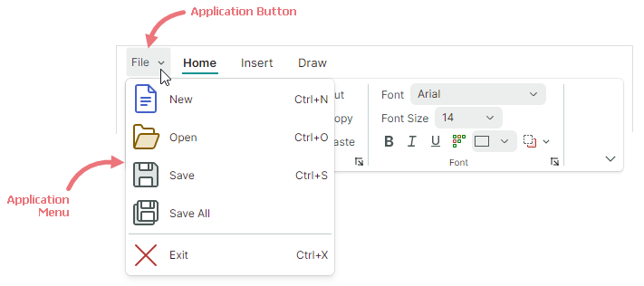
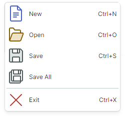

# Application Button and Main Menu

The Ribbon control has a built-in Application Button. A click on the Application Button typically invokes an associated dropdown Application Menu. You can also perform custom actions when this button is clicked.



## Application Button Content

The Application Button can display an image and content (text). 

- `RibbonControl.ApplicationButtonContent` — Specifies the Application Button's caption.
- `RibbonControl.ApplicationButtonContentTemplate` — A data template to render the Application Button's caption in a custom manner.
- `RibbonControl.ApplicationButtonGlyph` — Specifies an image displayed before the caption.

The following code assign a custom caption and image to the Application Button:


``` xml
xmlns:icons="https://schemas.eremexcontrols.net/avalonia/icons"

<mxr:RibbonControl Name="ribbon1" 
  ApplicationButtonContent="File" 
  ApplicationButtonGlyph="{x:Static icons:Basic.Small_Images}" 
  ApplicationButtonKeyTip="F" >
```

## Application Button Visibility

The Application Button is located at the left edge, before ribbon page headers. 

When the Application Button and Menu are not required, you can use the `RibbonControl.IsApplicationButtonVisible` property to hide the Application Button.

## Click the Application Button

A click on the Application Button invokes the [Application Menu](#application-menu) (if specified).

You can also process Application Button clicking with the following API members:

- `RibbonControl.ApplicationButtonCommand` — A command that fires on right-clicking the Application Button. Use the `RibbonControl.ApplicationButtonCommandParameter` property to specify a parameter for the command.
- `RibbonControl.ApplicationButtonClick` — An event raised when the Application Button is right-clicked.
- `RibbonControl.ApplicationButtonPress` — An event raised when any mouse button is pressed over the Application Button.


## Application Menu

Use the `RibbonControl.ApplicationButtonDropDownControl` property to specify a popup menu/dropdown control invoked when the Application Button is clicked. You can set the `ApplicationButtonDropDownControl` property to the following objects:

- `PopupMenu` — A popup menu that can display various items (buttons, check buttons, sub-menus, and so on). See [Popup and Context Menus](../toolbars-and-menus/popup-and-context-menus.md) to learn more.
  
  

- `PopupContainer` — A popup control that can display custom content.


The following example specifies a `PopupMenu` component as the Application Menu for a Ribbon control.


``` xml
<mxr:RibbonControl Name="ribbon1" ApplicationButtonContent="File">
    <mxr:RibbonControl.ApplicationButtonDropDownControl>
        <mxb:PopupMenu MinWidth="250" ContentRightIndent="30">
            <mxb:ToolbarButtonItem Header="New" Glyph="{x:Static icons:Basic.Doc}" 
              GlyphSize="24,24" HotKey="Ctrl+N"/>
            <mxb:ToolbarButtonItem Header="Open" Glyph="{x:Static icons:Basic.Folder_Open}" 
              GlyphSize="24,24" HotKey="Ctrl+O"/>
            <mxb:ToolbarButtonItem Header="Save" Glyph="{x:Static icons:Basic.Save}" 
              GlyphSize="24,24"  HotKey="Ctrl+S"/>
            <mxb:ToolbarButtonItem Header="Exit" Glyph="{x:Static icons:Basic.Cancel}" 
              ShowSeparator="True" GlyphSize="24,24"  HotKey="Ctrl+X"/>
        </mxb:PopupMenu>
    </mxr:RibbonControl.ApplicationButtonDropDownControl>
    <!-- ... -->
</mxr:RibbonControl>
```
