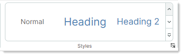
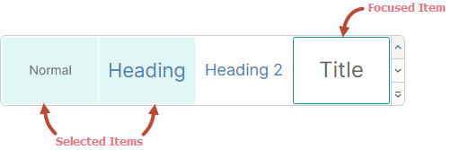
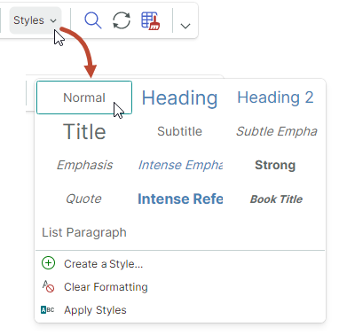

# Galleries

A gallery is a [ribbon item](ribbon-items.md) that can display a set of graphically rich elements (for instance, formatted text with images), rendered according to specified data templates. Gallery items are arranged across then down, forming a multi-column list. 

The following image demonstrates an in-ribbon gallery displaying 3 columns of items.


An in-ribbon gallery contains two buttons for vertical scrolling. Below these buttons is a dropdown button that displays the entire contents of the gallery in a dropdown window.


## Create a Ribbon Gallery

Use the [`RibbonGalleryItem`](../../API/Eremex.AvaloniaUI.Controls.Ribbon/RibbonGalleryItem.md) item to add a gallery to a Ribbon UI. You can add a [`RibbonGalleryItem`](../../API/Eremex.AvaloniaUI.Controls.Ribbon/RibbonGalleryItem.md) object to a [page group](page-groups.md), popup menus, [Page Header Area](page-header-items.md) or [Quick Access Toolbar](quick-access-toolbar.md) in the same manner as other [ribbon items](ribbon-items.md).  For instance, to add ribbon items to a page group, define them between the &lt;RibbonPageGroup&gt; start and end tags. In code-behind, you can add items using the [`RibbonPageGroup.Items`](../../API/Eremex.AvaloniaUI.Controls.Ribbon/RibbonPageGroup/Items.md) collection.

The following code snippet from the _WordPad Example_ demo adds a gallery to the _Styles_ page group. The source of gallery items is specified by the _FontStyles_ collection defined in a View Model.


``` xml
<mxr:RibbonPageGroup Header="Styles" IsHeaderButtonVisible="True">
    <mxr:RibbonGalleryItem MaxColumnCount="3" ItemWidth="108" StretchItemVertically="True"
                           ItemHeight="80"
                           Header="Styles"
                           MaxDropDownColumnCount="3"
                           ItemsSource="{Binding FontStyles}">
</mxr:RibbonPageGroup>
```

## Gallery Items

Use the [`RibbonGalleryItem.ItemsSource`](../../API/Eremex.AvaloniaUI.Controls.Ribbon/RibbonGalleryItem/ItemsSource.md) property to supply a collection of business objects to be displayed as gallery items. To render these business objects in a gallery, define corresponding data templates. 

To define gallery item templates, you can also use the [`RibbonGalleryItem.ItemTemplate`](../../API/Eremex.AvaloniaUI.Controls.Ribbon/RibbonGalleryItem/ItemTemplate.md) property.

### Example - Use Multiple Templates for Gallery Items

In the following code from the _WordPad Example_ demo, gallery items are populated from the _FontStyles_ collection defined in a View Model. The elements of the _FontStyles_ collection are business objects (_NormalGalleryItem_, _HeadingGalleryItem_ and _TitleGalleryItem_) for which data templates are defined in the `UserControl.DataTemplates` collection.




``` xml
<mxr:RibbonGalleryItem 
  ItemsSource="{Binding FontStyles}"
  ...
  >
```

``` cs
public partial class WordPadExampleViewModel : PageViewModelBase
{
    [ObservableProperty] private ObservableCollection<FontStyleGalleryItem> fontStyles;
    //...
    fontStyles = new ObservableCollection<FontStyleGalleryItem>();
    fontStyles.Add(new NormalGalleryItem() { Header = "Normal" });
    fontStyles.Add(new HeadingGalleryItem() { Header = "Heading" });
    fontStyles.Add(new TitleGalleryItem() { Header = "Title" });
}
```

``` xml
<!-- Define data templates -->
<UserControl.DataTemplates>
    <DataTemplate DataType="vm:NormalGalleryItem">
        <Grid>
            <TextBlock Text="{Binding Header}"
                        FontSize="14"
                        HorizontalAlignment="Center"
                        VerticalAlignment="Center" />
        </Grid>
    </DataTemplate>
    <DataTemplate DataType="vm:HeadingGalleryItem">
        <Grid>
            <TextBlock Text="{Binding Header}"
                        FontSize="22"
                        Foreground="SteelBlue"
                        HorizontalAlignment="Center"
                        VerticalAlignment="Center" />
        </Grid>
    </DataTemplate>
    <DataTemplate DataType="vm:TitleGalleryItem">
        <Grid>
            <TextBlock Text="{Binding Header}"
                        FontSize="24"
                        HorizontalAlignment="Center"
                        VerticalAlignment="Center" />
        </Grid>
    </DataTemplate>
</UserControl.DataTemplates>
```

See the _WordPad Example_ demo for the complete code.


### Example - Use One Template for All Gallery Items

The example below uses the [`RibbonGalleryItem.ItemTemplate`](../../API/Eremex.AvaloniaUI.Controls.Ribbon/RibbonGalleryItem/ItemTemplate.md) property to define a data template to render all gallery items. This template draws a text block whose text and colors are specified by settings of gallery item objects (_CellStyle_ objects) stored in a View Model's _CellStyles_ collection.

The [`RibbonGalleryItem.FocusedItem`](../../API/Eremex.AvaloniaUI.Controls.Ribbon/RibbonGalleryItem/FocusedItem.md) property identifies the currently [selected gallery item](#focus-and-select-gallery-items). In the example, the [`RibbonGalleryItem.FocusedItem`](../../API/Eremex.AvaloniaUI.Controls.Ribbon/RibbonGalleryItem/FocusedItem.md) property is bound to the _SelectedCellStyle_ property in the View Model. To perform actions when a gallery item is selected, the View Model's `PropertyChanged` event handler tracks changes to the _SelectedCellStyle_ property.


``` xml
<mxb:ToolbarManager IsWindowManager="True">
    <mxr:RibbonControl IsApplicationButtonVisible="False">
        <mxr:RibbonPage Header="Home">
            <mxr:RibbonPageGroup Header="Styles" IsHeaderButtonVisible="True">
                <mxr:RibbonGalleryItem MaxColumnCount="3"
                                        ItemWidth="108"
                                        ItemHeight="40"
                                        Header="Cell Styles"
                                        MaxDropDownColumnCount="4"
                                        ItemsSource="{Binding CellStyles}"
                                        FocusedItem="{Binding SelectedCellStyle, Mode=TwoWay}"
                                        >
                    <mxr:RibbonGalleryItem.ItemTemplate>
                        <DataTemplate>
                            <Border Background="{Binding BackColor}">
                                <TextBlock Text="{Binding Text}" 
                                  HorizontalAlignment="Center" 
                                  VerticalAlignment="Center"
                                  Foreground="{Binding TextColor}"/>
                            </Border>
                        </DataTemplate>
                    </mxr:RibbonGalleryItem.ItemTemplate>
                </mxr:RibbonGalleryItem>
            </mxr:RibbonPageGroup>
        </mxr:RibbonPage>
    </mxr:RibbonControl>
</mxb:ToolbarManager>
```

``` cs
public partial class MainWindowViewModel : ViewModelBase
{
    [ObservableProperty] private ObservableCollection<CellStyle> cellStyles;
    [ObservableProperty] private CellStyle selectedCellStyle;

    public MainWindowViewModel()
    {
        cellStyles = new ObservableCollection<CellStyle>
        {
            new CellStyle(){ Text="Normal", TextColor=Brushes.Black, BackColor=Brushes.White },
            new CellStyle(){ Text="Bad", TextColor=Brushes.Maroon, BackColor=Brushes.Pink },
            new CellStyle(){ Text="Good", TextColor=Brushes.Green, BackColor=Brushes.Honeydew },
            new CellStyle(){ Text="Neutral", TextColor=Brushes.Sienna, BackColor=Brushes.Khaki }
        };
        //Add accent colors
        Color[] accentColors = new Color[] { Colors.MediumOrchid, Colors.Chocolate, Colors.CadetBlue };
        for (int accentColorIndex=1; accentColorIndex<= accentColors.Length; accentColorIndex++)
        {
            Color accentColor = accentColors[accentColorIndex-1];
            string accentTitle = $"Accent {accentColorIndex}";
            cellStyles.Add(new CellStyle() { 
              Text = accentTitle, 
              TextColor=Brushes.White, 
              BackColor=new SolidColorBrush(accentColor) 
            });
            for (double opacity = 0.6; opacity > 0.1; opacity -= 0.2)
            {
                cellStyles.Add(new CellStyle() { 
                  Text = $"{opacity:p0} - " + accentTitle, 
                  TextColor=Brushes.Black, 
                  BackColor=new SolidColorBrush(accentColor, opacity)  
                });
            }
        };
        selectedCellStyle = cellStyles[0];
        PropertyChanged += PropertyChanged1;
    }

    // Perform actions when a gallery item is selected.
    private void PropertyChanged1(object? sender, System.ComponentModel.PropertyChangedEventArgs e)
    {
        if (e.PropertyName == nameof(SelectedCellStyle))
        {
            string selectedCellStyleName = SelectedCellStyle.Text;
            //...
        }
    }
}

public class CellStyle : ObservableObject
{
    public CellStyle() 
    {
        Text = "Default";
        TextColor = Brushes.Black;
        BackColor = Brushes.White;
    }
    public string Text { get; set; }
    public IBrush TextColor { get; set; }
    public IBrush BackColor { get; set; }
}
```

## Gallery Display Settings

- [`RibbonGalleryItem.Header`](../../API/Eremex.AvaloniaUI.Controls.Bars/ToolbarItem/Header.md) — A gallery's caption.  

  ``` xml
  <mxr:RibbonGalleryItem Header="Styles" ...>
  ```


  The gallery's caption is displayed in the following cases:

  - In the dropdown gallery when the [`IsDropDownHeaderVisible`](../../API/Eremex.AvaloniaUI.Controls.Ribbon/RibbonGalleryItem/IsDropDownHeaderVisible.md) option is enabled.

    
    

  - When a [`RibbonGalleryItem`](../../API/Eremex.AvaloniaUI.Controls.Ribbon/RibbonGalleryItem.md) object is rendered as a button with an associated dropdown gallery. This happens when the [`RibbonGalleryItem`](../../API/Eremex.AvaloniaUI.Controls.Ribbon/RibbonGalleryItem.md) object is embedded in a popup menu, or when the [Simplified Command layout](ribbon-command-layouts.md) is used.  The [`RibbonGalleryItem.Header`](../../API/Eremex.AvaloniaUI.Controls.Bars/ToolbarItem/Header.md) property specifies the caption of this button. 
  
    

    See the following sections for more details: [Galleries in the Simplified Command Layout](#galleries-in-the-simplified-command-layout) and [Galleries in Toolbars, Popups and Context Menus](#galleries-in-toolbars-popups-and-context-menus).

- [`RibbonGalleryItem.ItemHeight`](../../API/Eremex.AvaloniaUI.Controls.Ribbon/RibbonGalleryItem/ItemHeight.md) — Specifies the height of gallery items. This property has a higher priority than the [`RibbonGalleryItem.StretchItemVertically`](../../API/Eremex.AvaloniaUI.Controls.Ribbon/RibbonGalleryItem/StretchItemVertically.md) setting.

  If the [`RibbonGalleryItem.ItemHeight`](../../API/Eremex.AvaloniaUI.Controls.Ribbon/RibbonGalleryItem/ItemHeight.md) property is not set, the default gallery item height is specified by the height of the first gallery item. This height is obtained from a corresponding data template.

- [`RibbonGalleryItem.ItemWidth`](../../API/Eremex.AvaloniaUI.Controls.Ribbon/RibbonGalleryItem/ItemWidth.md) — Specifies the width of gallery items.
- [`RibbonGalleryItem.MaxColumnCount`](../../API/Eremex.AvaloniaUI.Controls.Ribbon/RibbonGalleryItem/MaxColumnCount.md) — Specifies the maximum number of columns in the in-ribbon gallery.
- [`RibbonGalleryItem.MaxDropDownColumnCount`](../../API/Eremex.AvaloniaUI.Controls.Ribbon/RibbonGalleryItem/MaxDropDownColumnCount.md) — Specifies the maximum number of columns in the dropdown gallery.
- [`RibbonGalleryItem.StretchItemVertically`](../../API/Eremex.AvaloniaUI.Controls.Ribbon/RibbonGalleryItem/StretchItemVertically.md) — Specifies whether to vertically stretch the first row of gallery items to fit the height of the in-ribbon gallery. This automatic height is propagated to other rows, including rows in the dropdown gallery.

  

  The [`RibbonGalleryItem.StretchItemVertically`](../../API/Eremex.AvaloniaUI.Controls.Ribbon/RibbonGalleryItem/StretchItemVertically.md) property is not in effect if the [`RibbonGalleryItem.ItemHeight`](../../API/Eremex.AvaloniaUI.Controls.Ribbon/RibbonGalleryItem/ItemHeight.md) property is set.

  When the [`RibbonGalleryItem.StretchItemVertically`](../../API/Eremex.AvaloniaUI.Controls.Ribbon/RibbonGalleryItem/StretchItemVertically.md) property is `false`, and the [`RibbonGalleryItem.ItemHeight`](../../API/Eremex.AvaloniaUI.Controls.Ribbon/RibbonGalleryItem/ItemHeight.md) property is not used, the default gallery item height is specified by the height of the first gallery item. This height is obtained from a corresponding data template.

## Focus and Select Gallery Items

- [`RibbonGalleryItem.FocusedItem`](../../API/Eremex.AvaloniaUI.Controls.Ribbon/RibbonGalleryItem/FocusedItem.md) — Allows you to get the business object that corresponds to the currently focused gallery item. The focused item is the one that receives focus. You can identify the focused item by the focus frame.

  
  

- [`RibbonGalleryItem.ItemSelectionMode`](../../API/Eremex.AvaloniaUI.Controls.Ribbon/RibbonGalleryItem/ItemSelectionMode.md) — Allows you to choose between single- and multiple item selection modes. When the [`ItemSelectionMode`](../../API/Eremex.AvaloniaUI.Controls.Editors/ItemSelectionMode.md) property is set to `Multiple`, users can select multiple gallery items simultaneously.
  
  In single selection mode, use the [`RibbonGalleryItem.FocusedItem`](../../API/Eremex.AvaloniaUI.Controls.Ribbon/RibbonGalleryItem/FocusedItem.md) property to get/set the focused (selected) item.
  
  In multiple selection mode, use the [`RibbonGalleryItem.SelectedItems`](../../API/Eremex.AvaloniaUI.Controls.Ribbon/RibbonGalleryItem/SelectedItems.md) property to get/set currently selected items. 

  When you click an item in multi-selection mode, this item is automatically focused and selected. 
  Selected items have a highlighted background. A frame around a gallery item indicates that it is focused.

  
  
  To select multiple items, click items while holding the CTRL and/or SHIFT key down. 
  
  A CTRL+click action toggles the selected state for the focused item. This allows a user to unselect the focused item.

  

- [`RibbonGalleryItem.SelectedItems`](../../API/Eremex.AvaloniaUI.Controls.Ribbon/RibbonGalleryItem/SelectedItems.md) — A collection of business objects that correspond to selected gallery items. Set the [`RibbonGalleryItem.ItemSelectionMode`](../../API/Eremex.AvaloniaUI.Controls.Ribbon/RibbonGalleryItem/ItemSelectionMode.md) property to `Multiple` to allow multiple item selection.

  
  In single selection mode, the [`RibbonGalleryItem.SelectedItems`](../../API/Eremex.AvaloniaUI.Controls.Ribbon/RibbonGalleryItem/SelectedItems.md) property contains one element. It matches the [`RibbonGalleryItem.FocusedItem`](../../API/Eremex.AvaloniaUI.Controls.Ribbon/RibbonGalleryItem/FocusedItem.md) property.

  


## Show and Close the Dropdown Gallery

- [`RibbonGalleryItem.IsPopupOpen`](../../API/Eremex.AvaloniaUI.Controls.Ribbon/RibbonGalleryItem/IsPopupOpen.md) — Gets or sets whether the dropdown gallery is open.
- [`RibbonGalleryItem.ClosePopup`](../../API/Eremex.AvaloniaUI.Controls.Ribbon/RibbonGalleryItem/ClosePopup.md) — Closes the dropdown gallery.

## Additional Commands in a Dropdown Gallery

A dropdown gallery can display additional ribbon items (commands) at the bottom. 


Use the [`RibbonGalleryItem.DropDownItems`](../../API/Eremex.AvaloniaUI.Controls.Ribbon/RibbonGalleryItem/DropDownItems.md) property to specify these additional items.

``` xml
<mxr:RibbonPageGroup Header="Styles" IsHeaderButtonVisible="True">
    <mxr:RibbonGalleryItem MaxColumnCount="3" ItemWidth="108" StretchItemVertically="True"
                           ItemHeight="80"
                           Header="Styles"
                           MaxDropDownColumnCount="3"
                           ItemsSource="{Binding FontStyles}">
        <mxr:RibbonGalleryItem.DropDownItems>
            <mxb:ToolbarButtonItem Header="Create A Style..." Glyph="{x:Static icons:Basic.Add}" />
            <mxb:ToolbarButtonItem Header="Clear Formatting"
                                   Glyph="{x:Static icons:Filter.Does_not_contain}" />
            <mxb:ToolbarButtonItem Header="Apply Styles" Glyph="{x:Static icons:Filter.Starts_with}" />
        </mxr:RibbonGalleryItem.DropDownItems>
    </mxr:RibbonGalleryItem>
</mxr:RibbonPageGroup>
```

## Galleries in the Simplified Command Layout

In the [Simplified command layout](ribbon-command-layouts.md), a gallery added to a page group is rendered as a button. Clicking this button invokes the entire gallery.



The button's text is specified by the [`RibbonGalleryItem.Header`](../../API/Eremex.AvaloniaUI.Controls.Bars/ToolbarItem/Header.md) property.

## Galleries in Toolbars, Popups and Context Menus

When you add a gallery to a traditional toolbar or popup menu, the gallery is displayed as a sub-menu.


The sub-menu's caption is specified by the [`RibbonGalleryItem.Header`](../../API/Eremex.AvaloniaUI.Controls.Bars/ToolbarItem/Header.md) property.