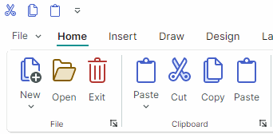

# Key Tips

You can press ALT to move focus to the Ribbon control, and then use the Arrow keys on the keyboard to navigate through the Ribbon UI.



During keyboard navigation, the Ribbon control also supports quick access to ribbon elements using **Key Tips**. Key Tips are access keys (one to three keys) displayed when the ALT key is pressed. They allow a user to quickly focus or activate ribbon elements. 

Press ALT to show Key Tips for the top-level ribbon elements ([ribbon pages](pages.md), [Application Button](application-button-and-main-menu.md), [Quick Access Toolbar](quick-access-toolbar.md), and [Page Header items](page-header-items.md)). Key Tips appear as small tooltips. 


- Pressing a visible Key Tip assigned to a command activates this command.
- Pressing a visible Key Tip assigned to an in-place editor moves focus to this editor.
- Pressing a visible Key Tip assigned to the [Application Button](application-button-and-main-menu.md) invokes the associated [Application Menu/Dropdown control](application-button-and-main-menu.md).
- Pressing a visible Key Tip assigned to a page displays Key Tips for commands located in this page.

  For instance, when you press "H" in the Ribbon control's state demonstrated in the image above, Key Tips are displayed for commands in the _Home_ page.

  

  Now you can press any of the displayed Key Tips to activate a corresponding command in the active page.

- Pressing a Key Tip that is not currently visible is not in effect. 

    !!! tip
        You can assign keyboard shortcuts (such as CTRL+O, CTRL+B and so on) to ribbon commands using the `HotKey` property. Hotkeys allow users to activate commands if focus is within the hotkey scope (the default hotkey scope is defined by the boundaries of the `ToolbarManager` component.). See [Ribbon Items. Hot Keys](ribbon-items.md#hot-keys) for more details.

## Go Back During Keyboard Navigation

To go back a step and see the previous Key Tips, press Esc.

If a wrong character is pressed, click Backspace to erase it.

## Cancel Keyboard Navigation

- Press ESC until Key Tips disappear.

or

- Move focus away from the Ribbon control (for instance, click another control).

## Specify Key Tips

The following properties allow you to assign key tips to Ribbon elements:

- `ToolbarItem.KeyTip`
- `RibbonPage.KeyTip`
- `RibbonControl.ApplicationButtonKeyTip`

``` xml
<!-- Specify a Key Tip for the Application Menu-->
<mxr:RibbonControl ApplicationButtonContent="File" ApplicationButtonKeyTip="F" Name="ribbon">
    <mxr:RibbonControl.ApplicationButtonDropDownControl>
        <!-- Define the Application Menu displayed when the Application Button is clicked
            or activated with the "F" Key Tip.
         -->
        <mxb:PopupMenu MinWidth="250" >
            <!-- ... -->
        </mxb:PopupMenu>
    </mxr:RibbonControl.ApplicationButtonDropDownControl>
    <!-- Specify a Key Tip for the Home Page -->
    <mxr:RibbonPage Header="Home" KeyTip="H">
        <mxr:RibbonPageGroup Header="File">
            <!-- Specify Key Tips for ribbon commands -->
            <mxb:ToolbarButtonItem Header="New" KeyTip="N" .../>
            <mxb:ToolbarButtonItem Header="Open" KeyTip="O".../>
        </mxr:RibbonPageGroup>
        <mxr:RibbonPageGroup Header="Clipboard">
            <mxb:ToolbarButtonItem Header="Paste" KeyTip="PA" .../>
            <mxb:ToolbarButtonItem Header="Cut" KeyTip="CT" .../>
        </mxr:RibbonPageGroup>
    </mxr:RibbonPage>
</mxr:RibbonControl>
```

Ensure that Key Tips displayed simultaneously are unique. For instance, you need to assign unique Key Tips for commands in ribbon pages.


