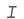
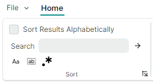
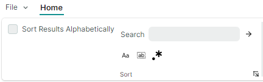
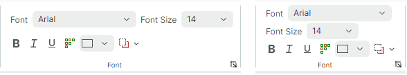

# Page Groups

[Items (commands)](ribbon-items.md) in [ribbon pages](pages.md) can be logically divided into groups. Ribbon page groups are delimited by vertical separators. They display captions at the bottom when the [Classic command layout](ribbon-command-layouts.md) is applied. The following image demonstrates the _File_, _Clipboard_, _Font_ and _Styles_ page groups displayed within the _Home_ page:


## Define and Access Ribbon Page Groups

Ribbon page groups are encapsulated by `RibbonPageGroup` class objects. In code-behind, you can create, access and modify page groups using the `RibbonPage.Groups` collection. To define page groups in XAML, add `RibbonPageGroup` objects between the **&lt;RibbonPage&gt;** start and end tags.

``` xml
<mxr:RibbonPage Header="Home" KeyTip="H" Name="pageHome">
    <mxr:RibbonPageGroup Header="File" IsHeaderButtonVisible="True">
        <!-- ... -->
    </mxr:RibbonPageGroup>
    <mxr:RibbonPageGroup Header="Clipboard" IsHeaderButtonVisible="True">
        <!-- ... -->
    </mxr:RibbonPageGroup>
    <mxr:RibbonPageGroup Header="Font" IsHeaderButtonVisible="True">
        <!-- ... -->
    </mxr:RibbonPageGroup>
    <!-- ... -->
</mxr:RibbonPageGroup>
```

You can also use the `RibbonPage.GroupsSource` property to create page groups from a collection of business objects in a View Model. A corresponding data template should define a `RibbonPageGroup` object and initialize its settings from a business object.

<!-- TODO
GroupsSource example
 -->


## Page Group Header

When the [Classic command layout](ribbon-command-layouts.md) is applied, page groups have headers at the bottom. A group header displays a caption (`RibbonPageGroup.Header`) and a header button.


A click on the header button has no default action. You can associate an action with the header button as follows:

- Handle the `RibbonPageGroup.HeaderButtonClick` or `RibbonPageGroup.HeaderButtonPress` event. For instance, your event handler can display a dialog or menu that brings up more settings related to the group.

  The `HeaderButtonClick` event is raised after the left mouse button is pressed and released over the header button. The `HeaderButtonPress` event is raised immediately after a user presses any mouse button over the header button. 

- Assign a command to the `RibbonPageGroup.HeaderButtonCommand` property. You can specify an optional command parameter using the `RibbonPageGroup.HeaderButtonCommandParameter` property.

Use the `RibbonPageGroup.IsHeaderButtonVisible` property to hide the header button.


## Page Group Content


A page group displays a set of closely related ribbon items. Ribbon items are buttons, check buttons, button groups, sub-menus, in-place editors, galleries and more. See the following topics for more information: [Ribbon Items](ribbon-items.md) and [Galleries](galleries.md)

To populate a ribbon page group with items, use the `RibbonPageGroup.Items` collection.  In XAML, you can define items between the **&lt;RibbonPageGroup&gt;** start and end tags.


``` xml
 <mxr:RibbonPage Header="Home" KeyTip="H">
    <mxr:RibbonPageGroup Header="File" IsHeaderButtonVisible="True">
        <mxb:ToolbarButtonItem Header="New" KeyTip="N" Glyph="{x:Static icons:Basic.Docs_Add}"
                               mxr:RibbonControl.DisplayMode="Large"/>
        <mxb:ToolbarButtonItem Header="Open" KeyTip="O"
                               Glyph="{x:Static icons:Basic.Folder_Open}" />
        <mxb:ToolbarButtonItem Header="Exit" KeyTip="E"
                               Glyph="{x:Static icons:Basic.Remove}" />
    </mxr:RibbonPageGroup>
    <mxr:RibbonPageGroup Header="Font" IsHeaderButtonVisible="True">
        <mxb:ToolbarCheckItemGroup ShowSeparator="True">
            <mxb:ToolbarCheckItem Header="Bold" KeyTip="B" Glyph="{x:Static icons:Basic.Font_Bold}" />
            <mxb:ToolbarCheckItem Header="Italic" KeyTip="I" Glyph="{x:Static icons:Basic.Font_Italic}" />
            <mxb:ToolbarCheckItem Header="Underline" KeyTip="U" Glyph="{x:Static icons:Basic.Font_Underline}"  />
        </mxb:ToolbarCheckItemGroup>
       <!-- ... -->
    </mxr:RibbonPageGroup>
</mxr:RibbonPage>
```

You can also use the `RibbonPageGroup.ItemsSource` property to create items from a collection of business objects in a View Model. Corresponding data templates should define ribbon items and initialize their settings from underlying business objects.

<!-- TODO
ItemsSource example
 -->


## Page Group Image

When a Ribbon control is resized, the adaptive layout feature may collapse specific page groups. In the collapsed state, a group's items are displayed in a dropdown window.


You can use the `RibbonPageGroup.Glyph` property to display an image in a collapsed group's button:


``` xml
xmlns:icons="https://schemas.eremexcontrols.net/avalonia/icons"
<mxr:RibbonPageGroup Header="File" Glyph="{x:Static icons:Basic.Doc}">
```


## Layout of Items in Page Groups

### Adaptive Layout

The Ribbon control supports the adaptive layout feature, which adjusts the layout of items in ribbon page groups when the Ribbon control is resized. 


#### Combining Items in Groups

You can group sets of [ribbon items](ribbon-items.md) in non-breaking containers (groups) using [ToolbarItemGroup](ribbon-items.md#non-breaking-groups-of-items-toolbaritemgroup) and [ToolbarCheckItemGroup](ribbon-items.md#non-breaking-groups-of-check-items-toolbarcheckitemgroup).
These containers ensure that the items are displayed together in a single line, preserving this layout even when the adaptive layout functionality is applied. Only an entire container can be collapsed when the Ribbon is resized, not its individual items.

For instance, in the animation above the ,  and  items are combined in a non-breaking container. 

#### Item Images

When the [Classic command layout](ribbon-command-layouts.md) is applied, the adaptive layout functionality also adjusts the display size of items as you resize the ribbon — from large to small with text to small glyphs, and backwards.


The `RibbonControl.DisplayMode` attached property allows you to specify supported display modes for ribbon items in ribbon page groups in the [Classic command layout](ribbon-command-layouts.md).
You can force an item to use only large images, small images, small images with text, or a combination of these display modes.

  ``` xml
  <mxb:ToolbarButtonItem Header="Open" KeyTip="O" mxr:RibbonControl.DisplayMode="Large"
                            Glyph="{x:Static icons:Basic.Folder_Open}" />
  ```

  See the following topic for more information: [Adaptive Glyph Size in the Classic Command Layout](ribbon-items.md#adaptive-glyph-size-in-the-classic-command-layout)


#### Related API

- `AllowCollapse` — Specifies whether a group can be collapsed when the Ribbon control's width is reduced. 
- `IsCollapsed` — Returns if the current group is currently collapsed.


### Customize Item Layout in Page Groups

Ribbon control supports two layout modes for items in page groups:

- Column (down then across)

    

    An item is moved to a new column if the group height is not enough to display the item below its preceding sibling.

    Currently, all Ribbon items except [non-breaking groups](ribbon-items.md#non-breaking-groups-of-items-toolbaritemgroup) only support Column layout mode.
    

- Row (across then down)

    

    An item is moved to a new row if the group width is not enough to display the item to the right of its preceding sibling.

    Non-breaking containers ([ToolbarItemGroup](ribbon-items.md#non-breaking-groups-of-items-toolbaritemgroup) and [ToolbarCheckItemGroup](ribbon-items.md#non-breaking-groups-of-check-items-toolbarcheckitemgroup)) use Row layout mode by default.

The `RibbonPageGroup.ItemLayouMode` attached property allows you to change layout mode for [non-breaking containers](ribbon-items.md#non-breaking-groups-of-items-toolbaritemgroup) from Row (default) to Column. The `RibbonPageGroup.ItemLayouMode` property is not currently in effect for other ribbon items.

The `RibbonPageGroup.ItemLayouMode` property's default value is `Default`, which is equivalent to `Row` for non-breaking containers, and `Column` for other ribbon items.

- If two consecutive items use different layout modes (Column and Row), the second item is automatically shifted to a new column.
- To arrange a set of consecutive items using Column or Row layout mode, ensure that the required layout mode is applied to all of these items, either explicitly or implicitly.
- Tip: You can combine two ribbon items in a separate [non-breaking container](ribbon-items.md#non-breaking-groups-of-items-toolbaritemgroup) to make them act as a whole.

#### Example - Arrange Items in a Column
The following example uses the `RibbonPageGroup.ItemLayouMode` attached property to arrange items as a column.



This layout consists of three rows of ribbon items:

- Row 1 displays a check item.

    ``` xml
    <mxb:ToolbarCheckItem Name="btnSort" Header="Sort Results Alphabetically" CheckBoxStyle="CheckBox"/>
    ```

- Row 2 displays a container (`ToolbarItemGroup`) that combines a text editor and a button. Grouping the items in a container is required to position the items next to each other.

    ``` xml
    <mxb:ToolbarItemGroup Name="groupSearchBox">
        <mxb:ToolbarEditorItem Header="Search" EditorWidth="150">
            <mxb:ToolbarEditorItem.EditorProperties>
                <mxe:TextEditorProperties/>
            </mxb:ToolbarEditorItem.EditorProperties>
        </mxb:ToolbarEditorItem>
        <mxb:ToolbarButtonItem
                Header="Find"
                Glyph="{SvgImage 'avares://Ribbon-Layout/Assets/arrow-right.svg'}"
                Command="{Binding FindCommand}"/>
    </mxb:ToolbarItemGroup>
    ```
    
- Row 3 displays a container (`ToolbarCheckItemGroup`) that combines three check items:

    ``` xml
    <mxb:ToolbarCheckItemGroup Name="groupSearchProperties"  >
        <mxb:ToolbarCheckItem
            Header="Match case"
            IsChecked="{Binding IsMatchCase}"
            Glyph="{SvgImage 'avares://Ribbon-Layout/Assets/match-case.svg'}"/>
        <mxb:ToolbarCheckItem
            Header="Match whole word"
            IsChecked="{Binding IsMatchWholeWord}"
            Glyph="{SvgImage 'avares://Ribbon-Layout/Assets/match-whole-word.svg'}"/>
        <mxb:ToolbarCheckItem
            Header="Use regular expressions"
            IsChecked="{Binding IsUseRegExp}"
            Glyph="{SvgImage 'avares://Ribbon-Layout/Assets/match-regexp.svg'}"/>
    </mxb:ToolbarCheckItemGroup>
    ```

Place the _btnSort_, _groupSearchBox_ and _groupSearchProperties_ items in a `RibbonPageGroup`:

``` xml
<mxr:RibbonControl>
    <mxr:RibbonPage Header="Home">
        <mxr:RibbonPageGroup Header="Sort">
            <mxb:ToolbarCheckItem Name="btnSort" Header="Sort Results Alphabetically" CheckBoxStyle="CheckBox"/>
            <mxb:ToolbarItemGroup Name="groupSearchBox">
                <!-- ... -->
            </mxb:ToolbarItemGroup>
            <mxb:ToolbarCheckItemGroup Name="groupSearchProperties" >
                <!-- ... -->
            </mxb:ToolbarCheckItemGroup
        </mxr:RibbonPageGroup>
    </mxr:RibbonControl>
</mxr:RibbonPage
```

This code produces an unwanted layout, in which the _groupSearchBox_ and _groupSearchProperties_ containers are shifted to a separate column. This happens because the _btnSort_ item uses Column layout mode, while the containers use Row layout mode by default.

 

To arrange the containers below the _btnSort_ button, set the `RibbonPageGroup.ItemLayouMode` attached property to Column for these containers.

``` xml
<mxr:RibbonControl ApplicationButtonContent="File" ApplicationButtonKeyTip="F">
    <mxr:RibbonPage Header="Home" KeyTip="M">
        <mxr:RibbonPageGroup Header="Sort">
            <mxb:ToolbarCheckItem Name="btnSort" Header="Sort Results Alphabetically" CheckBoxStyle="CheckBox"/>
            <mxb:ToolbarItemGroup Name="groupSearchBox"
                                  mxr:RibbonPageGroup.ItemLayoutMode="Column">
                <mxb:ToolbarEditorItem Header="Search" EditorWidth="150">
                    <mxb:ToolbarEditorItem.EditorProperties>
                        <mxe:TextEditorProperties/>
                    </mxb:ToolbarEditorItem.EditorProperties>
                </mxb:ToolbarEditorItem>
                <mxb:ToolbarButtonItem
                        Header="Find"
                        Glyph="{SvgImage 'avares://Ribbon-Layout/Assets/arrow-right.svg'}"
                        Command="{Binding FindCommand}"/>
            </mxb:ToolbarItemGroup>

            <mxb:ToolbarCheckItemGroup Name="groupSearchProperties" 
                                       mxr:RibbonPageGroup.ItemLayoutMode="Column" >
                <mxb:ToolbarCheckItem
                    Header="Match case"
                    IsChecked="{Binding IsMatchCase}"
                    Glyph="{SvgImage 'avares://Ribbon-Layout/Assets/match-case.svg'}"/>
                <mxb:ToolbarCheckItem
                    Header="Match whole word"
                    IsChecked="{Binding IsMatchWholeWord}"
                    Glyph="{SvgImage 'avares://Ribbon-Layout/Assets/match-whole-word.svg'}"/>
                <mxb:ToolbarCheckItem
                    Header="Use regular expressions"
                    IsChecked="{Binding IsUseRegExp}"
                    Glyph="{SvgImage 'avares://Ribbon-Layout/Assets/match-regexp.svg'}"/>
            </mxb:ToolbarCheckItemGroup>
        </mxr:RibbonPageGroup>
    </mxr:RibbonPage>
</mxr:RibbonControl>
```

Now, the _btnSort_, _groupSearchBox_ and _groupSearchProperties_ items use Column layout mode, so they are arranged in a single column, as demonstrated in the image below:

 


### Arrange Non-Breaking Containers in Two or Three Rows

If a page group is wide enough, items combined in non-breaking containers ([ToolbarItemGroup](ribbon-items.md#non-breaking-groups-of-items-toolbaritemgroup) and [ToolbarCheckItemGroup](ribbon-items.md#non-breaking-groups-of-check-items-toolbarcheckitemgroup)) are arranged in two rows. When the width of the page group is reduced, the containers are arranged in three rows, creating a more compact layout.



In specific cases, you may need to forcibly arrange non-breaking containers in two or three rows.
For this purpose, set the `RibbonPageGroup.ItemGroupLayoutMode` attached property for the first non-breaking container to `Layout2Rows` or `Layout3Rows` (the property's default value is `AdaptiveLayout`).

#### Example - Forcibly Arrange Containers in Two Rows

Consider a `RibbonPageGroup` that contains four non-breaking containers (groups) of items.


When you resize the Ribbon control, the adaptive layout feature arranges the containers in two or three rows to fit the available space.


To forcibly arrange the containers in two rows, set the `RibbonPageGroup.ItemGroupLayoutMode` attached property for the first non-breaking container to `Layout2Rows`.

``` xml
<mxr:RibbonPageGroup Header="Paragraph">
    <mxb:ToolbarItemGroup Name="gIndent"
                          mxr:RibbonPageGroup.ItemGroupLayoutMode="Layout2Rows">
        <mxb:ToolbarButtonItem Header="Increase Indent" Glyph="{x:Static icons:Basic.Level_Increase}"/>
        <mxb:ToolbarButtonItem Header="Decrease Indent" Glyph="{x:Static icons:Basic.Level_Reduce}"/>
    </mxb:ToolbarItemGroup>

    <mxb:ToolbarItemGroup  Name="gLineSpacing">
        <mxb:ToolbarButtonItem Header="Increase Line Spacing" Glyph="{x:Static icons:Basic.List_Collapse}"/>
        <mxb:ToolbarButtonItem Header="Decrease Line Spacing" Glyph="{x:Static icons:Basic.List_Expand}"/>
    </mxb:ToolbarItemGroup>
            
    <mxb:ToolbarItemGroup  Name="gParaNumbering">
        <mxb:ToolbarButtonItem Header="Bullets" Glyph="{x:Static icons:Office.Bullets}" />
        <mxb:ToolbarButtonItem Header="Numbering" Glyph="{x:Static icons:Office.Line_Numbering}" />
        <mxb:ToolbarButtonItem Header="Multilevel List" Glyph="{x:Static icons:Office.Multilevel_List}" />
    </mxb:ToolbarItemGroup>
            
    <mxb:ToolbarCheckItemGroup  Name="gAlign" CheckType="Radio">
        <mxb:ToolbarCheckItem Header="Align Left" Glyph="{x:Static icons:Alignment.Align_Left}"/>
        <mxb:ToolbarCheckItem Header="Align Center" Glyph="{x:Static icons:Alignment.Align_Horizontal_Centers}"/>
        <mxb:ToolbarCheckItem Header="Align Right" Glyph="{x:Static icons:Alignment.Align_Right}"/>
    </mxb:ToolbarCheckItemGroup>
</mxr:RibbonPageGroup>
```

This results in the containers being arranged in two rows. If there is not enough space to display the containers in their entirety they are automatically collapsed.


If you need a specific item to start a new column, place a  `ToolbarSeparatorItem` object before this item.

``` xml
<mxr:RibbonPageGroup Header="Paragraph">
    <mxb:ToolbarItemGroup Name="gIndent" mxr:RibbonPageGroup.ItemGroupLayoutMode="Layout2Rows">
        <!-- ... -->
    </mxb:ToolbarItemGroup>

    <mxb:ToolbarItemGroup  Name="gLineSpacing">
        <!-- ... -->    
    </mxb:ToolbarItemGroup>
            
    <mxb:ToolbarItemGroup  Name="gParaNumbering">
        <!-- ... -->
    </mxb:ToolbarItemGroup>
    
    <mxb:ToolbarSeparatorItem/>
            
    <mxb:ToolbarCheckItemGroup  Name="gAlign" CheckType="Radio">
        <!-- ... -->        
    </mxb:ToolbarCheckItemGroup>
</mxr:RibbonPageGroup>
```


