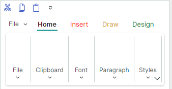

# Pages

Ribbon pages are used to create tabs in the Ribbon control's command bar. The following image shows a Ribbon control with three pages (_Home_, _Insert_ and _Help_):


You can initially hide individual pages, and then make them visible and active at specific times. See the following section to learn more: [Page Visibility](#page-visibility).

## Define and Access Ribbon Pages

Ribbon pages are encapsulated by `RibbonPage` class objects. In code-behind, you can create, access and modify ribbon pages using the `RibbonControl.Pages` collection. To define ribbon pages in XAML, add `RibbonPage` objects between the **&lt;RibbonControl&gt;** start and end tags.

``` xml
<mxb:ToolbarManager IsWindowManager="True">
    <mxr:RibbonControl>
      <mxr:RibbonPage Header="Home" KeyTip="H"> 
        <!-- ... -->
      </mxr:RibbonPage>
      <mxr:RibbonPage Header="Insert" KeyTip="I">
        <!-- ... -->
      </mxr:RibbonPage>
      <mxr:RibbonPage Header="Help" KeyTip="P">
        <!-- ... -->
      </mxr:RibbonPage>
    </mxr:RibbonControl>
</mxb:ToolbarManager>
```

<!-- TODO
Example of adding, hiding, positioning pages via `RibbonControl.Pages`.
 -->


You can also use the `RibbonControl.PagesSource` property to create ribbon pages from a collection of business objects in a View Model. A corresponding data template should define a `RibbonPage` object and initialize its settings from an underlying business object.

<!-- TODO
PagesSource example 
 -->

## Page Header and Content

When you create a page, use the `RibbonPage.Header` property to specify text for the page header.

<!-- TODO
There is a Glyph property in RibbonPage.  Doesn't work???
 -->

The content of ribbon pages are [ribbon page groups](page-groups.md). Use the `RibbonPage.Groups` collection to create and access ribbon page groups. In XAML, you can define page groups between the **&lt;RibbonPage&gt;** start and end tags.

``` xml
 <mxr:RibbonPage Header="Home" KeyTip="H">
    <mxr:RibbonPageGroup Header="File" IsHeaderButtonVisible="True">
        <mxb:ToolbarButtonItem Header="New" KeyTip="N" Glyph="{x:Static icons:Basic.Docs_Add}"
                               mxr:RibbonControl.DisplayMode="Large"/>
        <mxb:ToolbarButtonItem Header="Open" KeyTip="O"
                               Glyph="{x:Static icons:Basic.Folder_Open}" />
        <mxb:ToolbarButtonItem Header="Exit" KeyTip="E"
                               Glyph="{x:Static icons:Basic.Remove}" />
    </mxr:RibbonPageGroup>
    <mxr:RibbonPageGroup Header="Font" IsHeaderButtonVisible="True">
        <mxb:ToolbarCheckItemGroup ShowSeparator="True">
            <mxb:ToolbarCheckItem Header="Bold" KeyTip="B" Glyph="{x:Static icons:Basic.Font_Bold}" />
            <mxb:ToolbarCheckItem Header="Italic" KeyTip="I" Glyph="{x:Static icons:Basic.Font_Italic}" />
            <mxb:ToolbarCheckItem Header="Underline" KeyTip="U" Glyph="{x:Static icons:Basic.Font_Underline}"  />
        </mxb:ToolbarCheckItemGroup>
       <!-- ... -->
    </mxr:RibbonPageGroup>
</mxr:RibbonPage>
```


You can also use the `RibbonPage.GroupsSource` property to create page groups from a collection of business objects in a View Model. A corresponding data template should define a `RibbonPageGroup` object and initialize its settings from a business object.

## Selected Page

The content of a page is shown to a user when the page is selected. A user can select a page by clicking the page header. In code, you can select a page with one of the following properties:

- `RibbonControl.SelectedPage`
- `RibbonPage.IsSelected`

## Page Visibility

Use the `RibbonPage.IsVisible` property to hide and display a page. The page's position is specified by its place in the `RibbonControl.Pages` collection.

The following code displays and activates an initially hidden _Table_ page.

``` xml
<mxr:RibbonControl Name="ribbon">
    <mxr:RibbonPage Header="Table" Name="pageTable" IsVisible="False"> 
        <!-- ... -->
    </mxr:RibbonPage>
<mxr:RibbonControl>
```
``` cs
// Display and select the Table page.
pageTable.IsVisible = true;
pageTable.IsSelected = true;
```

## Page Colorization

In the Ribbon control, you can highlight any page with a custom foreground color. Use the `RibbonPage.Foreground` property for this purpose.

``` xml
<mxr:RibbonPage Header="Insert"  KeyTip="I" Foreground="Red"/>
<mxr:RibbonPage Header="Draw" KeyTip="D" Foreground="Goldenrod"/>
<mxr:RibbonPage Header="Design" KeyTip="S" Foreground="Green" />
```




Page colorization is helpful when you need to implement contextual pages (those that are temporarily visible and highlighted at certain times). You should manually control the visibility, position and selected state of these pages. See [Selected Page](#selected-page) and [Page Visibility](#page-visibility) to learn more.
