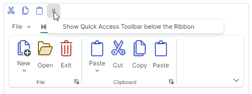

# Quick Access Toolbar

The Ribbon Quick Access Toolbar is a customizable toolbar displaying frequently used [ribbon items](ribbon-items.md). 


A user can use a context menu to add items to and remove them from the Ribbon Quick Access Toolbar at runtime.

## Add and Remove Items to the Quick Access Toolbar

To add items to the Quick Access Toolbar at runtime, a user can right-click an item and select **Add to Quick Access Toolbar** in the context menu that appears.


To remove an item from the Quick Access Toolbar, right-click an item and select the **Remove from Quick Access Toolbar**.


To learn how to save and restore user changes to the Ribbon Quick Access Toolbar between application runs, follow this topic:

- [Ribbon Serialization and Deserialization](ribbon-serialization-and-deserialization.md)

### Disable Quick Access Toolbar Customization

Set the `RibbonControl.AllowQuickAccessToolbarCustomizationMenu` property to `false` to hide the **Add to Quick Access Toolbar** and **Remove from Quick Access Toolbar** commands, thus preventing users from customizing the Quick Access Toolbar.

### Add Items to the Quick Access Toolbar in Code

To populate the Quick Access Toolbar with items in code, use the `RibbonControl.QuickAccessToolbarItems` collection. You can also use this collection to access and then modify Quick Access Toolbar items in code-behind.

``` xml
<mxr:RibbonControl.QuickAccessToolbarItems>
    <mxb:ToolbarButtonItem Header="Cut" KeyTip="CT"
                           Glyph="{x:Static icons:Basic.Cut}" />
    <mxb:ToolbarButtonItem Header="Copy" KeyTip="CP"
                           Glyph="{x:Static icons:Basic.Copy}" />
    <mxb:ToolbarButtonItem Header="Paste" KeyTip="P"
                           Glyph="{x:Static icons:Basic.Paste}" />
</mxr:RibbonControl.QuickAccessToolbarItems>
```

Use the `RibbonControl.QuickAccessToolbarItemsSource` property to populate the Quick Access Toolbar with items from a collection of business objects stored in a View Model. Corresponding data templates should define ribbon items and initialize their settings from underlying business objects.


## Change the Position and Visibility

The Ribbon Quick Access Toolbar can be displayed above (default) or below the Ribbon's main command region. 

A user can click the dropdown button in the Quick Access Toolbar and select the **Show Quick Access Toolbar Below/Above the Ribbon** command to change the Toolbar's position.




You can hide the dropdown button in the Quick Access Toolbar using the `RibbonControl.IsQuickAccessToolbarCustomizationButtonVisible` property.

The following properties allow you to control the position and visibility of the Quick Access Toolbar in code:

- `RibbonControl.QuickAccessToolbarLocation` — Allows you to choose between the `Top` and `Bottom` positions for the Quick Access Toolbar.
- `RibbonControl.IsQuickAccessToolbarVisible` — Allows you to hide the Quick Access Toolbar.

## See Also

- [Ribbon Serialization and Deserialization](ribbon-serialization-and-deserialization.md)