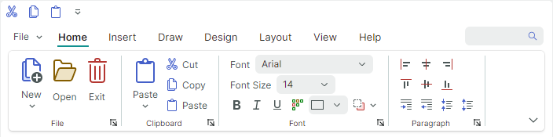

# Ribbon Command Layouts

The ribbon command layout determines the arrangement of commands in the Ribbon bar. The Ribbon control supports two layouts: Classic and Simplified.

## Classic Command Layout



- The Ribbon bar is tall enough to display three rows of commands with small icons.
- Page group headers are visible
- Groups cannot be partially collapsed when the Ribbon is resized
- Support for inline galleries
- The default size of small icons is `16x16`. You can use the `RibbonControl.SmallGlyphSize` property to change the size of small icons. Large icons are twice the size of small icons.
- When the Ribbon is resized, the [adaptive layout feature](ribbon-items.md#adaptive-glyph-size-in-the-classic-command-layout) adjusts the size of icons — from large to small with text to small glyphs, and backwards.

  

## Simplified Command Layout


- Buttons are arranged in one row
- Page group headers are hidden
- Groups can be partially collapsed when the Ribbon is resized. Collapsed buttons are accessible from the group's dropdown menu.
- Galleries are displayed in dropdown menus
- The default size of icons in the Simplified Command Layout is `22x22`. Use the `RibbonControl.GlyphSizeInSimplifiedLayout` property to specify a custom icon size.

    ``` xml
    <mxr:RibbonControl GlyphSizeInSimplifiedLayout="32">
    ```

    

## Select a Command Layout

A user can switch between the Classic and Simplified views at runtime by clicking the Command Layout Selection button at the Ribbon's right bottom corner.


Set the `RibbonControl.IsCommandLayoutSelectionButtonVisible` option to `false` to hide this button.

The `RibbonControl.CommandLayout` property allows you to specify the command layout in code.

``` xml
<mxr:RibbonControl Name="ribbon" CommandLayout="Simplified">
    <!-- ... -->
</mxr:RibbonControl>
```