# Ribbon Items

You can add various items to the Ribbon control and its menus: buttons, check buttons, text labels, sub-menus, in-place editors, and more.  


In addition to these classic items, the Ribbon control supports galleries. They are designed to display graphically rich elements, arranged in columns and rows. See [Galleries](galleries.md) for more information.

All items, including galleries, can be added to [traditional toolbars and context menus](../toolbars-and-menus/index.md). 

## Add Ribbon Items 

You can display various items in different Ribbon elements: [ribbon page groups](page-groups.md), [Quick Access Toolbar](quick-access-toolbar.md), [Page Header Area](page-header-items.md), [Main (Application) Menu](application-button-and-main-menu.md), and sub-menus.

To add items to a ribbon page group in XAML, define these items between the **&lt;RibbonPageGroup&gt;** start and end tags. In code-behind, you can add, access and modify items using the `RibbonPageGroup.Items` collection. Other ribbon elements are populated with items in the same manner.

The following example adds three buttons (`ToolbarButtonItem` objects) to a `RibbonPageGroup` object. 

``` xml
<mxb:ToolbarManager IsWindowManager="True">
    <mxr:RibbonControl ApplicationButtonContent="File" ApplicationButtonKeyTip="F">
        <mxr:RibbonPage Header="Home" KeyTip="H">
            <mxr:RibbonPageGroup Header="Editing" IsHeaderButtonVisible="False">
                <mxb:ToolbarButtonItem Header="Find" KeyTip="FN" 
                  Glyph="{x:Static icons:Basic.Search}" 
                  Command="FindButtonClick" />
                <mxb:ToolbarButtonItem Header="Replace" KeyTip="RP" 
                  Glyph="{x:Static icons:Basic.Update}" 
                  Command="ReplaceButtonClick"/>
                <mxb:ToolbarButtonItem Header="Clear" KeyTip="CL" 
                  Glyph="{x:Static icons:Basic.Table_Clear}" 
                  Command="ClearButtonClick"/>
            </mxr:RibbonPageGroup>
        </mxr:RibbonPage>
    </mxr:RibbonControl>
</mxb:ToolbarManager>
```

## Ribbon Item Types

All items you can add to the Ribbon control and traditional toolbars are `ToolbarItem` class descendants. The following sections describes available ribbon items and its settings. 


### Regular Buttons (ToolbarButtonItem)

`ToolbarButtonItem` objects allow you to implement regular buttons and [buttons with dropdown functionality](#buttons-with-dropdown-functionality-toolbarbuttonitem).

A regular button raises an action on a click.

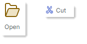


#### Click the Button

To implement an action for a button, you can specify a command or handle the button's events:

- `ToolbarItem.Command` — A command executed when the button is clicked.

    ``` xml
    <mxb:ToolbarButtonItem Header="Open" KeyTip="O" 
    Command="{Binding OpenFileCommand}" 
    Glyph="{x:Static icons:Basic.Folder_Open}" />
    ```
    ``` cs
    [RelayCommand]
    public void OpenFile()
    {
        //...
    }
    ```
    
- `CommandParameter` — A command parameter passed to the specified command.

- `ToolbarItem.Click` — Fires when the item is left-clicked (after the left mouse button is pressed and then released).
- `ToolbarItem.Press` — Fires when any mouse button is pressed over the item.

#### Button Caption and Glyph

- `Header` — The item's display text.
- `Glyph` — The item's image. See also: [Glyph Size](#glyph-size).
- `GlyphTemplate` — A custom data template to render the item's image.

#### Glyph Size

The size of command glyphs in [Ribbon page groups](page-groups.md) is different in the Simplified and Classic [command layouts](ribbon-command-layouts.md). The following sections provide more details:

- [Glyph Size in the Simplified Command Layout](#glyph-size-in-the-simplified-command-layout)
- [Glyph Size in the Classic Command Layout](#glyph-size-in-the-classic-command-layout)
- [Adaptive Glyph Size in the Classic Command Layout](#adaptive-glyph-size-in-the-classic-command-layout)


!!! tip

    To customize the size of item glyphs in popup and context menus, use the item's `GlyphSize` property.
    
    ``` xml
    <mxb:PopupMenu MinWidth="250" ContentRightIndent="30">
        <mxb:ToolbarButtonItem Header="New" Glyph="{x:Static icons:Basic.Doc}" GlyphSize="32,32" HotKey="Ctrl+N"/>
    </mxb:PopupMenu>
    ```


#### Glyph Size in the Simplified Command Layout

All commands in page groups use one icon size in the [Simplified Command Layout](ribbon-command-layouts.md). 


The default icon size is `22x22`. You can use the `RibbonControl.GlyphSizeInSimplifiedLayout` property to specify a custom icon size.

#### Glyph Size in the Classic Command Layout

Commands in page groups can display large and small glyphs in the [Classic Command Layout](ribbon-command-layouts.md).


The default size of small icons is `16x16`. You can use the `RibbonControl.SmallGlyphSize` property to change the size of small icons. Large icons are twice the size of small icons.

The `RibbonControl.DisplayMode` attached property can be used to specify display size (large, small, and small with text) for commands in ribbon page groups. See [Adaptive Glyph Size in the Classic Command Layout](#adaptive-glyph-size-in-the-classic-command-layout) for more information.

#### Adaptive Glyph Size in the Classic Command Layout

The Ribbon control's [adaptive layout feature](page-groups.md#adaptive-layout) adjusts the layout of items in [ribbon page groups](page-groups.md) when the Ribbon control is resized. This functionality also adjusts the display size of items during Ribbon resizing when the Classic command layout is used.


The `RibbonControl.DisplayMode` attached property allows you to specify supported display modes for ribbon items in ribbon page groups in the [Classic command layout](ribbon-command-layouts.md).
You can force an item to use only large images, small images, small images with text, or a combination of these display modes.

Predefined glyph display modes are defined by the `RibbonItemDisplayMode` enumeration:

  - `Large` — An item displays a large glyph and text.
  
     

  - `Small` — An item displays a small glyph and text.

    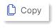

  - `SmallGlyph` — An item displays a small glyph.

    

  - `Auto` — An item supports the `Large`, `Small` and `SmallGlyph` display modes. Depending on the space available in the item's parent [group](page-groups.md), the Ribbon control automatically chooses one of these display modes for the item.

The following code snippet sets the `RibbonControl.DisplayMode` attached property for a ribbon item to `Large`. This forces the item to only use large images.

``` xml
<mxr:RibbonPage Header="Home" KeyTip="H">
    <mxr:RibbonPageGroup Header="File" IsHeaderButtonVisible="True">
        <mxb:ToolbarButtonItem Header="Open" KeyTip="O" mxr:RibbonControl.DisplayMode="Large"
                            Glyph="{x:Static icons:Basic.Folder_Open}" />
    </mxr:RibbonPageGroup>
</mxr:RibbonPage>
```

The `RibbonItemDisplayMode` enumeration is marked with the `[Flags]` attribute. So you can use any combination of the `Large`, `Small` and `SmallGlyph` flags when setting the `RibbonControl.DisplayMode` attached property.

The following code allows a ribbon item to only use the `Small` and `SmallGlyph` display modes:

``` xml
<mxb:ToolbarButtonItem Header="Help" KeyTip="LP" Glyph="{x:Static icons:Basic.Info}"
                       mxr:RibbonControl.DisplayMode="Small, SmallGlyph" />
```

#### Common Item Display Settings

- `ShowSeparator` — Gets or sets whether to display a separator before the item. You can also use the `ToolbarSeparatorItem` bar item to insert a separator.

<!-- TODO
 Check:
  - `GlyphAlignment` — The glyph alignment relative to the item's header. 
-->

    
### Buttons with Dropdown Functionality (ToolbarButtonItem)

The `ToolbarButtonItem` item allows you to create a button with an associated dropdown control or menu. 


Use the `ToolbarButtonItem.DropDownControl` property to specify a dropdown control/menu. This dropdown control is invoked when a user clicks the button or the built-in down-arrow button (depending on the `DropDownArrowVisibility` setting; see below).
  

  
``` xml
<mxb:ToolbarButtonItem Name="btnNew" Header="New" KeyTip="N" 
    Glyph="{x:Static icons:Basic.Docs_Add}"
    mxr:RibbonControl.DisplayMode="Large"
    DropDownArrowVisibility="ShowSplitArrow">
    <mxb:ToolbarButtonItem.DropDownControl>
        <mxb:PopupMenu>
            <mxb:ToolbarButtonItem Header="New Document" KeyTip="ND" 
                Glyph="{x:Static icons:Basic.Doc_Add}" />
            <mxb:ToolbarButtonItem Header="New Excel Document" KeyTip="NX"
                                    Glyph="{x:Static icons:Basic.Doc_Excel}" />
        </mxb:PopupMenu>
    </mxb:ToolbarButtonItem.DropDownControl>
</mxb:ToolbarButtonItem>
```
  
#### Dropdown Control and Down-Arrow Button

- `DropDownControl` — Gets or sets a dropdown control (an `Eremex.AvaloniaUI.Controls.Bars.IPopup` object) associated with the item. The control pops up when a user clicks the item or the built-in down arrow button (see `DropDownArrowVisibility`). The following objects implement the `Eremex.AvaloniaUI.Controls.Bars.IPopup` interface, and so they can be displayed as dropdown controls:

    - `Eremex.AvaloniaUI.Controls.Bars.PopupMenu` — A [popup menu](../toolbars-and-menus/popup-and-context-menus.md). You can add all types of toolbar items to the menu to populate it with content.
    - `Eremex.AvaloniaUI.Controls.Bars.PopupContainer` — A container of controls. Use `PopupContainer` to display custom controls in a dropdown.
    
- `DropDownArrowVisibility` — Gets or sets whether the item displays a dropdown arrow used to invoke the associated dropdown control. 

    

    - `ShowSplitArrow` or `Default` — The dropdown arrow is visible. It acts as a separate button embedded in the item. A click on the dropdown arrow invokes the associated dropdown control and raises the `DropDownPress` event. A click on the item invokes its command (`Command`) and events (`Click` and `Press`). 

    - `ShowArrow` — The dropdown arrow is visible. The item and arrow act as a single button. A click on them displays an associated dropdown control.

    - `Hide` — The dropdown arrow is hidden. A click on the item invokes the dropdown control.

<!-- - `DropDownArrowAlignment` — Gets or sets the position of the dropdown arrow. -->

#### Invoke the Dropdown Control

- `DropDownOpenMode` — Gets or sets whether and when the dropdown control is invoked when a user touches the item/dropdown arrow. Supported options include:
    - `Press` or `Default` — The dropdown is displayed on a mouse press event.
    - `Click` — The dropdown is displayed after the mouse is pressed and then released over the item.
    - `Never` — The dropdown is not displayed.
- `DropDownPress` — The event that fires when the dropdown arrow is pressed.
  


### Check Buttons (ToolbarCheckItem)


The `ToolbarCheckItem` item allows you to create a check button. Check buttons support two states — normal and pressed. 


``` xml
xmlns:mxb="https://schemas.eremexcontrols.net/avalonia/bars"

<mxb:ToolbarCheckItem Header="Bold" 
 IsChecked="{Binding #textBox.FontWeight, 
  Converter={helpers:BoolToFontWeightConverter}, Mode=TwoWay}" 
 Glyph="{SvgImage 'avares://DemoCenter/Images/FontBold.svg'}" />
```

#### Check the Button

- `IsChecked` — Gets or sets the button's check state.
- `CheckedChanged` — The event that fires when the check state changes.


#### Caption, Glyph and Display Settings

- `Header` — The item's display text.
- `Glyph` — The item's image. A check button supports both large and small images. See the following sections to learn more:

  - [Glyph Size](#glyph-size)
  - [Adaptive Glyph Size in the Classic Command Layout](#adaptive-glyph-size-in-the-classic-command-layout)

- `GlyphTemplate` — A custom data template to render the item's image.

- `CheckBoxStyle` — Gets or sets display mode for a `ToolbarCheckItem` object. Available options include:

  - `CheckBoxStyle.CheckButton` — The item is rendered as a check button. When `IsChecked` is `true` the button appears in the pressed state.

    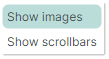

  - `CheckBoxStyle.CheckBox` — The item displays a toggle box before its text and glyph. When `IsChecked` is `true` the toggle box has a check mark.

    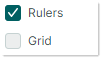
    
  - `CheckBoxStyle.RadioButton` — The item displays a radio button before its text and glyph. When `IsChecked` is `true` the radio button is rendered as a filled circle.

    You can apply the RadioButton style to `ToolbarCheckItem` objects combined in a check group ([`ToolbarCheckItemGroup`](#non-breaking-groups-of-check-items-toolbarcheckitemgroup)). In this case, the group appears as a typical radio group.

    ``` xml
    <mxb:ToolbarCheckItemGroup CheckType="Radio">
        <mxb:ToolbarCheckItem Header="E-mail" CheckBoxStyle="RadioButton" />
        <mxb:ToolbarCheckItem Header="Phone" CheckBoxStyle="RadioButton" />
    </mxb:ToolbarCheckItemGroup>
    ```
    
    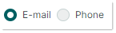
    
- `CheckBoxAlignment` — Gets or sets whether the check box (or radio button) are displayed before or after an item's glyph and text. This option is in effect when the `CheckBoxStyle` property is set to `CheckBoxStyle.CheckBox` or `CheckBoxStyle.RadioButton`.

    ```xml
    <mxb:ToolbarCheckItem Header="Status bar" CheckBoxAlignment="After"
                        CheckBoxStyle="CheckBox"
                        Hint="Show and hide the status bar"/>
    <mxb:ToolbarSeparatorItem/>
    ```
    
    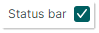
    


You can customize the general display settings for check buttons in the same manner as for regular buttons.

- [Common Item Display Settings](#common-item-display-settings)

### Sub-menus (ToolbarMenuItem)

Use `ToolbarMenuItem` to create an item that displays a sub-menu on a click. 

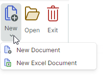

#### Sub-menu's Content

To specify a sub-menu's content, define items between the **&lt;ToolbarMenuItem&gt;** start and end tags in XAML, or add items to the `ToolbarMenuItem.Items` collection in code-behind.

``` xml
xmlns:mxb="https://schemas.eremexcontrols.net/avalonia/bars"

<mxb:ToolbarMenuItem Header="File" Category="File">
    <mxb:ToolbarButtonItem Header="New" 
     Glyph="{SvgImage 'avares://DemoCenter/Images/Group=Context Menu, Icon=NewDraftAction.svg'}" 
     Category="File" Command="{Binding NewFileCommand}"/>
    <mxb:ToolbarButtonItem Header="Open" 
     Glyph="{SvgImage 'avares://DemoCenter/Images/Group=Basic, Icon=Folder Open.svg'}" 
     Category="File" Command="{Binding OpenFileCommand}"/>
    <mxb:ToolbarButtonItem Header="Save" 
     Glyph="{SvgImage 'avares://DemoCenter/Images/Group=Basic, Icon=Save.svg'}" 
     Category="File" Command="{Binding SaveFileCommand}"/>
    <mxb:ToolbarButtonItem Header="Print" 
     Glyph="{SvgImage 'avares://DemoCenter/Images/Group=Basic, Icon=Print.svg'}" 
     ShowSeparator="True"  Category="File" Command="{Binding PrintFileCommand}"/>
</mxb:ToolbarMenuItem>
```

You can also use the `ToolbarMenuItem.ItemsSource` property to populate a sub-menu with items from a collection of business objects in a View Model. Corresponding data templates should define ribbon items and initialize their settings from underlying business objects.


#### Invoke the Sub-menu

When a sub-menu is invoked, the following events are raised:

- `Opening` — Fires when the menu is about to be displayed. This event allows you to cancel the display of the menu.
- `Opened` — Fires after the menu is displayed.
- `Closing` — Fires when the menu is about to be closed. This event allows you to cancel closing the menu.
- `Closed` — Fires after the menu is closed.

The following property allows you to cancel the display of a sub-menu, and specify whether to display the sub-menu on a mouse click or press event.

- `DropDownOpenMode` — Gets or sets whether and how the sub-menu is invoked when a user touches the item. Supported options include:
    - `Press` or `Default` — The menu is displayed on a mouse press event.
    - `Click` — The menu is displayed after the mouse is pressed and then released over the item.
    - `Never` — The menu is not displayed.


#### Caption, Glyph and Display Settings

- `Header` — The sub-menu's header text.
- `Glyph` — The sub-menu's image. A sub-menu supports both large and small images in the header. See the following sections to learn how to specify the size of item glyphs in the Ribbon control:

  - [Glyph Size](#glyph-size)
  - [Adaptive Glyph Size in the Classic Command Layout](#adaptive-glyph-size-in-the-classic-command-layout)

- `GlyphTemplate` — A custom data template to render the item's image.

You can customize the general display settings for sub-menus in the same manner as for regular buttons.

- [Common Item Display Settings](#common-item-display-settings)


### In-place Editors (ToolbarEditorItem)

Use a `ToolbarEditorItem` object to embed an in-place editor in a Ribbon control. 

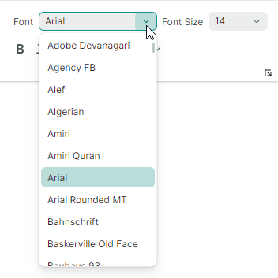

A `ToolbarEditorItem` object supports the following approaches to specify an in-place editor:

- [Specify an Editor Type](#specify-an-editor-type).  This is the recommended way to specify an Eremex in-place editor.

- [Specify an Editor in a Data Template](#specify-an-editor-in-a-data-template)


#### Specify an Editor Type

This approach allows you to embed an Eremex editor. 

To specify an editor type, set the `ToolbarEditorItem.EditorProperties` property to one of the following objects:

- `ButtonEditorProperties` — Corresponds to a `ButtonEditor` in-place editor.
- `CheckEditorProperties` — Corresponds to a `CheckEditor` in-place editor.
- `ColorEditorProperties` — Corresponds to a `ColorEditor` in-place editor.
- `ComboBoxEditorProperties` — Corresponds to a `ComboBoxEditor` in-place editor.
- `HyperlinkEditorProperties` — Corresponds to a `HyperlinkEditor` in-place editor.
- `PopupColorEditorProperties` — Corresponds to a `PopupColorEditor` in-place editor.
- `PopupEditorProperties` — Corresponds to a `PopupEditor` in-place editor.
- `SegmentedEditorProperties` — Corresponds to a `SegmentedEditor` in-place editor.
- `SpinEditorProperties` — Corresponds to a `SpinEditor` in-place editor.
- `TextEditorProperties` — Corresponds to a `TextEditor` in-place editor.
- `MemoEditorProperties` — Corresponds to a `MemoEditor` in-place editor.

These objects are `BaseEditorProperties` descendants. They contain settings to customize corresponding in-place editors.

The following example defines the _Font_ item (`ToolbarEditorItem` object) that displays a list of fonts using a combobox in-place editor. The `ToolbarEditorItem.EditorProperties` property is set to a `ComboBoxEditorProperties` object, which corresponds to a `ComboBoxEditor` editor. See the _WordPad Example_ demo for the complete code.

``` xml
<mxb:ToolbarEditorItem Header="Font" EditorWidth="150" 
 EditorValue="{Binding #textBox.FontFamily, Converter={helpers:FontNameToFontFamilyConverter}}">
    <mxb:ToolbarEditorItem.EditorProperties>
        <mxe:ComboBoxEditorProperties 
         ItemsSource="{Binding $parent[view:ToolbarAndMenuPageView].Fonts}"
         IsTextEditable="False" PopupMaxHeight="300"/>
    </mxb:ToolbarEditorItem.EditorProperties>
</mxb:ToolbarEditorItem>      
```

#### Specify an Editor in a Data Template

Use the `ToolbarEditorItem.EditorTemplate` property to specify an editor in a Data Template. In this case, you need to manually set a value for the editor (for instance, using Data Binding).

``` xml
<mxb:ToolbarEditorItem Width="150">
    <mxb:ToolbarEditorItem.EditorTemplate>
        <DataTemplate>
            <mxe:TextEditor EditorValue="{Binding Count}" Width="80"/>
        </DataTemplate>
    </mxb:ToolbarEditorItem.EditorTemplate>
</mxb:ToolbarEditorItem>
```

#### Change and Return the Editor's Value

- `ToolbarEditorItem.EditorValue` — Gets or sets the in-place editor's value. Use this property for data binding.

- `ToolbarEditorItem.EditorValueChanged` — The event that fires after the editor's value is changed.

These members are in effect when you use the `ToolbarEditorItem.EditorProperties` property to specify an editor.

#### Editor's Width

<!-- TODO 
Not supported in Ribbon

 - `ToolbarEditorItem.SizeMode` — Gets or sets the item's size mode. This property allows you to stretch the bar item, so it occupues all the available empty space within the bar. -->
- `ToolbarEditorItem.EditorWidth` — Gets or sets the in-place editor's width. This property is in effect when you use the `ToolbarEditorItem.EditorProperties` property to specify an editor. If you specify an editor in a Data Template, you can set the editor width with the `ToolbarEditorItem.Width` property, or set the width for the editor itself.
<!-- TODO
Doesn't work:

- `ToolbarEditorItem.EditorHeight` — Gets or sets the in-place editor's height. 
- `ToolbarEditorItem.EditorAlignment` — Gets or sets the editor's alignment relative to the item's header.
-->

<!--TODO - `ToolbarEditorItem.Editor` -  

-->

#### Caption and Glyph

- `Header` — The item's display text.

- `Glyph` — The item's image. `ToolbarEditorItem` objects support only small images. The size of small images is specified by the `RibbonControl.SmallGlyphSize` property in the Classic command layout, and the `RibbonControl.GlyphSizeInSimplifiedLayout` property in the Simplified command layout.
- `GlyphTemplate` — A custom data template to render the item's image.

You can customize the general display settings for `ToolbarEditorItem` objects in the same manner as for regular buttons.

- [Common Item Display Settings](#common-item-display-settings)


### Text Labels (ToolbarTextItem)


Use a `ToolbarTextItem` object to display a text label that cannot be edited by users.


``` xml
<mxb:ToolbarTextItem 
 Header="{Binding #scaleDecorator.Scale, StringFormat={}Zoom: {0:P0}}" 
 ShowBorder="False" 
 />
```

#### Caption and Glyph

- `Header` — The item's display text.
- `Glyph` — The item's image. A text label supports both large and small images. See the following sections to learn how to specify the size of item glyphs in the Ribbon control:

  - [Glyph Size](#glyph-size)
  - [Adaptive Glyph Size in the Classic Command Layout](#adaptive-glyph-size-in-the-classic-command-layout)


#### Text Label's Display Settings

- `ToolbarTextItem.ShowBorder` — Gets or sets whether the item's border is visible. 

  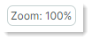

  You can use the `ToolbarTextItem.BorderTemplate` property to specify a custom template to paint the border.
- `ToolbarTextItem.BorderTemplate` — Gets or sets a custom template to paint the item's border. This template is in effect if the `ToolbarTextItem.ShowBorder` option is enabled.


See also:

- [Common Item Display Settings](#common-item-display-settings)


### Non-Breaking Groups of Items (ToolbarItemGroup)

Use `ToolbarItemGroup` to create a non-breaking container (group) of toolbar items. Items in this container are always displayed together in a line, and they act as a cohesive unit when the Ribbon is resized. 

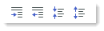

In the [Classic command layout](ribbon-command-layouts.md), a `ToolbarItemGroup`'s items support only small images.

#### Group's Content

To specify a container's content, define items between the **&lt;ToolbarItemGroup&gt;** start and end tags in XAML, or add items to the `ToolbarItemGroup.Items` collection in code-behind.

``` xml
<mxb:ToolbarItemGroup>
    <mxb:ToolbarButtonItem Header="Increase" KeyTip="CR" Glyph="{x:Static icons:Basic.Level_Increase}" />
    <mxb:ToolbarButtonItem Header="Decrease" KeyTip="DC" Glyph="{x:Static icons:Basic.Level_Reduce}" />
    <mxb:ToolbarButtonItem Header="Collapse" KeyTip="CL" Glyph="{x:Static icons:Basic.List_Collapse}" />
    <mxb:ToolbarButtonItem Header="Expand" KeyTip="EX" Glyph="{x:Static icons:Basic.List_Expand}" />
</mxb:ToolbarItemGroup>
```

You can also use the `ToolbarItemGroup.ItemsSource` property to populate the container with items from a collection of business objects stored in a View Model. Corresponding data templates should define ribbon items and initialize their settings from underlying business objects.

See also:

- [Customize Item Layout in Page Groups](page-groups.md#customize-item-layout-in-page-groups)
- [Arrange Non-Breaking Containers in Two or Three Rows](page-groups.md#arrange-non-breaking-containers-in-two-or-three-rows)

### Non-Breaking Groups of Check Items (ToolbarCheckItemGroup)

Use `ToolbarCheckItemGroup` to create a non-breaking container (group) of check items ([`ToolbarCheckItem` objects](#check-buttons-toolbarcheckitem)). Like a `ToolbarItemGroup` object, a `ToolbarCheckItemGroup` object acts as a whole when its parent is resized (the contents of the container cannot be partially hidden; items are always displayed in a single line and do not support wrapping).


The `ToolbarCheckItemGroup` container can control the check state of its child `ToolbarCheckItem` items. You can use the `ToolbarCheckItemGroup` container to create the following group types:

- A group of mutually exclusive items (radio group).
- A group that allows multiple items to be checked at the same time.

In the [Classic command layout](ribbon-command-layouts.md), a `ToolbarCheckItemGroup`'s items support only small images.

#### Group's Content

To specify a container's content, define `ToolbarCheckItem` items between the **&lt;ToolbarCheckItemGroup&gt;** start and end tags in XAML, or add items to the `ToolbarCheckItemGroup.Items` collection in code-behind.

``` xml
<mxb:ToolbarCheckItemGroup>
    <mxb:ToolbarCheckItem Header="Bold" KeyTip="B" Glyph="{x:Static icons:Basic.Font_Bold}" />
    <mxb:ToolbarCheckItem Header="Italic" KeyTip="I" Glyph="{x:Static icons:Basic.Font_Italic}" />
    <mxb:ToolbarCheckItem Header="Underline" KeyTip="U" Glyph="{x:Static icons:Basic.Font_Underline}" />
</mxb:ToolbarCheckItemGroup>
```

You can also use the `ToolbarCheckItemGroup.ItemsSource` property to populate the container with items from a collection of business objects stored in a View Model. Corresponding data templates should define ribbon items and initialize their settings from underlying business objects.


#### Check the Group's Items

- `ToolbarCheckItemGroup.CheckType` — Gets or sets whether a single or multiple items can be checked in the group at a time. The following options are supported:

    - `Default` or `Multiple` — Multiple items can be checked at a time.
    - `Radio` — A group of mutually exclusive items. A user cannot uncheck an item other than by checking another one.
    - `Single` — A group of mutually exclusive items. A user can uncheck all items within the group.

- `ToolbarCheckItem.IsChecked` — Gets or sets a button's check state.


See also:

- [Customize Item Layout in Page Groups](page-groups.md#customize-item-layout-in-page-groups)
- [Arrange Non-Breaking Containers in Two or Three Rows](page-groups.md#arrange-non-breaking-containers-in-two-or-three-rows)

### Separators (ToolbarSeparatorItem)

A `ToolbarSeparatorItem` object allows you to insert a separator.

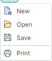

``` xml
<mxb:ToolbarMenuItem Header="File" Category="File">
    <mxb:ToolbarButtonItem Header="New" 
     Glyph="{SvgImage 'avares://DemoCenter/Images/Group=Context Menu, Icon=NewDraftAction.svg'}" 
     Category="File"/>
    <mxb:ToolbarButtonItem Header="Open" 
     Glyph="{SvgImage 'avares://DemoCenter/Images/Group=Basic, Icon=Folder Open.svg'}" 
     Category="File"/>
    <mxb:ToolbarButtonItem Header="Save" 
     Glyph="{SvgImage 'avares://DemoCenter/Images/Group=Basic, Icon=Save.svg'}" 
     Category="File"/>
    <mxb:ToolbarSeparatorItem/>
    <mxb:ToolbarButtonItem Header="Print" 
     Glyph="{SvgImage 'avares://DemoCenter/Images/Group=Basic, Icon=Print.svg'}" 
     Category="File"/>
</mxb:ToolbarMenuItem>
```

### Galleries

To create a gallery, use a `RibbonGalleryItem` item. The following image displays an in-ribbon gallery.

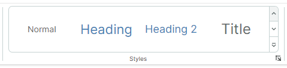

When you add a `RibbonGalleryItem` object to a traditional toolbar or popup menu, the gallery is displayed as a sub-menu.

See the following topic for more information: [Galleries](galleries.md)

## Hot Keys

You can use the `ToolbarItem.HotKey` property to assign hotkeys to items. 

``` xml
<mxb:ToolbarButtonItem 
    Header="Open" Command="{Binding OpenCommand}" HotKey="Ctrl+O"
    Glyph="{x:Static icons:Basic.Folder_Open}"/>
```

A hotkey press activates an item's command provided that focus is within the hotkey scope. The default hotkey scope is the UI region within the `ToolbarManager` component's bounds. When the input focus is beyond the hotkey scope, `ToolbarManager` is not able to intercept hotkeys.

The `ToolbarManager.IsWindowManager` property allows you to extend the hotkey scope to the entire window. When you set this property to `true`, the `ToolbarManager` component registers item hotkeys in the window. It will be able to intercept and process hotkeys even if focus is outside its client area.

## Tooltips

Use the `ToolbarItem.Hint` property to specify tooltips for ribbon items:

``` xml
<mxb:ToolbarButtonItem Header="Increase" HotKey="CTRL+J" 
  Glyph="{x:Static icons:Basic.Level_Increase}" 
  Hint="Increase the indent"/>
```

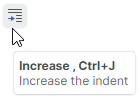

## See Also

- [Key Tips](key-tips.md)
- [Customize Item Layout in Page Groups](page-groups.md#customize-item-layout-in-page-groups)