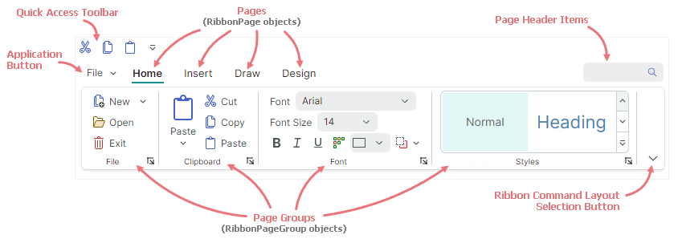
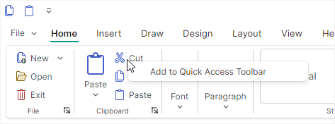
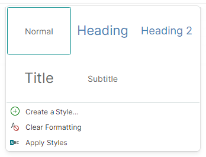

# Ribbon Overview

Use [`RibbonControl`](../../API/Eremex.AvaloniaUI.Controls.Ribbon/RibbonControl.md) to create a ribbon menu like the one found in Microsoft Office applications. [`RibbonControl`](../../API/Eremex.AvaloniaUI.Controls.Ribbon/RibbonControl.md) is a toolbar that organizes commands and other items into a series of pages (tabs). Pages consist of groups which in turn display ribbon items (commands, in-place editors, labels, galleries, and so on).




## Ribbon Visual Elements

[`RibbonControl`](../../API/Eremex.AvaloniaUI.Controls.Ribbon/RibbonControl.md) comprises the following elements:

- [Pages](pages.md) — Ribbon pages allow you to create tabs. You can add as many pages as you need. At least, one page must be created. 

    Each page displays one or more groups of items.

- [Page Groups](page-groups.md) — Ribbon groups provide a logical way to combine sets of items within pages. Groups are separated with vertical lines.

- [Application Button](application-button-and-main-menu.md) — This button invokes a dropdown Application Menu, which typically contains commands used to work with files.

  

    The Application Button, if enabled, is displayed before page headers. 

- [Quick Access Toolbar](quick-access-toolbar.md) — This toolbar provides access to frequently used commands. Users can add a command to this toolbar using a context menu.

  

  The Quick Access Toolbar can be displayed above or below the ribbon pages.

- [Page Header Items](page-header-items.md) — You can display ribbon items at the Ribbon's right edge, in line with the page headers. The collection that stores these items is called Page Header Items.

- [Ribbon Command Layout Selection Button](ribbon-command-layouts.md) — This button displays a menu that allows a user to switch between the Classic and Simplified ribbon command layouts.

  
  

  The `Classic` command layout arranges ribbon items in three rows:

  


  The `Simplified` layout uses one row of items:

  

  Refer to [Ribbon Command Layouts](ribbon-command-layouts.md) for more information.


## Demo 

See the Eremex Controls Demo application for examples that demonstrate the features of the [`RibbonControl`](../../API/Eremex.AvaloniaUI.Controls.Ribbon/RibbonControl.md) in action.

## Create a Ribbon UI

In short, the creation of a Ribbon UI consists of the following stages:

1. Create a [`RibbonControl`](../../API/Eremex.AvaloniaUI.Controls.Ribbon/RibbonControl.md).
2. Add ribbon pages (tabs) to the ribbon.
3. Add ribbon page groups to the pages.
4. Add ribbon items (commands, galleries, etc.) to the page groups.

You can also add ribbon items to the [Page Header Area](page-header-items.md), [Quick Access Toolbar](quick-access-toolbar.md), popup menus and sub-menus.

### Define RibbonControl

[`RibbonControl`](../../API/Eremex.AvaloniaUI.Controls.Ribbon/RibbonControl.md) is a feature-rich toolbar. Like [traditional toolbars](../toolbars-and-menus/index.md), [`RibbonControl`](../../API/Eremex.AvaloniaUI.Controls.Ribbon/RibbonControl.md) is managed by the [`ToolbarManager`](../../API/Eremex.AvaloniaUI.Controls.Bars/ToolbarManager.md) component. 

!!! tip

    The [`ToolbarManager`](../../API/Eremex.AvaloniaUI.Controls.Bars/ToolbarManager.md) component can manage not only [`RibbonControl`](../../API/Eremex.AvaloniaUI.Controls.Ribbon/RibbonControl.md). You can use this component to create [traditional toolbars](../toolbars-and-menus/index.md) (for instance, a status bar) and [context menus](../toolbars-and-menus/popup-and-context-menus.md) for controls.

To create a [`RibbonControl`](../../API/Eremex.AvaloniaUI.Controls.Ribbon/RibbonControl.md), define it inside a [`ToolbarManager`](../../API/Eremex.AvaloniaUI.Controls.Bars/ToolbarManager.md) component.

``` xml
<mxb:ToolbarManager IsWindowManager="True">
    <mxr:RibbonControl Name="ribbon1">
      <!-- ... -->
    </mxr:RibbonControl>
</mxb:ToolbarManager>
```

### Define and Access Ribbon Pages

Ribbon [pages](pages.md) (tabs) are encapsulated by the [`RibbonPage`](../../API/Eremex.AvaloniaUI.Controls.Ribbon/RibbonPage.md) class.

To add ribbon pages in XAML, define **&lt;RibbonPage&gt;** objects as the content of the **&lt;RibbonControl&gt;** tag. To add and access ribbon pages in code-behind, use the [`RibbonControl.Pages`](../../API/Eremex.AvaloniaUI.Controls.Ribbon/RibbonControl/Pages.md) collection. 

``` xml
<mxb:ToolbarManager IsWindowManager="True">
    <mxr:RibbonControl>
      <mxr:RibbonPage Header="Home" KeyTip="H"> 
        <!-- ... -->
      </mxr:RibbonPage>
      <mxr:RibbonPage Header="View" KeyTip="V">
        <!-- ... -->
      </mxr:RibbonPage>
      <mxr:RibbonPage Header="Design" KeyTip="S">
        <!-- ... -->
      </mxr:RibbonPage>
    </mxr:RibbonControl>
</mxb:ToolbarManager>
```


### Define and Access Ribbon Page Groups

Ribbon [page groups](page-groups.md) are encapsulated by the [`RibbonPageGroup`](../../API/Eremex.AvaloniaUI.Controls.Ribbon/RibbonPageGroup.md) class. They are child elements of ribbon pages. 

To create page groups in XAML, define **&lt;RibbonPageGroup&gt;** objects as the content of **&lt;RibbonPage&gt;** elements. To add and access page groups in code-behind, use the [`RibbonPage.Groups`](../../API/Eremex.AvaloniaUI.Controls.Ribbon/RibbonPage/Groups.md) collection. 

``` xml
<mxr:RibbonPage Header="Home" KeyTip="H" Name="pageHome">
  <mxr:RibbonPageGroup Header="File" IsHeaderButtonVisible="True">
    <!-- ... -->
  </mxr:RibbonPageGroup>
  <mxr:RibbonPageGroup Header="Clipboard" IsHeaderButtonVisible="True">
    <!-- ... -->
  </mxr:RibbonPageGroup>
  <mxr:RibbonPageGroup Header="Font" IsHeaderButtonVisible="True">
    <!-- ... -->
  </mxr:RibbonPageGroup>
</mxr:RibbonPage>
```

### Define Ribbon Items (Commands, Sub-Menus, Galleries, and so on)

Ribbon items are basic elements that you can add to a ribbon UI (ribbon page groups, Quick Access Toolbar, and Page Header Items collection). They include:

- Buttons ([`ToolbarButtonItem`](../../API/Eremex.AvaloniaUI.Controls.Bars/ToolbarButtonItem.md)) — A regular or dropdown button. 

  A regular button executes a command ([`ToolbarButtonItem.Command`](../../API/Eremex.AvaloniaUI.Controls.Bars/ToolbarItem/Command.md)) and events ([`Click`](../../API/Eremex.AvaloniaUI.Controls.Bars/ToolbarItem/Click.md) and [`Press`](../../API/Eremex.AvaloniaUI.Controls.Bars/ToolbarItem/Press.md)) on a click. 
  
  

  You can also associate a dropdown control with the button. This control will be displayed when a user clicks the button or the built-in down arrow.

  

  The Ribbon control allows you to specify display size for buttons. You can use the `RibbonControl.DisplayMode` attached property to choose between large size, small size with text and small size without text.

    

- Check Buttons ([`ToolbarCheckItem`](../../API/Eremex.AvaloniaUI.Controls.Bars/ToolbarCheckItem.md)) — A button that supports two states - normal and pressed. The button's state is specified by the [`ToolbarCheckItem.IsChecked`](../../API/Eremex.AvaloniaUI.Controls.Bars/ToolbarCheckItem/IsChecked.md) property. The [`ToolbarCheckItem.CheckedChanged`](../../API/Eremex.AvaloniaUI.Controls.Bars/ToolbarCheckItem/CheckedChanged.md) event fires when the check state changes.

  

- Sub-menu ([`ToolbarMenuItem`](../../API/Eremex.AvaloniaUI.Controls.Bars/ToolbarMenuItem.md)) — Displays a sub-menu on a click. 

  
  
- In-place editor ([`ToolbarEditorItem`](../../API/Eremex.AvaloniaUI.Controls.Bars/ToolbarEditorItem.md)) — Displays an in-place editor specified by the [`ToolbarEditorItem.EditorProperties`](../../API/Eremex.AvaloniaUI.Controls.Bars/ToolbarEditorItem/EditorProperties.md) property. For instance, you can embed a [SpinEditor](../editors/spineditor.md) or [TextEditor](../editors/texteditor.md) to the Ribbon UI.

  

- A text label ([`ToolbarTextItem`](../../API/Eremex.AvaloniaUI.Controls.Bars/ToolbarTextItem.md)) — Displays static text specified by the [`ToolbarTextItem.Header`](../../API/Eremex.AvaloniaUI.Controls.Bars/ToolbarItem/Header.md) property.

  

- A group of items ([`ToolbarItemGroup`](../../API/Eremex.AvaloniaUI.Controls.Bars/ToolbarItemGroup.md)) — A non-breaking group of items. 

  
 
  The Ribbon's adaptive layout feature automatically collapses and restores items when the control is resized. Groups function as a whole. Only an entire group can be collapsed when the Ribbon is resized, not its individual items.

- A group of check buttons ([`ToolbarCheckItemGroup`](../../API/Eremex.AvaloniaUI.Controls.Bars/ToolbarCheckItemGroup.md)) — A non-breaking group of check buttons ([`ToolbarCheckItem`](../../API/Eremex.AvaloniaUI.Controls.Bars/ToolbarCheckItem.md) objects). The [`ToolbarCheckItemGroup`](../../API/Eremex.AvaloniaUI.Controls.Bars/ToolbarCheckItemGroup.md) class allows you to create a group of mutually exclusive items (radio group), and a group that allows multiple items to be checked at the same time.

  

- A separator ([`ToolbarSeparatorItem`](../../API/Eremex.AvaloniaUI.Controls.Bars/ToolbarSeparatorItem.md)) — Displays a separator between Ribbon items.

  

- A gallery ([`RibbonGalleryItem`](../../API/Eremex.AvaloniaUI.Controls.Ribbon/RibbonGalleryItem.md)) — A gallery of elements. Use the [`RibbonGalleryItem.ItemsSource`](../../API/Eremex.AvaloniaUI.Controls.Ribbon/RibbonGalleryItem/ItemsSource.md) property to specify a list of objects to be rendered as gallery items.

  

  An in-ribbon gallery has a dropdown button, which activates a dropdown view of the gallery. The dropdown gallery can display additional commands at the bottom, specified by the [`RibbonGalleryItem.DropDownItems`](../../API/Eremex.AvaloniaUI.Controls.Ribbon/RibbonGalleryItem/DropDownItems.md) property.

  
  

All ribbon items listed above are [`ToolbarItem`](../../API/Eremex.AvaloniaUI.Controls.Bars/ToolbarItem.md) class descendants. 
They can be added to traditional toolbars and context menus as well. 


To add items to ribbon page groups, define corresponding ribbon items between the **&lt;RibbonPageGroup&gt;** start and end tags. To add and access ribbon items in code-behind, use the [`RibbonPageGroup.Items`](../../API/Eremex.AvaloniaUI.Controls.Ribbon/RibbonPageGroup/Items.md) collection. 

The following code snippet adds four regular buttons ([`ToolbarButtonItem`](../../API/Eremex.AvaloniaUI.Controls.Bars/ToolbarButtonItem.md) objects) to the _Clipboard_ group. You can find the complete code in the _WordPad Example_ demo.


``` xml
<mxr:RibbonPageGroup Header="Clipboard" IsHeaderButtonVisible="True">
    <mxb:ToolbarButtonItem Header="Paste" KeyTip="PA" Glyph="{x:Static icons:Basic.Paste}"
                           mxr:RibbonControl.DisplayMode="Large"
                           DropDownArrowVisibility="ShowSplitArrow">
        <mxb:ToolbarButtonItem.DropDownControl>
            <mxb:PopupMenu>
                <mxb:ToolbarButtonItem Header="Paste Special" KeyTip="PS" 
                  Glyph="{x:Static icons:Basic.Paste}" 
                  Command="{Binding PasteSpecialCommand}"/>
                <mxb:ToolbarButtonItem Header="Set Default Paste..." KeyTip="SP" 
                  Command="{Binding SetDefaultPasteCommand}"
                />
            </mxb:PopupMenu>
        </mxb:ToolbarButtonItem.DropDownControl>
    </mxb:ToolbarButtonItem>
    <mxb:ToolbarButtonItem Header="Cut" KeyTip="CT"
                           Glyph="{x:Static icons:Basic.Cut}" Command="{Binding CutCommand}"/>
    <mxb:ToolbarButtonItem Header="Copy" KeyTip="CP"
                           Glyph="{x:Static icons:Basic.Copy}" Command="{Binding CopyCommand}"/>
    <mxb:ToolbarButtonItem Header="Paste" KeyTip="P"
                           Glyph="{x:Static icons:Basic.Paste}" Command="{Binding PasteCommand}"/>
</mxr:RibbonPageGroup>
```

See the following topics for more information:

- [Ribbon Items](ribbon-items.md)
- [Galleries](galleries.md)


## MVVM Design Pattern Support

The Ribbon control supports the MVVM design pattern, allowing you to create pages, page groups, and items (in page groups, Quick Access Toolbar, and Page Header area) from collections of business objects defined in a View Model. The following properties maintain the MVVM design pattern:

- [`RibbonControl.PagesSource`](../../API/Eremex.AvaloniaUI.Controls.Ribbon/RibbonControl/PagesSource.md) — A collection of business objects used to populate a Ribbon control's pages. Corresponding data templates should define [`RibbonPage`](../../API/Eremex.AvaloniaUI.Controls.Ribbon/RibbonPage.md) objects.
- [`RibbonPage.GroupsSource`](../../API/Eremex.AvaloniaUI.Controls.Ribbon/RibbonPage/GroupsSource.md) — A collection of business objects used to populate groups in Ribbon pages. Corresponding data templates should define [`RibbonPageGroup`](../../API/Eremex.AvaloniaUI.Controls.Ribbon/RibbonPageGroup.md) objects.
- [`RibbonPageGroup.ItemsSource`](../../API/Eremex.AvaloniaUI.Controls.Ribbon/RibbonPageGroup/ItemsSource.md) — A collection of business objects used to create Ribbon items in page groups. Corresponding data templates should define [ribbon items](ribbon-items.md).
- [`RibbonControl.QuickAccessToolbarItemsSource`](../../API/Eremex.AvaloniaUI.Controls.Ribbon/RibbonControl/QuickAccessToolbarItemsSource.md) — A collection of business objects used to create Ribbon items in the [Quick Access Toolbar](quick-access-toolbar.md). Corresponding data templates should define [ribbon items](ribbon-items.md).
- [`RibbonControl.PageHeaderItemsSource`](../../API/Eremex.AvaloniaUI.Controls.Ribbon/RibbonControl/PageHeaderItemsSource.md) — A collection of business objects used to create [Page Header Items](page-header-items.md). Corresponding data templates should define [ribbon items](ribbon-items.md).
- [`ToolbarMenuItem.ItemsSource`](../../API/Eremex.AvaloniaUI.Controls.Bars/ToolbarMenuItem/ItemsSource.md) — A collection of business objects used to populate a sub-menu with items. Corresponding data templates should define ribbon items.
