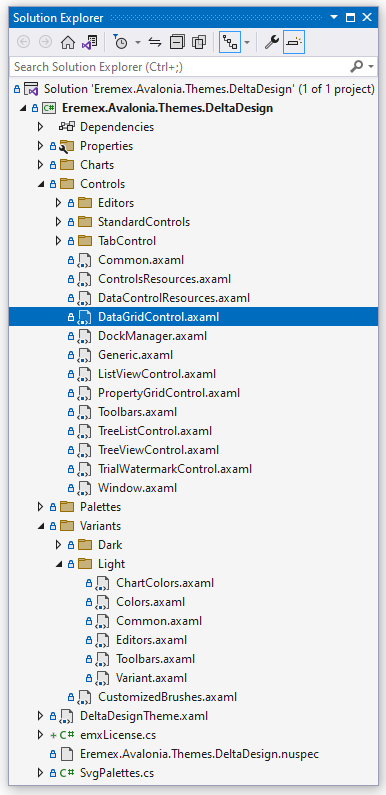
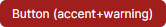
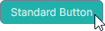
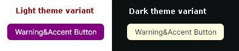
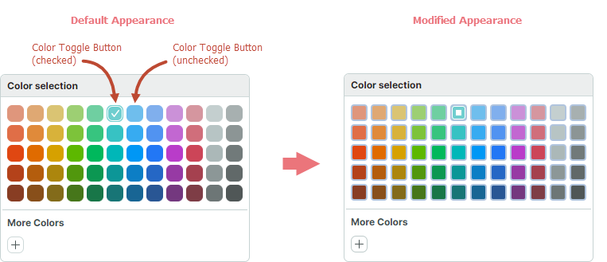

# Modify Control Themes

A control theme in Avalonia UI is a collection of styles, [control themes](https://docs.avaloniaui.net/docs/basics/user-interface/styling/control-themes) and resources that define templates and appearance settings of controls.

This topic explains how to modify theme settings and styles for individual Eremex controls or for all Eremex controls in your project.

## Default Theme

The _Eremex.Avalonia.Themes.DeltaDesign_ theme is currently the default for Eremex Controls. To use the Eremex Controls library, you need to include this theme in your project and [register](register-an-eremex-paint-theme.md) it in the _App.axaml_ file. Otherwise, the Eremex controls will appear blank.

To modify specific theme settings (for instance, colors or templates of control elements), refer to the theme's source code. You can find and download it from GitHub at: [Eremex Controls Themes](https://github.com/Eremex/controlthemes).

Modification of theme settings involves two steps:

- Identify a target theme setting (style, resource or template) that you need to override.
- Modify the target theme setting for all or individual controls.

<!-- To override a resource in your application, you must know the key of this resource. -->

## Concepts: Locate a Target Style, Resource, or Template

You can explore the theme's source code to identify the theme settings you want to modify.

The image below demonstrates the structure of the _DeltaDesign_ theme source code:



- _Controls_ folder — Contains theme files for the Eremex and standard Avalonia UI controls.
- _Charts_ folder — Contains theme files for the Eremex Chart controls.
- _Variants_ — Contains theme definitions for the `Light` and `Dark` theme variants.

Within these files, theme settings (templates, colors, margins, etc.) are defined as dynamic or static resources. 

### Declaration of Dynamic Resources in the Eremex Paint Theme

Theme settings that depend on a theme variant (Light or Dark) are defined as dynamic resources (`DynamicResource`). These theme settings include most colors for the Eremex controls.

The following code snippet shows a style selector that sets the `ColumnHeaderControl.Foreground` property in a TreeList control. This property determines the foreground color of TreeList column headers. The value of the `ColumnHeaderControl.Foreground` property is bound to the dynamic resource with the key **Text/Neutral/Secondary**.

``` xml
<!-- Eremex.Avalonia.Themes.DeltaDesign\Controls\TreeListControl.axaml -->
<Styles ...>
    <Style Selector="mxdcv|ColumnHeaderControl">
        <Setter Property="Foreground" Value="{DynamicResource Text/Neutral/Secondary}" />
        <!-- ... -->
    </Style>
</Styles>
```

The **Text/Neutral/Secondary** resource has different values for the Light and Dark theme variants:

``` xml
<!-- Eremex.Avalonia.Themes.DeltaDesign\Variants\Light\Colors.axaml file -->
<SolidColorBrush x:Key="Text/Neutral/Secondary" Color="#ff424d4d"/>

<!-- Eremex.Avalonia.Themes.DeltaDesign\Variants\Dark\Colors.axaml file -->
<SolidColorBrush x:Key="Text/Neutral/Secondary" Color="#ffc6d2d2"/>
```

The **Text/Neutral/Secondary** resource is used by multiple controls. You can search the theme source code for this key to find all its references.

The paint theme organizes resources for the Light and Dark theme variants into two resource dictionaries:

- Resource dictionary with the key **"Default"**  — Combines resources related to the Light theme variant. See the _Eremex.Avalonia.Themes.DeltaDesign\Variants\Light\Variant.axaml_ file.
- Resource dictionary with the key **"Dark"** — Combines resources related to the Dark theme variant. See the _Eremex.Avalonia.Themes.DeltaDesign\Variants\Dark\Variant.axaml_ file.

To override dynamic resources for a specific theme variant in your project, you must know the key of its corresponding dictionary ("Default" or "Dark").

### Declaration of Static Resources in the Eremex Paint Theme

Many theme settings are identical for the Light and Dark theme variants. These settings are defined as static resources (`StaticResource`). They include:

- Layout settings (for example, size and margins of UI elements)
- Templates used to render inner elements and context menus


For example, the _Eremex.Avalonia.Themes.DeltaDesign\Controls\TreeListControl.axaml_ file contains theme settings for a TreeList control. In this file, the font size of TreeList column headers is defined as a static resource with the key **"ColumnHeaderFontSize"**.

``` xml
<!-- Eremex.Avalonia.Themes.DeltaDesign\Controls\TreeListControl.axaml file -->
<Styles ...>
    <Style Selector="mxdcv|ColumnHeaderControl">
        <Setter Property="FontSize" Value="{StaticResource ColumnHeaderFontSize}" />
        <!-- ... -->
    </Style>

    <Styles.Resources>
        <x:Double x:Key="ColumnHeaderFontSize">12</x:Double>
    </Styles.Resources>
</Styles>
```

### Styling with Style Classes

The _DeltaDesign_ theme includes [control themes](https://docs.avaloniaui.net/docs/basics/user-interface/styling/control-themes) and style selectors that target specific [style classes](https://docs.avaloniaui.net/docs/basics/user-interface/styling/style-classes) for Eremex and standard Avalonia controls.
When you assign a specific _style class_ to a control (using the control's `Classes` property), the theme applies a corresponding style selector(s).
 
For example, to emphasize a CheckBox with a distinct border color, apply the `warning` _style class_:

``` xml
<CheckBox Content="Important" Classes="warning"/>
```


In the _DeltaDesign_ theme, the style selector for the CheckBox with the `warning` _style class_ is defined as follows:

``` xml
<!-- Eremex.Avalonia.Themes.DeltaDesign\Controls\StandardControls\CheckBox.axaml -->

<ControlTheme x:Key="{x:Type CheckBox}" TargetType="CheckBox">
    <!-- Warning State -->
    <Style Selector="^.warning /template/ Border#NormalRectangle">
        <Setter Property="BorderBrush" Value="{DynamicResource CheckBoxWarningRectBorderBrush}" />
    </Style>
    <!-- ... -->
</ControlTheme>
```

Below are main _style classes_ customized by the _DeltaDesign_ theme:

- `accent` —  Accented appearance settings. 

    - Target standard Avalonia controls: Button and RepeatButton.

    

- `warning` — Appearance settings to indicate warings and errors. 

    - Target standard Avalonia controls: Button, RepeatButton, CheckBox, and RadioButton.

    

    You can combine the `accent` and `warning` style classes:

    

- `secondary` — Appearance settings for controls displayed on a gray background. 

    - Target Eremex controls: Editors with a built-in text box (TextEditor, ButtonEditor, ComboBoxEditor, SpinEditor, DateEditor, and so on), and SegmentedEditor. 
    
    - Target standard Avalonia controls: TextBox, Button, RepeatButton, ToggleButton, CheckBox, ProgressBar, RadioButton, and Slider.

    


## Modify a Shared Dynamic Resource

Multiple controls can use the same dynamic resource. 
To modify a shared resource for all target controls across your application, override it at the application level using the `Application.Resources` property.
To only apply the change within a specific window, use the `Window.Resources` property instead.

### Example — Modify the focused row's border brush for controls in your application for the Light and Dark theme variants

Assume that you need to modify the brush used to paint the focused row's border in DataGrid, TreeList, and ListView controls throughout your application. The new brush should have different values for the Light and Dark theme variants.

The default paint theme defines the focused row's border brush as a dynamic resource with the key **Outline/Accent/Focus**.

``` xml
<!-- Eremex.Avalonia.Themes.DeltaDesign\Controls\DataGridControl.axaml file -->
<Style Selector="mxdgv|DataGridRowControl:focusedState /template/ Border#FocusBorder, mxdgv|DataGridRowControl:focusedAndSelectedState /template/ Border#FocusBorder">
    <!-- ... -->
    <Setter Property="BorderBrush" Value="{DynamicResource Outline/Accent/Focus}" />
</Style>

<!-- Eremex.Avalonia.Themes.DeltaDesign\Controls\ListViewControl.axaml -->
<Style Selector="mxl|ListViewGroupControl:focus-visible/template/Rectangle#PART_Border">
    <Setter Property="Stroke" Value="{DynamicResource Outline/Accent/Focus}"/>
</Style>

<!-- Eremex.Avalonia.Themes.DeltaDesign\Controls\TreeListControl.axaml -->
<Style Selector="mxtlv|TreeListRowControl:focusedState /template/ Border#FocusBorder, mxtlv|TreeListRowControl:focusedAndSelectedState /template/ Border#FocusBorder">
	<Setter Property="BorderThickness" Value="1" />
	<Setter Property="BorderBrush" Value="{DynamicResource Outline/Accent/Focus}" />
</Style>
```

<!-- TODO
Update the declaration of style selectors above when DataGrid moves to ControlThemes 
 -->


In the default theme, the **Outline/Accent/Focus** resource has different values for the Light and Dark theme variants:

``` xml
<!-- Eremex.Avalonia.Themes.DeltaDesign\Variants\Light\Colors.axaml file -->
<ResourceDictionary xmlns="https://github.com/avaloniaui" 
  xmlns:x="http://schemas.microsoft.com/winfx/2006/xaml">
    <!-- ... -->
    <SolidColorBrush x:Key="Outline/Accent/Focus" Color="#ff129190"/>
</ResourceDictionary>

<!-- Eremex.Avalonia.Themes.DeltaDesign\Variants\Dark\Colors.axaml file -->
<ResourceDictionary xmlns="https://github.com/avaloniaui" 
  xmlns:x="http://schemas.microsoft.com/winfx/2006/xaml">
    <!-- ... -->
    <SolidColorBrush x:Key="Outline/Accent/Focus" Color="#ff36afb0"/>
</ResourceDictionary>
```


To modify this resource for the Light and Dark theme variants in your application, follow these steps:

1. In your project, create the "ModifiedResources.axaml" file inside the "Resources" folder.

2. Within this file, define two resource dictionaries with the **"Default"** and **"Dark"** keys (for the Light and Dark theme variants, respectively).

``` xml
<ResourceDictionary xmlns="https://github.com/avaloniaui"
                    xmlns:x="http://schemas.microsoft.com/winfx/2006/xaml">
    <ResourceDictionary.ThemeDictionaries>

        <!-- Override resources for the Light theme variant -->
        <ResourceDictionary x:Key="Default">
            
        </ResourceDictionary>

        <!-- Override resources for the Dark theme variant -->
        <ResourceDictionary x:Key="Dark">
            
        </ResourceDictionary>
        
    </ResourceDictionary.ThemeDictionaries>   
</ResourceDictionary>
```

3. Define new values for the **Outline/Accent/Focus** resource in the **"Default"** and **"Dark"** resource dictionaries:

``` xml
<ResourceDictionary xmlns="https://github.com/avaloniaui"
                    xmlns:x="http://schemas.microsoft.com/winfx/2006/xaml">
    <ResourceDictionary.ThemeDictionaries>

        <!-- Override resources for the Light theme variant -->
        <ResourceDictionary x:Key="Default">
            <SolidColorBrush x:Key="Outline/Accent/Focus" Color="Blue"/>
        </ResourceDictionary>

        <!-- Override resources for the Dark theme variant -->
        <ResourceDictionary x:Key="Dark">
            <SolidColorBrush x:Key="Outline/Accent/Focus" Color="Orange"/>
        </ResourceDictionary>
        
    </ResourceDictionary.ThemeDictionaries>   
</ResourceDictionary>
```

4. In your `App.axaml` file, merge the resources from the "Resources/ModifiedResources.axaml" file into the application's resources.

``` xml
<Application ...>
    <Application.Resources>
        <ResourceDictionary>
            <ResourceDictionary.MergedDictionaries>
                <ResourceInclude Source="/Resources/ModifiedResources.axaml"/>
            </ResourceDictionary.MergedDictionaries>
        </ResourceDictionary>
    </Application.Resources>
</Application>
```

5. Run the application to see the result. 
When the light theme variant is active, the focused row border is painted in blue.
When the dark theme variant is applied, the orange color is used.


## Modify Theme Resources for a Specific Control

You can use a control's `Resources` property to change specific resources for this control only.
This modification does not affect other controls.

### Example - Modify an individual Button's color in the pressed and focused states

The _DeltaDesign_ theme includes [control themes](https://docs.avaloniaui.net/docs/basics/user-interface/styling/control-themes) and style selectors that adjust the colors of standard Avalonia UI controls to match the appearance of Eremex controls when placed on the same window.

The following image shows the default appearance of the standard Button control in the pressed state painted by the _DeltaDesign_ theme:


In the pressed state, the following style selectors are applied:

``` xml
<!-- Eremex.Avalonia.Themes.DeltaDesign\Controls\StandardControls\Button.axaml -->
<ControlTheme x:Key="{x:Type Button}" TargetType="Button">
    <!-- Pressed State -->
    <Style Selector="^:pressed">
        <Style Selector="^ /template/ Border#PART_BackgroundBorder">
            <Setter Property="Background" Value="{DynamicResource ButtonBackgroundPressed}" />
        </Style>
        <Style Selector="^  /template/ ContentPresenter#PART_ContentPresenter">
            <Setter Property="Foreground" Value="{DynamicResource ButtonForegroundPressed}" />
            <Setter Property="Opacity" Value="0.8"/>
        </Style>
    </Style>
    <!--Focus Border-->
    <Style Selector="^:focus /template/ Border#PART_ButtonBorder">
        <Setter Property="BorderBrush" Value="{DynamicResource ButtonFocusBorderBrush}" />
        <Setter Property="BorderThickness" Value="{StaticResource EditorBorderThickness}"/>
    </Style>
    <!-- ... -->
</ControlTheme>
```

To change the colors of a single Button in the pressed and focused state, modify the `ButtonBackgroundPressed`, `ButtonForegroundPressed` and `ButtonFocusBorderBrush` resources from the `Button.Resources` property.



``` xml
<Button Content="Simple Button" HorizontalAlignment="Center" >
    <Button.Resources>
        <SolidColorBrush x:Key="ButtonBackgroundPressed" Color="LightSeaGreen" />
        <SolidColorBrush x:Key="ButtonForegroundPressed" Color="Snow" />
        <SolidColorBrush x:Key="ButtonFocusBorderBrush" Color="SlateGray" />
    </Button.Resources>
</Button>
```


## Modify Theme Resources for Controls Within a Window

You can change theme resources from the `Window.Resources` property to apply theme modifications to corresponding controls within this window.

### Example - Modify accented buttons within a Window for the Light and Dark theme variants

The _DeltaDesign_ theme contains specific style selectors applied when you set the `accent` and/or `warning` style classes for the standard Avalonia Button control. This example shows how to override the appearances settings of accented buttons in a Window for the Light and Dark theme variants.

You can apply the `accent` and `warning` style classes to emphasize a button:

``` xml
<Button Content="Warning&amp;Accent Button" Classes="warning accent"/>
```


Refer to the _Eremex.Avalonia.Themes.DeltaDesign\Controls\StandardControls\Button.axaml_ file to see style selectors applied to accented buttons in the normal, hovered, pressed and disabled states. The code snippet below demonstrates two style selectors for an accented button's normal state:

``` xml
<!-- Eremex.Avalonia.Themes.DeltaDesign\Controls\StandardControls\Button.axaml file -->
<ControlTheme x:Key="{x:Type Button}" TargetType="Button">
    <!-- WarningAccent style -->
    <Style Selector="^.warning.accent">
        <Style Selector="^ /template/ Border#PART_BackgroundBorder">
            <Setter Property="Background" Value="{DynamicResource ButtonWarningAccentBackground}" />
        </Style>
        <Style Selector="^ /template/ ContentPresenter#PART_ContentPresenter">
            <Setter Property="Foreground" Value="{DynamicResource ButtonWarningAccentForeground}" />
        </Style>
        <!-- ... -->
    </Style>
    <!-- ... -->
</ControlTheme>
```

Use the `Window.Resources` property to override the background colors for accented buttons for the Light and Dark theme variants at the window level. The code below overrides the corresponding theme resources in the `Default` (Light) and `Dark` resource dictionaries:

``` xml
<mx:MxWindow 
    xmlns:mx="https://schemas.eremexcontrols.net/avalonia">

    <mx:MxWindow.Resources>
        <ResourceDictionary>
            <ResourceDictionary.ThemeDictionaries>
                <!--Resources for the Light theme variant-->
                <ResourceDictionary x:Key="Default">
                    <SolidColorBrush x:Key="ButtonWarningAccentBackground" Color="Purple" />
                </ResourceDictionary>

                <!--Resources for the Dark theme variant-->
                <ResourceDictionary x:Key="Dark">
                    <SolidColorBrush x:Key="ButtonWarningAccentBackground" Color="LightYellow" />
                </ResourceDictionary>
            </ResourceDictionary.ThemeDictionaries>
        </ResourceDictionary>
    </mx:MxWindow.Resources>
    <!-- ... -->
</mx:MxWindow>
```



You can also modify the brushes for other button states:

- Hovered — `ButtonWarningAccentBackgroundPointerOver` and `ButtonWarningAccentForegroundPointerOver`
- Pressed — `ButtonWarningAccentBackgroundPressed` and `ButtonWarningAccentForegroundPressed`
- Disabled — `ButtonWarningAccentBackgroundDisabled` and `ButtonWarningAccentForegroundDisabled`.


## Modify Control Styles Defined in the Eremex Paint Theme

When you explore the _DeltaDesign_ paint theme source code, you'll find style selectors that change not only the colors and brushes, but also other appearance settings of controls. These include the size of inner elements and the control templates that define layout and content.

You can override these style selectors in your application using the following properties:

- `Application.Styles` — A collection of styles applied to controls throughout the application.
- `Window.Styles` — A collection of styles applied to controls within a window.
- `Control.Styles` — A collection of styles applied to a specific control.


### Example - Modify a style for a color toggle button in a ColorEditor control at the application level

This example shows how to change the appearance and template of color toggle buttons in the [`ColorEditor`](../../API/Eremex.AvaloniaUI.Controls.Editors/ColorEditor.md) and  [PopupColorEditor](../editors/popupcoloreditor.md) controls. New styles are applied to all [`ColorEditor`](../../API/Eremex.AvaloniaUI.Controls.Editors/ColorEditor.md) and [`PopupColorEditor`](../../API/Eremex.AvaloniaUI.Controls.Editors/PopupColorEditor.md) controls within the application.



First, locate the default style for color toggle buttons in the _DeltaDesign_ theme source code. 

``` xml
<!-- Eremex.Avalonia.Themes.DeltaDesign\Controls\Editors\ColorEditor.axaml -->
<!--Color Toggle Button-->
<ControlTheme x:Key="{x:Type mxev:ColorToggleButton}" TargetType="mxev:ColorToggleButton">
    <Setter Property="CornerRadius" Value="{StaticResource EditorCornerRadius}"/>
    <Setter Property="BorderThickness" Value="{StaticResource EditorBorderThickness}"/>
    <Setter Property="Width" Value="{StaticResource ColorButtonDefaultSize}"/>
    <!-- ... -->
    <Setter Property="Template">
        <ControlTemplate>
            <Border x:Name="PART_ExternalBorder"
                    CornerRadius="{TemplateBinding CornerRadius}"
                    BorderThickness="{TemplateBinding BorderThickness}"
                    ...>
                <Border x:Name="PART_InternalBorder"
                        CornerRadius="{TemplateBinding CornerRadius}"
                        BorderThickness="{TemplateBinding BorderThickness}"
                        ...>
                    <Path x:Name="PART_CheckGlyph"
                            Stretch="None"
                            Fill="{Binding $parent[mxev:ColorToggleButton].BorderBrush}"
                            Data="{StaticResource CheckBoxCheckIcon}"
                            .../>
                </Border>
            </Border>
        </ControlTemplate>
    </Setter>
</ControlTheme>
```

Follow the steps below to change the appearance of color toggle buttons at the application level:

1. Create the "ModifiedStyles.axaml" file inside the "Resources" folder of your project.

2. Add the following code to the "ModifiedStyles.axaml" file. This code overrides the styles for the `ColorToggleButton` class 

``` xml
<Styles xmlns="https://github.com/avaloniaui"
        xmlns:x="http://schemas.microsoft.com/winfx/2006/xaml"
        xmlns:mxev="clr-namespace:Eremex.AvaloniaUI.Controls.Editors.Visuals;assembly=Eremex.Avalonia.Controls">
    <Styles.Resources>
        <RectangleGeometry x:Key="ColorCheckedIcon" Rect="0,0,7,7" />
    </Styles.Resources>
    
    <Style Selector="mxev|ColorToggleButton">
        <Setter Property="CornerRadius" Value="3"/>
        <Setter Property="Template">
            <ControlTemplate>
                <Border x:Name="PART_ExternalBorder"
                                CornerRadius="{TemplateBinding CornerRadius}"
                                BorderThickness="2"
                                BorderBrush="LightSteelBlue"
                                Background="{TemplateBinding Background}">
                    <Border x:Name="PART_InternalBorder"
                                    CornerRadius="{TemplateBinding CornerRadius}"
                                    BorderThickness="{TemplateBinding BorderThickness}"
                                    BorderBrush="{TemplateBinding BorderBrush}"
                                    Background="{TemplateBinding Background}">
                        <Path x:Name="PART_CheckGlyph"
                                    Stretch="None"
                                    VerticalAlignment="Center"
                                    HorizontalAlignment="Center"
                                    Data="{StaticResource ColorCheckedIcon}"
                                    Margin="0"
                                    Width = "7"
                                    Height="7"
                        />
                    </Border>
                </Border>
            </ControlTemplate>
        </Setter>
    </Style>
</Styles>
```

3. In the `App.axaml` file, merge the styles from the "Resources/ModifiedStyles.axaml" file into the `Application.Styles` collection.

``` xml
<Application ...>
    <Application.Styles>
        <theme:DeltaDesignTheme/>
        <StyleInclude Source="/Resources/ModifiedStyles.axaml"/>
    </Application.Styles>
</Application>
```

4. Run the application to see the result. 

