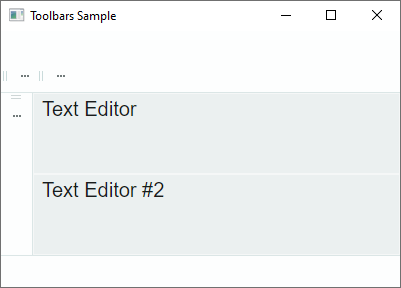
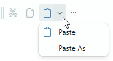
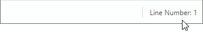
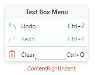

# Get Started With Toolbars

This tutorial shows how to use the Eremex Toolbars library to create a toolbar UI from scratch. It introduces controls to implement the toolbar UI, and demonstrates main toolbar settings.


The tutorial creates a toolbar UI for two text editors placed in the center of the window. The toolbar UI consists of the main menu, status bar, and regular toolbars that display various items: buttons, check buttons, in-place editors, sub-menus, and text items. 

All but one of the toolbars are docked to the edges of the window. These toolbars have commands that work with the first text editor. One toolbar (standalone toolbar) is placed between the text editors. It provides commands for the second text editor.

The tutorial also shows how to associate a text editor with a context menu from the Toolbars&Menu library.

## 1. Create a New Project

Ensure you have installed the [Eremex Avalonia Templates](../../whats-included/project-templates.md), which simplify the creation of Avalonia UI projects with Eremex controls. Create a new project from the `Eremex Avalonia .NET MVVM App` template and name it "Bars-sample".


This template adds the assemblies with the Eremex controls and DeltaDesign [paint theme](../themes/index.md) to the created project, and [registers](../themes/register-an-eremex-paint-theme.md) the paint theme for use.

## 2. Add a ToolbarManager Component

Start by defining a [`ToolbarManager`](../../API/Eremex.AvaloniaUI.Controls.Bars/ToolbarManager.md) component in XAML. 

``` xml
<mx:MxWindow ...
    xmlns:mx="https://schemas.eremexcontrols.net/avalonia"
    xmlns:mxb="https://schemas.eremexcontrols.net/avalonia/bars"
    xmlns:mxe="https://schemas.eremexcontrols.net/avalonia/editors"
    xmlns:vm="using:Bars_sample.ViewModels"
    xmlns:view="clr-namespace:Bars_sample.Views"
    Title="Toolbars Sample"
    >

    <mx:MxWindow.DataContext>
        <vm:MainWindowViewModel/>
    </mx:MxWindow.DataContext>

    <mxb:ToolbarManager IsWindowManager="True">
        <Grid RowDefinitions="Auto, *, Auto, *, Auto" ColumnDefinitions="Auto, *, Auto">
            <TextBox Grid.Row="1" Grid.Column="1" x:Name="textBox1"  
            Text="Text Editor" AcceptsReturn="True"/>
            <TextBox x:Name="textBox2"  Grid.Row="3" Grid.Column="1" 
            Text="Text Editor #2" AcceptsReturn="True"/>
        </Grid>
    </mxb:ToolbarManager>            
</mx:MxWindow>
```

[`ToolbarManager`](../../API/Eremex.AvaloniaUI.Controls.Bars/ToolbarManager.md) is the main component that manages toolbars, context menus, and menu items. The component processes keyboard shortcuts, invokes commands associated with corresponding items, maintains toolbar runtime customization, and performs bar UI serialization and deserialization.

The [`ToolbarManager`](../../API/Eremex.AvaloniaUI.Controls.Bars/ToolbarManager.md) component should wrap the client control (controls) for which a toolbar UI is created.


## 3. Create Toolbar Containers

To allow a toolbar to be docked at a specific position in a window/UserControl, first create a toolbar container ([`ToolbarContainerControl`](../../API/Eremex.AvaloniaUI.Controls.Bars/ToolbarContainerControl.md)). A toolbar container is a control that displays toolbars in the docked state, and maintains toolbar drag-and-drop operations.

In XAML, create four toolbar containers ([`ToolbarContainerControl`](../../API/Eremex.AvaloniaUI.Controls.Bars/ToolbarContainerControl.md) objects) along the top, bottom, left and right edges of the window. You will then be able to dock toolbars at these positions.  


``` xml
xmlns:mxb="https://schemas.eremexcontrols.net/avalonia/bars"

<mxb:ToolbarManager IsWindowManager="True">
    <Grid RowDefinitions="Auto, *, Auto, *, Auto" ColumnDefinitions="Auto, *, Auto">
        <mxb:ToolbarContainerControl DockType="Top" Grid.ColumnSpan="3"/>

        <mxb:ToolbarContainerControl DockType="Left" Grid.Row="1" 
         Grid.Column="0" Grid.RowSpan="3" />

        <TextBox Grid.Row="1" Grid.Column="1" x:Name="textBox1"  
         Text="Text Editor" AcceptsReturn="True"/>
        <TextBox x:Name="textBox2"  Grid.Row="3" Grid.Column="1" 
         Text="Text Editor #2" AcceptsReturn="True"/>

        <mxb:ToolbarContainerControl DockType="Right" Grid.Row="1" 
         Grid.Column="2" Grid.RowSpan="3"/>

        <mxb:ToolbarContainerControl DockType="Bottom" 
         Grid.Row="4" Grid.ColumnSpan="3"/>
    </Grid>
</mxb:ToolbarManager>
```

### Toolbar Container Options

A [`ToolbarContainerControl`](../../API/Eremex.AvaloniaUI.Controls.Bars/ToolbarContainerControl.md)'s main setting is [`ToolbarContainerControl.DockType`](../../API/Eremex.AvaloniaUI.Controls.Bars/ToolbarContainerControl/DockType.md), which specifies how the container is docked to its parent. You can set the [`DockType`](../../API/Eremex.AvaloniaUI.Controls.ApplicationServices/DockType.md) property to `Left`, `Right`, `Top`, `Bottom`, and `Standalone`. 

The [`DockType`](../../API/Eremex.AvaloniaUI.Controls.ApplicationServices/DockType.md) setting determines the container's border visibility, and default alignment of nested toolbars. For instance, if a container's [`DockType`](../../API/Eremex.AvaloniaUI.Controls.ApplicationServices/DockType.md) option is `Left`, the container draws a border at its right edge, and arranges nested toolbars vertically. The image below demonstrates the toolbar container that has its [`DockType`](../../API/Eremex.AvaloniaUI.Controls.ApplicationServices/DockType.md) option set to `Left`. The child toolbars are oriented vertically according to the [`DockType`](../../API/Eremex.AvaloniaUI.Controls.ApplicationServices/DockType.md) setting.


## 4. Create Toolbars

Add toolbars ([`Toolbar`](../../API/Eremex.AvaloniaUI.Controls.Bars/Toolbar.md) objects) to required toolbar containers. 



``` xml
xmlns:mxb="https://schemas.eremexcontrols.net/avalonia/bars"

<mxb:ToolbarManager IsWindowManager="True">
    <Grid RowDefinitions="Auto, *, Auto, *, Auto" ColumnDefinitions="Auto, *, Auto">
        <mxb:ToolbarContainerControl DockType="Top" Grid.ColumnSpan="3">
            <mxb:Toolbar x:Name="MainMenu" ToolbarName="Main Menu" DisplayMode="MainMenu">
            </mxb:Toolbar>

            <mxb:Toolbar x:Name="EditToolbar" ToolbarName="Edit" 
             ShowCustomizationButton="True">
            </mxb:Toolbar>

            <mxb:Toolbar x:Name="FontToolbar" ToolbarName="Font" 
             ShowCustomizationButton="True">
            </mxb:Toolbar>
        </mxb:ToolbarContainerControl>

        <mxb:ToolbarContainerControl DockType="Left" Grid.Row="1" 
         Grid.Column="0" Grid.RowSpan="3">
            <mxb:Toolbar x:Name="TextEditingToolbar" ToolbarName="Text Editing" 
             ShowCustomizationButton="True" >
            </mxb:Toolbar>
        </mxb:ToolbarContainerControl>
                
        <TextBox Grid.Row="1" Grid.Column="1" x:Name="textBox1"  Text="Text Editor" 
         AcceptsReturn="True" CornerRadius="0" FontFamily="Arial" FontSize="20"/>
        <TextBox x:Name="textBox2"  Grid.Row="3" Grid.Column="1" Text="Text Editor #2" 
         AcceptsReturn="True" CornerRadius="0" FontFamily="Arial" FontSize="20"/>

        <mxb:ToolbarContainerControl DockType="Right" Grid.Row="1" 
         Grid.Column="2" Grid.RowSpan="3"/>

        <mxb:ToolbarContainerControl DockType="Bottom" Grid.Row="4" Grid.ColumnSpan="3">
            <mxb:Toolbar DisplayMode="StatusBar" ToolbarName="Status Bar" x:Name="StatusBar">
            </mxb:Toolbar>
        </mxb:ToolbarContainerControl>
    </Grid>
</mxb:ToolbarManager>
```

The snippet above populates three toolbar containers with toolbars, and leaves one toolbar container empty. Users will be able to drag and drop toolbars to any of the four toolbar containers at runtime.

### Specify the Main Menu and Status Bar

To indicate that a toolbar is the main menu or status bar, set its [`Toolbar.DisplayMode`](../../API/Eremex.AvaloniaUI.Controls.Bars/Toolbar/DisplayMode.md) property to `MainMenu` and `StatusBar`, respectively.

``` xml
<mxb:Toolbar x:Name="MainMenu" ToolbarName="Main Menu" DisplayMode="MainMenu">
</mxb:Toolbar>
```

The main menu and status bar have distinctive appearance settings and behavior. For instance, they do not contain a drag handle, so they cannot be dragged by users. A user cannot hide the main menu and status bar at runtime.


### Toolbar Options

[`Toolbar`](../../API/Eremex.AvaloniaUI.Controls.Bars/Toolbar.md) objects expose many options to customize their view, layout, and behavior settings. Some of these options include:

- [`ToolbarName`](../../API/Eremex.AvaloniaUI.Controls.Bars/Toolbar/ToolbarName.md) — The toolbar's display name. Toolbar names are displayed in the Customization window and also when a toolbar is in the floating state.
    
    
    
- [`ShowCustomizationButton`](../../API/Eremex.AvaloniaUI.Controls.Bars/Toolbar/ShowCustomizationButton.md) — Specifies the visibility of the Customization button used to activate customization mode and open the Customization window.
    
    

- [`AllowDragToolbar`](../../API/Eremex.AvaloniaUI.Controls.Bars/Toolbar/AllowDragToolbar.md) — Specifies the visibility of a drag handle that enables users to drag the toolbar.
    
    

- [`DockType`](../../API/Eremex.AvaloniaUI.Controls.ApplicationServices/DockType.md) — This property allows you to move a toolbar to a specific toolbar container in code-behind, or make the toolbar floating.
- [`StretchToolbar`](../../API/Eremex.AvaloniaUI.Controls.Bars/Toolbar/StretchToolbar.md) — Enables toolbar stretching. In this mode, no other toolbar can be displayed in the same row.
- [`WrapItems`](../../API/Eremex.AvaloniaUI.Controls.Bars/Toolbar/WrapItems.md) — Enables a multiple row layout for a toolbar.


## 5. Create Toolbar Items

The next step is to populate toolbars with toolbar items: regular buttons, check buttons, in-place editors, sub-menus, and text items. Toolbar items are encapsulated by classes derived from the [`ToolbarItem`](../../API/Eremex.AvaloniaUI.Controls.Bars/ToolbarItem.md) class, which exposes common toolbar item options.

This tutorial creates the following toolbar items:

### ToolbarButtonItem

A regular button that fires a command specified by the [`Command`](../../API/Eremex.AvaloniaUI.Controls.Bars/ToolbarItem/Command.md) property. 


``` xml
<mxb:Toolbar x:Name="EditToolbar" ToolbarName="Edit" ShowCustomizationButton="True"  >
    <mxb:ToolbarButtonItem Header="Cut" Command="{Binding #textBox1.Cut}" 
     IsEnabled="{Binding #textBox1.CanCut}" 
     Glyph="{SvgImage 'avares://Bars-sample/Images/Toolbars/EditCut.svg'}" 
     Category="Edit"/>
    <mxb:ToolbarButtonItem Header="Copy" Command="{Binding #textBox1.Copy}" 
     IsEnabled="{Binding #textBox1.CanCopy}" 
     Glyph="{SvgImage 'avares://Bars-sample/Images/Toolbars/EditCopy.svg'}" 
     Category="Edit"/>
</mxb:Toolbar>
```

#### Common Toolbar Item Options

The base [`ToolbarItem`](../../API/Eremex.AvaloniaUI.Controls.Bars/ToolbarItem.md) class provides common options inherited by all toolbar items. Some of these options include:

- [`Alignment`](../../API/Eremex.AvaloniaUI.Controls.Bars/Alignment.md) — The item's alignment within the toolbar.        
- [`Category`](../../API/Eremex.AvaloniaUI.Controls.Bars/ToolbarItem/Category.md) — A category to which the item belongs. Categories are used to organize items into logical groups within the Customization window.
- [`Command`](../../API/Eremex.AvaloniaUI.Controls.Bars/ToolbarItem/Command.md) — A command executed when the button is clicked.
- [`CommandParameter`](../../API/Eremex.AvaloniaUI.Controls.Bars/ToolbarItem/CommandParameter.md) — A command parameter passed to the specified command.
- [`DisplayMode`](../../API/Eremex.AvaloniaUI.Controls.Bars/ToolbarItem/DisplayMode.md) — Gets whether to display only the glyph, the header, or both.
- [`Header`](../../API/Eremex.AvaloniaUI.Controls.Bars/ToolbarItem/Header.md) — The item's display text. 
- [`Glyph`](../../API/Eremex.AvaloniaUI.Controls.Bars/ToolbarItem/Glyph.md) — The item's image.
- [`GlyphAlignment`](../../API/Eremex.AvaloniaUI.Controls.Bars/ToolbarItem/GlyphAlignment.md) — The glyph alignment relative to the item's header.
- [`GlyphSize`](../../API/Eremex.AvaloniaUI.Controls.Bars/ToolbarItem/GlyphSize.md) — The glyph display size.
- [`ShowSeparator`](../../API/Eremex.AvaloniaUI.Controls.Bars/ToolbarItem/ShowSeparator.md) — Allows you to display a separator before the item.

#### Assign a Dropdown Control/Menu to a ToolbarButtonItem

You can associate a dropdown control/menu with a [`ToolbarButtonItem`](../../API/Eremex.AvaloniaUI.Controls.Bars/ToolbarButtonItem.md) object. The dropdown is activated by a click on the built-in dropdown arrow or the item itself (see the [`DropDownArrowVisibility`](../../API/Eremex.AvaloniaUI.Controls.Bars/DropDownArrowVisibility.md) option below for more information).

Let's associate the _Paste_ button ([`ToolbarButtonItem`](../../API/Eremex.AvaloniaUI.Controls.Bars/ToolbarButtonItem.md)) with a dropdown menu. The dropdown menu will display the _Paste_ and _Paste As_ commands.



``` xml
<mxb:ToolbarButtonItem Header="Paste" Command="{Binding #textBox1.Paste}" 
 IsEnabled="{Binding #textBox1.CanPaste}" 
 Glyph="{SvgImage 'avares://Bars-sample/Images/Toolbars/EditPaste.svg'}" 
 Category="Edit">
    <mxb:ToolbarButtonItem.DropDownControl>
        <mxb:PopupMenu>
            <mxb:ToolbarButtonItem Header="Paste" Command="{Binding #textBox1.Paste}" 
             IsEnabled="{Binding #textBox1.CanPaste}" 
             Glyph="{SvgImage 'avares://Bars-sample/Images/Toolbars/EditPaste.svg'}"/>
            <mxb:ToolbarButtonItem Header="Paste As" 
             Command="{Binding PasteAsCommand}" 
             IsEnabled="{Binding #textBox1.CanPaste}"/>
        </mxb:PopupMenu>
    </mxb:ToolbarButtonItem.DropDownControl>
</mxb:ToolbarButtonItem>
```

The following properties are used to specify a dropdown control and the way it is displayed:

- [`DropDownControl`](../../API/Eremex.AvaloniaUI.Controls.Bars/ToolbarButtonItem/DropDownControl.md) — Gets or sets a dropdown control/menu associated with the item. This property accepts [`PopupContainer`](../../API/Eremex.AvaloniaUI.Controls.Bars/PopupContainer.md) and [`PopupMenu`](../../API/Eremex.AvaloniaUI.Controls.Bars/PopupMenu.md) objects.

- [`DropDownArrowVisibility`](../../API/Eremex.AvaloniaUI.Controls.Bars/DropDownArrowVisibility.md) — Specifies whether the item displays a dropdown arrow used to invoke the associated dropdown control. Supported options include:
    - `ShowArrow` — The dropdown arrow is visible. The item and arrow act as a single button. A click on them displays an associated dropdown control.

    - `ShowSplitArrow` or `Default` — The dropdown arrow is visible. It acts as a separate button embedded in the item. A click on the dropdown arrow invokes the associated dropdown control. A click on the item invokes its command.

    - `Hide` — The dropdown arrow is hidden. A click on the item invokes the dropdown control.


### ToolbarMenuItem

A button that invokes a sub-menu. To add items to the sub-menu, define them between the start and end `<ToolbarMenuItem>` tags in XAML markup, or add them to the `Items` collection.


``` xml
<mxb:Toolbar x:Name="MainMenu" ToolbarName="Main Menu" DisplayMode="MainMenu">
    <mxb:ToolbarMenuItem Header="File" Category="File">
        <mxb:ToolbarButtonItem Header="New" 
         Glyph="{SvgImage 'avares://Bars-sample/Images/Toolbars/FileNew.svg'}" 
         Category="File" Command="{Binding NewFileCommand}"/>
        <mxb:ToolbarButtonItem Header="Open" 
         Glyph="{SvgImage 'avares://Bars-sample/Images/Toolbars/FileOpen.svg'}" 
         Category="File" Command="{Binding OpenFileCommand}"/>
        <mxb:ToolbarButtonItem Header="Print" 
         Glyph="{SvgImage 'avares://Bars-sample/Images/Toolbars/FilePrint.svg'}" 
         Category="File" Command="{Binding PrintCommand}" ShowSeparator="True"/>
    </mxb:ToolbarMenuItem>
</mxb:Toolbar>
```

You can add all supported item types to the sub-menu.

    

### ToolbarCheckItem

A check button that can be either in the normal or pressed state. 


``` xml
<mxb:Toolbar x:Name="FontToolbar" ToolbarName="Font" ShowCustomizationButton="False">
    <mxb:ToolbarCheckItem Header="Bold" 
     IsChecked="{Binding #textBox1.FontWeight, 
      Converter={view:BoolToFontWeightConverter}, Mode=TwoWay}" 
     Glyph="{SvgImage 'avares://Bars-sample/Images/Toolbars/FontBold.svg'}" 
     Category="Font"/>
    ...
</mxb:Toolbar>
```

#### ToolbarCheckItem Options

- `IsChecked` — Gets or sets the button's check state.
- `CheckedChanged` — The event that fires when the checked state changes.

### ToolbarEditorItem

An item that allows you to embed an Eremex editor in a toolbar or menu.


``` xml
<mxb:Toolbar x:Name="FontToolbar" ToolbarName="Font" ShowCustomizationButton="False">
    <mxb:ToolbarEditorItem Header="Font:" EditorWidth="150" Category="Font" 
     EditorValue="{Binding #textBox1.FontFamily, 
      Converter={view:FontNameToFontFamilyConverter}}">
        <mxb:ToolbarEditorItem.EditorProperties>
            <mxe:ComboBoxEditorProperties 
             ItemsSource="{Binding $parent[view:MainWindow].Fonts}" 
             IsTextEditable="False"/>
        </mxb:ToolbarEditorItem.EditorProperties>
    </mxb:ToolbarEditorItem>
    ...
</mxb:Toolbar>
```

#### ToolbarEditorItem Options

- `EditorValue` — Allows you to set and read the inplace editor's value.
- `EditorProperties` — Specifies the type of the editor to be embedded in a toolbar/menu. In the code snippet above, the `EditorProperties` property is set to a [`ComboBoxEditorProperties`](../../API/Eremex.AvaloniaUI.Controls.Editors/ComboBoxEditorProperties.md) object. This object contains settings specific to the [`ComboBoxEditor`](../../API/Eremex.AvaloniaUI.Controls.Editors/ComboBoxEditor.md) control. A toolbar will automatically create a [`ComboBoxEditor`](../../API/Eremex.AvaloniaUI.Controls.Editors/ComboBoxEditor.md) control at runtime from the specified [`ComboBoxEditorProperties`](../../API/Eremex.AvaloniaUI.Controls.Editors/ComboBoxEditorProperties.md) object.

### ToolbarTextItem

A text label. A click on a text label does not raise any action (command).



``` xml
<mxb:Toolbar DisplayMode="StatusBar" ToolbarName="Status Bar" 
 x:Name="StatusBar" ShowCustomizationButton="False">
    <mxb:ToolbarTextItem  Name="tbTextItem1" Alignment="Far" 
     ShowSeparator="True" ShowBorder="False" Category="Info" 
     CustomizationName="Position Info" 
     Header="{Binding $parent[view:MainWindow].LineNumber}"/>
</mxb:Toolbar>
```

#### ToolbarTextItem Options

- `SizeMode` — Gets or sets whether the item is auto-sized to fit its content, or stretched to occupy the available space in the toolbar.
- `ShowBorder` — Gets or sets whether to display a border around the item.

### Other Toolbar Item Types

The Toolbars library also supports other toolbar item types that are not demonstrated in this tutorial:

- [`ToolbarItemGroup`](../../API/Eremex.AvaloniaUI.Controls.Bars/ToolbarItemGroup.md) — A group of toolbar items.
- [`ToolbarCheckItemGroup`](../../API/Eremex.AvaloniaUI.Controls.Bars/ToolbarCheckItemGroup.md) — A group of check buttons. Use it to create a group of mutually exclusive check items, or a group that supports selecting multiple items at a time.

See the following topic for more information: [Toolbar Items](toolbar-items.md).

## 6. Create a Standalone Toolbar

You can place toolbars at any position within a window, not only along its edges. For instance, you can place toolbars with commands next to a target control. These toolbars are called 'standalone', because they reside within 'standalone' toolbar containers.


To create a standalone toolbar, do the following:
1. Create a toolbar container ([`ToolbarContainerControl`](../../API/Eremex.AvaloniaUI.Controls.Bars/ToolbarContainerControl.md)) at the required position. Set its [`DockType`](../../API/Eremex.AvaloniaUI.Controls.ApplicationServices/DockType.md) property to `Standalone`. 
   
   Standalone toolbar containers do not have borders.

2. Add a toolbar with commands to this toolbar container.

The code below displays a standalone toolbar between two text editors. The toolbar's _Select All_ command selects text in the second text editor.

``` xml
<mxb:ToolbarManager Name="toolbarManager1" IsWindowManager="True" >
    <Grid RowDefinitions="Auto, *, Auto, *, Auto" ColumnDefinitions="Auto, *, Auto">
        ...
        <TextBox Grid.Row="1" Grid.Column="1" x:Name="textBox1" Text="Text Editor" 
         AcceptsReturn="True"/>

        <mxb:ToolbarContainerControl DockType="Standalone" Grid.Row="2" Grid.Column="1">
            <mxb:Toolbar x:Name="TextEditor2Toolbar" ToolbarName="Standalone Toolbar" 
             ShowCustomizationButton="True" AllowDragToolbar="true"  >
                <mxb:ToolbarButtonItem Header="Select All" 
                 Command="{Binding #textBox2.SelectAll}" Category="TextEditor2 Toolbar" />
                <mxb:ToolbarButtonItem Header="Make Toolbar Floating" 
                 Command="{Binding $parent[view:MainWindow].MakeToolbar2Floating}" 
                 ShowSeparator="True"
                 Category="TextEditor2 Toolbar"/>
            </mxb:Toolbar>
        </mxb:ToolbarContainerControl>

        <TextBox x:Name="textBox2"  Grid.Row="3" Grid.Column="1" Text="Text Editor #2" 
         AcceptsReturn="True"/>
    </Grid>
</mxb:ToolbarManager>
```

## 7. Assign a Context Menu to a Text Editor

To specify a context menu for a control, create a [`PopupMenu`](../../API/Eremex.AvaloniaUI.Controls.Bars/PopupMenu.md) object and assign it to the target control using the `ToolbarManager.ContextPopup` attached property. Toolbar items of any type can be added to popup menus.


``` xml
<TextBox Grid.Row="1" Grid.Column="1" x:Name="textBox1"  Text="Text Editor" 
 AcceptsReturn="True" CornerRadius="0" FontFamily="Arial" FontSize="20" >
    <mxb:ToolbarManager.ContextPopup>
        <mxb:PopupMenu ShowIconStrip="True" Header="Text Box Menu" ShowHeader="True">
            <mxb:ToolbarButtonItem Header="Undo" HotKeyDisplayString="Ctrl+Z" 
             Command="{Binding #textBox1.Undo}" IsEnabled="{Binding #textBox1.CanUndo}"
             Glyph="{SvgImage 'avares://Bars-sample/Images/Toolbars/EditUndo.svg'}"  
             Category="Edit"/>
            <mxb:ToolbarButtonItem Header="Redo" HotKeyDisplayString="Ctrl+Y"  
             Command="{Binding #textBox1.Redo}" IsEnabled="{Binding #textBox1.CanRedo}"
             Glyph="{SvgImage 'avares://Bars-sample/Images/Toolbars/EditRedo.svg'}"  
             Category="Edit"/>
            <mxb:ToolbarSeparatorItem/>
            <mxb:ToolbarButtonItem Header="Clear" Command="{Binding #textBox1.Clear}" 
             HotKeyDisplayString="Ctrl+Q"  Category="Edit"
             Glyph="{SvgImage 'avares://Bars-sample/Images/Toolbars/EditDelete.svg'}"/>
        </mxb:PopupMenu>
    </mxb:ToolbarManager.ContextPopup>
</TextBox>
```

### PopupMenu Options

- [`ContentRightIndent`](../../API/Eremex.AvaloniaUI.Controls.Bars/PopupMenu/ContentRightIndent.md) — Specifies the width of the empty space to the right of menu items' text.

  

- [`Header`](../../API/Eremex.AvaloniaUI.Controls.Bars/PopupMenu/Header.md) — Allows you to specify a menu header.
- [`ShowHeader`](../../API/Eremex.AvaloniaUI.Controls.Bars/PopupMenu/ShowHeader.md) — Gets or sets whether the menu header is visible.
- [`ShowIconStrip`](../../API/Eremex.AvaloniaUI.Controls.Bars/PopupMenu/ShowIconStrip.md) — Gets or sets whether to display a vertical strip of icons for menu items. A menu item's icon is specified by the item's `Glyph` property.


## 8. Specify Hotkeys for Toolbar Items

Use the [`ToolbarItem.HotKey`](../../API/Eremex.AvaloniaUI.Controls.Bars/ToolbarItem/HotKey.md) property to assign shortcuts to items. 

``` xml
<mxb:ToolbarButtonItem
    Header="Clear" Command="{Binding #textBox1.Clear}" HotKey="Ctrl+Q"
    Glyph="{SvgImage 'avares://Bars-sample/Images/Toolbars/EditDelete.svg'}"  Category="Edit"/>
```

The [`ToolbarManager`](../../API/Eremex.AvaloniaUI.Controls.Bars/ToolbarManager.md) component's bounds define the default hotkey scope. If focus is within the hotkey scope, the [`ToolbarManager`](../../API/Eremex.AvaloniaUI.Controls.Bars/ToolbarManager.md) can intercept and process hotkeys. 
You can set the [`ToolbarManager.IsWindowManager`](../../API/Eremex.AvaloniaUI.Controls.Bars/ToolbarManager/IsWindowManager.md) property to `true` to expand the hotkey scope to the entire window. In this case, the [`ToolbarManager`](../../API/Eremex.AvaloniaUI.Controls.Bars/ToolbarManager.md) registers hotkeys in the window, and it can handle hotkeys even if focus is beyond the [`ToolbarManager`](../../API/Eremex.AvaloniaUI.Controls.Bars/ToolbarManager.md)'s bounds.

See the following topic for more information: [Toolbar Item Hotkeys](toolbar-items.md#hotkeys).


## 9. Assign Tooltips to Toolbar Items

The `ToolTip` property allows you to specify tooltips for toolbar items.


``` xml
<mxb:ToolbarButtonItem Header="Cut" Command="{Binding #textBox1.Cut}" 
 IsEnabled="{Binding #textBox1.CanCut}"
 Glyph="{SvgImage 'avares://Bars-sample/Images/Toolbars/EditCut.svg'}"
 Category="Edit"
 ToolTip.Tip="Cut Selection"/>
```


## 10. Make a Toolbar Floating

Let's make a toolbar floating in code-behind. Ensure that the target toolbar has a name, so you can access it. After you get the toolbar object, set its [`Toolbar.DockType`](../../API/Eremex.AvaloniaUI.Controls.Bars/Toolbar/DockType.md) property to `Floating`. Use the [`Toolbar.FloatingPosition`](../../API/Eremex.AvaloniaUI.Controls.Bars/Toolbar/FloatingPosition.md) property to set the floating toolbar's location.

``` csharp
EditToolbar.DockType = Eremex.AvaloniaUI.Controls.Bars.MxToolbarDockType.Floating;
EditToolbar.FloatingPosition = new PixelPoint(200, 200);
```

To create a floating toolbar in XAML, define a [`Toolbar`](../../API/Eremex.AvaloniaUI.Controls.Bars/Toolbar.md) object in the [`ToolbarManager.Toolbars`](../../API/Eremex.AvaloniaUI.Controls.Bars/ToolbarManager/Toolbars.md) collection, and set the [`Toolbar.DockType`](../../API/Eremex.AvaloniaUI.Controls.Bars/Toolbar/DockType.md) property to `Floating`. 

See the following topic for more information: [Floating Toolbars](toolbars.md#floating-toolbars).

<!--TODO ## 10. Save and Restore a Toolbars Layout

 -->

## 11. Runtime

The Toolbars library supports toolbar customization by users at runtime. Run the application to see these features in action:

- Bar drag-and-drop — Toolbars display drag handles that allow you to rearrange bars.


- Quick toolbar customization — You can quickly move items within and between bars using drag-and-drop by holding the Alt key down.


- Customization Mode and Customization Window — Click a toolbar's Customization button ('...'), and then select the 'Customize' command. Activation of customization mode displays the Customization Window:


In customization mode, you can do the following:

- Hide and restore toolbars.
- Create and manage user toolbars.
- Hide, restore and rearrange toolbar items between bars and sub-menus.


## 12. Complete Code

Below you can find the complete code of this tutorial. 

The SVG images used in this example are placed in the `Bars-sample/Images/Toolbars` folder. They have the `Build Action` property set to `AvaloniaResource`.

_MainWindow.axaml_:

``` xml
<mx:MxWindow xmlns="https://github.com/avaloniaui"
        xmlns:x="http://schemas.microsoft.com/winfx/2006/xaml"
        xmlns:vm="using:Bars_sample.ViewModels"
        xmlns:d="http://schemas.microsoft.com/expression/blend/2008"
        xmlns:mc="http://schemas.openxmlformats.org/markup-compatibility/2006"
        xmlns:mx="https://schemas.eremexcontrols.net/avalonia"
        xmlns:mxe="https://schemas.eremexcontrols.net/avalonia/editors"
        xmlns:mxb="https://schemas.eremexcontrols.net/avalonia/bars"
        xmlns:view="clr-namespace:Bars_sample.Views"
        mc:Ignorable="d" d:DesignWidth="800" d:DesignHeight="450"
        x:Class="Bars_sample.Views.MainWindow"
        x:DataType="vm:MainWindowViewModel"
        Icon="/Assets/EMXControls.ico"
        Title="Toolbars Sample"
        Width="800" Height="600">

    <mx:MxWindow.DataContext>
        <vm:MainWindowViewModel/>
    </mx:MxWindow.DataContext>

    <mxb:ToolbarManager Name="toolbarManager1" IsWindowManager="True" >
        <Grid RowDefinitions="Auto, *, Auto, *, Auto" ColumnDefinitions="Auto, *, Auto">
            <mxb:ToolbarContainerControl DockType="Top" Grid.ColumnSpan="3">
                <mxb:Toolbar x:Name="MainMenu" ToolbarName="Main Menu" DisplayMode="MainMenu" >
                    <mxb:ToolbarMenuItem Header="File" Category="File">
                        <mxb:ToolbarButtonItem Header="New"
                         Glyph="{SvgImage 'avares://Bars-sample/Images/Toolbars/FileNew.svg'}"
                         Category="File"
                         Command="{Binding NewFileCommand}"/>
                        <mxb:ToolbarButtonItem Header="Open"
                         Glyph="{SvgImage 'avares://Bars-sample/Images/Toolbars/FileOpen.svg'}"
                         Category="File"
                         Command="{Binding OpenFileCommand}"/>
                        <mxb:ToolbarButtonItem Header="Print"
                         Glyph="{SvgImage 'avares://Bars-sample/Images/Toolbars/FilePrint.svg'}"
                         Category="File"
                         Command="{Binding PrintCommand}" ShowSeparator="True"/>
                    </mxb:ToolbarMenuItem>

                    <mxb:ToolbarMenuItem Header="Edit" Category="Edit" >
                        <mxb:ToolbarButtonItem Header="Cut"
                         Glyph="{SvgImage 'avares://Bars-sample/Images/Toolbars/EditCut.svg'}"
                         Category="Edit"
                         Command="{Binding #textBox1.Cut}" IsEnabled="{Binding #textBox1.CanCut}"/>
                        <mxb:ToolbarButtonItem Header="Copy"
                         Glyph="{SvgImage 'avares://Bars-sample/Images/Toolbars/EditCopy.svg'}"
                         Category="Edit"
                         Command="{Binding #textBox1.Copy}" IsEnabled="{Binding #textBox1.CanCopy}"/>
                        <mxb:ToolbarButtonItem Header="Paste"
                         Glyph="{SvgImage 'avares://Bars-sample/Images/Toolbars/EditPaste.svg'}"
                         Category="Edit"
                         Command="{Binding #textBox1.Paste}" IsEnabled="{Binding #textBox1.CanPaste}"/>
                    </mxb:ToolbarMenuItem>
                    <mxb:ToolbarButtonItem Header="About" Category="Options" ShowSeparator="True"
                     Alignment="Far" Command="{Binding AboutCommand}"/>
                </mxb:Toolbar>

                <mxb:Toolbar x:Name="EditToolbar" ToolbarName="Edit" ShowCustomizationButton="True"  >
                    <mxb:ToolbarButtonItem Header="Cut" Command="{Binding #textBox1.Cut}"
                     IsEnabled="{Binding #textBox1.CanCut}"
                     Glyph="{SvgImage 'avares://Bars-sample/Images/Toolbars/EditCut.svg'}"
                     Category="Edit" ToolTip.Tip="Cut Selection"/>
                    <mxb:ToolbarButtonItem Header="Copy" Command="{Binding #textBox1.Copy}"
                     IsEnabled="{Binding #textBox1.CanCopy}"
                     Glyph="{SvgImage 'avares://Bars-sample/Images/Toolbars/EditCopy.svg'}"
                     Category="Edit"/>
                    <mxb:ToolbarButtonItem Header="Paste"
                     Command="{Binding #textBox1.Paste}"
                     IsEnabled="{Binding #textBox1.CanPaste}"
                     Glyph="{SvgImage 'avares://Bars-sample/Images/Toolbars/EditPaste.svg'}"
                     Category="Edit"
                     DropDownArrowVisibility="ShowArrow" DropDownArrowAlignment="Default">
                        <mxb:ToolbarButtonItem.DropDownControl>
                            <mxb:PopupMenu>
                                <mxb:ToolbarButtonItem Header="Paste"
                                 Command="{Binding #textBox1.Paste}"
                                 IsEnabled="{Binding #textBox1.CanPaste}"/>
                                <mxb:ToolbarButtonItem Header="Paste As"
                                 Command="{Binding PasteAsCommand}"
                                 IsEnabled="{Binding #textBox1.CanPaste}"/>
                            </mxb:PopupMenu>
                        </mxb:ToolbarButtonItem.DropDownControl>
                    </mxb:ToolbarButtonItem>
                </mxb:Toolbar>

                <mxb:Toolbar x:Name="FontToolbar" ToolbarName="Font" ShowCustomizationButton="True" >
                    <mxb:ToolbarCheckItem Header="Bold"
                     IsChecked="{Binding #textBox1.FontWeight, 
                      Converter={view:BoolToFontWeightConverter}, Mode=TwoWay}"
                     Glyph="{SvgImage 'avares://Bars-sample/Images/Toolbars/FontBold.svg'}"
                     Category="Font"/>
                    <mxb:ToolbarCheckItem Header="Italic"
                     IsChecked="{Binding #textBox1.FontStyle, 
                      Converter={view:BoolToFontStyleConverter}, Mode=TwoWay}"
                     Glyph="{SvgImage 'avares://Bars-sample/Images/Toolbars/FontItalic.svg'}"
                     Category="Font"/>
                    <mxb:ToolbarEditorItem Header="Font:" IsVisible="" EditorWidth="150" Category="Font"
                    EditorValue="{Binding #textBox1.FontFamily, 
                     Converter={view:FontNameToFontFamilyConverter}}">
                        <mxb:ToolbarEditorItem.EditorProperties>
                            <mxe:ComboBoxEditorProperties
                             ItemsSource="{Binding $parent[view:MainWindow].Fonts}"
                             IsTextEditable="False" PopupMaxHeight="145"/>
                        </mxb:ToolbarEditorItem.EditorProperties>
                    </mxb:ToolbarEditorItem>
                </mxb:Toolbar>
            </mxb:ToolbarContainerControl>

            <mxb:ToolbarContainerControl DockType="Left" Grid.Row="1" Grid.Column="0"
             Grid.RowSpan="3">
                <mxb:Toolbar x:Name="TextEditingToolbar" ToolbarName="Text Editing"
                 ShowCustomizationButton="True" >
                    <mxb:ToolbarButtonItem Header="Undo" HotKeyDisplayString="Ctrl+Z"
                     Command="{Binding #textBox1.Undo}" IsEnabled="{Binding #textBox1.CanUndo}"
                     Glyph="{SvgImage 'avares://Bars-sample/Images/Toolbars/EditUndo.svg'}"
                     Category="Edit"/>
                    <mxb:ToolbarButtonItem Header="Redo" HotKeyDisplayString="Ctrl+Y"
                     Command="{Binding #textBox1.Redo}" IsEnabled="{Binding #textBox1.CanRedo}"
                     Glyph="{SvgImage 'avares://Bars-sample/Images/Toolbars/EditRedo.svg'}"
                     Category="Edit"/>
                    <mxb:ToolbarButtonItem Header="Clear" Command="{Binding #textBox1.Clear}"
                     HotKey="Ctrl+Q"
                     Glyph="{SvgImage 'avares://Bars-sample/Images/Toolbars/EditDelete.svg'}"
                     Category="Edit"/>
                </mxb:Toolbar>
            </mxb:ToolbarContainerControl>

            <TextBox Grid.Row="1" Grid.Column="1" x:Name="textBox1"  Text="Text Editor"
            AcceptsReturn="True" CornerRadius="0" FontFamily="Arial" FontSize="20">
                <mxb:ToolbarManager.ContextPopup>
                    <mxb:PopupMenu ShowIconStrip="True" Header="Text Box Menu" ShowHeader="True">
                        <mxb:ToolbarButtonItem Header="Undo" HotKeyDisplayString="Ctrl+Z"
                         Command="{Binding #textBox1.Undo}" IsEnabled="{Binding #textBox1.CanUndo}"
                         Glyph="{SvgImage 'avares://Bars-sample/Images/Toolbars/EditUndo.svg'}"
                         Category="Edit"/>
                        <mxb:ToolbarButtonItem Header="Redo" HotKeyDisplayString="Ctrl+Y"
                         Command="{Binding #textBox1.Redo}" IsEnabled="{Binding #textBox1.CanRedo}"
                         Glyph="{SvgImage 'avares://Bars-sample/Images/Toolbars/EditRedo.svg'}"
                         Category="Edit"/>
                        <mxb:ToolbarSeparatorItem/>
                        <mxb:ToolbarButtonItem Header="Clear" Command="{Binding #textBox1.Clear}"
                         HotKeyDisplayString="Ctrl+Q"  Category="Edit"
                         Glyph="{SvgImage 'avares://Bars-sample/Images/Toolbars/EditDelete.svg'}"/>
                    </mxb:PopupMenu>
                </mxb:ToolbarManager.ContextPopup>
            </TextBox>

            <mxb:ToolbarContainerControl DockType="Standalone" Grid.Row="2" Grid.Column="1">
                <mxb:Toolbar x:Name="TextEditor2Toolbar" ToolbarName="Standalone Toolbar"
                 ShowCustomizationButton="True" AllowDragToolbar="true"  >
                    <mxb:ToolbarButtonItem Header="Select All"
                     Command="{Binding #textBox2.SelectAll}" Category="TextEditor2 Toolbar"/>
                    <mxb:ToolbarButtonItem Header="Make Toolbar Floating"
                     Command="{Binding $parent[view:MainWindow].MakeToolbar2Floating}"
                     ShowSeparator="True"
                     Category="TextEditor2 Toolbar"/>
                </mxb:Toolbar>
            </mxb:ToolbarContainerControl>

            <TextBox x:Name="textBox2"  Grid.Row="3" Grid.Column="1" Text="Text Editor #2"
             AcceptsReturn="True" CornerRadius="0" FontFamily="Arial" FontSize="20"/>

            <mxb:ToolbarContainerControl DockType="Right" Grid.Row="1" Grid.Column="2"
             Grid.RowSpan="3"/>

            <mxb:ToolbarContainerControl DockType="Bottom" Grid.Row="4" Grid.ColumnSpan="3">
                <mxb:Toolbar DisplayMode="StatusBar" ToolbarName="Status Bar" x:Name="StatusBar">
                    <mxb:ToolbarTextItem  Name="tbTextItem1" Alignment="Far"
                     ShowSeparator="True" ShowBorder="False" Category="Info"
                     CustomizationName="Position Info"
                     Header="{Binding $parent[view:MainWindow].LineNumber}"/>
                </mxb:Toolbar>
            </mxb:ToolbarContainerControl>
        </Grid>
    </mxb:ToolbarManager>

</mx:MxWindow>
```

_App.axaml_:

``` xml
<Application xmlns="https://github.com/avaloniaui"
             xmlns:x="http://schemas.microsoft.com/winfx/2006/xaml"
             x:Class="Bars_sample.App"
             xmlns:theme="clr-namespace:Eremex.AvaloniaUI.Themes.DeltaDesign;assembly=Eremex.Avalonia.Themes.DeltaDesign"
             RequestedThemeVariant="Default">
             <!-- "Default" ThemeVariant follows system theme variant. "Dark" or "Light" are other available options. -->
    <Application.Styles>
        <theme:DeltaDesignTheme/>
    </Application.Styles>
</Application>
```

_MainWindow.axaml.cs_:

``` csharp
using Avalonia;
using Avalonia.Controls;
using Eremex.AvaloniaUI.Controls.Common;
using System;
using System.Collections.Generic;
using System.ComponentModel;
using System.Globalization;
using System.Runtime.CompilerServices;

using Avalonia.Data.Converters;
using Avalonia.Markup.Xaml;
using Avalonia.Media;
using System.Linq;
using CommunityToolkit.Mvvm.Input;

namespace Bars_sample.Views;

public partial class MainWindow : MxWindow, INotifyPropertyChanged
{
    public MainWindow()
    {
        InitializeComponent();
        textBox1.PropertyChanged += TextBox_PropertyChanged;
    }

    private void TextBox_PropertyChanged(object? sender, AvaloniaPropertyChangedEventArgs e)
    {
        if (e.Property == TextBox.CaretIndexProperty)
        {
            NotifyPropertyChanged("LineNumber");
        }
    }

    public event PropertyChangedEventHandler PropertyChanged;
    private void NotifyPropertyChanged([CallerMemberName] string propertyName = "")
    {
        PropertyChanged?.Invoke(this, new PropertyChangedEventArgs(propertyName));
    }

    IReadOnlyList<string> fonts;
    public IReadOnlyList<string> Fonts => fonts ??
    (
        fonts = FontManager.Current.SystemFonts.Select(x => x.Name).OrderBy(x => x).ToList()
    );

    [RelayCommand]
    public void MakeToolbar2Floating()
    {
        TextEditor2Toolbar.DockType = Eremex.AvaloniaUI.Controls.Bars.MxToolbarDockType.Floating;
        TextEditor2Toolbar.FloatingPosition = new PixelPoint(200, 200);
    }

    public string LineNumber
    {
        get
        {
            TextBox textBox = this.textBox1;
            string text = textBox.Text;
            string newLine = textBox.NewLine;

            int currentIndex = 0;
            int lineNumber = 0;
            while (currentIndex <= textBox.CaretIndex)
            {
                lineNumber++;
                int newLineIndex = 1;
                if(text!=null) newLineIndex = text.IndexOf(newLine, currentIndex);
                if (newLineIndex >= 0)
                    currentIndex = newLineIndex + newLine.Length;
                else
                    break;
            }
            return "Line Number: " + lineNumber;
        }
    }
}

public class BoolToFontWeightConverter : MarkupExtension, IValueConverter
{
    public override object ProvideValue(IServiceProvider serviceProvider)
    {
        return this;
    }

    public object Convert(object value, Type targetType, object parameter, CultureInfo culture)
    {
        return ((FontWeight)value) == FontWeight.Bold;
    }

    public object ConvertBack(object value, Type targetType, object parameter, CultureInfo culture)
    {
        return (bool)value ? FontWeight.Bold : FontWeight.Normal;
    }
}

public class BoolToFontStyleConverter : MarkupExtension, IValueConverter
{
    public override object ProvideValue(IServiceProvider serviceProvider)
    {
        return this;
    }

    public object Convert(object value, Type targetType, object parameter, CultureInfo culture)
    {
        return (FontStyle)value == FontStyle.Italic;
    }

    public object ConvertBack(object value, Type targetType, object parameter, CultureInfo culture)
    {
        return (bool)value ? FontStyle.Italic : FontStyle.Normal;
    }
}

public class FontNameToFontFamilyConverter : MarkupExtension, IValueConverter
{
    public override object ProvideValue(IServiceProvider serviceProvider)
    {
        return this;
    }

    public object Convert(object value, Type targetType, object parameter, CultureInfo culture)
    {
        return ((FontFamily)value).Name;
    }

    public object ConvertBack(object value, Type targetType, object parameter, CultureInfo culture)
    {
        return new FontFamily((string)value);
    }
}
```

_MainWindowViewModel.cs_:
``` csharp
using CommunityToolkit.Mvvm.Input;

namespace Bars_sample.ViewModels;

public partial class MainWindowViewModel : ViewModelBase
{
    [RelayCommand]
    void About()
    {

    }

    [RelayCommand]
    void NewFile()
    {

    }

    [RelayCommand]
    void OpenFile()
    {

    }

    [RelayCommand]
    void Print()
    {

    }
}
```

## See Also

- [Toolbars](toolbars.md)
- [Popup and Context Menus](popup-and-context-menus.md)
- [Toolbar Items](toolbar-items.md)
- [Toolbar Serialization](toolbar-serialization-and-deserialization.md)