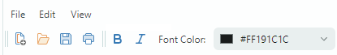
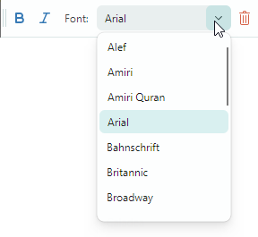
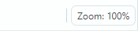
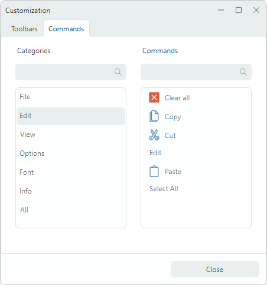

# Toolbar Items

Toolbar items are used to display buttons, check buttons, text labels, sub-menus, and in-place editors in toolbars and menus. You can add any number of items to each bar/menu, and create multiple hierarchy levels using sub-menus.



## Add Toolbar Items to a Bar and Context Menu

Use the `Toolbar.Items` and `PopupMenu.Items` collections to populate bars and menus with items. In XAML, you can define items directly between the start and end `<Toolbar>`/`<PopupMenu>` tags.

The following example displays three items in a toolbar.

``` xml
xmlns:mxb="https://schemas.eremexcontrols.net/avalonia/bars"

<mxb:Toolbar x:Name="EditToolbar" ToolbarName="Edit" ShowCustomizationButton="False">
    <mxb:ToolbarButtonItem Header="Cut" Command="{Binding #textBox.Cut}" 
     IsEnabled="{Binding #textBox.CanCut}" 
     Glyph="{SvgImage 'avares://DemoCenter/Images/Group=Context Menu, Icon=Cut.svg'}" 
     Category="Edit"/>
    <mxb:ToolbarButtonItem Header="Copy" Command="{Binding #textBox.Copy}" 
     IsEnabled="{Binding #textBox.CanCopy}" 
     Glyph="{SvgImage 'avares://DemoCenter/Images/Group=Context Menu, Icon=Copy.svg'}" 
     Category="Edit"/>
    <mxb:ToolbarButtonItem Header="Paste" Command="{Binding #textBox.Paste}" 
     IsEnabled="{Binding #textBox.CanPaste}" 
     Glyph="{SvgImage 'avares://DemoCenter/Images/Group=Context Menu, Icon=Paste.svg'}" 
     Category="Edit"/>
</mxb:Toolbar>
```
## Toolbar Item Types

The toolbar library supports multiple toolbar item types. All of them are descendants of the `ToolbarItem` class, which contains settings common to all toolbar items.

### Common Toolbar Item Settings

- `Alignment` — The item's alignment within the toolbar.
- `Category` — The category to which the item belongs. Categories are used to organize items into logical groups within the Customization window. See the following section for more information: [Toolbar Item Categories](#toolbar-item-categories).
- `Command` — A command executed when the button is clicked.
- `CommandParameter` — A command parameter passed to the specified command.
- `DisplayMode` — Gets or sets whether to display only the glyph, the header, or both.
- `Glyph` — The item's image.
- `GlyphAlignment` — The glyph alignment relative to the item's header.
- `GlyphSize` — The glyph display size.
- `Header` — The item's display text.
- `ShowSeparator` — Gets or sets whether to display a separator before the item. You can also use the `ToolbarSeparatorItem` bar item to insert a separator.

**Events**

- `Click` — Fires when the item is left-clicked (after the left mouse button is pressed and then released).
- `Press` — Fires when any mouse button is pressed over the item.

### Regular and Dropdown Buttons (ToolbarButtonItem)

Use `ToolbarButtonItem` to create regular buttons. A click on a regular button invokes a linked command (`Command`) and events (`Click` and `Press`). 


``` xml
xmlns:mxb="https://schemas.eremexcontrols.net/avalonia/bars"

<mxb:ToolbarButtonItem Header="Open" 
 Glyph="{SvgImage 'avares://bars_sample/Images/Toolbars/FileOpen.svg'}" 
 Category="File" Command="{Binding OpenFileCommand}"/>
```

You can associate a dropdown control or menu with a `ToolbarButtonItem` object. In this case, `ToolbarButtonItem` can act as a dropdown button, invoking the specified dropdown control/menu on clicking the item or the built-in down arrow.


``` xml
xmlns:mxb="https://schemas.eremexcontrols.net/avalonia/bars"

<mxb:ToolbarButtonItem Header="Paste"
                       Command="{Binding #textBox.Paste}"
                       IsEnabled="{Binding #textBox.CanPaste}"
                       Glyph="{SvgImage 'avares://bars_sample/Images/Toolbars/EditPaste.svg'}"
                       Category="Edit"
                       DropDownArrowVisibility="ShowArrow" DropDownArrowAlignment="Default"
                       >
    <mxb:ToolbarButtonItem.DropDownControl>
        <mxb:PopupMenu>
            <mxb:ToolbarButtonItem Header="Paste" Command="{Binding #textBox.Paste}" 
             IsEnabled="{Binding #textBox.CanPaste}"/>
            <mxb:ToolbarButtonItem Header="Paste As" Command="{Binding PasteAsCommand}" 
             IsEnabled="{Binding #textBox.CanPaste}"/>
        </mxb:PopupMenu>
    </mxb:ToolbarButtonItem.DropDownControl>
</mxb:ToolbarButtonItem>
```

#### Button's Main Settings

- `DropDownControl` — Gets or sets a dropdown control (an `Eremex.AvaloniaUI.Controls.Bars.IPopup` object) associated with the item. The control pops up when a user clicks the item or the built-in down arrow button (see `DropDownArrowVisibility`). The following objects implement the `Eremex.AvaloniaUI.Controls.Bars.IPopup` interface, and so they can be displayed as dropdown controls:

    - `Eremex.AvaloniaUI.Controls.Bars.PopupMenu` — A [popup menu](../toolbars-and-menus/popup-and-context-menus.md). You can add all types of toolbar items to the menu to populate it with content.
    - `Eremex.AvaloniaUI.Controls.Bars.PopupContainer` — A container of controls. Use `PopupContainer` to display custom controls in a dropdown.
    
- `DropDownArrowVisibility` — Gets or sets whether the item displays a dropdown arrow used to invoke the associated dropdown control. 

    

    - `ShowArrow` — The dropdown arrow is visible. The item and arrow act as a single button. A click on them displays an associated dropdown control.

    - `ShowSplitArrow` or `Default` — The dropdown arrow is visible. It acts as a separate button embedded in the item. A click on the item invokes its command (`Command`) and events (`Click` and `Press`). 

    - `Hide` — The dropdown arrow is hidden. A click on the item invokes the dropdown control.

- `DropDownArrowAlignment` — Gets or sets the position of the dropdown arrow.
- `DropDownOpenMode` — Gets or sets whether and when the dropdown control is invoked when a user touches the item/dropdown arrow. Supported options include:
    - `Press` or `Default` — The dropdown is displayed on a mouse press event.
    - `Click` — The dropdown is displayed after the mouse is pressed and then released over the item.
    - `Never` — The dropdown is not displayed.
- `DropDownPress` — The event that fires when the dropdown arrow is pressed.

See also: [Common Toolbar Item Settings](#common-toolbar-item-settings).

### Check Buttons (ToolbarCheckItem)

`ToolbarCheckItem` encapsulates a check button, which supports two states - normal and pressed. 


``` xml
xmlns:mxb="https://schemas.eremexcontrols.net/avalonia/bars"

<mxb:ToolbarCheckItem Header="Bold" 
 IsChecked="{Binding #textBox.FontWeight, 
  Converter={helpers:BoolToFontWeightConverter}, Mode=TwoWay}" 
 Glyph="{SvgImage 'avares://DemoCenter/Images/FontBold.svg'}" Category="Font"/>
```

#### Check Button's Main Settings and Events

- `IsChecked` — Gets or sets the button's check state.
- `CheckedChanged` — The event that fires when the check state changes.

- `CheckBoxStyle` — Gets or sets display mode for a `ToolbarCheckItem` object. Available options include:

  - `CheckBoxStyle.CheckButton` — The item is rendered as a check button. When `IsChecked` is `true` the button appears in the pressed state.

    

  - `CheckBoxStyle.CheckBox` — The item displays a toggle box before its text and glyph. When `IsChecked` is `true` the toggle box has a check mark.

    
    
  - `CheckBoxStyle.RadioButton` — The item displays a radio button before its text and glyph. When `IsChecked` is `true` the radio button is rendered as a filled circle.

    You can apply the RadioButton style to `ToolbarCheckItem` objects combined in a check group (`ToolbarCheckItemGroup`). In this case, the group appears as a typical radio group.

    ``` xml
    <mxb:ToolbarCheckItemGroup CheckType="Radio">
        <mxb:ToolbarCheckItem Header="E-mail" CheckBoxStyle="RadioButton" />
        <mxb:ToolbarCheckItem Header="Phone" CheckBoxStyle="RadioButton" />
    </mxb:ToolbarCheckItemGroup>
    ```
    
    

- `CheckBoxAlignment` — Gets or sets whether the check box (or radio button) are displayed before or after an item's glyph and text. This option is in effect when the `CheckBoxStyle` property is set to `CheckBoxStyle.CheckBox` or `CheckBoxStyle.RadioButton`.

    ```xml
    <mxb:ToolbarCheckItem Header="Status bar" CheckBoxAlignment="After"
                        CheckBoxStyle="CheckBox"
                        Hint="Show and hide the status bar"/>
    <mxb:ToolbarSeparatorItem/>
    ```
    
    

See also: [Common Toolbar Item Settings](#common-toolbar-item-settings).

### Sub-Menus (ToolbarMenuItem)

`ToolbarMenuItem` is an item that displays a sub-menu on a click. 


To specify a sub-menu's content, define items between the start and end `<ToolbarMenuItem>`  tags in XAML, or add items to the `ToolbarMenuItem.Items` collection in code-behind.

``` xml
xmlns:mxb="https://schemas.eremexcontrols.net/avalonia/bars"

<mxb:ToolbarMenuItem Header="File" Category="File">
    <mxb:ToolbarButtonItem Header="New" 
     Glyph="{SvgImage 'avares://DemoCenter/Images/Group=Context Menu, Icon=NewDraftAction.svg'}" 
     Category="File" Command="{Binding NewFileCommand}"/>
    <mxb:ToolbarButtonItem Header="Open" 
     Glyph="{SvgImage 'avares://DemoCenter/Images/Group=Basic, Icon=Folder Open.svg'}" 
     Category="File" Command="{Binding OpenFileCommand}"/>
    <mxb:ToolbarButtonItem Header="Save" 
     Glyph="{SvgImage 'avares://DemoCenter/Images/Group=Basic, Icon=Save.svg'}" 
     Category="File" Command="{Binding SaveFileCommand}"/>
    <mxb:ToolbarButtonItem Header="Print" 
     Glyph="{SvgImage 'avares://DemoCenter/Images/Group=Basic, Icon=Print.svg'}" 
     ShowSeparator="True"  Category="File" Command="{Binding PrintFileCommand}"/>
</mxb:ToolbarMenuItem>
```

#### Sub-menu's Main Settings and Events

- `DropDownOpenMode` — Gets or sets whether and how the sub-menu is invoked when a user touches the item. Supported options include:
    - `Press` or `Default` — The menu is displayed on a mouse press event.
    - `Click` — The menu is displayed after the mouse is pressed and then released over the item.
    - `Never` — The menu is not displayed.
- `Items` — A collection of items displayed in the sub-menu.
- `ItemsSource` — A collection of business objects in a View Model from which the sub-menu's items are created. Corresponding data templates should define toolbar items and initialize their settings from underlying business objects.

**Events**

- `Opening` — Fires when the menu is about to be displayed. This event allows you to cancel the display of the menu.
- `Opened` — Fires after the menu is displayed.
- `Closing` — Fires when the menu is about to be closed. This event allows you to cancel closing the menu.
- `Closed` — Fires after the menu is closed.

See also: [Common Toolbar Item Settings](#common-toolbar-item-settings).

### In-place Editors (ToolbarEditorItem)

`ToolbarEditorItem` allows you to display an in-place editor. 



To specify the in-place editor's type and settings, use the `ToolbarEditorItem.EditorProperties` property. You can set `ToolbarEditorItem.EditorProperties` to one of the following objects:

- `ButtonEditorProperties` — Corresponds to a `ButtonEditor` in-place editor.
- `CheckEditorProperties` — Corresponds to a `CheckEditor` in-place editor.
- `ColorEditorProperties` — Corresponds to a `ColorEditor` in-place editor.
- `ComboBoxEditorProperties` — Corresponds to a `ComboBoxEditor` in-place editor.
- `HyperlinkEditorProperties` — Corresponds to a `HyperlinkEditor` in-place editor.
- `PopupColorEditorProperties` — Corresponds to a `PopupColorEditor` in-place editor.
- `PopupEditorProperties` — Corresponds to a `PopupEditor` in-place editor.
- `SegmentedEditorProperties` — Corresponds to a `SegmentedEditor` in-place editor.
- `SpinEditorProperties` — Corresponds to a `SpinEditor` in-place editor.
- `TextEditorProperties` — Corresponds to a `TextEditor` in-place editor.
- `MemoEditorProperties` — Corresponds to a `MemoEditor` in-place editor.

In the following example, the _Font_ `ToolbarEditorItem` object displays a list of fonts using a combobox in-place editor. The `ToolbarEditorItem.EditorProperties` property is set to a `ComboBoxEditorProperties`, which corresponds to a `ComboBoxEditor` control.

``` xml
<mxb:ToolbarEditorItem Header="Font:" EditorWidth="150" Category="Font" 
 EditorValue="{Binding #textBox.FontFamily, Converter={helpers:FontNameToFontFamilyConverter}}">
    <mxb:ToolbarEditorItem.EditorProperties>
        <mxe:ComboBoxEditorProperties 
         ItemsSource="{Binding $parent[view:ToolbarAndMenuPageView].Fonts}"
         IsTextEditable="False" PopupMaxHeight="300"/>
    </mxb:ToolbarEditorItem.EditorProperties>
</mxb:ToolbarEditorItem>      
```

#### In-place Editor's Main Settings and Events

- `ToolbarEditorItem.EditorProperties` — Gets or sets the object that specifies the type and settings of the in-place editor.
- `ToolbarEditorItem.EditorValue` — Gets or sets the in-place editor's value. Use this property for data binding.
- `ToolbarEditorItem.SizeMode` — Gets or sets the item's size mode. This property allows you to stretch the bar item, so it occupues all the available empty space within the bar.
- `ToolbarEditorItem.EditorWidth` — Gets or sets the in-place editor's width.
- `ToolbarEditorItem.EditorHeight` — Gets or sets the in-place editor's height.
- `ToolbarEditorItem.EditorAlignment` — Gets or sets the editor's alignment relative to the item's header.

- `ToolbarEditorItem.EditorValueChanged` — The event that fires after the editor's value is changed.

<!--TODO - `ToolbarEditorItem.Editor` -  

-->

See also: [Common Toolbar Item Settings](#common-toolbar-item-settings).


### Text Labels (ToolbarTextItem)

`ToolbarTextItem` displays a text label specified by the `ToolbarTextItem.Header` property. Use this item to render text that is not editable by users.



``` xml
<mxb:ToolbarTextItem 
 Header="{Binding #scaleDecorator.Scale, StringFormat={}Zoom: {0:P0}}" 
 ShowBorder="True" Alignment="Far" ShowSeparator="True" Category="Info" 
 CustomizationName="Zoom Info"/>
```

#### Text Label's Main Settings and Events

- `ToolbarTextItem.SizeMode` — Gets or sets the item's size mode. This property allows you to stretch the item, so it occupues all the available empty space within the bar.
- `ToolbarTextItem.ShowBorder` — Gets or sets whether the item's border is visible. You can use the `ToolbarTextItem.BorderTemplate` property to specify a custom template to paint the border.
- `ToolbarTextItem.BorderTemplate` — Gets or sets a custom template to paint the item's border. This template is in effect if the `ToolbarTextItem.ShowBorder` option is enabled.

See also: [Common Toolbar Item Settings](#common-toolbar-item-settings).

### Non-Breaking Groups of Items (ToolbarItemGroup)

Use `ToolbarItemGroup` to create a non-breaking group of toolbar items. A non-breaking group is a container of items that acts as a whole when its parent is resized (the contents of the group cannot be partially hidden; items are always displayed in a single line and do not support wrapping).


To specify the group's contents, define items between the start and end `<ToolbarItemGroup>`  tags, or add items to the `ToolbarItemGroup.Items` collection in code-behind.

``` xml
<mxb:ToolbarItemGroup CustomizationName="Clipboard" >
    <mxb:ToolbarButtonItem Header="Cut" Command="{Binding #textBox.Cut}" 
     IsEnabled="{Binding #textBox.CanCut}" 
     Glyph="{SvgImage 'avares://DemoCenter/Images/Group=Context Menu, Icon=Cut.svg'}" 
     Category="Edit"/>
    <mxb:ToolbarButtonItem Header="Copy" Command="{Binding #textBox.Copy}" 
     IsEnabled="{Binding #textBox.CanCopy}" 
     Glyph="{SvgImage 'avares://DemoCenter/Images/Group=Context Menu, Icon=Copy.svg'}" 
     Category="Edit"/>
    <mxb:ToolbarButtonItem Header="Paste" Command="{Binding #textBox.Paste}" 
     IsEnabled="{Binding #textBox.CanPaste}" 
     Glyph="{SvgImage 'avares://DemoCenter/Images/Group=Context Menu, Icon=Paste.svg'}" 
     Category="Edit"/>
</mxb:ToolbarItemGroup>
```

#### Group's Main Settings and Events

- `ToolbarItemGroup.Items` — Allows you to access the group's children.

### Non-Breaking Groups of Check Items (ToolbarCheckItemGroup)

Use `ToolbarCheckItemGroup` to create a non-breaking group of check items. A non-breaking group is a container of items that acts as a whole when its parent is resized (the contents of the group cannot be partially hidden; items are always displayed in a single line and do not support wrapping).


The `ToolbarCheckItemGroup` container can control the check state of its child items ([`ToolbarCheckItem` objects](#check-buttons-toolbarcheckitem)). You can use `ToolbarCheckItemGroup` to create the following group types:

- A group of mutually exclusive items (radio group).
- A group that allows multiple items to be checked at the same time.


To specify the group's content, add `ToolbarCheckItem` items between the start and end `<ToolbarCheckItemGroup>` tags in XAML, or add items to the `ToolbarCheckItemGroup.Items` collection in code-behind.

``` xml
<mxb:ToolbarCheckItemGroup CustomizationName="Check group" CheckType="Radio" >
    <mxb:ToolbarCheckItem Header="1" IsChecked="{Binding Option1}"  
     Category="Settings"/>
    <mxb:ToolbarCheckItem Header="2" IsChecked="{Binding Option2}" 
     Category="Settings"/>
    <mxb:ToolbarCheckItem Header="3" IsChecked="{Binding Option3}" 
     Category="Settings"/>
</mxb:ToolbarCheckItemGroup>
```

A `ToolbarCheckItemGroup` object accepts child items of all supported bar item types. The group, however, only manipilates the check states of nested `ToolbarCheckItem` objects.

#### Check Group's Main Settings and Events

- `ToolbarCheckItemGroup.CheckType` — Gets or sets whether a single or multiple items can be checked in the group at a time. The following options are supported:

    - `Default` or `Multiple` — Multiple items can be checked at a time.
    - `Radio` — A group of mutually exclusive items. A user cannot uncheck an item other than by checking another one.
    - `Single` — A group of mutually exclusive items. A user can uncheck all items within the group.

- `ToolbarCheckItemGroup.Items` — Allows you to access the group's children.

See also: [Common Toolbar Item Settings](#common-toolbar-item-settings).

### Separators (ToolbarSeparatorItem)

`ToolbarSeparatorItem` draws a separator.


``` xml
<mxb:ToolbarMenuItem Header="File" Category="File">
    <mxb:ToolbarButtonItem Header="New" 
     Glyph="{SvgImage 'avares://DemoCenter/Images/Group=Context Menu, Icon=NewDraftAction.svg'}" 
     Category="File"/>
    <mxb:ToolbarButtonItem Header="Open" 
     Glyph="{SvgImage 'avares://DemoCenter/Images/Group=Basic, Icon=Folder Open.svg'}" 
     Category="File"/>
    <mxb:ToolbarButtonItem Header="Save" 
     Glyph="{SvgImage 'avares://DemoCenter/Images/Group=Basic, Icon=Save.svg'}" 
     Category="File"/>
    <mxb:ToolbarSeparatorItem/>
    <mxb:ToolbarButtonItem Header="Print" 
     Glyph="{SvgImage 'avares://DemoCenter/Images/Group=Basic, Icon=Print.svg'}" 
     Category="File"/>
</mxb:ToolbarMenuItem>
```


## Toolbar Item Categories

You can classify toolbar items into categories to enable item grouping in the Customization Window. A user can select a category in the Customization Window to access related items.



Use the `ToolbarItem.Category` property to assign an item to a category. This property specifies the category name. To assign a group of items to the same category, set their `ToolbarItem.Category` property to the same category name.

``` xml
<mxb:ToolbarMenuItem Header="Edit" Category="Edit">
    <mxb:ToolbarButtonItem Header="Cut" 
     Glyph="{SvgImage 'avares://DemoCenter/Images/Group=Context Menu, Icon=Cut.svg'}" 
     Category="Edit"/>
    <mxb:ToolbarButtonItem Header="Copy" 
     Glyph="{SvgImage 'avares://DemoCenter/Images/Group=Context Menu, Icon=Copy.svg'}" 
     Category="Edit"/>
    <mxb:ToolbarButtonItem Header="Paste" 
     Glyph="{SvgImage 'avares://DemoCenter/Images/Group=Context Menu, Icon=Paste.svg'}" 
     Category="Edit"/>
    <mxb:ToolbarButtonItem Header="Select All" 
     Command="{Binding #textBox.SelectAll}" Category="Edit" ShowSeparator="True"/>
    <mxb:ToolbarButtonItem Header="Clear all" 
     Command="{Binding #textBox.Clear}" 
     Glyph="{SvgImage 'avares://DemoCenter/Images/Group=Basic, Icon=Clear.svg'}" 
     Category="Edit"/>
</mxb:ToolbarMenuItem>       
```

## Hotkeys

You can use the `ToolbarItem.HotKey` property to assign hotkeys to items. 

``` xml
<mxb:ToolbarButtonItem 
    Header="Clear" Command="{Binding #textBox.Clear}" HotKey="Ctrl+Q"
    Glyph="{SvgImage 'avares://bars_sample/Images/Toolbars/EditDelete.svg'}"/>
```

A hotkey press activates an item's command provided that focus is within the hotkey scope. The default hotkey scope is the UI region within the `ToolbarManager` component's bounds. When the input focus is beyond the hotkey scope, `ToolbarManager` is not able to intercept hotkeys.

The `ToolbarManager.IsWindowManager` property allows you to extend the hotkey scope to the entire window. When you set this property to `true`, the `ToolbarManager` component registers item hotkeys in the window. It will be able to intercept and process hotkeys even if focus is outside its client area.

### Displaying Hotkeys

Hotkeys assigned to toolbar items are displayed in the following cases:

- In items when they reside within sub-menus or popup menus.
- In items' tooltips.


You can use the `ToolbarItem.HotKeyDisplayString` property to specify a hotkey display text. This text is displayed even if no hotkey is assigned to the item. This is helpful if a target hotkey is already registered by another object to perform a specific operation, and you want to indicate that the same hotkey is linked to a toolbar item.

For instance, a TextBox registers the _Ctrl+Z_ shortcut to perform an Undo operation. If a toolbar item performs the same Undo operation on the TextBox, do not assign the _Ctrl+Z_ hotkey to the item. Instead, set the item's `ToolbarItem.HotKeyDisplayString` to "_Ctrl+Z_" to display this shortcut to users in tooltips and sub-menus/popup menus.

``` xml
<mxb:ToolbarButtonItem Header="Undo" HotKeyDisplayString="Ctrl+Z" 
    Command="{Binding $parent[TextBox].Undo}" 
    IsEnabled="{Binding $parent[TextBox].CanUndo}" 
    Glyph="{SvgImage 'avares://bars_sample/Images/Toolbars/EditUndo.svg'}"/>
```


