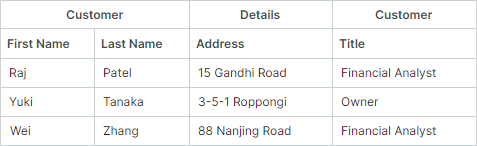
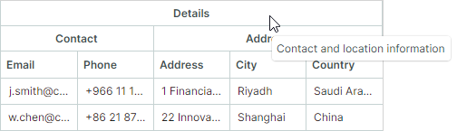

# Bands

You can use bands to visually combine columns together. The TreeListControl displays bands as additional headers above the column headers. Both band and column headers can contain text, images, or custom content. You can also create hierarchical bands with an unlimited number of nesting levels.

The following image demonstrates a TreeList control with four bands: 'Employee', 'Details', 'Contact', and 'Address':


The following approaches allow you to generate column bands:

- [Create bands manually](#create-bands-manually)
- [Create bands from a band source](#generate-bands-from-a-band-source)
- [Create bands based on DataAnnotation attributes (for auto-generated columns)](#generate-bands-based-on-dataannotation-attributes-for-auto-generated-columns)


## Create Bands Manually

Follow these steps to manually create bands:

1. Create band objects (`TreeListBand` class instances) and add them to the `TreeListControl.Bands` collection. 

    Assign unique band names to the created bands using the `TreeListBand.BandName` property. 

    ``` xml
    <mxtl:TreeListControl.Bands>
        <mxtl:TreeListBand BandName="Employee" HeaderHorizontalAlignment="Center"/>
        <mxtl:TreeListBand BandName="Details" HeaderHorizontalAlignment="Center"/>
    </mxtl:TreeListControl.Bands>
    ```

    You can create a hierarchical band structure. To create nested bands:
        
    - In code-behind: Add bands to the `TreeListBand.Bands` collection.
    - In XAML: Define nested bands directly between the opening and closing `TreeListBand` tags.


    ``` xml
    <mxtl:TreeListBand BandName="Details" HeaderHorizontalAlignment="Center">
        <mxtl:TreeListBand BandName="DetailsAddress" Header="Address" HeaderHorizontalAlignment="Center"/>
        <mxtl:TreeListBand BandName="DetailsContact" Header="Contact" HeaderHorizontalAlignment="Center"/>
    </mxtl:TreeListBand>
    ```

    The `TreeListBand.Header` property allows you to specify custom content (for example, custom text) for a band. If this property is not set, the band header displays the `TreeListBand.BandName` property's value.

2. Associate columns with specific bands by setting each column's `TreeListColumn.BandName` property to the corresponding band name (`TreeListBand.BandName`).

    ``` xml
    <mxtl:TreeListControl.Columns>
        <mxtl:TreeListColumn Width="150" FieldName="Name" BandName="Employee"/>
        <mxtl:TreeListColumn Width="*" FieldName="City" BandName="DetailsAddress"/>
        <mxtl:TreeListColumn Width="*" FieldName="Phone" BandName="DetailsContact"/>
        <!-- ... -->
    </mxtl:TreeListControl.Columns>
    ```

Columns are arranged in the TreeListControl according to their `TreeListColumn.VisibleIndex` properties. The control does not automatically rearrange columns to group them by bands.

<!-- TODO

image

 -->

See [Order of Columns and Bands](#order-of-columns-and-bands)

### Related API

- `TreeListBand` class — Encapsulates a column band.
- `TreeListBand.BandName` — A unique name used to identify a band and associate it with columns.
- `TreeListColumn.BandName` — The name of the band associated with the column. This value matches the `TreeListBand.BandName` property's value.
- `TreeListControl.Bands` — A collection of root bands.
- `TreeListBand.Bands` — A collection of child bands for this band.

### Example - Create column bands in a TreeList control

The following example creates bands and assigns them to TreeList columns, as shown in the image below:

[](../../images/treelist-bands-example.png)

- The "Employee", "Job", "Personal", "Address", and "Contact" bands are associated with TreeList columns. 
- The "Details" band owns two nested bands ("Address" and "Contact"). This band is not directly associated with columns.

Each band is assigned a unique name using the `TreeListBand.BandName` property. To link columns to a specific band, the `TreeListColumn.BandName` property is set to the target band's `BandName` value.

The `TreeListControl.Bands` property defines the structure of bands. To create nested bands, define them as children of a parent band.

``` xml
<!-- MainWindow.axaml file -->
<mx:MxWindow xmlns="https://github.com/avaloniaui"
        xmlns:x="http://schemas.microsoft.com/winfx/2006/xaml"
        xmlns:vm="using:TreeListColumnBands.ViewModels"
        xmlns:d="http://schemas.microsoft.com/expression/blend/2008"
        xmlns:mc="http://schemas.openxmlformats.org/markup-compatibility/2006"
        xmlns:mx="https://schemas.eremexcontrols.net/avalonia"
        xmlns:mxtl="https://schemas.eremexcontrols.net/avalonia/treelist"
        xmlns:mxe="https://schemas.eremexcontrols.net/avalonia/editors"
        mc:Ignorable="d" d:DesignWidth="800" d:DesignHeight="450"
        x:Class="TreeListColumnBands.Views.MainWindow"
        x:DataType="vm:MainWindowViewModel"
        Icon="/Assets/EMXControls.ico"
        Title="TreeListColumnBands">

    <Design.DataContext>
        <!-- This only sets the DataContext for the previewer in an IDE-->
        <vm:MainWindowViewModel/>
    </Design.DataContext>

    <mxtl:TreeListControl Name="employeeTreeList" AutoGenerateColumns="False"
                          ItemsSource="{Binding Employees}"
                          ChildrenFieldName="Subordinates"
                          HasChildrenFieldName="HasSubordinates"
                          >

        <mxtl:TreeListControl.Bands>
            <mxtl:TreeListBand BandName="Employee" HeaderHorizontalAlignment="Center"/>
            <mxtl:TreeListBand BandName="Job" HeaderHorizontalAlignment="Center"/>
            <mxtl:TreeListBand BandName="Personal" HeaderHorizontalAlignment="Center"/>
            <mxtl:TreeListBand BandName="Details" HeaderHorizontalAlignment="Center" HeaderToolTip="Contact and location information">
                <mxtl:TreeListBand BandName="DetailsAddress" Header="Address" HeaderHorizontalAlignment="Center"/>
                <mxtl:TreeListBand BandName="DetailsContact" Header="Contact" HeaderHorizontalAlignment="Center"/>
            </mxtl:TreeListBand>
        </mxtl:TreeListControl.Bands>
        
        <mxtl:TreeListControl.Columns>
            <mxtl:TreeListColumn Width="150" FieldName="Name" BandName="Employee"/>
            <mxtl:TreeListColumn Width="*" FieldName="Position" BandName="Job"/>
            <mxtl:TreeListColumn Width="*" FieldName="Salary" BandName="Job">
                <mxtl:TreeListColumn.EditorProperties>
                    <mxe:TextEditorProperties DisplayFormatString="c"/>
                </mxtl:TreeListColumn.EditorProperties>
            </mxtl:TreeListColumn>
            <mxtl:TreeListColumn Width="*" FieldName="HireDate" BandName="Job"/>
            <mxtl:TreeListColumn Width="*" FieldName="BirthDate" BandName="Personal"/>
            <mxtl:TreeListColumn Width="*" FieldName="Email" BandName="DetailsContact"/>
            <mxtl:TreeListColumn Width="*" FieldName="Phone" BandName="DetailsContact"/>
            <mxtl:TreeListColumn Width="*" FieldName="Address" BandName="DetailsAddress"/>
            <mxtl:TreeListColumn Width="*" FieldName="City" BandName="DetailsAddress"/>
            <mxtl:TreeListColumn Width="*" FieldName="Country" BandName="DetailsAddress"/>
        </mxtl:TreeListControl.Columns>
    </mxtl:TreeListControl>
</mx:MxWindow>
```

``` cs
//MainWindow.axaml.cs file
using Avalonia.Controls;
using Eremex.AvaloniaUI.Controls.Common;
using TreeListColumnBands.ViewModels;

namespace TreeListColumnBands.Views;
public partial class MainWindow : MxWindow
{
    public MainWindow()
    {
        this.DataContext = new MainWindowViewModel();
        InitializeComponent();
        employeeTreeList.Loaded += EmployeeTreeList_Loaded;
    }

    private void EmployeeTreeList_Loaded(object? sender, Avalonia.Interactivity.RoutedEventArgs e)
    {
        employeeTreeList.ExpandAllNodes();
    }
}
```

``` cs
//MainWindowViewModel.cs file
using System.Collections.Generic;
using System;
using CommunityToolkit.Mvvm.ComponentModel;
using System.Collections.ObjectModel;

namespace TreeListColumnBands.ViewModels;
public partial class MainWindowViewModel : ViewModelBase
{
    public MainWindowViewModel()
    {            
        Employees = EmployeeDataGenerator.GenerateData();
    }
    [ObservableProperty]
    public ObservableCollection<Employee> employees = new();
}
public partial class Employee : ObservableObject
{
    [ObservableProperty]
    public string name;

    [ObservableProperty]
    public string position;

    [ObservableProperty]
    public DateTime birthDate;

    [ObservableProperty]
    public string address;

    [ObservableProperty]
    public string city;

    [ObservableProperty]
    public string country;

    [ObservableProperty]
    public string phone;

    [ObservableProperty]
    public string email;

    [ObservableProperty]
    public DateTime hireDate;

    [ObservableProperty]
    public decimal salary;

    [ObservableProperty]
    public ObservableCollection<Employee> subordinates;

    public Employee(string name, string position, DateTime birthDate,
                   string address, string city, string country,
                   string phone, string email, DateTime hireDate,
                   decimal salary)
    {
        Name = name;
        Position = position;
        BirthDate = birthDate;
        Address = address;
        City = city;
        Country = country;
        Phone = phone;
        Email = email;
        HireDate = hireDate;
        Salary = salary;
        Subordinates = null;
    }
    public void AddSubordinate(Employee subordinate)
    {
        if (Subordinates == null)
            Subordinates = new();
        Subordinates.Add(subordinate);
    }
    public bool HasSubordinates => Subordinates?.Count > 0;
}
public static class EmployeeDataGenerator
{
    public static ObservableCollection<Employee> GenerateData()
    {
        var ceo = new Employee(
            "John Smith", "CEO", new DateTime(1972, 8, 10), "1 Financial District",
            "Riyadh", "Saudi Arabia", "+966 11 123 4567", "j.smith@company.sa", 
            new DateTime(2011, 3, 15), 320000m);
        var vpTech = new Employee(
            "Wei Chen", "VP of Technology", new DateTime(1980, 5, 22), "22 Innovation Park",
            "Shanghai", "China", "+86 21 8765 4321", "w.chen@company.cn", 
            new DateTime(2013, 6, 20), 240000m);
        var devManager = new Employee(
            "Raj Pat", "Development Manager", new DateTime(1985, 11, 30), "33 Tech Corridor",
            "Bangalore", "India", "+91 80 2345 6789", "r.pat@company.in", 
            new DateTime(2016, 4, 10), 160000m);
        var seniorDev = new Employee(
            "Hannah Zhang", "Senior Developer", new DateTime(1990, 3, 12), "44 Code Avenue",
            "Casablanca", "Morocco", "+212 522 987 654", "h.zhang@company.ma", 
            new DateTime(2018, 7, 15), 95000m);
        var juniorDev = new Employee(
            "Lillian Oni", "Junior Developer", new DateTime(1994, 9, 25), "55 Debug Street",
            "Lagos", "Nigeria", "+234 1 345 6789", "l.oni@company.ng", 
            new DateTime(2020, 2, 20), 65000m);
        var cfo = new Employee(
            "Marianne Lockwood", "CFO", new DateTime(1978, 4, 18), "66 Finance Plaza",
            "Ho Chi Minh City", "Vietnam", "+84 28 7654 3210", "m.lock@company.vn", 
            new DateTime(2014, 9, 12), 280000m);
        var financeManager = new Employee(
            "Joanna Bennett", "Finance Manager", new DateTime(1983, 7, 8), "77 Capital Road",
            "Kuala Lumpur", "Malaysia", "+60 3 4567 8901", "j.ben@company.my", 
            new DateTime(2017, 1, 5), 140000m);
        ceo.AddSubordinate(vpTech);
        vpTech.AddSubordinate(devManager);
        devManager.AddSubordinate(seniorDev);
        seniorDev.AddSubordinate(juniorDev);
        ceo.AddSubordinate(cfo); 
        cfo.AddSubordinate(financeManager);
        ObservableCollection<Employee> employees = new ObservableCollection<Employee>();
        employees.Add(ceo);
        return employees;
    }
}
```

## Generate Bands from a Band Source

You can populate column bands from a band source defined in a View Model. Use the `TreeListControl.BandsSource` and `TreeListControl.BandTemplate` properties to generate bands from a collection of business objects.

As an alternative to specifying the `BandTemplate` property, you can use the `Styles` property to initialize `TreeListBand` objects from business objects. See [Initialize Bands Using a Style](#initialize-bands-using-a-style) for an example.

To associate columns with bands, set each column's `TreeListColumn.BandName` to the corresponding band name (`TreeListBand.BandName`).

### Related API

- `TreeListControl.BandsSource` — A collection of business objects used to generate root bands.
- `TreeListControl.BandTemplate` — A template that creates `TreeListBand` instances from business objects.
- `TreeListBand.BandsSource` — A collection of business objects used to generate child bands.
- `TreeListBand.BandName` — A unique name used to identify a band and associate it with columns.
- `TreeListColumn.BandName` — The name of the band associated with the column. This value matches the `TreeListBand.BandName` property's value.

<!-- TODO
Example
 -->

### Initialize Bands Using a Style

As an alternative to specifying the `BandTemplate` property, you can use the `Styles` property to initialize `TreeListBand` objects from business objects.

``` xml
<mxtl:TreeListControl.Styles>
    <Style Selector="mxtl|TreeListBand">
        <Setter Property="BandName" Value="{Binding Name}"/>
        <Setter Property="Header" Value="{Binding DisplayName}"/>
        <Setter Property="HeaderHorizontalAlignment" Value="Center"/>
    </Style>
</mxtl:TreeListControl.Styles>
```

See the "Column Bands" demo for an example of using the `BandsSource` and `Styles` properties.

## Generate Bands Based on DataAnnotation Attributes (for Auto-Generated Columns)

This approach allows you to use attributes to associate [auto-generated columns](columns.md#automatic-column-generation) with bands. 

When column auto-generation is enabled (see `TreeListControl.AutoGenerateColumns`), TreeList control can initialize column settings from [dedicated attributes](columns.md#use-attributes-to-customize-settings-of-auto-generated-columns) applied to a business object's properties.
The `System.ComponentModel.DataAnnotations.DisplayAttribute` attribute allows you to associate auto-generated columns with bands. Specify the `DisplayAttribute.GroupName` parameter to define the band name for the corresponding column.

``` cs
public partial class Order : ObservableObject
{
    [ObservableProperty]
    [property: Display(Order = 0, GroupName = "Order")]
    private int orderId;
    //...
}
```

When TreeList encounters `DisplayAttribute.GroupName`, it checks for an existing band with a matching name (`TreeListBand.BandName`). If no such band is found, the band is created and initialized as follows:

- The control automatically creates the band and set its `TreeListBand.BandName` property to the `DisplayAttribute.GroupName` value.
- The band is added to the control's `TreeListControl.Bands` collection. Nested bands are added to the appropriate `TreeListBand.Bands` collections.
- The created band is associated with the auto-generated column, using the `TreeListColumn.BandName` property.

The `DisplayAttribute.GroupName` parameter supports nested bands. Use the '/' character to separate parent and child bands (for instance, "ParentBandName/ChildBandName"). To include '/' as a literal character, use the double slash ("//") notation.

!!! note

    Individual child band names must be unique throughout the TreeList control.

``` cs
public partial class Order : ObservableObject
{
    [ObservableProperty]
    [property: Display(Order = 20, GroupName = "Shipping Info/Address")]
    private string shipCountry = string.Empty;
    //...
}
```

### Related API

- `TreeListControl.AutoGenerateBands` (default is `true`) — Gets or sets whether bands are automatically generated from the `DisplayAttribute.GroupName` attributes applied to the underlying business object's properties. These bands are then automatically linked to their corresponding auto-generated columns.

    Automatic band generation (and linking bands to auto-generated columns) is forcibly disabled if `TreeListControl.AutoGenerateColumns` is `false`.

- `TreeListControl.Bands` and `TreeListBand.Bands` — You can use these collections to access automatically generated bands.

<!-- TODO
Example - Generate bands based on the DisplayAttribute.GroupName parameter
 -->

### Order of Columns and Bands

The TreeListControl arranges columns according to their `TreeListColumn.VisibleIndex` properties.

The order of band headers is determined by the visual order of the columns. 
If columns linked to the same band are placed next to each other, their band headers are merged.

``` xml
<mxtl:TreeListControl.Columns>
    <mxtl:TreeListColumn Width="*" FieldName="FirstName" BandName="Customer"/>
    <mxtl:TreeListColumn Width="*" FieldName="LastName" BandName="Customer"/>
    <mxtl:TreeListColumn Width="*" FieldName="Address" BandName="Details"/>
</mxtl:TreeListControl.Columns>
```


The control does not automatically rearrange columns to group them by bands. 
If columns linked to the same band are placed in non-adjacent positions (separated by columns linked to a different band(s)), the TreeList control creates multiple band headers with the same name above the column headers.

In the following code snippet, columns linked to the _Customer_ band are separated by the _Address_ column, which is linked to the _Details_ band. The control does not automatically reorder the columns to combine them into a single _Customer_ band:

``` xml
<mxtl:TreeListControl.Columns>
    <mxtl:TreeListColumn Width="*" FieldName="FirstName" BandName="Customer"/>
    <mxtl:TreeListColumn Width="*" FieldName="LastName" BandName="Customer"/>
    <mxtl:TreeListColumn Width="*" FieldName="Address" BandName="Details"/>
    <mxtl:TreeListColumn Width="*" FieldName="Title" BandName="Customer"/>
</mxtl:TreeListControl.Columns>
```




## Drag-and-Drop Operations

### Column Drag-and-Drop

Users can freely drag and drop columns within the control if `TreeListControl.AllowColumnMoving` is `true` (default). If they drag a column into a different band, the control draws an appropriate band header (`TreeListColumn.BandHeader`) above this column in its new position. See [Order of Columns and Bands](#order-of-columns-and-bands).

#### Related API

- `TreeListControl.AllowColumnMoving` — Gets or sets whether column drag-and-drop operations are enabled.

### Band Drag-and-Drop

The TreeList control does not support drag-and-drop operations on bands.


## Show and Hide the Band Panel

The band panel displays band headers. The panel is visible when any column is associated with an existing band. Use the following property to forcibly hide the band panel, when required:

- `TreeListControl.ShowBands` — Gets or sets whether the band panel is visible.

## Specify Band Header Content

- `Header` — Gets or sets a band header's content. If this property is not set, the band displays the value of the `TreeListBand.BandName` property.
- `HeaderTemplate` — Gets or sets a template used to render the `Header` object. The template allows you to display images and custom controls, and to render text in a custom manner.

### Example - Display an image in a band header
The following example displays an SVG image followed by a text caption in a band header. The SVG image (`address-location-icon.svg` file) is located in the project's `Assets` folder, with its `Build Action` property set to `AvaloniaResource`.


``` xml
xmlns:svg="using:Avalonia.Svg.Skia"

<mxtl:TreeListControl.Bands>
    <mxtl:TreeListBand BandName="Customer" HeaderHorizontalAlignment="Center">
        <mxtl:TreeListBand.HeaderTemplate>
            <DataTemplate>
                <StackPanel Orientation="Horizontal">
                    <svg:Svg Path="/Assets/address-location-icon.svg" Width="16" Height="16" Margin="5" />
                    <TextBlock Text="{Binding}" VerticalAlignment="Center"/>
                </StackPanel>
            </DataTemplate>
        </mxtl:TreeListBand.HeaderTemplate>
</mxtl:TreeListControl.Bands>
```

## Blank Band Header

Columns not associated with existing bands are displayed under a blank band header.

<!-- TODO
example + image
 -->

## Band Separators

- `TreeListControl.ShowBandSeparators` — Enables thick separators between adjacent bands. Use this property to emphasize divisions between bands. If `ShowBandSeparators` is disabled, the tree list draws  regular column separators (thin lines) between bands.

<!-- TODO
The following image demonstrates thick band separators.

image
 -->

## Hide Bands

Band objects do not have a 'Visible' property. To hide a band, you should hide columns linked to this band.

Bands without associated columns are never displayed.


## Band Header Tooltips

Use the `HeaderToolTip` property to specify custom tooltips for band headers. Custom tooltips are displayed when hovering over band headers regardless of whether band header text is trimmed or not.

``` xml
<mxtl:TreeListBand BandName="Details" HeaderHorizontalAlignment="Center" HeaderToolTip="Contact and location information">
```




When no custom tooltip is assigned to a band, the default tooltip is shown for the band header in case the header text is trimmed. The default tooltip displays the full, untrimmed header text.

