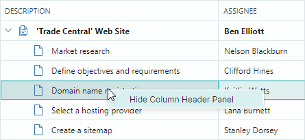

## Context Menus

TreeList and TreeView controls support built-in context menus invoked when a user right-clicks the controls. You can customize these menus to provide users with custom context-dependent commands.

## Built-in Column Header Context Menu (TreeList)

When a user right-clicks a TreeList column header, the control displays the built-in column header menu. It contains commands that allow the user to change sort settings for the clicked column.


Use the `TreeListControl.ColumnMenu` property to customize this menu.
You can assign a `Eremex.AvaloniaUI.Controls.Bars.PopupMenu` object to the `TreeListControl.ColumnMenu` property to replace the default menu.

To customize the existing column header menu (add or remove default items), access the menu after it has been initialized (for instance, within your TreeList's `Initialized` event handler), and then modify the menu.

### Data Context

The `DataContext` property of the column header menu and its items (`ToolbarButtonItem` objects) specifies the `TreeListColumn` object for which the menu has been invoked. 

### Example - How to replace the default column header menu

The following code creates a custom column header menu that contains the _Clear Column Data_ menu item. The code binds the menu item to the _ClearColumnDataCommand_ command defined in a ViewModel.


Take note of the initialization of the `Command` and `CommandParameter` properties for the menu item in the code below. The expression `CommandParameter="{Binding FieldName}"` specifies binding to the `FieldName` property of the menu item's `DataContext` (`TreeListColumn.FieldName`).

A `TreeListColumn`'s `DataContext` matches the Tree List's `DataContext` (a _ViewModel_ object in this example). This allows you to access the View Model and its _ClearColumnDataCommand_ command using the expression: `Command="{Binding DataContext.ClearColumnDataCommand}"`.


``` xml
xmlns:mxtl="https://schemas.eremexcontrols.net/avalonia/treelist"
xmlns:mxe="https://schemas.eremexcontrols.net/avalonia/editors"
xmlns:mxb="https://schemas.eremexcontrols.net/avalonia/bars"

<mxtl:TreeListControl Name="treeList1"
                    >
    <mxtl:TreeListControl.ColumnMenu>
        <mxb:PopupMenu>
            <mxb:ToolbarButtonItem
                Header="Clear Column Data"
                Command="{Binding DataContext.ClearColumnDataCommand}"
                CommandParameter="{Binding FieldName}">
            </mxb:ToolbarButtonItem>
        </mxb:PopupMenu>
    </mxtl:TreeListControl.ColumnMenu>
</mxtl:TreeListControl>
```
``` csharp
public MainView()
{
    DataContext = new ViewModel();
}

public partial class ViewModel : ObservableObject
{
    [RelayCommand]
    void ClearColumnData(string fieldName)
    {
        //...
    }
}
```

### Example - How to modify the existing column header menu

The following example adds a custom command to the default column header menu.

The example handles the `TreeListControl.Initialized` event to access the default column header menu after it has been initialized, and adds a _Refresh Data_ command to the menu.


``` xml
xmlns:mxtl="https://schemas.eremexcontrols.net/avalonia/treelist"
xmlns:mxe="https://schemas.eremexcontrols.net/avalonia/editors"
xmlns:mxb="https://schemas.eremexcontrols.net/avalonia/bars"

<mxtl:TreeListControl Name="treeList1"
                      Initialized="OnInitialized"
                    >
```
``` csharp
using Eremex.AvaloniaUI.Controls.Bars;
using Eremex.AvaloniaUI.Controls.TreeList;

private void OnInitialized(object sender, System.EventArgs e)
{
    ToolbarButtonItem btn1 = new ToolbarButtonItem();
    btn1.Header = "Refresh Data";
    btn1.ShowSeparator = true;
    btn1.Command = new RelayCommand<TreeListControl>(UpdateTreeList);
    btn1.CommandParameter = treeList1;
    treeList1.ColumnMenu.Items.Add(btn1);
}

[RelayCommand]
void UpdateTreeList(TreeListControl treeList)
{
    //...
}
```


## Row Cell Menu (TreeList and TreeView)

TreeList and TreeView controls support a built-in context menu for row cells (see the `TreeListControlBase.RowCellMenu` property). This menu is initially empty, and therefore hidden. To show the row cell menu, populate it with items in XAML or in code-behind.

### Data Context

The `DataContext` of the row cell menu and its items contains a `CellData` object, which allows you to access context specific information:

- `CellData.DataControl` — Returns the container control (`TreeListControl`) for which the menu is invoked. 
- `CellData.Row` — Returns the clicked node's underlying data object. 

### Example - How to show the same context menu commands for all rows

The following example adds the "_Delete Row_" command to the row cell menu (`TreeListControlBase.RowCellMenu`) for all rows. 


The XAML code below assigns a popup menu to the `TreeListControlBase.RowCellMenu` property. The popup menu contains a single item (`ToolbarButtonItem`) bound to the _DeleteRowCommand_ command defined in a View Model (a Tree List's `DataContext`).

``` xml
xmlns:mxtl="https://schemas.eremexcontrols.net/avalonia/treelist"
xmlns:mxe="https://schemas.eremexcontrols.net/avalonia/editors"
xmlns:mxb="https://schemas.eremexcontrols.net/avalonia/bars"

<mxtl:TreeListControl Name="treeList1"
                    AutoGenerateColumns="True"
                    ItemsSource="{Binding Departments}"
                    ChildrenFieldName="Children"
                    HasChildrenFieldName="HasChildren"
                    >
    <mxtl:TreeListControl.RowCellMenu>
        <mxb:PopupMenu>
            <mxb:PopupMenu.Items>
                <mxb:ToolbarButtonItem Header="Delete Row"
                 Command="{Binding DataControl.DataContext.DeleteRowCommand}"
                 CommandParameter="{Binding Row}">
                </mxb:ToolbarButtonItem>
            </mxb:PopupMenu.Items>
        </mxb:PopupMenu>
    </mxtl:TreeListControl.RowCellMenu>
</mxtl:TreeListControl>
```
``` csharp
public partial class MainView : UserControl
{
    MainViewModel viewModel = new MainViewModel();

    public MainView()
    {
        DataContext = viewModel;

        Department depOperations = new Department() 
        { 
            Name = "Operations", Phone = "1110", IsRoot = true 
        };
        Department depManufacturing = new Department() 
        { 
            Name = "Manufacturing", Phone = "1111" 
        };
        Department depQuality = new Department() 
        { 
            Name = "Quality", Phone = "1112" 
        };
        depOperations.Children.Add(depManufacturing);
        depOperations.Children.Add(depQuality);

        Department depMarketing = new Department() 
        { 
            Name = "Marketing", Phone = "3120", IsRoot = true 
        };
        Department depSales = new Department() 
        { 
            Name = "Sales", Phone = "3121" 
        };
        Department depCRM = new Department() 
        { 
            Name = "CRM", Phone = "3122" 
        };
        depMarketing.Children.Add(depSales);
        depMarketing.Children.Add(depCRM);

        Department depAccountsAndFinance = new Department() 
        { 
            Name = "Accounts & Finance", Phone = "5780", IsRoot = true 
        };
        Department depAccounts = new Department() 
        { 
            Name = "Sales", Phone = "5781" 
        };
        Department depFinance = new Department() 
        { 
            Name = "Finance", Phone = "5782" 
        };
        depAccountsAndFinance.Children.Add(depAccounts);
        depAccountsAndFinance.Children.Add(depFinance);

        Department depHumanResources = new Department() 
        { 
            Name = "Human Resources", Phone = "7370", IsRoot = true 
        };
        Department depHR = new Department() 
        { 
            Name = "HR", Phone = "7370" 
        };
        depHumanResources.Children.Add(depHR);

        viewModel.Departments.Add(depOperations);
        viewModel.Departments.Add(depMarketing);
        viewModel.Departments.Add(depAccountsAndFinance);
        viewModel.Departments.Add(depHumanResources);

        InitializeComponent();
    }
}

public partial class MainViewModel : ViewModelBase
{
    public MainViewModel() { }

    public ObservableCollection<Department> Departments { get; } = new();

    [RelayCommand]
    void DeleteRow(Department row)
    {
        DeleteRowRecursively(Departments, row);
    }

    bool DeleteRowRecursively(ObservableCollection<Department> departments, Department row)
    {
        foreach (Department dep in departments)
        {
            if (dep == row)
            {
                departments.Remove(row);
                return true;
            }
            if (DeleteRowRecursively(dep.Children, row))
                break;
        }
        return false;
    }
}

public partial class Department : ObservableObject
{
    [ObservableProperty]
    public string name = "";

    [ObservableProperty]
    public string phone = "0";

    [Browsable(false)]
    public bool IsRoot { get; set; } = false;

    public ObservableCollection<Department> Children { get; } = new();

    public bool HasChildren { get { return Children.Count > 0; } }

    public void AddDepartment(Department department)
    {
        Children.Add(department);
        if (Children.Count == 1)
            OnPropertyChanged(nameof(HasChildren));
    }
}
```

### Example - How to show different context menu commands for different rows

The following example initializes the context menu for rows (`TreeListControlBase.RowCellMenu`), and displays different menu items for root and nested rows.

The root context menu displays the "_Add Child Dep_" command, while the context menu for nested rows displays the "_Delete Row_" command.


The XAML code defines the context menu (a `PopupMenu` object) with the "_Add Child Dep_" and "_Delete Row_" commands. 
The "_Add Child Dep_" command is displayed for root nodes. The "_Delete Row_" command is displayed for nested nodes.
Visibility of these commands is managed dynamically by the business object's _IsRoot_ property.

``` xml
xmlns:mxtl="https://schemas.eremexcontrols.net/avalonia/treelist"
xmlns:mxe="https://schemas.eremexcontrols.net/avalonia/editors"
xmlns:mxb="https://schemas.eremexcontrols.net/avalonia/bars"

<mxtl:TreeListControl Name="treeList1"
                        AutoGenerateColumns="True"
                        ItemsSource="{Binding Departments}"
                        ChildrenFieldName="Children"
                        HasChildrenFieldName="HasChildren"
                    >
    <mxtl:TreeListControl.RowCellMenu>
        <mxb:PopupMenu>
            <mxb:PopupMenu.Items>
                <mxb:ToolbarButtonItem
                    Header="Add Child Dep"
                    Command="{Binding DataControl.DataContext.AddChildRowCommand}"
                    CommandParameter="{Binding Row}"
                    Glyph="/Assets/add.png"
                    IsVisible="{Binding Row.IsRoot}">
                </mxb:ToolbarButtonItem>
                <mxb:ToolbarButtonItem
                    Header="Delete Row"
                    Command="{Binding DataControl.DataContext.DeleteRowCommand}"
                    CommandParameter="{Binding Row}"
                    Glyph="/Assets/delete.png"
                    IsVisible="{Binding !Row.IsRoot}">
                </mxb:ToolbarButtonItem>
            </mxb:PopupMenu.Items>
        </mxb:PopupMenu>
    </mxtl:TreeListControl.RowCellMenu>
</mxtl:TreeListControl>
```
``` csharp
public partial class MainView : UserControl
{
    MainViewModel viewModel = new MainViewModel();

    public MainView()
    {
        DataContext = viewModel;

        Department depOperations = new Department() 
        { 
            Name = "Operations", Phone = "1110", IsRoot = true 
        };
        Department depManufacturing = new Department() 
        { 
            Name = "Manufacturing", Phone = "1111" 
        };
        Department depQuality = new Department() 
        { 
            Name = "Quality", Phone = "1112" 
        };
        depOperations.Children.Add(depManufacturing);
        depOperations.Children.Add(depQuality);

        Department depMarketing = new Department() 
        { 
            Name = "Marketing", Phone = "3120", IsRoot = true 
        };
        Department depSales = new Department() 
        { 
            Name = "Sales", Phone = "3121" 
        };
        Department depCRM = new Department() 
        { 
            Name = "CRM", Phone = "3122" 
        };
        depMarketing.Children.Add(depSales);
        depMarketing.Children.Add(depCRM);

        Department depAccountsAndFinance = new Department() 
        { 
            Name = "Accounts & Finance", Phone = "5780", IsRoot = true 
        };
        Department depAccounts = new Department() 
        { 
            Name = "Sales", Phone = "5781" 
        };
        Department depFinance = new Department() 
        { 
            Name = "Finance", Phone = "5782" 
        };
        depAccountsAndFinance.Children.Add(depAccounts);
        depAccountsAndFinance.Children.Add(depFinance);

        Department depHumanResources = new Department() 
        { 
            Name = "Human Resources", Phone = "7370", IsRoot = true 
        };
        Department depHR = new Department() 
        { 
            Name = "HR", Phone = "7370" 
        };
        depHumanResources.Children.Add(depHR);

        viewModel.Departments.Add(depOperations);
        viewModel.Departments.Add(depMarketing);
        viewModel.Departments.Add(depAccountsAndFinance);
        viewModel.Departments.Add(depHumanResources);

        InitializeComponent();
    }
}

public partial class MainViewModel : ViewModelBase
{
    public MainViewModel() { }

    public ObservableCollection<Department> Departments { get; } = new();

    [RelayCommand]
    void AddChildRow(Department parentRow)
    {
        parentRow.AddDepartment(new Department() 
        { 
            Name = "New dep", Phone = "0000" 
        });
    }

    [RelayCommand]
    void DeleteRow(Department row)
    {
        DeleteRowRecursively(Departments, row);
    }

    bool DeleteRowRecursively(ObservableCollection<Department> departments, Department row)
    {
        foreach (Department dep in departments)
        {
            if (dep == row)
            {
                departments.Remove(row);
                return true;
            }
            if (DeleteRowRecursively(dep.Children, row))
                break;
        }
        return false;
    }
}

public partial class Department : ObservableObject
{
    [ObservableProperty]
    public string name = "";

    [ObservableProperty]
    public string phone = "0";

    [Browsable(false)]
    public bool IsRoot { get; set; } = false;

    public ObservableCollection<Department> Children { get; } = new();

    public bool HasChildren { get { return Children.Count > 0; } }

    public void AddDepartment(Department department)
    {
        Children.Add(department);
        if (Children.Count == 1)
            OnPropertyChanged(nameof(HasChildren));
    }
}
```


### Example - How to generate context menu commands from a ViewModel

This example shows how to populate a TreeList control's row cell menu with items defined in ViewModel.


The row cell menu (`TreeListControlBase.RowCellMenu`) is populated with items (`ToolbarButtonItem` objects) from an item source specified by the `PopupMenu.ItemsSource` collection. In this example, the `PopupMenu.ItemsSource` property is bound to the _MenuItems_ collection defined in the main View Model using the following binding expression:

``` xml
<mxb:PopupMenu ItemsSource="{Binding DataControl.DataContext.MenuItems}">
```

When a `PopupMenu` is displayed for a TreeList cell, the menu's `DataContext` contains a `Eremex.AvaloniaUI.Controls.DataControl.Visuals.CellData` object. The `CellData` object exposes the `DataControl` property, which allows you to access the control for which the menu is displayed. 
The main View Model is assigned to the control's `DataContext`. Thus, the `DataControl.DataContext.MenuItems` syntax refers to the _MenuItems_ collection defined in the main View Model.

The `CellData` object also contains other properties that allow you to access cell-related information (column, row object, etc.).

The menu items are initialized using styles. The `DataContext` of the menu items are elements of the `PopupMenu.ItemsSource` collection. In this example, the `PopupMenu.ItemsSource` property stores a collection of _MenuItemViewModel_ objects. The following snippet binds the `ToolbarButtonItem.Header` and `ToolbarButtonItem.Command` properties to the  _MenuItemViewModel.Header_ and _MenuItemViewModel.Command_ properties, respectively.

``` xml
<mxb:PopupMenu.Styles>
    <Style Selector="mxb|ToolbarButtonItem">
        <Setter Property="Header" Value="{Binding Header}"/>
        <Setter Property="Command" Value="{Binding Command}"  />
    </Style>
</mxb:PopupMenu.Styles>
```

A `ToolbarButtonItem`'s command requires information about the row that has been right-clicked. To pass the data row to the command, the XAML code sets the `ToolbarButtonItem.CommandParameter` property, as follows:

``` xml
xmlns:mxvis="clr-namespace:Eremex.AvaloniaUI.Controls.DataControl.Visuals;
 assembly=Eremex.Avalonia.Controls"

<mxb:PopupMenu.Styles>
    <Style Selector="mxb|ToolbarButtonItem">
        ...
        <Setter Property="CommandParameter" 
         Value="{Binding $parent[mxvis:CellControl].DataContext.Row}"/>
    </Style>
</mxb:PopupMenu.Styles>
```

Here, the `$parent[mxvis:CellControl]` expression traverses the logical tree to locate a `CellControl` object (it is a parent of the `ToolbarButtonItem`'s `DataContext`). The `CellControl.DataContext` object contains an `Eremex.AvaloniaUI.Controls.DataControl.Visuals.CellData` object, which allows you to access the data row from the `CellData.Row` property.

The complete code is shown below.                

``` xml
xmlns:mxtl="https://schemas.eremexcontrols.net/avalonia/treelist"
xmlns:mxb="https://schemas.eremexcontrols.net/avalonia/bars"
xmlns:mxvis="clr-namespace:Eremex.AvaloniaUI.Controls.DataControl.Visuals;
 assembly=Eremex.Avalonia.Controls"

<mxtl:TreeListControl Name="treeList1"
                AutoGenerateColumns="True"
                ItemsSource="{Binding Departments}"
                ChildrenFieldName="Children"
                HasChildrenFieldName="HasChildren"
                ExpandStateFieldName="IsExpanded"
                FocusedItem="{Binding SelectedDepartment, Mode=TwoWay}"
            >
    <mxtl:TreeListControl.RowCellMenu>
        <mxb:PopupMenu ItemsSource="{Binding DataControl.DataContext.MenuItems}">
            <mxb:PopupMenu.Styles>
                <Style Selector="mxb|ToolbarButtonItem">
                    <Setter Property="Header" Value="{Binding Header}"/>
                    <Setter Property="Command" Value="{Binding Command }"  />
                    <Setter Property="CommandParameter" 
                     Value="{Binding $parent[mxvis:CellControl].DataContext.Row}"/>
                </Style>
            </mxb:PopupMenu.Styles>
        </mxb:PopupMenu>
    </mxtl:TreeListControl.RowCellMenu>
</mxtl:TreeListControl>
```
``` csharp
public partial class MainView : UserControl
{
    MainViewModel viewModel = new MainViewModel();

    public MainView()
    {
        DataContext = viewModel;

        Department depOperations = new Department() 
        { 
            Name = "Operations", Phone = "1110", IsRoot = true 
        };
        Department depManufacturing = new Department() 
        { 
            Name = "Manufacturing", Phone = "1111" 
        };
        Department depQuality = new Department() 
        { 
            Name = "Quality", Phone = "1112" 
        };
        depOperations.Children.Add(depManufacturing);
        depOperations.Children.Add(depQuality);

        Department depMarketing = new Department() 
        { 
            Name = "Marketing", Phone = "3120", IsRoot = true 
        };
        Department depSales = new Department() 
        { 
            Name = "Sales", Phone = "3121" 
        };
        Department depCRM = new Department() 
        { 
            Name = "CRM", Phone = "3122" 
        };
        depMarketing.Children.Add(depSales);
        depMarketing.Children.Add(depCRM);

        Department depAccountsAndFinance = new Department() 
        { 
            Name = "Accounts & Finance", Phone = "5780", IsRoot = true 
        };
        Department depAccounts = new Department() 
        { 
            Name = "Sales", Phone = "5781" 
        };
        Department depFinance = new Department() 
        { 
            Name = "Finance", Phone = "5782" 
        };
        depAccountsAndFinance.Children.Add(depAccounts);
        depAccountsAndFinance.Children.Add(depFinance);

        Department depHumanResources = new Department() 
        { 
            Name = "Human Resources", Phone = "7370", IsRoot = true 
        };
        Department depHR = new Department() 
        { 
            Name = "HR", Phone = "7370" 
        };
        depHumanResources.Children.Add(depHR);

        viewModel.Departments.Add(depOperations);
        viewModel.Departments.Add(depMarketing);
        viewModel.Departments.Add(depAccountsAndFinance);
        viewModel.Departments.Add(depHumanResources);

        InitializeComponent();
    }
}

public partial class MainViewModel : ViewModelBase
{
    [ObservableProperty]
    Department? selectedDepartment;

    public MainViewModel() 
    {
        MenuItemViewModel menuItem1 = new MenuItemViewModel();
        menuItem1.Header = "Add Child Dep";
        menuItem1.Command = new RelayCommand<Department>(AddChildRow);
        MenuItems.Add(menuItem1);

        MenuItemViewModel menuItem2 = new MenuItemViewModel();
        menuItem2.Header = "Hide Dep";
        menuItem2.Command = new RelayCommand<Department>(HideRow);
        MenuItems.Add(menuItem2);
    }

    public ObservableCollection<Department> Departments { get; } = new();

    public ObservableCollection<MenuItemViewModel> MenuItems { get; } = new();

    [RelayCommand]
    void AddChildRow(Department? parentRow)
    {
        if (parentRow == null) return;

        Department newDepartment = new() 
        { 
            Name = "New dep", Phone = "0000" 
        };
        parentRow.AddDepartment(newDepartment);
        parentRow.IsExpanded = true;
        SelectedDepartment = newDepartment;
    }

    [RelayCommand]
    void HideRow(Department? row)
    {
        //...
    }
}

public partial class MenuItemViewModel : ObservableObject
{
    [ObservableProperty]
    string? header;

    [ObservableProperty]
    ICommand? command;
}

public partial class Department : ObservableObject
{
    [ObservableProperty]
    public string name = "";

    [ObservableProperty]
    public string phone = "0";

    [ObservableProperty]
    public bool isExpanded;

    [Browsable(false)]
    public bool IsRoot { get; set; } = false;

    public ObservableCollection<Department> Children { get; } = new();

    public bool HasChildren => Children.Count > 0;

    public void AddDepartment(Department department)
    {
        Children.Add(department);
        if (Children.Count == 1)
            OnPropertyChanged(nameof(HasChildren));
    }
}
```

## Customize Menus on Showing

You can handle the `PopupMenu.Opening` event to dynamically customize a TreeList's menu. The event occurs when the PopupMenu is about to be displayed.

## Example - How to show a context menu for the first column

The following example assign an empty `PopupMenu` to the `TreeListControlBase.RowCellMenu` property, and then handles the `PopupMenu.Opening` event to populate the menu with items when a user right-clicks cells within the first visible TreeList column. The menu remains empty (and thus it's not displayed) when a user right-clicks within other columns.

The created menu contains the "_Show/Hide Root Indent_" check button that toggles the visibility of the TreeList's indent (the `TreeListControlBase.ShowRootIndent` property).


``` xml
<mxtl:TreeListControl Name="treeList1" ...>
    <mxtl:TreeListControl.RowCellMenu>
        <mxb:PopupMenu Opening="RowCellMenuOpening"/>
    </mxtl:TreeListControl.RowCellMenu>
</mxtl:TreeListControl>
```
``` csharp
void RowCellMenuOpening(object sender, CancelEventArgs e)
{
    if (sender == null) return;
    PopupMenu menu = sender as PopupMenu;
    menu.Items.Clear();

    CellData cellData = menu.DataContext as CellData;
    TreeListControl control = cellData.DataControl as TreeListControl;
    TreeListColumn column = cellData.Column as TreeListColumn;
    //// Access the underlying data row, when required.
    //object dataRow = cellData.Row;

    if(column.VisibleIndex == 0)
    {
        ToolbarCheckItem btn1 = new ToolbarCheckItem();
        btn1.IsChecked = control.ShowRootIndent;
        btn1.Header = (control.ShowRootIndent) ? "Hide Root Indent" : "Show Root Indent";
        btn1.Command = new RelayCommand<TreeListControl>(ShowRootIndentCommand);
        btn1.CommandParameter = control;
        menu.Items.Add(btn1);
    }
}

[RelayCommand]
void ShowRootIndentCommand(TreeListControl treeList)
{
    treeList.ShowRootIndent = !treeList.ShowRootIndent;
}
```

## Show a Context Menu for Controls Using a ToolbarManager's Attached Property

The `Eremex.AvaloniaUI.Controls.Bars.ToolbarManager` component provides the `ContextPopup` attached property that allows you to assign a context menu to any control, including TreeList and TreeView. This context menu is displayed for TreeList/TreeView regions that have no default context menus, and for regions with empty default menus.

### Example - How to assign a context menu using the _ToolbarManager.ContextPopup_ attached property

The following code uses the `ToolbarManager.ContextPopup` attached property to specify a context menu for a TreeList control. The menu contains the _Show Column Header Panel_/_Hide Column Header Panel_ menu check item which toggles the visibility of the `TreeListControl.ShowColumnHeaders` option.



``` xml
xmlns:mxtl="https://schemas.eremexcontrols.net/avalonia/treelist"

<mxtl:TreeListControl Name="treeList1">
    <mxtl:TreeListControl.Styles>
        <Style Selector="mxtl|TreeListControl">
            <Setter Property="mxb:ToolbarManager.ContextPopup" >
                <Template>
                    <mxb:PopupMenu Tag="treeList1">
                        <mxb:ToolbarCheckItem Header="Show Column Header Panel" 
                         IsChecked="{Binding $parent[mxtl:TreeListControl].ShowColumnHeaders, 
                          Mode=TwoWay}" 
                         IsVisible="{Binding !$parent[mxtl:TreeListControl].ShowColumnHeaders}"/>
                        <mxb:ToolbarCheckItem Header="Hide Column Header Panel" 
                        IsChecked="{Binding $parent[mxtl:TreeListControl].ShowColumnHeaders, 
                         Mode=TwoWay}" 
                        IsVisible="{Binding $parent[mxtl:TreeListControl].ShowColumnHeaders}"/>
                    </mxb:PopupMenu>
                </Template>
            </Setter>
        </Style>
    </mxtl:TreeListControl.Styles>
</mxtl:TreeListControl>
```