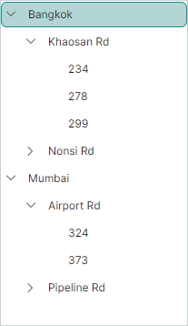

# Binding to Hierarchical Data

In a typical hierarchical data source, a business object has a property that stores a collection of child data objects. Two approaches allow you to supply child data to the TreeList and TreeView controls in hierarchical binding mode:

- [Specify a path to the child data](#specify-path-to-child-data)

- [Specify a children selector](#specify-a-children-selector)

    A children selector is useful in the following cases:
    - When parent and child business objects are of different types
    - When you cannot specify a path to child data


## Dynamic Data Load

When bound to a hierarchical data source, TreeList and TreeView controls load nodes on demand by default: child nodes are dynamically loaded when a parent node is expanded. 

Set the `AllowDynamicDataLoading` property to `false` to load all nodes simultaneously after you bind the control to the data source.

If you use dynamic node loading, the TreeList and TreeView controls do not have access to nodes (and their underlying data) that haven't been loaded. This applies the following restrictions to the node checking and filter/search functionalities:

- When you check a parent node in recursive mode (see `AllowRecursiveNodeChecking`), the control checks this node along with currently loaded child nodes. The control does not check child nodes that haven't been loaded.

- When you search for data in the built-in Search box, or filter data with the auto-filter row, the control searches for data only across currently loaded nodes.

## Specify Path to Child Data 

One approach to supply child data to the TreeList/TreeView control is to specify the name of the property that stores child data in a business object. Use the `ChildrenFieldName` property for this purpose. For instance, if a business object stores child data in the `Items` collection, set the `ChildrenFieldName` property to "_Items_". 

You also need to set the `HasChildrenFieldName` property to the name of the property that returns `true` if a business object has child data, and `false`, otherwise. This information is required to display or hide node expand buttons.
If you do not specify the `HasChildrenFieldName` property the control displays expand buttons for childless nodes until a user tries to expand these nodes.

The following example demonstrates how to bind a TreeList control to data. An _Employee_ object in the example has the _Subordinates_ collection that contains child items. The `ChildrenFieldName` property specifies the name of the property (the "_Subordinates_" string) that stores child data.

``` xml
xmlns:mxtl="https://schemas.eremexcontrols.net/avalonia/treelist"
...
<mxtl:TreeListControl Grid.Column="0" Width="400" Name="treeList1" >
    <mxtl:TreeListControl.Columns>
        <mxtl:TreeListColumn Name="colName" FieldName="Name" Header="Name" />
        <mxtl:TreeListColumn Name="colBirthdate" FieldName="Birthdate" Header="Birthdate"/>
    </mxtl:TreeListControl.Columns>
</mxtl:TreeListControl>
```
``` cs
using CommunityToolkit.Mvvm.ComponentModel;

Employee p1 = new Employee() { Name = "Mark Douglas", Birthdate=new DateTime(1990, 01, 5) };
Employee p2 = new Employee() { Name = "Mary Watson", Birthdate = new DateTime(1985, 12, 17) };
Employee p3 = new Employee() { Name = "Alex Wude", Birthdate = new DateTime(2000, 10, 7) };
Employee p4 = new Employee() { Name = "Sam Louis", Birthdate = new DateTime(1975, 8, 27) };
Employee p5 = new Employee() { Name = "Dan Miller", Birthdate = new DateTime(1981, 3, 6) };
p1.Subordinates.Add(p2);
p1.Subordinates.Add(p3);
p2.Subordinates.Add(p4);
p3.Subordinates.Add(p5);

ObservableCollection<Employee> employees = new ObservableCollection<Employee>() { p1 };

treeList1.ChildrenFieldName = "Subordinates";
treeList1.HasChildrenFieldName = "HasChildren";

treeList1.ItemsSource = employees;

public partial class Employee : ObservableObject
{
    [ObservableProperty]
    public string name="";

    [ObservableProperty]
    public DateTime? birthdate=null;

    public ObservableCollection<Employee> Subordinates { get; } = new();

    public bool HasChildren { get { return Subordinates.Count > 0; } }
}
```

## Specify a Children Selector

Another approach to supply child data in hierarchical binding mode is to implement a _children selector_. The selector specifies whether child data is available in a business object, and returns this child data on demand. The TreeList/TreeView control uses the information supplied by the selector to create child nodes and draw node expand buttons.

A children selector is useful in the following scenarios:

- When parent and child business objects are [of different types](#use-a-children-selector-when-parent-and-child-business-objects-are-different)
- In all other cases, when you cannot specify a path to children with the `ChildrenFieldName` property.


Use the `TreeListControlBase.ChildrenSelector` property to assign a selector to your TreeList/TreeView control. A selector is an object that implements the `ITreeListChildrenSelector` interface:

``` cs
public interface ITreeListChildrenSelector
{
    // The method should return whether a business object has child data. 
    // The control uses this information to display or hide node expand buttons.
    bool HasChildren(object item) => true;
    // The method should return child objects for a business object.
    IEnumerable? SelectChildren(object item);
}
```


### Example - Implement a Simple Children Selector

The following example creates a selector (_MyTreeListChildrenSelector_) that supplies information on children for a TreeList control.

``` xml
xmlns:mxtl="https://schemas.eremexcontrols.net/avalonia/treelist"
...
<Grid RowDefinitions="Auto, Auto, Auto, Auto" ColumnDefinitions="400, *">
    <Grid.Resources>
        <local:MyTreeListChildrenSelector x:Key="mySelector" />
    </Grid.Resources>

    <mxtl:TreeListControl Grid.Column="0" Name="treeList2"
     ChildrenSelector="{StaticResource mySelector}">
        <mxtl:TreeListControl.Columns>
            <mxtl:TreeListColumn Name="colName1" FieldName="Name" />
            <mxtl:TreeListColumn Name="colBirthdate1" FieldName="Birthdate"/>
        </mxtl:TreeListControl.Columns>
    </mxtl:TreeListControl>
</Grid>
```
``` cs
using CommunityToolkit.Mvvm.ComponentModel;

Employee p1 = new Employee() { Name = "Mark Douglas", Birthdate = new DateTime(1990, 01, 5)};
Employee p2 = new Employee() { Name = "Mary Watson", Birthdate = new DateTime(1985, 12, 17)};
Employee p3 = new Employee() { Name = "Alex Wude", Birthdate = new DateTime(2000, 10, 7)};
Employee p4 = new Employee() { Name = "Sam Louis", Birthdate = new DateTime(1975, 8, 27)};
Employee p5 = new Employee() { Name = "Dan Miller", Birthdate = new DateTime(1981, 3, 6)};
p1.Subordinates.Add(p2);
p1.Subordinates.Add(p3);
p2.Subordinates.Add(p4);
p3.Subordinates.Add(p5);

ObservableCollection<Employee> employees = new ObservableCollection<Employee>() { p1 };

treeList2.ItemsSource = employees;

public class MyTreeListChildrenSelector : ITreeListChildrenSelector
{
    public bool HasChildren(object? item) => (item as Employee).HasChildren;
    public IEnumerable? SelectChildren(object? item) => (item as Employee).Subordinates;
}

public partial class Employee : ObservableObject
{
    [ObservableProperty]
    public string name="";

    [ObservableProperty]
    public DateTime? birthdate=null;

    public ObservableCollection<Employee> Subordinates = new();

    public bool HasChildren { get { return Subordinates.Count > 0; } }
}
```


### Use a Children Selector when Parent and Child Business Objects are Different

The following considerations apply when parent and child business objects are of different types. 

- TreeList displays values from the fields to which TreeList columns are bound (see `TreeListColumn.FieldName`). The parent and child business objects must expose these fields.

- The TreeView control displays values from business objects from a field whose name is specified by the `DataFieldName` property. Ensure that the parent and child data objects have this field.

### Example - Implement a Children Selector in Case of Different Business Objects

Assume that a TreeView control is bound to a collection of _City_ objects. Each _City_ object owns a collection of _Street_ objects, which in turn own collections of _Building_ objects. The TreeView should display the cities at the root level, the streets at the second level, and the numbers of the buildings at the third level.



The code below shows the definitions of the _City_, _Street_ and _Building_ business objects.
Note that these objects all have the _Name_ property. The name of this property will be assigned to the `TreeViewControl.DataFieldName` property in XAML.

``` cs
public class City
{
    public City(string name) { Name = name; }
    public string Name { get; set; }
    public ObservableCollection<Street> Streets = new();
}

public class Street 
{
    public Street(string name, string[] buidingNumbers) { 
        Name = name;
        foreach (string number in buidingNumbers)
        {
            Buildings.Add(new Building(number));
        }
    }
    public string Name { get; set; }
    public ObservableCollection<Building> Buildings = new();
}

public class Building  
{
    public Building(string name) { Name = name; }
    public string Name { get; set; }
}
```

The TreeView control is bound to the _Cities_ collection defined in a View Model. The `TreeViewControl.DataFieldName` property is set to "Name". This property identifies the field of business objects whose values should be displayed in the TreeView control.

``` cs
public partial class MainWindowViewModel : ViewModelBase
{
    [ObservableProperty]
    ObservableCollection<City> cities = new();
    //...
}
```
``` xml
<mxtl:TreeViewControl 
    Name="treeView"
    ItemsSource="{Binding Cities}"
    DataFieldName="Name"
    ...
/>
```

Because business objects in the hierarchical data source are of different types, a selector must be implemented to retrieve children for Tree View nodes.

``` cs
public class MyTreeListChildrenSelector : ITreeListChildrenSelector
{
    public bool HasChildren(object item)
    {
        if (item is City city)
            return city.Streets.Count > 0;
        if (item is Street street)
            return street.Buildings.Count > 0;
        return false;
    }
    public IEnumerable? SelectChildren(object item)
    {
        if (item is City city)
            return city.Streets;
        if (item is Street street)
            return street.Buildings;
        return null;
    }
}
```

To assign the _MyTreeListChildrenSelector_ selector to the TreeView control, use the `TreeListControlBase.ChildrenSelector` property.

``` xml
xmlns:local="clr-namespace:EremexAvaloniaApplication10.Views"

<mx:MxWindow.Resources>
    <local:MyTreeListChildrenSelector x:Key="mySelector" />
</mx:MxWindow.Resources>

<mxtl:TreeViewControl ...
    ChildrenSelector="{StaticResource mySelector}"
/>
```

#### Complete Code

The complete code of this example is listed below.

``` xml
<!-- MainWindow.axaml -->

<mx:MxWindow xmlns="https://github.com/avaloniaui"
        xmlns:x="http://schemas.microsoft.com/winfx/2006/xaml"
        xmlns:vm="using:EremexAvaloniaApplication10.ViewModels"
        xmlns:d="http://schemas.microsoft.com/expression/blend/2008"
        xmlns:mc="http://schemas.openxmlformats.org/markup-compatibility/2006"
        xmlns:mx="https://schemas.eremexcontrols.net/avalonia"
        xmlns:mxtl="https://schemas.eremexcontrols.net/avalonia/treelist"
        mc:Ignorable="d" d:DesignWidth="800" d:DesignHeight="450"
        x:Class="EremexAvaloniaApplication10.Views.MainWindow"
        x:DataType="vm:MainWindowViewModel"
        Icon="/Assets/EMXControls.ico"
        Title="EremexAvaloniaApplication10"
        xmlns:local="clr-namespace:EremexAvaloniaApplication10.Views"
        >

    <Design.DataContext>
        <vm:MainWindowViewModel/>
    </Design.DataContext>

    <mx:MxWindow.Resources>
        <local:MyTreeListChildrenSelector x:Key="mySelector" />
    </mx:MxWindow.Resources>

    <mxtl:TreeViewControl Name="treeView"
                          ItemsSource="{Binding Cities}"
                          DataFieldName="Name"
                          ChildrenSelector="{StaticResource mySelector}"
                          />
</mx:MxWindow>
```

``` cs
//MainWindow.axaml.cs

using Avalonia.Controls;
using Eremex.AvaloniaUI.Controls.Common;
using Eremex.AvaloniaUI.Controls.TreeList;
using EremexAvaloniaApplication10.ViewModels;
using System.Collections;

namespace EremexAvaloniaApplication10.Views
{
    public partial class MainWindow : MxWindow
    {
        public MainWindow()
        {
            InitializeComponent();
        }
    }

    public class MyTreeListChildrenSelector : ITreeListChildrenSelector
    {
        public bool HasChildren(object item)
        {
            if (item is City city)
                return city.Streets.Count > 0;
            if (item is Street street)
                return street.Buildings.Count > 0;
            return false;
        }
        public IEnumerable? SelectChildren(object item)
        {
            if (item is City city)
                return city.Streets;
            if (item is Street street)
                return street.Buildings;
            return null;
        }
    }
}
```

``` cs
//MainWindowViewModel.cs

using CommunityToolkit.Mvvm.ComponentModel;
using DynamicData;
using System.Collections.ObjectModel;
using System.Security.Cryptography;

namespace EremexAvaloniaApplication10.ViewModels
{
    public partial class MainWindowViewModel : ViewModelBase
    {
        [ObservableProperty]
        ObservableCollection<City> cities = new();

        public MainWindowViewModel()
        {
            Street s1 = new Street("Khaosan Rd", new string[] { "234", "278", "299" });
            Street s2 = new Street("Nonsi Rd", new string[] { "678", "639" });
            Street s3 = new Street("Airport Rd", new string[] { "324", "373" } );
            Street s4 = new Street("Pipeline Rd", new string[] { "111", "185" });

            City c1 = new City("Bangkok");
            City c2 = new City("Mumbai");

            c1.Streets.Add(s1);
            c1.Streets.Add(s2);
            c2.Streets.Add(s3);
            c2.Streets.Add(s4);

            cities.AddRange(new[] { c1, c2 });
        }
    }

    public class City
    {
        public City(string name) { Name = name; }
        public string Name { get; set; }
        public ObservableCollection<Street> Streets = new();
    }

    public class Street 
    {
        public Street(string name, string[] buildingNumbers) { 
            Name = name;
            foreach (string number in buildingNumbers)
            {
                Buildings.Add(new Building(number));
            }
        }
        public string Name { get; set; }
        public ObservableCollection<Building> Buildings = new();
    }

    public class Building  
    {
        public Building(string name) { Name = name; }
        public string Name { get; set; }
    }
}
```

# See Also
- [Data Binding](./index.md)
- [Binding to Self-Referential Data Source](binding-to-self-referential-data-source.md)
- [Columns](../columns.md)
- [How to Create a TreeList Control and Bind It to a Hierarchical Data Source](../examples/how-to-create-a-treelist-control-and-bind-it-to-a-hierarchical-data-source.md)