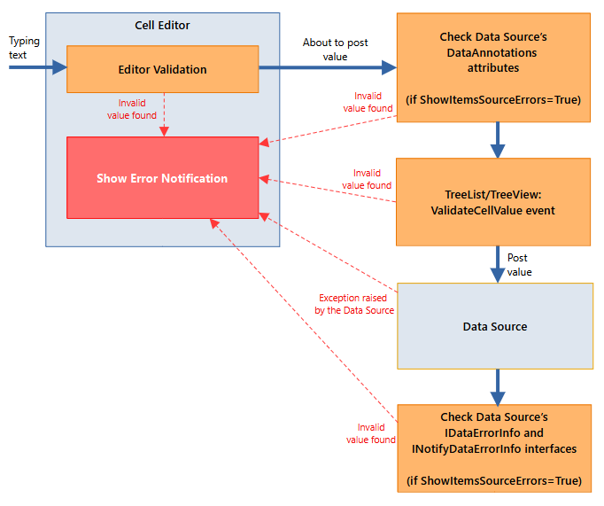
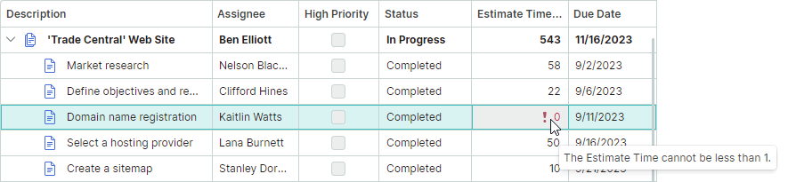

# Data Validation

The data validation mechanism allows you to check cell values and show errors in cells that contain invalid data. 

The TreeList and TreeView controls perform data validation when a user modifies a cell value and then tries to save (post) the value. The controls also invoke the validation mechanism for newly displayed cells, and cells updated in code even if a user has not modified cell values.

## Validate Values when User Modifies Cell Data

The TreeList and TreeView controls activate the cell value validation mechanism when a user modifies a cell value and tries to save it in the data source (for instance, a user presses the ENTER key or moves focus to another cell). The following diagram shows the validation mechanism stages performed when a user modifies a cell value:



1. A cell's in-place editor performs initial value validation during data input. For instance, a `SpinEditor`, which accepts only numeric values, shows errors if a user tries to type a letter.

    A user cannot leave a cell until a valid value is entered, or the ESC key is pressed, which reverts to the previous value.

1. The TreeList/TreeView control checks whether [DataAnnotations attributes](#dataannotations-attributes) are applied to the data source's business object, and then validates data according to these rules. This validation stage is enabled if the `DataControlBase.ShowItemsSourceErrors` property is set to `true` (the default value). 
    
    A user cannot leave a cell until a valid value is entered, or the ESC key is pressed, which reverts to the previous value.
    

1. The control fires the [`DataControlBase.ValidateCellValue` event](#controls-validatecellvalue-event), which you can handle to implement custom value validation.

    A user cannot leave a cell until a valid value is entered, or the ESC key is pressed, which reverts to the previous value.

1. The control posts the cell value. At this step, the data source may raise exceptions if the posted data is invalid. The control shows an error in the cell if any exception is caught.

    A user cannot leave a cell until a valid value is entered, or the ESC key is pressed, which reverts to the previous value.

1. The TreeList/TreeView control checks whether the business object implements the [IDataErrorInfo](#idataerrorinfo-interface) or [INotifyDataErrorInfo interface](#inotifydataerrorinfo-interface), and uses these interfaces to fetch cell errors, if any. This validation stage is enabled if the `DataControlBase.ShowItemsSourceErrors` property is set to `true` (the default value).
    
    The control allows a user to leave a cell when the cell value is invalid, because the value has already been posted.


## Validate Values of Newly Displayed Cells and Cells Updated in Code

The controls support the validation mechanism for newly displayed and updated cells even if a user has not modified cell values. The control validates cell values in the following cases:

- The control is initially displayed, and so cells are drawn within the viewport.
- A cell becomes visible when a control is scrolled.
- A cell value is modified in code, and so the control needs to redraw the cell. 

The following diagram shows the validation mechanism stages in these scenarios:


1. The TreeList/TreeView control checks whether [DataAnnotations attributes](#dataannotations-attributes) are applied to the data source's business object, and then validates data according to these rules. This validation stage is enabled if the `DataControlBase.ShowItemsSourceErrors` property is `true` (the default value).

1. The TreeList/TreeView control checks whether the business object implements the [IDataErrorInfo](#idataerrorinfo-interface) or [INotifyDataErrorInfo interface](#inotifydataerrorinfo-interface), and uses these interfaces to fetch cell errors, if any.  This validation stage is enabled if the `DataControlBase.ShowItemsSourceErrors` property is set to `true` (the default value).

1. The control fires the [`DataControlBase.ValidateCellValue` event](#controls-validatecellvalue-event), which you can handle to implement custom value validation. This validation stage is enabled if the `DataControlBase.ValidateCellValuesOnShowAndUpdate` property is `true` (the default value is `false`).


## Data Source Validation Rules

If the `DataControlBase.ShowItemsSourceErrors` property is enabled (the default behavior), the TreeList/TreeView control validates data using the `DataAnnotations` attributes and `IDataErrorInfo` interface applied to the data source's business object.

### DataAnnotations Attributes 

You can apply `DataAnnotations` validation attributes (`System.ComponentModel.DataAnnotations.ValidationAttribute` descendants) to a business object to specify validation rules for the object's properties. The list below shows most common validation attributes:

- [`CompareAttribute`](https://learn.microsoft.com/en-us/dotnet/api/system.componentmodel.dataannotations.compareattribute?view=net-7.0) — Provides an attribute that compares two properties.
- [`CustomValidationAttribute`](https://learn.microsoft.com/en-us/dotnet/api/system.componentmodel.dataannotations.customvalidationattribute?view=net-7.0) — Specifies a custom validation method that is used to validate a property or class instance.
- [`MaxLengthAttribute`](https://learn.microsoft.com/en-us/dotnet/api/system.componentmodel.dataannotations.maxlengthattribute?view=net-8.0) — Specifies the maximum length of array or string data allowed in a property.
- [`MinLengthAttribute`](https://learn.microsoft.com/en-us/dotnet/api/system.componentmodel.dataannotations.minlengthattribute?view=net-8.0) — Specifies the minimum length of array or string data allowed in a property.
- [`RangeAttribute`](https://learn.microsoft.com/en-us/dotnet/api/system.componentmodel.dataannotations.rangeattribute?view=net-8.0) — Specifies the numeric range constraints for the value of a data field.
- [`RegularExpressionAttribute`](https://learn.microsoft.com/en-us/dotnet/api/system.componentmodel.dataannotations.regularexpressionattribute?view=net-8.0) — Specifies that a data field value must match the specified regular expression.
- [`RequiredAttribute`](https://learn.microsoft.com/en-us/dotnet/api/system.componentmodel.dataannotations.requiredattribute?view=net-8.0) — Specifies that a data field value is required.
- [`StringLengthAttribute`](https://learn.microsoft.com/en-us/dotnet/api/system.componentmodel.dataannotations.stringlengthattribute?view=net-8.0) — Specifies the minimum and maximum length of characters that are allowed in a data field.

#### Example

The following code applies a `StringLength` attribute to a business object's _Code_ property. The attribute forces a user to enter a string containing at least 4, but no more than 8 characters.

``` csharp
public partial class Department : ObservableObject, IDataErrorInfo
{
    //...

    [ObservableProperty]
    [property: StringLength(8, MinimumLength = 4)]
    public string code = "0000";
}
```

### 'IDataErrorInfo' Interface

You can implement the [`System.ComponentModel.IDataErrorInfo`](https://learn.microsoft.com/en-us/dotnet/api/system.componentmodel.idataerrorinfo?view=net-7.0) interface for a business object to specify validation rules for the business object's properties.

Currently, the TreeList and TreeView controls only support errors that are set for individual cells, not for entire rows. Thus, the `IDataErrorInfo.Item[String]` property is only in effect, and the `IDataErrorInfo.Error` property is ignored.

#### Example - Implement 'IDataErrorInfo' interface

The following example implements the `IDataErrorInfo` interface for a business object to return an error if the _Phone_ property is empty.

``` csharp
public partial class Department : ObservableObject, IDataErrorInfo
{
    //... 

    [ObservableProperty]
    public string phone = "0";

    string IDataErrorInfo.this[string columnName]
    {
        get
        {
            if (columnName != "Phone")
                return "";
            return string.IsNullOrEmpty(this.Phone) ? "Please specify the phone number" : "";
        }
    }
    string IDataErrorInfo.Error
    {
        get { return ""; }
    } 
}
```

### 'INotifyDataErrorInfo' Interface

The `System.ComponentModel.INotifyDataErrorInfo` interface allows you to implement custom validation rules at the business object level. The interface supports synchronous and asynchronous validation, multiple errors per property, and cross-property errors.

#### Example - Implement 'INotifyDataErrorInfo' interface

The following example demonstrates how to implement the `INotifyDataErrorInfo` interface for a business object (_ProjectTask_). The interface is used to define validation rules for the _ProjectTask.EstimateTime_ property. When the property's value violates the validation rules, the TreeList control displays an error in a corresponding cell.

The `INotifyDataErrorInfo` interface implementation shown below supports multiple errors per property at the same time.



``` xml
<mxtl:TreeListControl x:Name="treeList" ItemsSource="{Binding Tasks}"...>
    <mxtl:TreeListColumn FieldName="EstimateTime" Header="Estimate Time (h)" Width="*" />
</mxtl:TreeListControl>
```

``` csharp
public partial class TreeListDataEditorsPageViewModel : PageViewModelBase
{
    //...
    public List<ProjectTask> Tasks { get; }
}


public partial class ProjectTask : ObservableObject, INotifyDataErrorInfo
{
    public ProjectTask(ProjectTask parent, string description, TaskStatus status, 
      int estimateTime, int timeSpent, string assignee, DateTime dueDate)
    {
        Tasks = new();
        Parent = parent;
        this.estimateTime = estimateTime;
        //...
    }

    [ObservableProperty]
    private int estimateTime;


    private Dictionary<string, List<string>> propertyErrors = new Dictionary<string, List<string>>();

    partial void OnEstimateTimeChanged(int oldValue, int newValue) => ValidateEstimateTime();

    public bool HasErrors => propertyErrors.Any();

    public event EventHandler<DataErrorsChangedEventArgs> ErrorsChanged;

    public System.Collections.IEnumerable GetErrors(string propertyName)
    {
        if (propertyErrors.ContainsKey(propertyName))
            return propertyErrors[propertyName];
        else
            return null;
    }

    private void RaiseErrorsChanged(string propertyName)
    {
        ErrorsChanged?.Invoke(this, new DataErrorsChangedEventArgs(propertyName));
    }

    private void ValidateEstimateTime()
    {
        ClearErrors(nameof(EstimateTime));

        if (EstimateTime < 1)
            AddError(nameof(EstimateTime), "The Estimate Time cannot be less than 1.");
        if (EstimateTime > 800)
            AddError(nameof(EstimateTime), "The Estimate Time cannot be greater than 800");
            
    }

    private void AddError(string propertyName, string error)
    {
        if (!propertyErrors.ContainsKey(propertyName))
            propertyErrors[propertyName] = new List<string>();

        if (!propertyErrors[propertyName].Contains(error))
        {
            propertyErrors[propertyName].Add(error);
            RaiseErrorsChanged(propertyName);
        }
    }

    private void ClearErrors(string propertyName)
    {
        if (propertyErrors.ContainsKey(propertyName))
        {
            propertyErrors.Remove(propertyName);
            RaiseErrorsChanged(propertyName);
        }
    }

    public ProjectTask Parent { get; }
    public List<ProjectTask> Tasks { get; }
    //...
}
```

## Control's 'ValidateCellValue' Event

The `DataControlBase.ValidateCellValue` event allows you to implement custom value validation logic.

Raising the `DataControlBase.ValidateCellValue` event is a non-optional stage of the validation mechanism invoked after a user has modified a cell value.

The validation mechanism is also used to check the validity of newly displayed cells and cells updated in code. In this case, the `DataControlBase.ValidateCellValue` event only fires if the inherited `DataControlBase.ValidateCellValuesOnShowAndUpdate` property is `true` (the default value is `false`).

### Example 

The following example handles the `ValidateCellValue` event to show errors when the _Date1_ property's value is greater than the _Date2_ property's value.

``` csharp
public partial class Department : ObservableObject, IDataErrorInfo
{
    [ObservableProperty]
    public DateTime date1 = new DateTime();

    [ObservableProperty]
    public DateTime date2 = new DateTime();
}

treeList1.ValidateCellValue += TreeList1_ValidateCellValue;

// Uncomment the following code line to use the ValidateCellValue event handler
// to check cells when they are displayed or modified in code:

// treeList1.ValidateCellValuesOnShowAndUpdate = true;

private void TreeList1_ValidateCellValue(object? sender, TreeListValidateCellValueEventArgs e)
{
    Department dep = e.Node.Content as Department;
        
    if(e.Column.FieldName == "Date1")
    {
        DateTime value1 = Convert.ToDateTime(e.Value);
        DateTime value2 = dep.Date2;
        if(value1 > value2)
        {
            e.ErrorContent = "Date1 must be less than Date2";
            return;
        }
    }
}
```