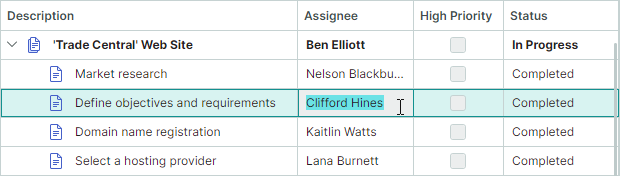

# Focus and Navigation


## Cell and Row Navigation Modes

The TreeList control's default behavior allows users to navigate between cells using the keyboard, or focus them using the mouse.
Use the [`TreeListControl.NavigationMode`](../../API/Eremex.AvaloniaUI.Controls.TreeList/TreeListControl/NavigationMode.md) property to switch between Cell Navigation and Row Navigation modes.

**Cell Navigation** (default)

Users can focus any cell using the keyboard or mouse.



**Row (Node) Navigation**

Users cannot focus individual cells, and cell edit operations are disabled. Clicking a cell highlights the entire node.

``` xml
<mxtl:TreeListControl x:Name="treeList" NavigationMode="Row">
```


## Focused Column

Use the [`TreeListControl.FocusedColumn`](../../API/Eremex.AvaloniaUI.Controls.TreeList/TreeListControl/FocusedColumn.md) property to obtain the focused column. To move focus to a specific column, assign a corresponding [`TreeListColumn`](../../API/Eremex.AvaloniaUI.Controls.TreeList/TreeListColumn.md) object to the [`FocusedColumn`](../../API/Eremex.AvaloniaUI.Controls.TreeList/TreeListControl/FocusedColumn.md) property.

!!! note

    You can only focus a column in [Cell Navigation mode](#cell-and-row-navigation-modes).

## Focused Node (Row)

Use the [`TreeListControlBase.FocusedNode`](../../API/Eremex.AvaloniaUI.Controls.TreeList/TreeListControlBase/FocusedNode.md) property to access the currently focused node (the node that receives keyboard events). To get the focused node's data (business) object, use the [`DataControlBase.FocusedItem`](../../API/Eremex.AvaloniaUI.Controls.DataControl/DataControlBase/FocusedItem.md) inherited property.

The [`TreeListControlBase.FocusedNodeChanged`](../../API/Eremex.AvaloniaUI.Controls.TreeList/TreeListControlBase/FocusedNodeChanged.md) event allows you to respond to moving focus between nodes.


## Focused Cell

The focused cell is determined by the intersection of the focused node and focused column. To move focus to a specific cell, focus the target [row](#focused-node-row) and [column](#focused-column).

<!-- TODO
Example - focus a specific cell
 -->