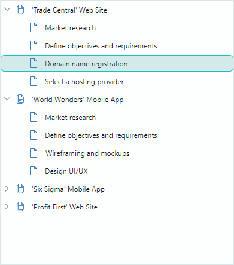

# TreeList and TreeView

The Eremex Controls library includes two data-aware controls to display hierarchical data in the form of a tree — [`TreeListControl`](../../API/Eremex.AvaloniaUI.Controls.TreeList/TreeListControl.md) and [`TreeViewControl`](../../API/Eremex.AvaloniaUI.Controls.TreeList/TreeViewControl.md). They render data source items as nodes (rows). If a node owns child nodes, you can expand it to display the next level of the node hierarchy. 

`TreeList` supports multiple columns:

`TreeView` is a single-column control:

The controls are derived from one ancestor, so they share multiple features:

- [Data Binding](data-binding/index.md) — You can bind the controls to self-referential (flat) and hierarchical data sources.
- [Unbound Mode](data-binding/unbound-mode.md) — Allows you to manually create the node structure.
- [Built-in Node Checkboxes](nodes.md#built-in-check-boxes) — Allow you to select individual nodes.
- [Data Sorting](sorting.md) — Allows you to sort sibling nodes in ascending or descending order. TreeList supports data sorting against one or multiple columns. 
- [Node Images](nodes.md#node-images) — Allow you to display custom images before cell values in the hierarchy column.
- [Styles](styles.md) — Allow you to customize the appearance settings of the controls' elements in various states.
- [Search Panel](filter-and-search.md#search-panel-treelist-and-treeview) — Helps a user quickly locate nodes by the data they contain.
- [Data Edit Operations](data-editing/index.md) — A user can edit cell values if data editing is enabled. You can embed Eremex and custom editors in cells to edit and present cell values in a specific manner.
- [Data Validation](data-validation.md) — The validation mechanism helps you check a user's input and data source's values, and show errors in cells.
- [Built-in and Custom Context Menus](context-menus.md)
- [Data Annotation Attribute Support](columns.md#use-attributes-to-customize-settings-of-auto-generated-columns) — The TreeList and TreeView controls take into account dedicated Data Annotation attributes applied to the data source's properties. You can use Data Annotation attributes to specify custom visibility, position, read-only state, and display name for auto-generated columns.
- [Node Drag-and-Drop](node-drag-and-drop.md) - A user can drag a node within the control and to another control.
- [High Performance for Large Volumes of Data](performance-and-data-virtualization.md) — The data virtualization mechanism for vertical and horizontal scrolling boosts the control's performance when displaying large numbers of rows and columns.

TreeList-specific features include:

- [Unbound Columns](data-binding/unbound-columns.md) — You can add unbound columns (those that are not bound to data source fields) and populate them with data manually, using an event.
- [Column Filter Menus](filter-and-search.md#column-filters-treelist) — You can filter data using dropdown menus that display unique column values. Click the filter button in any column header to access filtering options.
- [Auto Filter Row](filter-and-search.md#auto-filter-row-treelist) — A special row that allows a user to filter data against columns.
- [Column Header Templates](columns.md#column-headers) – Allow you to display custom content in column headers, including images.
- [Multiple Node Selection (Highlight)](nodes.md#multiple-node-selection-highlight) — You can enable multiple node selection mode to allow a user to select (highlight) multiple nodes at one time.
- [Column Bands](bands.md) — Allow you to visually group multiple columns under a common header.
- [Fixed Columns](columns.md#fixed-columns) — Allow specific columns to remain visible and anchored to the left or right edge of the TreeList control while other columns scroll horizontally. 
- [Best Fit](columns.md#best-fit) — This feature resizes columns to their minimum widths required to fully display column contents (values and headers) without truncation. 
- [Column Resize and Move Operations](columns.md#move-columns)
- [Export to XLSX, PDF, CSV and Image Formats](export.md)

See the following topic for more information: [TreeList and TreeView Controls Overview](treelist-and-treeview-overview.md).
