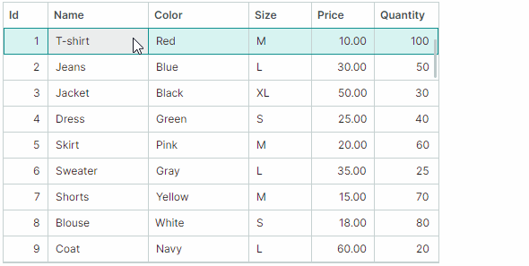
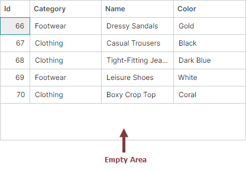
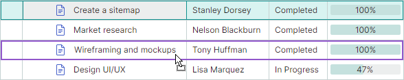

# Node Drag-and-Drop

TreeList and TreeView controls support the node drag-and-drop functionality within the controls and to external controls. The drag-and-drop feature is implemented in the base class of TreeList and TreeView, [`TreeListControlBase`](../../API/Eremex.AvaloniaUI.Controls.TreeList/TreeListControlBase.md). This class exposes the API to enable and handle node drag-and-drop operations.


<!-- TODO
Update animation with row previews
 -->

When you drag nodes, node previews are shown. However, if you enable platform-based node drag-and-drop (required for [dragging nodes between applications](#enable-node-drag-and-drop-between-applications)), node previews are not available.

## Enable Node Drag-and-Drop

Set the [`TreeListControlBase.AllowDragDrop`](../../API/Eremex.AvaloniaUI.Controls.TreeList/TreeListControlBase/AllowDragDrop.md) property to `true` to enable node drag-and-drop. In this case a user can drag a node within the TreeList/TreeView control and outside the control.
A drag-and-drop operation moves a node to another position, and also changes the position of a corresponding business object in the data source.

If a node is dragged to an external control, the default behavior of the TreeList/TreeView control is to remove the node from the current control, and delete the corresponding business object from the control's data source. See [Node Drag-and-Drop Between Controls](#node-drag-and-drop-between-controls) for information on how to prevent nodes and business objects from being deleted.

Drag-and-drop of multiple nodes is supported if you enable multiple node selection using the [`DataControlBase.SelectionMode`](../../API/Eremex.AvaloniaUI.Controls.DataControl/DataControlBase/SelectionMode.md) property (see [Nodes - Multiple Node Selection (Highlight)](nodes.md#multiple-node-selection-highlight)).

TreeList and TreeView controls do not maintain automatic copy operations during drag-and-drop. Pressing the CTRL key is not in effect. 

### Enable Node Drag-and-Drop Between Applications

To allow nodes to be dragged between applications, enable the [`UsePlatformRowDragDrop`](../../API/Eremex.AvaloniaUI.Controls.TreeList/TreeListControlBase/UsePlatformRowDragDrop.md) property for the control that is the source of drag-and-drop operations.

!!! Tip

    The [`UsePlatformRowDragDrop`](../../API/Eremex.AvaloniaUI.Controls.TreeList/TreeListControlBase/UsePlatformRowDragDrop.md) property enables a drag-and-drop mode in which operations are handled by the Avalonia platform. No node previews are shown during platform-based drag operations.


## Node Drag Mode – Start Drag Operations in Cells or Use Special Drag Handles

Tree List supports two node drag-and-drop modes that differ in how drag-and-drop operations are initiated. You can select the required mode using the control's [`RowDragMode`](../../API/Eremex.AvaloniaUI.Controls.DataControl/RowDragMode.md) property.

- [`RowDragMode.Row`](../../API/Eremex.AvaloniaUI.Controls.DataControl/RowDragMode.md) mode (default) — Users can initiate a drag-and-drop operation in any node cell.

    


    In this mode, the default cell editor activation behavior is as follows:
    
    1. A user needs to focus a cell first.
    
    2. A click within the focused cell then activates the cell editor.
    
    To activate a cell editor on a single click, enable cell editor activation on mouse button release. To do this, set the control's [`DataControlBase.EditorShowMode`](../../API/Eremex.AvaloniaUI.Controls.DataControl/DataControlBase/EditorShowMode.md) property to [`EditorShowMode.PointerReleased`](../../API/Eremex.AvaloniaUI.Controls.DataControl/EditorShowMode.md).

- [`RowDragMode.DragHandle`](../../API/Eremex.AvaloniaUI.Controls.DataControl/RowDragMode.md) mode — Users can initiate a drag-and-drop operation by dragging a special drag handle. Drag handles are displayed in the Row Indicator region, which automatically appears to the left of the nodes when you activate [`RowDragMode.DragHandle`](../../API/Eremex.AvaloniaUI.Controls.DataControl/RowDragMode.md) mode. 

    

    In `DragHandle` mode, cell editors are activated on a single press within a cell, by default. You can use the control's [`DataControlBase.EditorShowMode`](../../API/Eremex.AvaloniaUI.Controls.DataControl/DataControlBase/EditorShowMode.md) property to change this behavior.

    When multiple node selection is enabled, drag handles are shown for each selected node.


**Related API:**

- [`RowIndicatorWidth`](../../API/Eremex.AvaloniaUI.Controls.TreeList/TreeListControl/RowIndicatorWidth.md) — Specifies the width of the Row Indicator region, which displays drag handles.


## Drag-and-Drop of Sorted Data

TreeList and TreeView nodes can be [sorted](sorting.md). Node drag-and-drop operations within sorted TreeList and TreeView controls are disabled by default. Set the [`TreeListControlBase.AllowDragDropSortedNodes`](../../API/Eremex.AvaloniaUI.Controls.TreeList/TreeListControlBase/AllowDragDropSortedNodes.md) property to `true` to enable drag-and-drop operations within sorted controls.

If data is sorted and a node is dragged to a position before or after another node, the control automatically updates the dragged node's value(s) in the sorted column(s) to keep the current sort order. The dragged node's values in the sorted columns are set to corresponding values of the target node.

## Handle Drag-and-Drop Operations with Events

The TreeList and TreeView controls contain events that help you manage and respond to node drag-and-drop operations.

### Start Drag-and-Drop

The [`TreeListControlBase.StartDrag`](../../API/Eremex.AvaloniaUI.Controls.TreeList/TreeListControlBase/StartDrag.md) event fires when a drag-and-drop operation is about to start. Use the following event parameters to get information about the current drag-and-drop operation.

- `e.Data` — Specifies the [`DragDropData`](../../API/Eremex.AvaloniaUI.Controls.DataControl/DragDropData.md) object that contains the data of the current drag-and-drop operation.
- `e.DragElement` — The visual element being dragged.
<!-- TODO
что такое параметр DragElement (Avalonia.Controls.Border)
 -->

- `e.Effects` — Specifies the drag-and-drop effect. Set this parameter to `DragDropEffects.None` to cancel the current drag-and-drop operation. The drag-and-drop effect also determines the mouse pointer icon. 
- `e.Nodes` — An array of [`TreeListNode`](../../API/Eremex.AvaloniaUI.Controls.TreeList/TreeListNode.md) objects that are about to be dragged. This array contains a single object if only one node is being dragged.


#### Example - Prevent a drag-and-drop operation from starting for specific nodes

The following [`StartDrag`](../../API/Eremex.AvaloniaUI.Controls.TreeList/TreeListControlBase/StartDrag.md) event handler disables drag-and-drop operations for nodes that contain children.

``` cs
private void TreeList_StartDrag(object sender, TreeListStartDragEventArgs e)
{
    if(e.Nodes[0].HasChildren)
        e.Effects = Avalonia.Input.DragDropEffects.None;
}
```

### Handle the Drag-Over Stage

The [`TreeListControlBase.DragOver`](../../API/Eremex.AvaloniaUI.Controls.TreeList/TreeListControlBase/DragOver.md) event is raised repeatedly while a user drags a node (or nodes) over another node. The event's arguments allow you to identify information related to the current drag-and-drop operation:

- `e.DragNodes` — An array of treelist [nodes](nodes.md) ([`TreeListNode`](../../API/Eremex.AvaloniaUI.Controls.TreeList/TreeListNode.md)) being dragged. This array contains a single object if only one node is being dragged.
- `e.TargetNode` — The treelist node over which the nodes are dragged.
- `e.DropPosition` — Specifies the potential drop position relative to the target node. Available options include: 
    - [`DropPosition.Before`](../../API/Eremex.AvaloniaUI.Controls.DataControl/DropPosition.md) — Dragged nodes, if dropped, will be added at the same hierarchy level before the target node.
    - [`DropPosition.After`](../../API/Eremex.AvaloniaUI.Controls.DataControl/DropPosition.md) — Dragged nodes, if dropped, will be added at the same hierarchy level after the target node.
    - [`DropPosition.Inside`](../../API/Eremex.AvaloniaUI.Controls.DataControl/DropPosition.md) — Dragged nodes, if dropped, will be added as a child of the target node.
    - [`DropPosition.EmptyArea`](../../API/Eremex.AvaloniaUI.Controls.DataControl/DropPosition.md) (new in v1.5) — Nodes are dragged over the empty area below all treelist nodes. 
    
        
    
        The `e.Effects` parameter is initially set to `DragDropEffects.None` when nodes are dragged over the empty area, thus preventing them from being dropped here. 
    
        Set the `e.Effects` parameter to `DragDropEffects.Move` or `DragDropEffects.Copy` to allow node drop operations over the empty area. When nodes are dropped over this area, they are inserted at the end of all root nodes. 

    You can modify the `e.DropPosition` parameter to change how dragged nodes are inserted. For instance, to always append dragged nodes at the end of all root nodes, set the `e.DropPosition` parameter to [`DropPosition.EmptyArea`](../../API/Eremex.AvaloniaUI.Controls.DataControl/DropPosition.md), and ensure the `e.Effects` parameter is not set to `None`.


- `e.KeyModifiers` — Specifies whether the ALT, SHIFT, and/or CTRL key is pressed during the [`DragOver`](../../API/Eremex.AvaloniaUI.Controls.TreeList/TreeListControlBase/DragOver.md) event.
- `e.Data` — Specifies the [`DragDropData`](../../API/Eremex.AvaloniaUI.Controls.DataControl/DragDropData.md) object that contains the data of the current drag-and-drop operation.
- `e.Effects` — Specifies the drag-and-drop effect. Set this parameter to `DragDropEffects.None` to cancel the current drag-and-drop operation. The drag-and-drop effect also determines the mouse pointer icon. 

#### Example - Allow nodes to be dropped within the empty area

The following [`TreeListControlBase.DragOver`](../../API/Eremex.AvaloniaUI.Controls.TreeList/TreeListControlBase/DragOver.md) event handler sets the `e.Effects` parameter to `Move` to allow nodes to be dropped within the control's empty area.

``` cs 
private void TreeList_DragOver(object sender, TreeListDragEventArgs e)
{
    if (e.DropPosition == DropPosition.EmptyArea)
        e.Effects = Avalonia.Input.DragDropEffects.Move;
}
```

#### Example - Insert dragged nodes always at the end

The following [`TreeListControlBase.DragOver`](../../API/Eremex.AvaloniaUI.Controls.TreeList/TreeListControlBase/DragOver.md) event handler ensures dragged nodes are always inserted at the end of all root nodes when dropped. To do this, the `e.DropPosition` event parameter is forcibly set to [`DropPosition.EmptyArea`](../../API/Eremex.AvaloniaUI.Controls.DataControl/DropPosition.md), and the `e.Effects` parameter is set to `Move`.

``` cs
private void TreeList_DragOver(object sender, TreeListDragEventArgs e)
{
    e.DropPosition = DropPosition.EmptyArea;
    e.Effects = Avalonia.Input.DragDropEffects.Move;
}
```


#### Example - Prevent nodes from being dropped at the root level

The following [`DragOver`](../../API/Eremex.AvaloniaUI.Controls.TreeList/TreeListControlBase/DragOver.md) event handler prevents nodes from being dropped next to root nodes. The code still allows nodes to be dropped as children of root nodes.

``` cs
private void TreeList_DragOver(object sender, TreeListDragEventArgs e)
{
    if(e.TargetNode?.Level == 0 && (e.DropPosition==DropPosition.Before || e.DropPosition == DropPosition.After)) 
        e.Effects = Avalonia.Input.DragDropEffects.None;
}

```

### Finish Drag-and-Drop

Two events are available to help you manage the drop stage of a drag-and-drop operation: 

- [`TreeListControlBase.Drop`](../../API/Eremex.AvaloniaUI.Controls.TreeList/TreeListControlBase/Drop.md) — Fires when a node is about to be dropped over another treelist node. The event's arguments match those of the [`TreeListControlBase.DragOver`](../../API/Eremex.AvaloniaUI.Controls.TreeList/TreeListControlBase/DragOver.md) event.

    To cancel a drop operation in specific cases, handle the [`Drop`](../../API/Eremex.AvaloniaUI.Controls.TreeList/TreeListControlBase/Drop.md) event and set its `e.Handled` parameter to `true`. 

    If a node is dropped outside the current TreeList/TreeView control, the [`Drop`](../../API/Eremex.AvaloniaUI.Controls.TreeList/TreeListControlBase/Drop.md) event does not fire for this control. See the [`TreeListControlBase.CompleteDragDrop`](../../API/Eremex.AvaloniaUI.Controls.TreeList/TreeListControlBase/CompleteDragDrop.md) event's description below for more information.

    #### Example - Modify a dropped node's values 

    The following [`Drop`](../../API/Eremex.AvaloniaUI.Controls.TreeList/TreeListControlBase/Drop.md) event handler changes a value of a dragged node(s) when it is dropped. It is assumed that the data source contains the _"Assignee"_ field. The code below sets the dropped node's _"Assignee"_ field to the target node's _"Assignee"_ field value.

    ``` cs
    private void TreeList_Drop(object sender, TreeListDragEventArgs e)
    {
        if (e.DropPosition != DropPosition.Inside)
            return;
        TreeListControl treeList = e.Source as TreeListControl;
        string newAssignee = treeList.GetCellValue(e.TargetNode, "Assignee").ToString();
        foreach (TreeListNode node in e.DragNodes)
        {
            treeList.SetCellValue(node, "Assignee", newAssignee);
        }
    }
    ```

- [`TreeListControlBase.CompleteDragDrop`](../../API/Eremex.AvaloniaUI.Controls.TreeList/TreeListControlBase/CompleteDragDrop.md) — Fires after a drag-and-drop operation has been finished within the current control or outside the current control.

    The [`TreeListControlBase.CompleteDragDrop`](../../API/Eremex.AvaloniaUI.Controls.TreeList/TreeListControlBase/CompleteDragDrop.md) event fires after the [`TreeListControlBase.Drop`](../../API/Eremex.AvaloniaUI.Controls.TreeList/TreeListControlBase/Drop.md) event.

    The following arguments are available for the [`TreeListControlBase.CompleteDragDrop`](../../API/Eremex.AvaloniaUI.Controls.TreeList/TreeListControlBase/CompleteDragDrop.md) event:

    - `e.DragNodes` — An array of treelist [nodes](nodes.md) ([`TreeListNode`](../../API/Eremex.AvaloniaUI.Controls.TreeList/TreeListNode.md)) that have been dropped. 
    - `e.Effects` — Returns the drag-and-drop effect that has been set in a [`Drop`](../../API/Eremex.AvaloniaUI.Controls.TreeList/TreeListControlBase/Drop.md) event handler of the control on which the node has been dropped.

    See also: [Node Drag-and-Drop Between Controls](#node-drag-and-drop-between-controls)

    
## Drag-and-Drop Options

The TreeList/TreeView controls expose the following options to customize node drag-and-drop operations:

- [`TreeListControlBase.AutoExpandOnDrag`](../../API/Eremex.AvaloniaUI.Controls.TreeList/TreeListControlBase/AutoExpandOnDrag.md) — Gets or sets whether collapsed nodes are automatically expanded when hovered during a drag-and-drop operation.
- [`TreeListControlBase.AutoExpandDelayOnDrag`](../../API/Eremex.AvaloniaUI.Controls.TreeList/TreeListControlBase/AutoExpandDelayOnDrag.md) — Gets or sets the delay before collapsed nodes are automatically expanded when the mouse is over them during a drag-and-drop operation.
- [`TreeListControlBase.AllowScrollingOnDrag`](../../API/Eremex.AvaloniaUI.Controls.TreeList/TreeListControlBase/AllowScrollingOnDrag.md) — Gets or sets whether the TreeList/TreeView automatically scrolls nodes when you drag a node at the control's top or bottom edge.


## Node Drag-and-Drop Between Controls

Drag-and-drop of nodes (rows) is automatically supported between [`TreeListControl`](../../API/Eremex.AvaloniaUI.Controls.TreeList/TreeListControl.md), [`TreeViewControl`](../../API/Eremex.AvaloniaUI.Controls.TreeList/TreeViewControl.md) and [`DataGridControl`](../../API/Eremex.AvaloniaUI.Controls.DataGrid/DataGridControl.md) controls. Use the `AllowDragDrop` option exposed by these controls to enable the drag-and-drop functionality for them.

### Visual Indication of Drag-and-Drop

When a node (row) is dragged, [`TreeListControl`](../../API/Eremex.AvaloniaUI.Controls.TreeList/TreeListControl.md), [`TreeViewControl`](../../API/Eremex.AvaloniaUI.Controls.TreeList/TreeViewControl.md) and [`DataGridControl`](../../API/Eremex.AvaloniaUI.Controls.DataGrid/DataGridControl.md) controls visually indicate a potential drop position.



### Automatic Movement of a Node (Row) and Its Item from the Source to the Target Control

[`TreeListControl`](../../API/Eremex.AvaloniaUI.Controls.TreeList/TreeListControl.md), [`TreeViewControl`](../../API/Eremex.AvaloniaUI.Controls.TreeList/TreeViewControl.md) and [`DataGridControl`](../../API/Eremex.AvaloniaUI.Controls.DataGrid/DataGridControl.md) support automatic movement of a dragged node (row) between these controls during a drag-and-drop operation: a new node (row) containing dragged data is added to the target control, and the dragged node (row) is then removed from the source control. The corresponding item (business object) is transferred between the source and target controls' item sources, as well.

Automatic movement of a node (row) and the corresponding item occurs if the data type of items in the source control matches or compatible with the data type of items in the target control. See the `Type.IsAssignableFrom` method, used to check the compatibility of data types.

To prevent a node (row) and item from being deleted in the source control during a drag-and-drop operation to external controls, you can do one of the following:

- Handle the target control's `Drop` event and set its `e.Effects` event parameter to `Avalonia.Input.DragDropEffects.None`.

- Handle the source control's [`TreeListControlBase.CompleteDragDrop`](../../API/Eremex.AvaloniaUI.Controls.TreeList/TreeListControlBase/CompleteDragDrop.md) event, and set the `e.Handled` event parameter to `true`.

    ``` cs
    private void TreeList_CompleteDragDrop(object sender, TreeListCompleteDragDropEventArgs e)
    {
        e.Handled = true;
    }
    ```

### Drag-and-Drop to Other Controls

The [`TreeListControl`](../../API/Eremex.AvaloniaUI.Controls.TreeList/TreeListControl.md), [`TreeViewControl`](../../API/Eremex.AvaloniaUI.Controls.TreeList/TreeViewControl.md) and [`DataGridControl`](../../API/Eremex.AvaloniaUI.Controls.DataGrid/DataGridControl.md) controls do not maintain automatic drag-and-drop of rows/nodes to other controls (for instance, the standard Avalonia `DataGrid`). To allow nodes/rows to be dragged to these controls, enable the drag-and-drop functionality for them using the `Avalonia.Input.DragDrop.AllowDrop` attached property. Handle the target control's `Avalonia.Input.DragDrop.Drop` attached event to accept dragged nodes (rows). While handling the `DragDrop.Drop` event, you can access the dragged nodes (rows) from the `Data` event parameter.