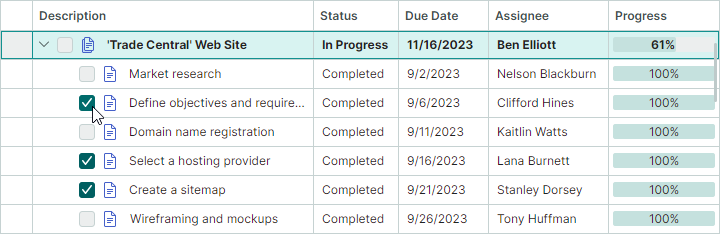

# Nodes

The `TreeListNode` class encapsulates a node in the TreeList and TreeView controls. 
A TreeView node displays a single value, while a TreeList node can display multiple values (a value per each column).


## Create and Access Nodes

In bound mode, TreeList and TreeView controls automatically create nodes for all data source items.
You can access the created nodes using the following properties:

- `TreeListControlBase.Nodes` — Root nodes.
- `TreeListNode.Nodes` — A node's child nodes.

You need to create nodes manually when the control is in [unbound mode](data-binding/unbound-mode.md).

See also: [Find Nodes](#find-nodes).

## Get and Set Node Values

The `TreeListNode.Content` property specifies the node's underlying data object. You can type-cast this property value to your business object and then read individual values.
In [unbound mode](data-binding/unbound-mode.md), you can manually assign an object to the `TreeListNode.Content` property. Do not assign objects to `TreeListNode.Content` in bound mode.

To get and set individual cell values you can use the following methods:

- `GetCellValue` and `GetCellDisplayText`
- `SetCellValue`

## Focused Node

Use the `TreeListControlBase.FocusedNode` property to access the currently focused node (the node that receives keyboard events). To get the focused node's data (business) object, use the `DataControlBase.FocusedItem` inherited property.

The `TreeListControlBase.FocusedNodeChanged` event allows you to respond to moving focus between nodes.

See also: [Multiple Node Selection (Highlight)](#multiple-node-selection-highlight).

## Node Images

The TreeList and TreeView controls support node images. These images are displayed before cell values in the [hierarchy column](columns.md#hierarchy-column).


Set the `TreeListControlBase.ShowNodeImages` property to `true` to enable node images.

The following approaches allow you to supply node images:

- Use the `TreeListControlBase.NodeImageFieldName` property to specify a business object's property (field) that returns a node image (an `IImage` object). 

- Use the `TreeListControlBase.NodeImageSelector` property to specify a selector (an `ITreeListNodeImageSelector` object) that returns node images for specific nodes.

- In unbound mode, you can set a node's image using the `TreeListNode.Image` property.

### Example 

The following code displays images for nodes that have a specific cell value.

The example creates a `NodeImageSelector` object that returns images according to a business object's _OnVacation_ property.

``` xml
xmlns:mxtl="https://schemas.eremexcontrols.net/avalonia/treelist"

<Grid.Resources>
    <local:MyNodeImageSelector x:Key="myNodeImageSelector" />
    ...
</Grid.Resources>

<mxtl:TreeListControl 
    Grid.Column="0" Grid.Row="1" Name="treeList2"
    ChildrenSelector="{StaticResource mySelector}"
    ItemsSource="{Binding Employees}"
    NodeImageSelector="{StaticResource myNodeImageSelector}"
    ShowNodeImages="True"
    >
...
</mxtl:TreeListControl>
```

``` csharp
using Avalonia.Media.Imaging;
using Avalonia.Platform;

public class MyNodeImageSelector : ITreeListNodeImageSelector
{
    IImage onVacationImage;
    IImage defaultImage;

    public MyNodeImageSelector()
    {
        onVacationImage = new Bitmap(AssetLoader.Open(
            new Uri("avares://AvaloniaApp1/Assets/plane.png")));
        defaultImage = null;
    }
    public IImage SelectImage(TreeListNode node)
    {
        Employee row = node.Content as Employee;
        return row.OnVacation? onVacationImage: defaultImage;
    }
}
```


## Expand and Collapse Nodes 

A user can expand and collapse nodes that have children as follows:

- Click node expand buttons
 
  
  
- Press the "+" and "-" keys on the keyboard


You can hide node expand buttons with the `TreeListControlBase.ShowExpandButtons` property. In this case, nodes can only be expanded and collapsed in code, and from the keyboard.


In code, you can control node expansion with the following API members:

- `TreeListControlBase.AutoExpandAllNodes` — Specifies whether to automatically expand nodes on a load.
- `TreeListControlBase.CollapseAllNodes` — Collapses all nodes.
- `TreeListControlBase.ExpandAllNodes` — Expands all nodes.
- `TreeListControlBase.ExpandNodesOnFiltering` — Specifies whether to [search](filter-and-search.md) in collapsed nodes during data searching/filtering, and automatically expand them when their child nodes match the current filter/search criteria. The TreeList and TreeView controls only search through currently loaded nodes. For [hierarchical data sources](data-binding/index.md#hierarchical-data-source), you can set the `AllowDynamicDataLoading` property to `false` to disable dynamic node loading and load all nodes at once. 

- `TreeListNode.IsExpanded` — Allows you to expand/collapse an individual node, or obtain its expanded state.

A Boolean property/field in the control's item source (`DataControlBase.ItemsSource`) can store the expanded states of nodes. Use the `TreeListControlBase.ExpandStateFieldName` property to specify this property. Once this property is set, the expanded states of nodes are synced with the values stored in this property in the item source.

The following events are raised when nodes are expanded and collapsed:

- `TreeListControlBase.NodeExpanding` — Fires when a node is about to be expanded. You can use the `Allow` event parameter to prevent a node from being expanded.
- `TreeListControlBase.NodeExpanded` — Fires after a node has been expanded.
- `TreeListControlBase.NodeCollapsing` — Fires when a node is about to be collapsed. You can use the `Allow` event parameter to prevent a node from being collapsed.
- `TreeListControlBase.NodeCollapsed` — Fires after a node has been collapsed.


## Built-in Check Boxes

The `TreeListControlBase.ShowNodeCheckBoxes` property enables built-in node check boxes for the TreeList and TreeView controls. The check boxes allow a user to check (select) individual nodes.



Check boxes have two states by default — checked and unchecked. If you set the `AllowIndeterminateCheckState` property to `true`, check boxes support three states — checked, unchecked, and indeterminate.

For the TreeList control, you can enable the `TreeListControl.ShowCheckAllNodesCheckBox` option to display the `Check All` check box in the header of the [hierarchy column](columns.md#hierarchy-column). This check box selects and deselects all nodes at once.


### Get and Set a Node's Check State

Use a node's `TreeListNode.IsChecked` property to read and specify the node's check state. The `TreeListNode.IsChecked` property is of the Nullable Boolean type, so you can assign `null` to the property to switch a node to the indeterminate state.


### Get Checked Nodes

Use the `GetAllCheckedNodes` method to retrieve nodes with the checked state.

You can also create an iterator to retrieve nodes that match custom criteria.


### Sync Check States with the Data Source

Use the `CheckBoxFieldName` property to sync node check states with a specific data source field. This property specifies the name of the Boolean or Nullable Boolean data source field that stores check states for nodes.

### Recursive Checking

The `AllowRecursiveNodeChecking` enables recursive node checking. In this mode, child nodes change their check state when a parent node's check state changes, and vice versa.

## Multiple Node Selection (Highlight)

The TreeList and TreeView controls support multiple node selection mode, which allows you and your user to select (highlight) multiple nodes at one time.


Set the `SelectionMode` property to `Multiple` to enable multiple node selection mode.

### Select Nodes Using the Mouse and Keyboard

Users can select multiple nodes with the mouse and keyboard. They need to click nodes while holding the CTRL and/or SHIFT key down.

### Work with Node Selection in Code

The following API allows you to select/deselect nodes, and identify whether a node is selected:

- `SelectAll`
- `SelectNode`
- `SelectRange`
- `UnselectNode`
- `ClearSelection`
- `IsNodeSelected`

To retrieve the node selection, use the following members:

- `GetSelectedNodes` — Returns a collection of currently selected `TreeListNode` objects.
- `SelectedItems` — Specifies the collection of data (business) objects that correspond to selected nodes.

Handle the `SelectionChanged` event to respond to changes to the node selection.

A call to any method that changes a node's selected state causes an update of the TreeList/TreeView control, and raises the `SelectionChanged` event. 

To perform batch modifications to the node selection and prevent superfluous updates, you can wrap the code that modifies nodes' selected states with the `BeginSelection` and `EndSelection` method pair. In this case, the control redraws the selection, and the `SelectionChanged` event fires after the call to the `EndSelection` method.

``` csharp
treeList1.SelectionMode = Eremex.AvaloniaUI.Controls.DataControl.RowSelectionMode.Multiple;
// Start a batch update of the node selection.
treeList1.BeginSelection();
treeList1.ClearSelection();
treeList1.SelectNode(node1);
treeList1.SelectNode(node2);
//...
// Finish the batch update.
treeList1.EndSelection();
```
### Focused Node vs Selected Nodes

The focused node is the node that receives user input. The focused node may not be in sync with the selected (highlighted) node in multiple selection mode. See the following sections for mode details.

#### Focused Node in Single Selection Mode

In single selection mode, the focused node automatically gets the selected state. You can use the `FocusedNode` property and `GetSelectedNodes` method to retrieve the focused node.

#### Focused Node in Multiple Selection Mode

The focused and selected states are different in multiple node selection mode. 
Whether a node is selected or not, can be determined by the node's highlight. Only selected nodes are highlighted.


In multiple selection mode, a click on a node focuses and selects this node at the same time. A user, however, can toggle the focused node's selected state using the following actions:

- Press CTRL+SPACE.
- Click the focused node while holding the CTRL key down.

When you select a node in code, this node does not get the focused state in multiple selection mode, and vice versa.  

## Find Nodes

The `TreeListControlBase.FindNode` method allows you to locate nodes that match custom criteria.

The following code enables multiple node selection, and locates and selects two nodes that contain specific values in the _Name_ field.

``` csharp
treeList1.SelectionMode = Eremex.AvaloniaUI.Controls.DataControl.RowSelectionMode.Multiple;
treeList1.ExpandAllNodes();
TreeListNode node1 = treeList1.FindNode(node => 
    (node.Content as Employee).Name.Contains("Sam"));
TreeListNode node2 = treeList1.FindNode(node => 
    (node.Content as Employee).Name.Contains("Dan"));
treeList1.ClearSelection();
treeList1.SelectNode(node1);
treeList1.SelectNode(node2);
```

See also: [Filter and Search](filter-and-search.md).

## Iterate Through Nodes

You can create an iterator (a `TreeListNodeIterator` object) to recursively iterate through nodes and perform an operation on them. 

Use one of the following constructors to create a `TreeListNodeIterator` object:

``` csharp
// Recursively iterates through child nodes of the specified node, and their children.
public TreeListNodeIterator(TreeListNode? node, bool onlyExpanded = false)

// Recursively iterates through the specified nodes, and their children.
public TreeListNodeIterator(TreeListNodeCollection? nodes, bool onlyExpanded = false)
```

The _onlyExpanded_ parameter specifies whether to iterate through expanded nodes, or expanded and collapsed nodes.

``` csharp
foreach (var node in new TreeListNodeIterator(treeList1.Nodes))
{
    if (node != null)
    {
        //do smth
    }
}
```


## Node Height

All nodes initially have the same height sufficient to display a single line of text. You can set a custom node height, as well as enable automatic node height calculation to display large text data in cells in its entirety.

### Custom Node Height

- `DataControlBase.RowMinHeight` property — Gets or sets the minimum node height. 

    If the automatic node height feature is disabled, all nodes have the same height specified by the `DataControlBase.RowMinHeight` property.

### Node Auto-Height

For columns containing lengthy text, you can enable text wrapping to dynamically adjust node heights and display complete cell contents.


To enable text wrapping for column cells, assign a `TextEditorProperties` object (or its descendant; for example, `ButtonEditorProperties`) to the `GridColumn.EditorProperties` property, and set the `TextEditorProperties.TextWrapping` option to `Wrap`.

!!! tip

    A `TextEditorProperties` object is used to configure an in-place `TextEditor` editor for a column. At runtime, the editor is instantiated using these settings. See [Data Editing](data-editing/index.md) for more information.

The following code enables text wrapping for a treelist column.

``` xml
<mxtl:TreeListColumn FieldName="LongDescription" Width="2*">
    <mxtl:TreeListColumn.EditorProperties>
        <mxe:TextEditorProperties TextWrapping="Wrap"/>
    </mxtl:TreeListColumn.EditorProperties>
</mxtl:TreeListColumn>
```

#### Automatic Node Height Adjustment During Horizontal Scrolling 

Horizontal [virtualization](performance-and-data-virtualization.md) supported by TreeList enhances the control's performance by reducing the load time.

With this feature enabled (default), node heights are calculated automatically according to the contents of the currently visible cells. Cells outside the viewport do not affect node height calculation. When you scroll to the cells with different content heights, the node height is adjusted dynamically. To prevent dynamic node height changes during horizontal scrolling, use the `DataGridControl.AllowHorizontalVirtualization` property to disable horizontal virtualization.

``` xml
<mxtl:TreeListControl x:Name="treeList" AllowHorizontalVirtualization="False">
```