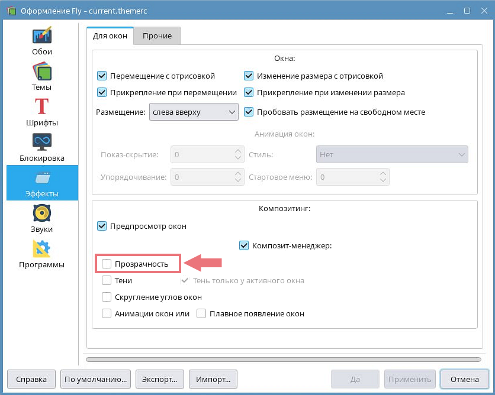

# Shadows are not Displayed Correctly for Windows and Menus in OS Astra Linux

Eremex windows and menus use transparent shadows by default. If window transparency is disabled in the operating system, the shadows of windows and menus are not correctly displayed. An example of incorrect menu rendering is demonstrated below:


To resolve the issue, you can do one of the following:

1. Enable window transparency in the OS 

    Window transparency is disabled in the Astra Linux Fly environment, by default. To enable it, check the display settings:

    


2. Disable transparency for all Eremex windows and popups in your application

    The `MxSettings` class stores global settings specific to all Eremex controls in an Avalonia application. This class contains the `MxSettings.EnableWindowTransparency` property, which  manages transparency and shadow visibility for Eremex windows and popups.

    To customize the `MxSettings.EnableWindowTransparency` setting, add a `UseEMXServices` method call to the `AppBuilder.Configure` chain as follows:

    ``` cs
    public static AppBuilder BuildAvaloniaApp()
        => AppBuilder.Configure<App>()
            .UsePlatformDetect()
            .WithInterFont()
            .LogToTrace()
            .UseEMXServices(settings => { settings.EnableWindowTransparency = false; });
    ```
