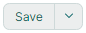
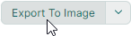

# SplitButton

`MxSplitButton` combines two buttons in one control. The primary button executes the main action, which can be implemented as a command or an event. The secondary button activates an associated dropdown control (menu), in which you can display custom content or commands.

The following image demonstrates a SplitButton that displays a PopupMenu as a dropdown control. 


The code used to create this button is shown below. See the [DemoCenter application](../../index.md#demo-application) for the complete example.

``` xml
xmlns:mx="https://schemas.eremexcontrols.net/avalonia"
xmlns:mxb="https://schemas.eremexcontrols.net/avalonia/bars"

<mx:MxSplitButton Name="splitButton1"
                  Content="Export To Image" Margin="0,8,0,0" 
                  Command="{Binding ExportImageCommand}" 
                  CommandParameter="{x:Static exports:MxImageFormat.Jpeg}" 
                  HorizontalAlignment="Left" Grid.Row="6"
                  >
    <mx:MxSplitButton.DropDownControl>
        <mxb:PopupMenu>
            <mxb:ToolbarButtonItem Header="Jpeg" Command="{Binding ExportImageCommand}" CommandParameter="{x:Static exports:MxImageFormat.Jpeg}"/>
            <mxb:ToolbarButtonItem Header="Png" Command="{Binding ExportImageCommand}" CommandParameter="{x:Static exports:MxImageFormat.Png}"/>
            <mxb:ToolbarButtonItem Header="Svg" Command="{Binding ExportImageCommand}" CommandParameter="{x:Static exports:MxImageFormat.Svg}"/>
            <mxb:ToolbarButtonItem Header="Webp" Command="{Binding ExportImageCommand}" CommandParameter="{x:Static exports:MxImageFormat.Webp}"/>
        </mxb:PopupMenu>
    </mx:MxSplitButton.DropDownControl>
</mx:MxSplitButton>
```

## Content

Use the `Content` property to assign visual content to the primary button. 

``` xml
<mx:MxSplitButton Content="Save"/>
```



The `Content` property allows you to display an image next to the text or adjust the appearance of the primary button in a custom manner. The following example displays an image and text:

``` xml
xmlns:mx="https://schemas.eremexcontrols.net/avalonia"
xmlns:mxi="https://schemas.eremexcontrols.net/avalonia/icons"

<mx:MxSplitButton Height="27" VerticalContentAlignment="Center" Command="{Binding SaveCommand}">
    <mx:MxSplitButton.Content>
        <StackPanel Orientation="Horizontal" Spacing="5" >
            <Image Source="{x:Static mxi:Basic.Save}" Height="20"/>
            <TextBlock Text="Save" />
        </StackPanel>
    </mx:MxSplitButton.Content>
</mx:MxSplitButton>
```


## Specify the Main Action

The primary button triggers the `MxSplitButton`'s main action.



You can use the following API members to implement this action:

- `MxSplitButton.Click` event — An event raised when the primary button is clicked.
- `MxSplitButton.Command` command — A command executed when the primary button is clicked. You can use the `MxSplitButton.CommandParameter` property to pass a parameter to the command.

``` xml
<mx:MxSplitButton Content="Save" Command="{Binding SaveCommand}">
```

``` cs
using CommunityToolkit.Mvvm.Input;

public partial class MainWindowViewModel : ViewModelBase
{
    [RelayCommand]
    void Save()
    {
        //...
    }
}
```


## Specify the Dropdown Control

The secondary button opens a dropdown control/menu, which is specified by the `MxSplitButton.DropDownControl` property.


You can set the `DropDownControl` property to the following objects:

- `Eremex.AvaloniaUI.Controls.Bars.PopupMenu` — A popup menu that can host various items (buttons, check buttons, sub-menus, and so on). See the following topic for more information: [Popup and Context Menus](../../controls/toolbars-and-menus/popup-and-context-menus.md).
  
- `Eremex.AvaloniaUI.Controls.Bars.PopupContainer` — A popup control that can display custom content.

The following example defines a `PopupMenu` with two commands as a SplitButton's dropdown control:

``` xml
xmlns:mx="https://schemas.eremexcontrols.net/avalonia"
xmlns:mxi="https://schemas.eremexcontrols.net/avalonia/icons"
xmlns:mxb="https://schemas.eremexcontrols.net/avalonia/bars"

<mx:MxSplitButton Height="27" VerticalContentAlignment="Center" Command="{Binding SaveCommand}">
    <mx:MxSplitButton.Content>
        ...
    </mx:MxSplitButton.Content>

    <mx:MxSplitButton.DropDownControl>
        <mxb:PopupMenu>
            <mxb:ToolbarButtonItem Header="Save" 
                    Glyph="{x:Static mxi:Basic.Save}"
                    GlyphSize="20,20"
                    Command="{Binding SaveCommand}"/>
            <mxb:ToolbarButtonItem Header="Save As" Command="{Binding SaveAsCommand}"/>
        </mxb:PopupMenu>
    </mx:MxSplitButton.DropDownControl>
</mx:MxSplitButton>
```

``` cs
using CommunityToolkit.Mvvm.Input;

public partial class MainWindowViewModel : ViewModelBase
{
    [RelayCommand]
    void Save()
    {
        //...
    }
    [RelayCommand]
    void SaveAs()
    {
        //...
    }
}
```


### Related API

- `MxSplitButton.IsPopupOpen` — Gets or sets whether the dropdown control/menu is currently open. You can use this property to open or close the dropdown control in code.

