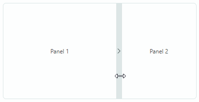
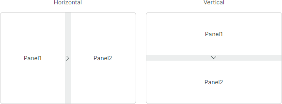
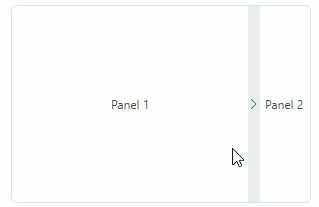

# SplitContainerControl

[`SplitContainerControl`](../../API/Eremex.AvaloniaUI.Controls.Editors/SplitContainerControl.md) is a composite control that displays two panels separated by a movable splitter. Users can drag the splitter to change size of the panels. They can also click the splitter to collapse a selected panel, and then click the splitter again to restore the panel.



The control's main features include:

- Users can drag-and-drop the splitter to resize the panels.
- Setting size of the panels in code.
- Vertical or horizontal arrangement of the panels.
- Ability to collapse/expand one of the panels.
- An option to hide the splitter.

## Specify Content for the Panels

Use the [`SplitContainerControl.Panel1`](../../API/Eremex.AvaloniaUI.Controls.Editors/SplitContainerControl/Panel1.md) and [`SplitContainerControl.Panel2`](../../API/Eremex.AvaloniaUI.Controls.Editors/SplitContainerControl/Panel2.md) properties to place contents onto the control's panels. Two usage scenarios are supported:

- Initialize these properties with controls to be displayed in the panels. 
- Initialize these properties with custom objects. In this case, use the [`SplitContainerControl.Panel1Template`](../../API/Eremex.AvaloniaUI.Controls.Editors/SplitContainerControl/Panel1Template.md) and [`SplitContainerControl.Panel2Template`](../../API/Eremex.AvaloniaUI.Controls.Editors/SplitContainerControl/Panel2Template.md) properties to specify DataTemplates that will render the custom objects.

``` xml
<mxe:SplitContainerControl Name="splitContainer"
                            Grid.Row="1"
                            BorderThickness="1" BorderBrush="Gray">
    <mxe:SplitContainerControl.Panel1>
        <Label Content="Panel1" HorizontalAlignment="Center" VerticalAlignment="Center"/>
    </mxe:SplitContainerControl.Panel1>
    <mxe:SplitContainerControl.Panel2>
        <Label Content="Panel2" HorizontalAlignment="Center" VerticalAlignment="Center"/>
    </mxe:SplitContainerControl.Panel2>
</mxe:SplitContainerControl>
```

## Set Panel Size and Direction

Use the [`SplitContainerControl.Orientation`](../../API/Eremex.AvaloniaUI.Controls.Editors/SplitContainerControl/Orientation.md) property to choose between the horizontal (default) and vertical panel arrangement.



To set size of the container's panels, use the [`SplitContainerControl.Panel1Length`](../../API/Eremex.AvaloniaUI.Controls.Editors/SplitContainerControl/Panel1Length.md) or [`SplitContainerControl.Panel2Length`](../../API/Eremex.AvaloniaUI.Controls.Editors/SplitContainerControl/Panel2Length.md) properties.

- In a horizontal orientation, these properties set the width of the panels.
- In a vertical orientation, they set the height of the panels.

The [`Panel1MinLength`](../../API/Eremex.AvaloniaUI.Controls.Editors/SplitContainerControl/Panel1MinLength.md), [`Panel1MaxLength`](../../API/Eremex.AvaloniaUI.Controls.Editors/SplitContainerControl/Panel1MaxLength.md), [`Panel2MinLength`](../../API/Eremex.AvaloniaUI.Controls.Editors/SplitContainerControl/Panel2MinLength.md), and [`Panel2MaxLength`](../../API/Eremex.AvaloniaUI.Controls.Editors/SplitContainerControl/Panel2MaxLength.md) properties allow you to set resizing constraints for the panels.  Users cannot resize the panels beyond these limits. 

## Collapse and Restore a Panel

An arrow icon displayed in the splitter indicates that a panel will be collapsed when a user clicks the splitter. In the collapsed state, the splitter's arrow icon inverts its direction. A user can click the splitter again to restore the panel.



The [`SplitContainerControl.CollapsePanel`](../../API/Eremex.AvaloniaUI.Controls.Editors/SplitContainerControl/CollapsePanel.md) property allows you to specify the collapsible panel. The property's default value is _Panel2_.

To collapse and restore a panel in code, use the [`IsCollapsed`](../../API/Eremex.AvaloniaUI.Controls.Editors/SplitContainerControl/IsCollapsed.md) property.

## Disable Panel Collapsing

Set the [`SplitContainerControl.CollapsePanel`](../../API/Eremex.AvaloniaUI.Controls.Editors/SplitContainerControl/CollapsePanel.md) property to `None` to disable the panel collapse feature. In this mode, the splitter does not display arrow icons.

## Hide the Splitter

Use the [`SplitContainerControl.IsSplitterVisible`](../../API/Eremex.AvaloniaUI.Controls.Editors/SplitContainerControl/IsSplitterVisible.md) property to `false` to hide the splitter in specific cases. This prevents a user from performing resize and collapse/restore operations on the panels.