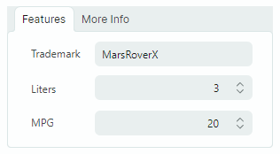
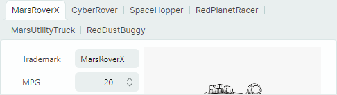

# TabControl

The `MxTabControl` control allows you to organize panels into a tabbed UI. Users can activate a specific panel with a click on a corresponding tab.


`MxTabControl` is a descendant of the standard `Avalonia.Controls.TabControl` control. It inherits the `TabControl`'s base functionality and extends it with additional features:

- An unlimited number of tabs.
- Population of tabs and tab contents from an items source.
- Tab re-ordering via drag-and-drop.
- Tab layout modes: Stretch, Scroll and Multi-line.
- 'Close Tab' buttons.
- 'New Tab' button.
- Custom controls in the tab header area.

## Create Tabs

The `MxTabControl` inherits tab creation functionality from the base `Avalonia.Controls.TabControl` class. The controls support two approaches to adding tabs:

- Add tab items manually
- Populate tabs and tab contents from an items source.

### Add Tab Items Manually

Tab items in the `MxTabControl` control are encapsulated by `MxTabItem` objects. They expose settings to specify tab header text, tab header image (glyph), 'Close' command (the command activated when the tab's 'Close' button is clicked), etc.

#### Example

The following example creates two tabs with predefined contents (editors and labels).



``` xml
xmlns:mx="https://schemas.eremexcontrols.net/avalonia"
xmlns:mxe="https://schemas.eremexcontrols.net/avalonia/editors"

<mx:MxTabControl Margin="5" Height="160" Name="tabControl1" Width="300">
    <mx:MxTabItem Header="Features">
        <Grid RowDefinitions="Auto Auto Auto" ColumnDefinitions="Auto *" Margin="5">
            <Label Classes="LayoutItem" Grid.Column="0" Grid.Row="0" Content="Trademark"/>
            <mxe:TextEditor EditorValue="{Binding SelectedCar.Trademark}" Margin="5" 
             Height="20" Grid.Row="0" Grid.Column="1"/>
            <Label Classes="LayoutItem" Grid.Column="0" Grid.Row="1" Content="Liters"/>
            <mxe:SpinEditor EditorValue="{Binding SelectedCar.Liter}" Margin="5" 
             Height="20" Grid.Row="1" Grid.Column="1"/>
            <Label Classes="LayoutItem" Grid.Column="0" Grid.Row="2" Content="MPG"/>
            <mxe:SpinEditor EditorValue="{Binding SelectedCar.MPG}" Margin="5" 
             Height="20" Grid.Row="2" Grid.Column="1"/>
        </Grid>
    </mx:MxTabItem>
    <mx:MxTabItem Header="More Info" >
        <mxe:TextEditor Margin="5" EditorValue="{Binding SelectedCar.Description}" 
         TextWrapping="Wrap" VerticalAlignment="Stretch"/>
    </mx:MxTabItem>
</mx:MxTabControl>
```

### Populate Tabs from an Items Source

One of the `MxTabControl`'s ancestors is the `Avalonia.Controls.ItemsControl` class. This allows you to populate the TabControl with items from an items source. Use the following main properties for this purpose:

- `ItemsSource` — Specifies the source that contains items to be rendered as tabs.
- `ItemTemplate` — Specifies the DataTemplate used to render tab headers.
- `ContentTemplate` — Specifies the DataTemplate used to render tab contents.

#### Example

The following example binds an `MxTabControl` control to an items source and specifies the DataTemplates that render tab headers and contents.


``` xml
xmlns:mx="https://schemas.eremexcontrols.net/avalonia"
xmlns:mxe="https://schemas.eremexcontrols.net/avalonia/editors"

<mx:MxTabControl ItemsSource="{Binding Cars}" SelectedItem="{Binding SelectedCar}">
    <mx:MxTabControl.ItemTemplate>
        <DataTemplate DataType="demoData:CarInfo">
            <TextBlock Text="{Binding Trademark}"></TextBlock>
        </DataTemplate>
    </mx:MxTabControl.ItemTemplate>

    <mx:MxTabControl.ContentTemplate>
        <DataTemplate DataType="demoData:CarInfo">
            <StackPanel Orientation="Horizontal" Margin="10">
                <Grid RowDefinitions="Auto Auto Auto" ColumnDefinitions="Auto *">
                    <Label Classes="LayoutItem" Grid.Column="0" Grid.Row="0" Content="Trademark"/>
                    <mxe:TextEditor Classes="LayoutItem"  Grid.Column="1" Grid.Row="0" 
                     EditorValue="{Binding Trademark}"/>

                    <Label Classes="LayoutItem" Grid.Column="0" Grid.Row="1" Content="MPG"/>
                    <mxe:SpinEditor Classes="LayoutItem" Grid.Column="1" Grid.Row="1" 
                     EditorValue="{Binding  MPG}" Minimum="0"/>

                    <Label Classes="LayoutItem" Grid.Column="0" Grid.Row="2" Content="Price"/>
                    <mxe:SpinEditor Classes="LayoutItem" Grid.Column="1" Grid.Row="2" 
                     EditorValue="{Binding  Price}" Suffix="{Binding Currency}" Minimum="0"/>
                </Grid>
                <Image Grid.Column="1" Width="200" Source="{Binding Image}" VerticalAlignment="Top"/>
            </StackPanel>
        </DataTemplate>
    </mx:MxTabControl.ContentTemplate>
</mx:MxTabControl>
```

## Select a Tab

Use the following properties to select tabs and get selected tabs:

- `SelectedIndex` — Specifies the zero-based index of the selected tab among all tabs. You can use the `MxTabControl.Items` property to access the tab collection.
- `SelectedItem` — Specifies the selected tab's item. If tabs are manually added to the TabControl using `MxTabItem` objects, the `SelectedItem` property specifies the selected `MxTabItem` object. If the TabControl is populated from an items source, the `SelectedItem` property specifies the selected tab's data object from the bound items source.

The `SelectedValue` property specifies the selected tab's value. This property returns the following values:

- `null`, if tabs are manually added to the TabControl using `MxTabItem` objects.
- A tab's underlying data object, if the TabControl is populated from an items source.

The following properties allow you to return the contents of the selected tab:

- `SelectedContent` — Specifies the selected tab's content.
- `SelectedContentTemplate` — Specifies the selected tab's content template.

## Tab Arrangement

Tab headers are displayed along the TabControl's top edge by default. You can use the `TabStripPlacement` property to specify the position of tab headers.

TabControl supports three tab header layout modes. Use the `MxTabControl.TabStripLayoutType` property to specify the tab header arrangement type:

- `Scroll` — Tab headers are wide enough to display tab headers' contents. Scroll buttons appear in the tab header region if there is not enough space to display all tab headers in their entirety.
  
  

- `Stretch` — All tab headers are arranged in a line, stretching to fit the control's width. They have the same width or height depending on the tab strip position (see the `TabStripPlacement` property).
  
  

- `MultiLine` — Tab headers are arranged in multiple lines if there is not enough space to display them in a single line.
  
  
    

## Tab Re-ordering

A user can re-arrange tabs using drag-and-drop if the `MxTabControl.TabDragMode` property is set to `Reorder`.

Handle the `TabItemStartDragging` and `TabItemCompleteDragging` events to cancel drag operations or perform additional actions when tabs are dragged.

## 'Close' Buttons

TabControl supports built-in 'Tab Close' ('x') buttons. They can be displayed in tabs and/or tab header region, as specified by the `MxTabControl.CloseButtonShowMode` property.

'Tab Close' buttons do not perform any action by default. You need to implement 'Close' button actions using one of the following approaches:

- Handle the `MxTabControl.CloseButtonClick` event.
- Specify commands with the `MxTabItem.CloseCommand` member.

## 'New Tab' Button

Set the `MxTabControl.NewButtonShowMode` property to `InHeaderPanel` to display the 'New Tab' ('+') button. A click on this button has no action by default. You can specify an action with the following members:

- `MxTabControl.NewButtonClick` event.
- `MxTabControl.NewCommand` command.

## Custom Controls in the Tab Header Area

You can use the `ControlBoxContent` and `ControlBoxContentTemplate` properties to add custom controls to the tab header area. 

### Example

The following example adds the '?' button to the tab header area. A click on the button raises the _HelpCommand_ command. The currently selected tab's item is passed as the command's parameter.


``` xml
xmlns:mx="https://schemas.eremexcontrols.net/avalonia"
x:Class="SampleTabControl.TabControlPageView"
xmlns:vm="using:SampleTabControl"
x:DataType="vm:TabControlPageViewModel"

<mx:MxTabControl ItemsSource="{Binding Cars}"
                SelectedItem="{Binding SelectedCar}"
                x:Name="TabControl"
    >
    <mx:MxTabControl.ControlBoxContent>
        <Button Command="{Binding HelpCommand}" 
         CommandParameter="{Binding $parent.SelectedItem}">
            <Image Width="20" Height="20"  
             Source="{SvgImage 'avares://SampleTabControl/Images/help-icon.svg'}"/>
        </Button>
    </mx:MxTabControl.ControlBoxContent>
    ...
</mx:MxTabControl>
```
``` csharp
public partial class TabControlPageViewModel : PageViewModelBase
{
    //...
    [RelayCommand]
    private void Help(object parameter)
    {
        //...
    }
}
```