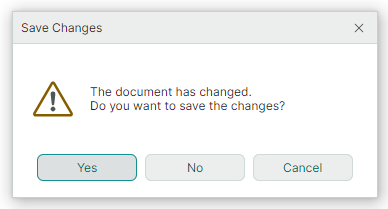

# MxMessageBox

The `MxMessageBox` dialog allows you to display messages and ask users simple questions.


`MxMessageBox` is painted using Eremex paint themes. It supports both light and dark theme variants.

Use the static `MxMessageBox.Show` and `MxMessageBox.ShowAsync` method overloads to display a dialog.


## Show Method Overloads

The `MxMessageBox.Show` method overloads return the result of the dialog (the button clicked by a user). Two `MxMessageBox.Show` method overloads are available:

``` cs
public static MessageBoxResult MxMessageBox.Show(Window? owner, string text, string? title = null, MessageBoxButtons buttons = MessageBoxButtons.Ok, MessageBoxIcon icon = MessageBoxIcon.None, MessageBoxResult defaultButton = MessageBoxResult.None, Action<MxMessageBox>? configure = null)
```

- owner — The window that will own the message box. If this parameter is `null`, the `MxMessageBox`  automatically identifies the owner: the owner is the last active window, or the application's main window.
- text — The text to display in the dialog.
- title — The dialog's title.
- buttons — An [`Eremex.AvaloniaUI.Controls.MessageBoxButtons`](../../API/Eremex.AvaloniaUI.Controls/MessageBoxButtons.md) enumeration value that specifies buttons to display in the dialog. Available values include: `Ok`, `OkCancel`, `YesNoCancel`, `YesNo`, `AbortRetryIgnore`, `RetryCancel`
- icon — One of the predefined icons to display before the text. Set the property to [`MessageBoxIcon.None`](../../API/Eremex.AvaloniaUI.Controls/MessageBoxIcon.md) to hide the icon.
- defaultButton — Identifies the default button. The default button is the one that is initially focused when the dialog is displayed. When a user presses ENTER, the default button is clicked.
- configure — A delegate to perform additional dialog customization (for instance, the dialog's icon in the title bar, or the alignment of buttons).


    ### Example 

    The following example displays a message box with three buttons - Yes, No and Cancel.

    

    ``` cs
    MessageBoxResult result = MxMessageBox.Show(null, "The document has changed."+ Environment.NewLine+ "Do you want to save the changes?", "Save Changes", MessageBoxButtons.YesNoCancel, MessageBoxIcon.Warning, MessageBoxResult.Yes);
    if (result == MessageBoxResult.Yes)
    {
        //...
    }
    ```

Another `MxMessageBox.Show` method overload contains only one parameter.

``` cs
public static MessageBoxResult MxMessageBox.Show(Action<MxMessageBox> configure)
```

- configure — A delegate to customize the dialog.


    ### Example

    

    ``` cs
    var res = MxMessageBox.Show(configure: msgBox =>
    {
        msgBox.Text = "Error opening the database";
        msgBox.Title = "Error";
        msgBox.Buttons = MessageBoxButtons.Ok;
        msgBox.ButtonAlignment = Avalonia.Layout.HorizontalAlignment.Center;
        msgBox.Window.Icon = new WindowIcon(AssetLoader.Open(new Uri("avares://DemoCenter/Assets/EMXControls.ico")));
    });
    ```


## ShowAsync Method Overloads

You can use the `MxMessageBox.ShowAsync` method overloads to invoke a message box asynchronously, without blocking the UI thread. The `ShowAsync` methods return a `Task<MessageBoxResult>` object representing an asynchronous operation. This operation is complete when a user closes the message box. The parameters of the `ShowAsync` method overloads match those of the `Show` methods.

``` cs
public static Task<MessageBoxResult> ShowAsync(Window? owner, string text, string? title = null, MessageBoxButtons buttons = MessageBoxButtons.Ok, MessageBoxIcon icon = MessageBoxIcon.None, MessageBoxResult defaultButton = MessageBoxResult.None, Action<MxMessageBox>? configure = null)
```

``` cs
public static Task<MessageBoxResult> ShowAsync(Action<MxMessageBox> configure)
```

### Example

The following example shows a message box asynchronously, and waits for a user to press a button. 

``` cs
async Task<MessageBoxResult> ShowMessageBoxAsync()
{
    Task<MessageBoxResult> resultTask = MxMessageBox.ShowAsync(
        owner: null,
        text: "Are you sure you want to cancel this task?",
        title: "Confirmation",
        buttons: MessageBoxButtons.YesNo,
        icon: MessageBoxIcon.Question
    );

    MessageBoxResult result = await resultTask;

    if (result == MessageBoxResult.Yes)
    {
        await CancelTaskAsync();
    }

    return result;
}

async Task CancelTaskAsync()
{
    await Task.Delay(3000);
}
```