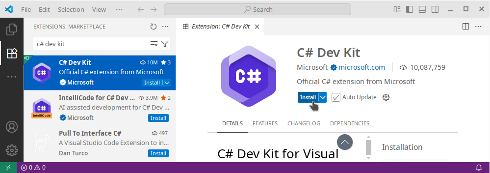
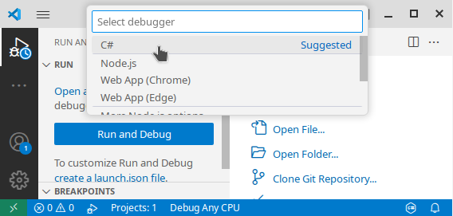
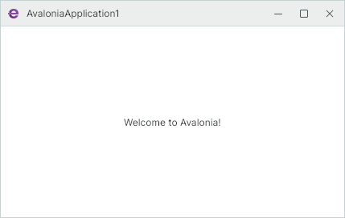

# Get Started with Eremex Avalonia UI Controls on ALT Linux

This tutorial walks you through creating an Avalonia UI application with Eremex Controls on ALT Linux. First, we'll set up the environment to develop .NET applications, and then create a project with the EMX DataGrid control.


## 1. Prerequisites

Ensure the .NET SDK and Visual Studio Code are installed on ALT Linux. The following sections show how to install them from the command line.

### 1.1 Install .NET SDK

To develop .NET applications on ALT Linux, install the .NET SDK package. For example, to install .NET 8 SDK, run the following command in the terminal:

``` sh
sudo apt-get install dotnet-sdk-8.0
```

### 1.2 Install Visual Studio Code and C# Dev Kit Extension

For instructions on installing VS Code on ALT Linux, refer to: [Education applications: VS Code](https://www.altlinux.org/Education_applications/Vscode).

Alternatively, you can download the VS Code RPM package from the [Download Visual Studio Code](https://code.visualstudio.com/Download) page, and then install it with the following command:

``` sh
sudo apt-get install code_xxx.rpm
```

(Replace `code_xxx.rpm` with the actual name of the downloaded package.)

Run VS Code, and install the `C# Dev Kit` add-on from the Extensions tab.




## 2. Install Eremex Project Templates

The EMX Controls library includes a collection of [project templates](../whats-included/project-templates.md) that help you create new Avalonia projects with the EMX Controls. Install these templates by running the following command in the terminal:

``` sh
dotnet new install Eremex.Avalonia.Templates
```

## 3. Create a New Project

Navigate to the directory where you want to generate a project. Execute the command below to create an MVVM-aware project named _AvaloniaApplication1_ according to the `eremex.avalonia.mvvm` project template. 

``` sh
dotnet new eremex.avalonia.mvvm -n AvaloniaApplication1
```

If you encounter certificate warnings for `nuget.org`, you should manually add required root certificates to your OS. To temporarily bypass certificate verification, run the following command:

``` sh
DOTNET_NUGET_SIGNATURE_VERIFICATION=false dotnet new eremex.avalonia.mvvm -n AvaloniaApplication1
```

The generated project includes:

- All necessary Eremex Controls package references
- The _'DeltaDesign'_ [paint theme](../controls/themes/index.md) registered in `App.axaml`.
- [MxWindow](../controls/windows-and-dialogs/mxwindow.md) used as the main application window. `MxWindow` is a dedicated window that paints its elements (background, border and title bar) according to the current Eremex paint theme. 

## 4. Open the Project in VS Code

In VS Code, open the generated _AvaloniaApplication1_ folder.

Switch to the `Run and Debug` tab (Ctrl+Shift+D), and click the `Run and Debug` button:


Select `c#` as the debug environment:



Select `C#: Launch Startup Project`:


Select `AvaloniaApplication1.csproj` as the startup project:


VS Code will then build and run the project.



You can also run the project from the terminal using the following command:

``` sh
dotnet run
```


## 5. Choose the Light or Dark Paint Theme Variant 

The Eremex Application Templates automatically add the registration code for the `DeltaDesign` paint theme to the created project. Open the _App.axaml_ file to locate this code in the `Application` object definition.

The `DeltaDesign` paint theme supports the `Light` and `Dark` theme variants. Use the `Application.RequestedThemeVariant` property to specify the required theme variant.

``` xml
<Application xmlns="https://github.com/avaloniaui"
    xmlns:x="http://schemas.microsoft.com/winfx/2006/xaml"
    x:Class="AvaloniaApplication1.App"
    xmlns:local="using:AvaloniaApplication1"
    xmlns:theme=
    "clr-namespace:Eremex.AvaloniaUI.Themes.DeltaDesign;assembly=Eremex.Avalonia.Themes.DeltaDesign"
    RequestedThemeVariant="Light">
  <!-- "Default" - The application's theme variant is defined by the system setting. 
       "Light" - Enables the Light theme variant.
       "Dark" - Enables the Dark theme variant. 
  -->
    <!-- .... -->
    <Application.Styles>
        <theme:DeltaDesignTheme/>
        <!-- .... -->
    </Application.Styles>
</Application>
```

<br>

In the sections below, we'll add an Eremex [`DataGridControl`](../API/Eremex.AvaloniaUI.Controls.DataGrid/DataGridControl.md) control to a View and bind it to the _Employees_ collection defined in a View Model.

## 6. Define Data for a Data Grid

Open the Main View Model (_MainWindowViewModel.cs_) and define the _Employees_ collection to which a Data Grid will be bound.

``` csharp
using CommunityToolkit.Mvvm.ComponentModel;
using System;
using System.Collections.Generic;

namespace AvaloniaApplication1.ViewModels;

public partial class MainWindowViewModel : ViewModelBase
{
    [ObservableProperty]
    IList<EmployeeInfo> employees;

    public MainWindowViewModel()
    {
        Employees = new List<EmployeeInfo>
        {
            new EmployeeInfo("Alex", "Smith", new DateTime(1990, 1, 1)),
            new EmployeeInfo("Samantha", "Brown", new DateTime(1988, 2, 5)),
            new EmployeeInfo("Nick", "Morris", new DateTime(2000, 8, 25)),
            new EmployeeInfo("Julia", "Lee", new DateTime(2005, 12, 3))
        };
    }
}

public partial class EmployeeInfo : ObservableObject
{
    [ObservableProperty]
    public string firstName;
    [ObservableProperty]
    public string lastName;
    [ObservableProperty]
    public DateTime birthDate;
    public EmployeeInfo(string firstName, string lastName, DateTime birthDate)
    {
        FirstName = firstName;
        LastName = lastName;
        BirthDate = birthDate;
    }
}
```

## 7. Add Eremex Avalonia Control Namespaces in XAML

Before you define Eremex Avalonia controls in XAML, first declare namespaces that contain these controls. To use [`DataGridControl`](../API/Eremex.AvaloniaUI.Controls.DataGrid/DataGridControl.md) in the Main Window, add the following namespace to the _MainWindow.axaml_ file:

``` xml
<mx:MxWindow 
...
xmlns:mxdg="https://schemas.eremexcontrols.net/avalonia/datagrid"
>
```

See the table below for a list of namespaces for the Eremex controls and helper classes:

Product/Classes | Namespace
------|------
Data Grid | `xmlns:mxdg="https://schemas.eremexcontrols.net/avalonia/datagrid"`
Tree List and Tree View | `xmlns:mxtl="https://schemas.eremexcontrols.net/avalonia/treelist"`
Editors and Utility Controls | `xmlns:mxe="https://schemas.eremexcontrols.net/avalonia/editors"`
Charts | `xmlns:mxc="https://schemas.eremexcontrols.net/avalonia/charts"`
Property Grid | `xmlns:mxpg="https://schemas.eremexcontrols.net/avalonia/propertygrid"`
Ribbon | `xmlns:mxr="https://schemas.eremexcontrols.net/avalonia/ribbon"`
Toolbars and Menus | `xmlns:mxb="https://schemas.eremexcontrols.net/avalonia/bars"`
Docking | `xmlns:mxd="https://schemas.eremexcontrols.net/avalonia/docking"`
Graphics3DControl | `xmlns:mx3d="https://schemas.eremexcontrols.net/avalonia/controls3d"`
Common Helper Classes | `xmlns:mx="https://schemas.eremexcontrols.net/avalonia"`


## 8. Add a Data Grid in XAML

In the _MainWindow.axaml_ file, define a [`DataGridControl`](../API/Eremex.AvaloniaUI.Controls.DataGrid/DataGridControl.md) and bind it to the _Employees_ collection.

``` xml
<mx:MxWindow xmlns="https://github.com/avaloniaui"
        xmlns:x="http://schemas.microsoft.com/winfx/2006/xaml"
        xmlns:vm="using:AvaloniaApplication1.ViewModels"
        xmlns:d="http://schemas.microsoft.com/expression/blend/2008"
        xmlns:mc="http://schemas.openxmlformats.org/markup-compatibility/2006"
        xmlns:mx="https://schemas.eremexcontrols.net/avalonia"
        xmlns:mxdg="https://schemas.eremexcontrols.net/avalonia/datagrid"
        mc:Ignorable="d" d:DesignWidth="800" d:DesignHeight="450"
        x:Class="AvaloniaApplication1.Views.MainWindow"
        x:DataType="vm:MainWindowViewModel"
        Icon="/Assets/EMXControls.ico"
        Title="AvaloniaApplication1">

    <Design.DataContext>
        <!-- This only sets the DataContext for the previewer in an IDE,
             to set the actual DataContext for runtime, 
             set the DataContext property in code (look at App.axaml.cs) -->
        <vm:MainWindowViewModel/>
    </Design.DataContext>

    <mxdg:DataGridControl AutoGenerateColumns="True" ItemsSource="{Binding Employees}"
     SearchPanelDisplayMode="Always"/>

</mx:MxWindow>
```

The [`DataGridControl.AutoGenerateColumns`](../API/Eremex.AvaloniaUI.Controls.DataGrid/DataGridControl/AutoGenerateColumns.md) option is enabled to automatically generate columns from public properties of the bound item source. 

The [`DataGridControl.SearchPanelDisplayMode`](../API/Eremex.AvaloniaUI.Controls.DataControl/DataControlBase/SearchPanelDisplayMode.md) property specifies the visibility of the search box, which allows a user to quickly locate grid rows by values they contain.

## 9. Run the Application

Now you can run the application (press F5). A window with a fully functional Data Grid control appears when the application is launched. The grid allows you to sort and group data out of the box. To locate cell values, type text in the search panel.

