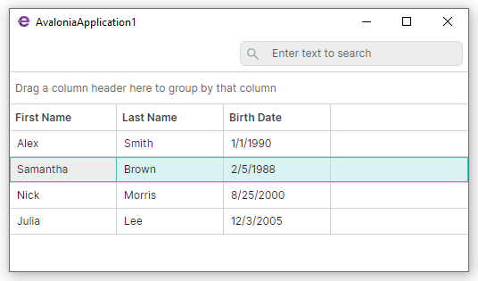

# Get Started with Eremex Avalonia UI Controls

This tutorial demonstrates how to create a new Avalonia UI application in Visual Studio 2022 with Eremex Avalonia controls. It shows the Eremex paint theme registration code required to render the controls.

In this tutorial, an Eremex [Data Grid control](../controls/datagrid/index.md) is added to the window and bound to an item source. The item source in this example is a collection of business objects implemented using the CommunityToolkit.Mvvm library.




## 1. Create a New Avalonia UI Project

This tutorial uses the **Eremex Avalonia App Template** to create a new project. 
This template creates a new project, adds the Eremex Controls library to the project, and registers an Eremex paint theme required to render the controls. 

You can also use the standard Avalonia UI templates to create projects. See the following topic for more information: [Use Standard Avalonia UI Templates to Create a New Project with Eremex Controls](create-new-avalonia-project-using-avalonia-templates.md)


### 1.1 Install the Eremex Avalonia Templates

Run the following command:

<code>
dotnet new install Eremex.Avalonia.Templates
</code>


The installed templates include:

#### eremex.avalonia.app

This application template creates an empty Avalonia UI project that references the Eremex Controls library. This template does the following:

- Adds the Eremex Nuget packages to the project: 
    
    - **Eremex.Avalonia.Controls** - Contains the Eremex controls and libraries.
    - **Eremex.Avalonia.Themes.DeltaDesign** - Contains the `DeltaDesign` paint theme for the Eremex controls.
- Uses the `MxWindow` class as the project's main window. `MxWindow` provides support for the Eremex paint themes.
- Registers the Eremex `DeltaDesign` paint theme. 

    !!! note
        If no Eremex paint theme is registered in your application, the Eremex controls are displayed blank.


#### eremex.avalonia.mvvm

This application template creates an MVVM-aware Avalonia UI project that references the Eremex Controls library. The template separates the code into a View (_MainWindow_) and ViewModel (_MainWindowViewModel_).
The rest of the features of this template are the same as the `eremex.avalonia.app` template.

#### eremex.avalonia.window

A template that creates a new `MxWindow`-based Avalonia window. This template only creates two files that define the window: _Window.axaml_ and _Window.axaml.cs_.

### 1.2 Create a New Project

Switch to the folder in which you need to create a project. Use the <code>dotnet new eremex.avalonia.mvvm</code> command to create an MVVM-aware new project. To specify a name for the project, use the <code>-n _name_</code> command option.

The following command creates a new _AvaloniaApplication1_ project.

<code>
dotnet new eremex.avalonia.mvvm -n AvaloniaApplication1 
</code>


Open the created project in Visual Studio.


### 1.3. Choose the Light or Dark Paint Theme Variant 

The Eremex Application Templates automatically add the registration code for the `DeltaDesign` paint theme to the created project. Open the _App.axaml_ file to find this code in the `Application` object definition.

The `DeltaDesign` paint theme supports the `Light` and `Dark` theme variants. Use the `Application.RequestedThemeVariant` property to specify the required theme variant.

``` xml
<Application xmlns="https://github.com/avaloniaui"
    xmlns:x="http://schemas.microsoft.com/winfx/2006/xaml"
    x:Class="AvaloniaApplication1.App"
    xmlns:local="using:AvaloniaApplication1"
    xmlns:theme=
    "clr-namespace:Eremex.AvaloniaUI.Themes.DeltaDesign;assembly=Eremex.Avalonia.Themes.DeltaDesign"
    RequestedThemeVariant="Light">
  <!-- "Default" - The application's theme variant is defined by the system setting. 
       "Light" - Enables the Light theme variant.
       "Dark" - Enables the Dark theme variant. 
  -->
    <!-- .... -->
    <Application.Styles>
        <theme:DeltaDesignTheme/>
        <!-- .... -->
    </Application.Styles>
</Application>
```

<br>

In the sections below, we'll add an Eremex `DataGridControl` control to a View and bind it to the _Employees_ collection defined in a View Model.

## 2. Define Data for a Data Grid

Open the Main View Model (_MainWindowViewModel.cs_) and define the _Employees_ collection to which a Data Grid will be bound.

``` csharp
using CommunityToolkit.Mvvm.ComponentModel;
using System;
using System.Collections.Generic;

namespace AvaloniaApplication1.ViewModels;

public partial class MainWindowViewModel : ViewModelBase
{
    [ObservableProperty]
    IList<EmployeeInfo> employees;

    public MainWindowViewModel()
    {
        Employees = new List<EmployeeInfo>
        {
            new EmployeeInfo("Alex", "Smith", new DateTime(1990, 1, 1)),
            new EmployeeInfo("Samantha", "Brown", new DateTime(1988, 2, 5)),
            new EmployeeInfo("Nick", "Morris", new DateTime(2000, 8, 25)),
            new EmployeeInfo("Julia", "Lee", new DateTime(2005, 12, 3))
        };
    }
}

public partial class EmployeeInfo : ObservableObject
{
    [ObservableProperty]
    public string firstName;
    [ObservableProperty]
    public string lastName;
    [ObservableProperty]
    public DateTime birthDate;
    public EmployeeInfo(string firstName, string lastName, DateTime birthDate)
    {
        FirstName = firstName;
        LastName = lastName;
        BirthDate = birthDate;
    }
}
```

## 3. Add Eremex Avalonia Control Namespaces in XAML

Before you define Eremex Avalonia controls in XAML, first declare namespaces that contain these controls. To use `DataGridControl` in the Main Window, add the following namespace to the _MainWindow.axaml_ file:

``` xml
<mx:MxWindow 
...
xmlns:mxdg="https://schemas.eremexcontrols.net/avalonia/datagrid"
>
```

See the table below for a list of namespaces for the Eremex controls and helper classes:

Product/Classes | Namespace
------|------
Data Grid | `xmlns:mxdg="https://schemas.eremexcontrols.net/avalonia/datagrid"`
Tree List and Tree View | `xmlns:mxtl="https://schemas.eremexcontrols.net/avalonia/treelist"`
Editors and Utility Controls | `xmlns:mxe="https://schemas.eremexcontrols.net/avalonia/editors"`
Charts | `xmlns:mxc="https://schemas.eremexcontrols.net/avalonia/charts"`
Property Grid | `xmlns:mxpg="https://schemas.eremexcontrols.net/avalonia/propertygrid"`
Ribbon | `xmlns:mxr="https://schemas.eremexcontrols.net/avalonia/ribbon"`
Toolbars and Menus | `xmlns:mxb="https://schemas.eremexcontrols.net/avalonia/bars"`
Docking | `xmlns:mxd="https://schemas.eremexcontrols.net/avalonia/docking"`
Graphics3DControl | `xmlns:mx3d="https://schemas.eremexcontrols.net/avalonia/controls3d"`
Common Helper Classes | `xmlns:mx="https://schemas.eremexcontrols.net/avalonia"`


## 4. Add a Data Grid in XAML

In the _MainWindow.axaml_ file, define a `DataGridControl` and bind it to the _Employees_ collection.

``` xml
<mx:MxWindow xmlns="https://github.com/avaloniaui"
        xmlns:x="http://schemas.microsoft.com/winfx/2006/xaml"
        xmlns:vm="using:AvaloniaApplication1.ViewModels"
        xmlns:d="http://schemas.microsoft.com/expression/blend/2008"
        xmlns:mc="http://schemas.openxmlformats.org/markup-compatibility/2006"
        xmlns:mx="https://schemas.eremexcontrols.net/avalonia"
        xmlns:mxdg="https://schemas.eremexcontrols.net/avalonia/datagrid"
        mc:Ignorable="d" d:DesignWidth="800" d:DesignHeight="450"
        x:Class="AvaloniaApplication1.Views.MainWindow"
        x:DataType="vm:MainWindowViewModel"
        Icon="/Assets/EMXControls.ico"
        Title="AvaloniaApplication1">

    <Design.DataContext>
        <!-- This only sets the DataContext for the previewer in an IDE,
             to set the actual DataContext for runtime, 
             set the DataContext property in code (look at App.axaml.cs) -->
        <vm:MainWindowViewModel/>
    </Design.DataContext>

    <mxdg:DataGridControl AutoGenerateColumns="True" ItemsSource="{Binding Employees}"
     SearchPanelDisplayMode="Always"/>

</mx:MxWindow>
```

The `DataGridControl.AutoGenerateColumns` option is enabled to automatically generate columns from public properties of the bound item source. 

The `DataGridControl.SearchPanelDisplayMode` property specifies the visibility of the search box, which allows a user to quickly locate grid rows by values they contain.

## 5. Run the Application

Now you can run the application. A window with a fully functional Data Grid control appears when the application is launched. The grid allows you to sort and group data out of the box. To locate cell values, type text in the search panel.


