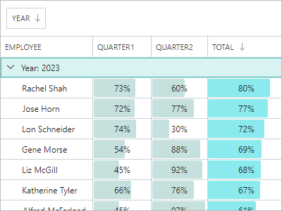
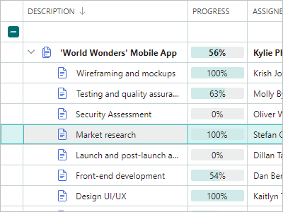
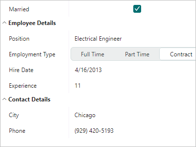
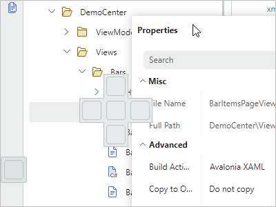
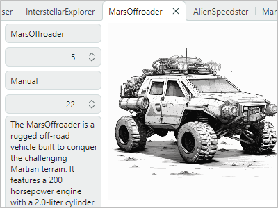
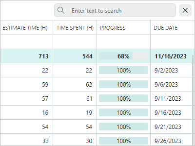

# Eremex Avalonia UI Controls Library

The Eremex Avalonia UI Controls Library includes powerful UI controls and utility libraries for the Avalonia framework to help you build highly customizable cross-platform applications with enhanced UX.

## Getting Started 

- [Get Started with Eremex Avalonia UI Controls](get-started/get-started-with-emx-controls.md)
- [Use Standard Avalonia UI Templates to Create a New Project with Eremex Controls](get-started/create-new-avalonia-project-using-avalonia-templates.md)

## Demo Application

Our Demo application allows you to explore and test a wide range of features of the Eremex Controls library.

### Download and Run Demo Offline

- [Eremex Avalonia Controls Demo](https://github.com/Eremex/controls-demo)

### Run Demo Online

You can run the WASM (WebAssembly) version of the Demo application and practice using the Eremex Controls directly in your browser. Access the Online Demo at:

- [Eremex Avalonia Controls Online Demo](https://eremex.github.io/controls-demo/)

Certain example modules are disabled in the Online Demo, including:

- Examples that demonstrate features not supported in WASM (for instance, the 3D engine).
- Examples not optimized for display and interaction in a web browser.

Known limitations: Hyperlinks are not supported.

## What's Included

- [Assemblies](whats-included/assemblies.md)
- [Project Templates](whats-included/project-templates.md)
- [System Requirements](whats-included/system-requirements.md)

 

## Controls and Libraries

     

### Data Management Controls

| 

 | col 2 |
| --- | --- |
| **Data Grid** |  |
|  | Displays data from an item source as a two-dimensional table, and provides rich data shaping and editing functionality.  - Large data sources support - Unbound data - Data sorting and grouping - In-place editors - Search and data filtration - Multiple row selection - Row drag-and-drop - Data validation - Built-in and custom context menus - Column bands [Learn more...](controls/datagrid/index.md) |  
| **Tree List and Tree View** |
|  | Renders hierarchical data in the form of a tree. Tree List supports multiple data columns, while Tree View is a single-column control.  - Binding to self-referential (flat) and hierarchical data sources - Unbound mode (allows you to manually supply data) - Multiple row selection - Row selection via built-in checkboxes - Data sorting - In-place editors - Data search and filtering - Row drag-and-drop - Data validation - Built-in and custom context menus - Column bands [Learn more...](controls/treelist/index.md) | 
| **Property Grid** |
|  | An efficient solution for browsing and editing properties of one or more objects.   - Automatic generation of rows from public properties of a bound object(s) - Manual row creation mode - Combining rows into category rows - Combining rows into embedded tabs - Search panel (for quick row location) - In-place editors [Learn more...](controls/propertygrid/index.md) | 
| **List View** |
|  | An advanced list that renders items according to your template. Supports item sorting, grouping, filtering and multi-selection.  - Two item arrangement modes: `Stack` (a single column of items) and `Wrap` (multi-column arrangement with the item wrapping feature)  - Rendering ListView items in a custom manner according to your template - Item sorting and grouping against an unlimited number of item properties - Item filtration with an event - Single and multiple selection modes [Learn more...](controls/listview/index.md) | 

     

### Navigation and Layout Controls

| 

 | col 2 |
| --- | --- |
| **Ribbon** |
|  | The menu inspired by the ribbon UI found in Microsoft Office products.  - Classic and Simplified views - Support for all types of items (commands) available in the [traditional menus](controls/toolbars-and-menus/index.md): regular buttons, check buttons, editors, labels, sub-menus and button groups. - In-place and dropdown galleries - Quick Access Toolbar - A user can add frequently used commands to this toolbar at runtime from a context menu. - Customizing the Quick Access Toolbar position (above or below the Ribbon command panel) and visibility - Displaying items in the tab header area - Tab header colorization (allows you to highlight contextual tabs)- Ribbon item navigation with the keyboard - Adaptive layout of groups and items (adjusts the layout of commands when the Ribbon control's width changes) [Learn more...](controls/ribbon/index.md) |
| **Toolbars and Menus** |  |
|  | Traditional toolbars and menus for your applications.  - Supported toolbar item types: buttons, check buttons, sub-menus, item groups, and more - Docking toolbars at the edges of a container - Placing toolbars at any position within the window (for example, at the top of client controls) - Horizontal and vertical toolbar orientations - Adaptive layout of commands - Toolbar layout customization at runtime using drag-and-drop operations - Runtime customization mode for advanced toolbar personalization - Quick customization (without the need to activate customization mode) - Show values in toolbars, and allow users to edit them using in-place editors - Hotkey support, including complex shortcuts, such as Ctrl+R, Ctrl+K - Context menus for external controls [Learn more...](controls/toolbars-and-menus/index.md) | 
| **Docking UI** |
|  | Classic docking interface inspired by the Microsoft Visual Studio IDE.  - Dock panels help you create tool panes - Documents (embedded dock windows) allow you to display the main content of your UI - Floating panels - Panel auto-hide functionality - Tab containers - Panel resizing and drag-and-drop - Dock hints - Built-in context menus to perform operations on panels and Documents - MVVM support - Docking on multiple monitors - Save and restore layouts of dock panels between application runs [Learn more...](controls/docking/index.md) |

    

### Data Visualization Controls

| 

 | col 2 |
| --- | --- |
| **Chart Controls** |  |
|  | The `CartesianChart`, `PolarChart` and `SmithChart` controls allow you to integrate the most popular interactive graphs into your application's UI.  - An unlimited number of data series - Supported Views: Line, Bar, Range Bar, Step Line, Candlestick, and more - Multiple axis types: Numeric, Date-Time, Time Span, Qualitative, and Logarithmic - Scrolling and zooming the entire view and individual axes - High-performance when displaying large data. - Real-time data visualization. [Learn more...](controls/charts/index.md) | 
| **Heatmap Control** |  |
|  | A two-dimensional heat map - a chart that visualizes data using colored points.  - 2D representation of numerical values as color - Customization of the X and Y axes - Crosshair - Strips and constant lines - Scroll and zoom with the mouse - Export rendering to a bitmap [Learn more...](controls/charts/heatmap.md) | 

     

### 3D Graphics

| 

 | col 2 |
| --- | --- |
| **Graphics3D Control** |  |
|  | Allows you to visualize 3D models in your Avalonia applications.  - API to specify 3D models - Simple materials - Textured materials in PBR format - Displaying multiple 3D models simultaneously - Perspective and isometric camera modes - Model rotation, panning and zooming with the mouse and keyboard at runtime - Rendering on a video card with the Vulkan SDK - MVVM pattern support for specifying 3D models [Learn more...](controls/graphics3dcontrol/index.md) | 

  

### Editors and Utility Controls
| 

 | col 2 |
| --- | --- |
| **Data Editors** |  |
|  | Simple and advanced editors that allow users to edit almost everything - from text and numbers to date/time values and colors. You can use them as standalone controls, or as in-place editors   - ButtonEditor - CheckEditor - ComboBoxEditor - DateEditor - HyperlinkEditor - MemoEditor - PopupColorEditor - SegmentedEditor - SpinEditor - TextEditor [Learn more...](controls/editors/index.md) |
| **Utility Controls** |  |
|  | A collection of useful controls shipped with the Eremex Controls library allow you to create feature-rich applications.  - TabControl -  SplitContainerControl -  GroupBox -  CalendarControl -  MxMessageBox -  CircleProgressIndicator [Learn more...](controls/utility-controls/index.md) |

     

### Eremex Paint Themes

The Eremex Controls Library ships with the 'DeltaDesign' paint theme that helps you deliver interfaces with the light and dark color palettes.

| 

 | 

 |
| --- | --- |
| **DeltaDesign Light Theme** | **DeltaDesign Dark Theme** |
|  |  |
|  |  |

See the following topic for more information: 

- [Themes](controls/themes/index.md)
