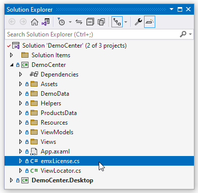
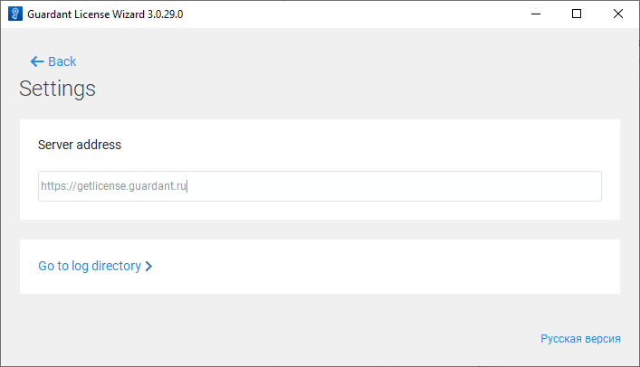
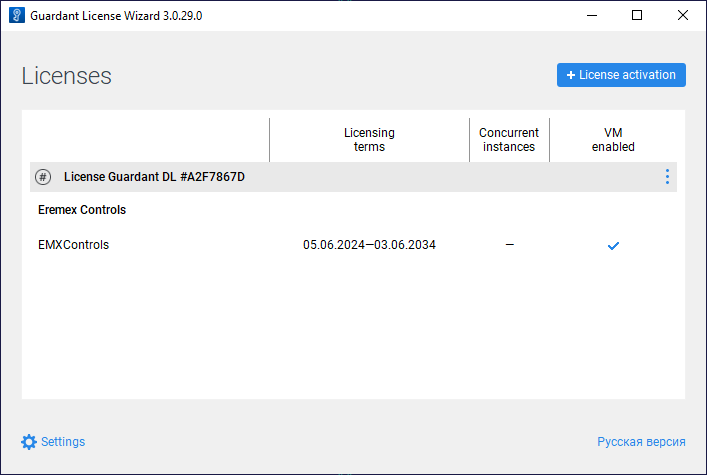
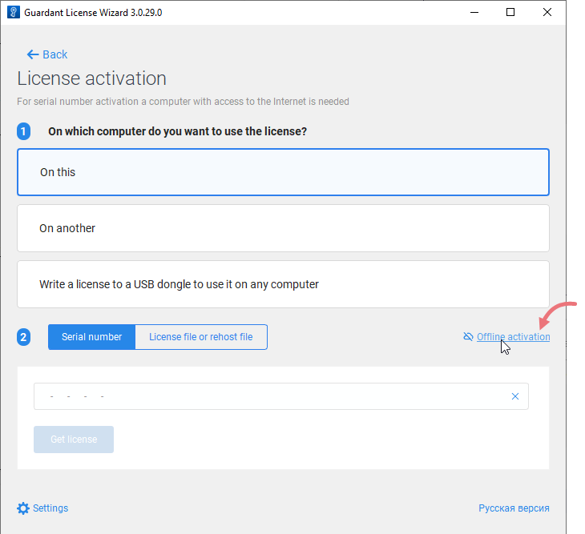
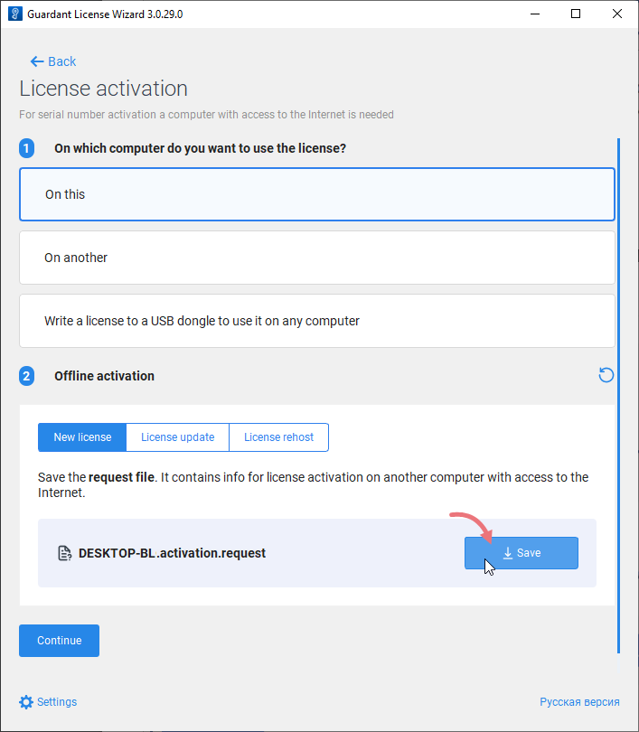
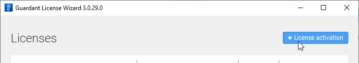
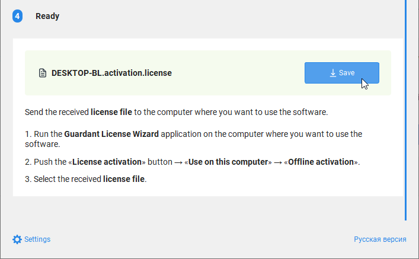
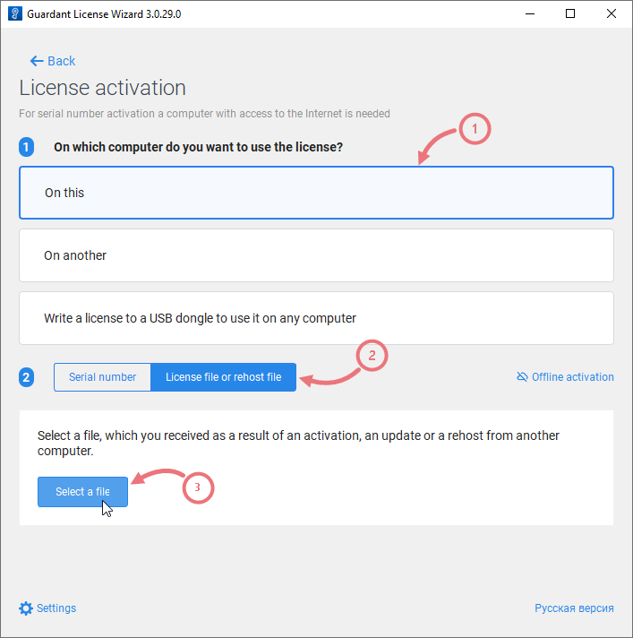

# Licensing and Product Evaluation

The current document contains information about the product evaluation, license activation, and answers frequently asked questions regarding licensing.

If you are developing an open-source project and wish to use the Eremex Controls library within it, you can apply for a free non-commercial license. See [Free Non-commercial Licenses for Open-Source Projects](#free-non-commercial-licenses-for-open-source-projects).

## Product Evaluation

The free 60-day trial version of the Eremex Controls Library allows you to evaluate the product in your projects and environment. While using the trial version, the Eremex Controls display trial messages.


<!-- The free 60-day trial version of the Eremex Controls Library allows you to evaluate the product in your projects and environment. There are no restrictions in the functionality of the controls. The trial version displays "trial" messages and has some minor restrictions -->


## Licensing

The licensing model of the Eremex Controls Library is outlined in the [End User License Agreement (EULA)](eula.md).

During the license period you can create new projects using the Eremex Controls Library, and upgrade your existing projects with a new version of the Library. In the pre-build stage, the Eremex Controls' license manager generates the `emxLicense.cs` file that contains a unique license runtime key. The license runtime key contains information about the following settings:

- Assembly name 
- Major version (**XX.Y**.z) of the Eremex Controls Library used in your project. 

The `emxLicense.cs' file is created in the project's directory when the project is built. It is included in the project as a compile item.



An example of the `emxLicense.cs` file that defines a license runtime key:

``` csharp
// This file is auto-generated. Please do not change it.
using System.Runtime.CompilerServices;
using Eremex.AvaloniaUI.Controls.License;

namespace DemoCenter;
public class LicenseProvider
{
#pragma warning disable CA2255 // The 'ModuleInitializer' attribute should not be used in libraries
	[ModuleInitializer]
#pragma warning restore CA2255 // The 'ModuleInitializer' attribute should not be used in libraries
    public static void RegisterLicense()
	{
        ControlsLicenseManager.SetRuntimeLicenseOwner(new LicenseProvider(),"", 
        "61 5C D0 DA 5E 85 40 27 D0 33 A1 27 5E A7 49 C0 55 B8 3F 84 29 15 30 E0 
        08 57 73 0B 33 D6 BF 34 51 3D AC 02 BD 11 BF C3");
	}
}
```

 If the generated `emxLicense.cs` file is not automatically included to the project (for instance, because of an IDE setting), please include this file manually.


The license runtime key is used for license checking at runtime. If license information is invalid or not found, the Eremex Controls display a trial message.


### License Expiration

After the license period expires, it is not possible to create new projects and update existing projects to a new major version of the Eremex Controls Library. 

Projects that were created during the license period will continue to build and run. The only requirement is that you must not change the assembly name and major version of the Eremex Controls Library in your existing projects. Otherwise, the Eremex Controls will display a trial message at runtime. However, you are free to update the minor release number (XX.Y.**z**) of the Library in your projects, even after the license expires. 


## Manage Licenses

Developer licenses for Eremex Controls are managed by two utilities from [Guardant](https://guardant.com):

- 'Guardant Control Center' - A license management service. Installation file: `grdcontrol-x.xx.msi` for Windows, and `grdcontrol-x.x_amd64.deb` for Linux. 
- 'Guardant License Wizard' - A GUI and command-line tool that allows you to add, update and transfer licenses. Executable file: `license_wizard.exe` for Windows, and `license_wizard` for Linux.

You can download these tools using the following links:

- [Guardant License Management Redistributables (Windows)](../resources/Guardant_Redistributable_Windows.zip)
- [Guardant License Management Redistributables (Linux)](../resources/Guardant_Redistributable_Linux_deb.zip) 

 

### Online Eremex Controls License Activation

1. Install 'Guardant Control Center'

2. Run 'Guardant License Wizard'

    
    
3. Click **Settings**, and ensure that the **Server address** property is set to _https://getlicense.guardant.ru_. 
   
     

	 Then click **Back** to return to the previous page.

4. Click the **License Activation** button to add a new license key.

5. Specify the computer on which you want to register a license.

    

6. Enter your license key in the **Serial Number** field.

    

	
7. Click **Get license**.

    If the license activation is successful, the Wizard will display information about the licensed products.

    


#### Register a license from the command line

```
license_wizard --console --activate &lt;LICENSE-KEY&gt; --host https://getlicense.guardant.ru
```

#### Get information about all command-line options

<code>license_wizard --help</code>


### Online Update of the Eremex Controls License

1. Run 'Guardant License Wizard'

    

2. Click **Settings**, and ensure that the **Server address** property is set to _https://getlicense.guardant.ru_. Then click **Back** to return to the previous page.

3. In the Licenses page, click the ellipsis ('...') button and click 'Check updates'.

    

	
4. Click the _Install Updates_ link that appears if a license update is found on the server. 

5. When the operation is successful, the Wizard will update the registered licenses.
 

#### Update a license from the command line

```
license_wizard --console --update &lt;LICENSE-KEY&gt; --host https://getlicense.guardant.ru
```


### Offline Eremex Controls License Activation

1. Run 'Guardant License Wizard'

    

2. Click 'License activation'.

    
3. Select 'On this' to specify the computer on which you want to register a license.

    

4. Click the 'Offline activation' button.

    

5. Click 'Save' to save a request for a new license to a file.

    

6. On another computer with Internet access, run 'Guardant License Wizard'.

7. Click **Settings**, and ensure that the **Server address** property is set to _https://getlicense.guardant.ru_. Then click **Back** to return to the previous page.

8. In the Licenses page, click the **License Activation** button.

    

9. Select "On another" to specify the computer for which to activate a license. Then click 'Continue'.

    

10. Load the request for a license that was generated on a target computer.

    

11. Enter your license number and click 'Activate a new license'.

    

12. Save the license file ('_*.license_').

    

13. Go back to the target computer.

14. Run 'Guardant License Wizard', and switch to the 'License activation' page.

15. Select "On this" to the specify the computer for the license activation. Then click 'License file or rehost file', and load the generated license file ('_*.license_').

    

16. Activate the license.

## Switch Between Licenses

If you have two or more licenses registered on your computer, you can select the required license for the project as follows.

1. Build your project if the `emxLicense.cs` file is missing. Once generated, this file will reference the first found license.

    The third parameter of the `SetRuntimeLicenseOwner` method in the `emxLicense.cs` file specifies the license id.

    <!-- TODO
    screenshots
    <image> -->

2. Run 'Guardant License Wizard' to view the installed licenses.

    <!--TODO <image> -->

3. Locate the id of the required license (a hexadecimal number displayed after the license title).

4. Replace the license id in the `SetRuntimeLicenseOwner` method with the new one.

    <!-- TODO
    code
    -->

5. Rebuild the project.


## Free Non-commercial Licenses for Open-Source Projects

We make Eremex Controls usage possible for those who develop open-source projects. If you are the author of an open-source project and wish to use our library within it, you can apply for a license using the service below.

- [EMX Controls licensing system for open source projects](https://eremexcontrols.net/open-source-licensing/)

!!! note 

    This licensing method is intended exclusively for non-commercial, open-source projects.

To qualify for a free license, your project must meet the following criteria:

- The project is hosted on GitHub, and it includes a README file.
- The README file contains a link to our website: [https://eremexcontrols.net/](https://eremexcontrols.net/).
- The project references the EMX Controls library.
- The project is licensed under one of the following open-source licenses: MIT, Apache 2.0, BSD 2-Clause, BSD 3-Clause, ISC, or MSPL.

An EMX Controls license is linked to the project name and the library's major version. If you change the project name or upgrade to a newer major version of the library, you will need to obtain a new license through our service.

Please note that support from our team may be limited for free licenses.


## FAQ


&ndash; **Can I build my project with the Eremex Controls in CI without an additional license?**

&ndash; Yes, you can. You do not need an additional developer license to build projects in CI. To run projects without trial messages, do not change the assembly name and the major version of Eremex Controls in your project in the CI environment.


<br>


&ndash; **Can I develop applications using a remote connection with RDP?**

&ndash; When you use remote application development, the license manager does not create a license file in your project. As a result, a trial message appears in the project. Please contact us if you need a license type without these restrictions.


<br>


&ndash; **Will my project continue to build and run without trial messages after my Eremex Controls License expires?**

&ndash; Yes. The license gives you the right to create new projects, and upgrade existing projects during the license period. After a license expires, your project will continue to build and run without trial messages if you do not change the assembly name and the major version (**XX.Y**.z) of the referenced Eremex Controls Library. It is possible to update the minor release number (XX.Y.**z**) in your existing projects, as it does not take part in license validity checking.

<br>

&ndash; **Why does my project display a trial message?**

&ndash; The Eremex Controls display a trial message in the following cases:

- The project does not contain the `emxLicense.cs` file with a valid license runtime key.
- The major version of the Eremex Controls Library used by the application does not match the version of the Library encoded in the license runtime key.
- The current assembly name does not match the assembly name encoded in the license runtime key.
