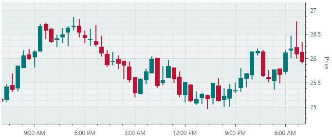
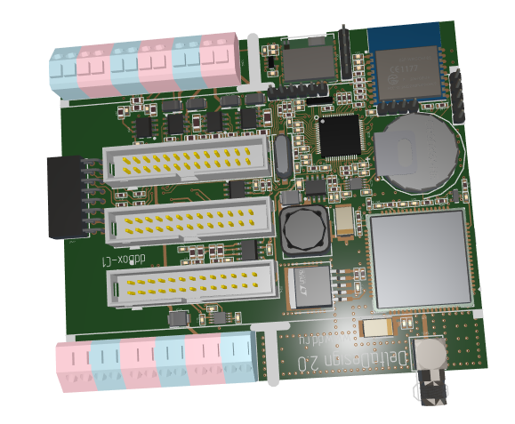

# Version 1.1

## 1.1.144

### Docking

- The new [`DockPane.AllowAutoHide`](../API/Eremex.AvaloniaUI.Controls.Docking/DockPane/AllowAutoHide.md) option allows you to prevent a user from enabling auto-hide mode for a specific panel. This option hides the 'Pin' button and 'Auto Hide' context menu item for the panel. 

### Ribbon and Toolbars

- Fixed issue: AvaloniaInternalException is raised in specific cases after dragging a toolbar.
- Fixed issue: NullReferenceException is raised when navigating in Ribbon if it contains a hidden group.

### Charts

- Fixed issue: Cannot change the visible range in code, using the [`AxisRange.VisualMin`](../API/Eremex.AvaloniaUI.Charts/AxisRange/VisualMin.md) and [`AxisRange.VisualMax`](../API/Eremex.AvaloniaUI.Charts/AxisRange/VisualMax.md) properties.
- Fixed issue: The CartesianChart control's `PointerPressed` event is not raised when scroll and zoom operations are disabled.

## 1.1.142

### DataGridControl and TreeListControl 

#### Tooltips for Column Headers

The new `HeaderToolTip` property allows you to specify custom tooltips for column headers in the DataGrid and TreeList controls.

#### Fixed Issues

- Incorrect sorting and filtering for columns that use in-place editors whose display text is formatted in a custom manner. Specific cases include:

    * Masked Editors — When an editor uses a mask and the `UseMaskAsDisplayText` property is set to `true`.
    * [`PopupColorEditor`](../API/Eremex.AvaloniaUI.Controls.Editors/PopupColorEditor.md) —  When the editor displays the selected color's value.
    * [`ComboBoxEditor`](../API/Eremex.AvaloniaUI.Controls.Editors/ComboBoxEditor.md) — When item display text does not match the value returned by an item's `ToString` method (for instance, when using an `EnumItemsSource` object as a source of items).

- DataGrid/TreeList raises an exception on window resizing if a `CellTemplate` property is used to assign an in-place editor to a column, and a binding is specified for the editor's `IsVisible` property.

### Editors

Fixed issue: Incorrect value selection in [`SpinEditor`](../API/Eremex.AvaloniaUI.Controls.Editors/SpinEditor.md) on a double-click and triple-click.

### PropertyGrid

Fixed issue: An in-place editor reverts to an old value after an edit operation if the `PropertyChanged` event hasn't been raised.

### Docking

The `FloatWindow.StyleKeyOverride` property's value has been changed from `typeof(Window)` to `typeof(FloatWindow)`

### Ribbon

Fixed issue: NullReferenceException is thrown on Ribbon resizing if the [`RibbonPageGroup.IsVisible`](../API/Eremex.AvaloniaUI.Controls.Bars/IToolbarItemsHolder/IsVisible.md) property is set to `false`

## 1.1.130

### Graphics3DControl

- The default exposure value ([`Graphics3DControl.Exposure`](../API/Eremex.AvaloniaUI.Controls3D/Graphics3DControl/Exposure.md)) has been changed to 4.5
- The `Graphics3DControl.EnableMultisampling` property has been replaced with [`Graphics3DControl.MultisamplingMode`](../API/Eremex.AvaloniaUI.Controls3D/Graphics3DControl/MultisamplingMode.md). The [`MultisamplingMode`](../API/Eremex.AvaloniaUI.Controls3D/MultisamplingMode.md) setting allows you to choose an anti-aliasing (MSAA) quality level.
- Graphics3DControl now allows you to specify custom light sources. Use the [`Lights`](../API/Eremex.AvaloniaUI.Controls3D/Graphics3DControl/Lights.md) or [`LightsSource`](../API/Eremex.AvaloniaUI.Controls3D/Graphics3DControl/LightsSource.md) property to create lights. Supported light types: Point, Directional, CameraPoint and CameraDirectional.
- You can use the [`AllowDefaultLight`](../API/Eremex.AvaloniaUI.Controls3D/Graphics3DControl/AllowDefaultLight.md) property to disable the default light.
- Added support for custom [skyboxes](../controls/graphics3dcontrol/skybox.md).
- The default skybox has been updated to improve visual rendering.
- Optimized the default distances to near and far clip planes.

### Data Grid and Tree List 
- Fixed issue: In-place ComboBoxEditor with a Enum source does not work properly during grid horizontal scrolling.
- Fixed issue: When using Binding in a CellTemplate, immediate editor value commit does not work.

### Docking UI

- Fixed issue: InvalidCastException when deleting a document if Compiled Bindings are enabled

## 1.1.112

### Charts

- Fixed an issue with the `DataAdapter.RemoveFromStart` method, where performance degraded significantly when deleting a large number of points.

### Docking UI

The following properties have been added:

- [`DockManager.OwnsFloatingDockPanes`](../API/Eremex.AvaloniaUI.Controls.Docking/DockManager/OwnsFloatingDockPanes.md) 
- [`DockManager.OwnsFloatingDocuments`](../API/Eremex.AvaloniaUI.Controls.Docking/DockManager/OwnsFloatingDocuments.md)

These properties specify whether the [`DockManager`](../API/Eremex.AvaloniaUI.Controls.Docking/DockManager.md) automatically sets itself as the owner of floating dock panes and documents.
If the [`OwnsFloatingDockPanes`](../API/Eremex.AvaloniaUI.Controls.Docking/DockManager/OwnsFloatingDockPanes.md)/[`OwnsFloatingDocuments`](../API/Eremex.AvaloniaUI.Controls.Docking/DockManager/OwnsFloatingDocuments.md) property is `false`, floating dock panes/documents appear behind the main window when the main window gets focus.

### Graphics3DControl

- Fixed an issue when a drag operation is not stopped when the context menu is invoked.
- The [`Graphics3DControl.Gamma`](../API/Eremex.AvaloniaUI.Controls3D/Graphics3DControl/Gamma.md) and [`Graphics3DControl.Exposure`](../API/Eremex.AvaloniaUI.Controls3D/Graphics3DControl/Exposure.md) properties now accept a value of 0.
- The [`Graphics3DControl.CoordinateSystem`](../API/Eremex.AvaloniaUI.Controls3D/Graphics3DControl/CoordinateSystem.md) now correctly returns `RightHanded`, which corresponds to the default coordinate system used in the [`Graphics3DControl`](../API/Eremex.AvaloniaUI.Controls3D/Graphics3DControl.md).
- The `Graphics3DControl.ZoomFactor` property has been renamed to [`Graphics3DControl.ZoomRate`](../API/Eremex.AvaloniaUI.Controls3D/Graphics3DControl/ZoomRate.md).
- Enhanced the algorithm that calculates the default positions of the Near and Far clipping planes.
- Added a Skybox feature.
- Added the object selection and highlighting features.
- Added an option to draw points without the need to specify indices.
- Added support for using a texture with only the Emission map.
- Adjusted the default rate of model rotation when using the mouse.
- Fixed an IndexOutOfRange exception when the `MaterialKey` is null.

### Ribbon

- Fixed an issue in specific MVVM scenarios.

## 1.1.95

### What's New

### Ribbon and Toolbars

New properties have been added to a [`ToolbarCheckItem`](../API/Eremex.AvaloniaUI.Controls.Bars/ToolbarCheckItem.md) object (check button). These properties specify how check buttons are rendered in the Ribbon control and toolbars:

- [`ToolbarCheckItem.CheckBoxStyle`](../controls/ribbon/ribbon-items.md#check-buttons-toolbarcheckitem) — Specifies whether to render the check box as a regular check button, toggle button or radio button.

- [`ToolbarCheckItem.CheckBoxAlignment`](../API/Eremex.AvaloniaUI.Controls.Bars/ToolbarCheckItem/CheckBoxAlignment.md) — Specifies whether to display the check box before or after the text and glyph.

<!-- The new `RibbonPageGroup.ItemLayoutDirectionInParent` attached property allows you to override the default layout mechanism for items in a Ribbon page group. -->

### Data Grid and Tree List

- Fixed issue: A `CellData.Row` object is not updated when a column's visibility and ItemsSource are changed.
- Fixed issue: A click on a node's check box closes the popup in which the Tree List control is displayed.

### Graphics3DControl

- If the Vulkan SDK is missing on MacOS, the control displays instructions on how to install the required libraries.
- Fixed issue: A Graphics3DControl's rendering is not cleared after removing the underlying 3D model.
- Fixed issue with automatic camera positioning in certain cases.
- Fixed issue: Back surfaces appear more metallic than they are.

## 1.1.91

### What's New

#### Ribbon

[RibbonControl](../controls/ribbon/index.md) allows you to integrate Microsoft Office-inspired navigation menus into your Avalonia UI applications. 

- In-place and dropdown galleries
- Quick Access Toolbar - You can add frequently used commands to this toolbar.
- Customizing the Quick Access Toolbar position (above or below the Ribbon command panel) and visibility
- Displaying items in the page header area
- Page header colorization (allows you to highlight contextual tabs)
- Ribbon item navigation with the keyboard
- Classic and Simplified command layouts
- Support for all types of items (commands) available in the traditional menus ([ToolbarManager](../controls/toolbars-and-menus/index.md))
- Adaptive layout of groups and items (adjusts the layout of commands when the Ribbon control's width changes)

#### Cartesian Chart - Candlestick Series View

[Candlestick View](../controls/charts/cartesian-series-views/candlestick-series-view.md) allows you to create a financial chart that describes price movements of an asset. 

For each data point, the chart displays a set of four values, the Open, Close, High and Low prices.

#### Heatmap

The [Heatmap](../controls/charts/heatmap.md) control represents a tool for visualizing numeric data in a matrix using color.

[Heatmaps](https://en.wikipedia.org/wiki/Heat_map) are useful for visual analysis of large datasets and locating correlations and anomalies across two variables displayed along the horizontal and vertical axes.
The color of each data point in a heatmap is determined by the point's numeric value. To specify custom color encoding in the Heatmap control, assign colors to specific values (transition values).
These colors are used to create color gradients between the transition values. Colors of all points in the matrix are determined from these gradients.
The [Heatmap](../controls/charts/heatmap.md) control's features include:
  - Custom color encoding
  - Grayscale colorization
  - Customization of the X and Y axes
  - Crosshair 
  - Strips and constant lines
  - Scroll and zoom with the mouse
  - Export the result of data colorization to a bitmap

#### Graphics3DControl

[Graphics3DControl](../controls/graphics3dcontrol/index.md) — A control to visualize and interact with 3D models.

- The control's API allows you to specify 3D models, camera settings, and materials (in PBR format)
- The camera supports the perspective and isometric 3D views 
- Displaying multiple 3D models simultaneously
- You can rotate, zoom and pan the models at runtime with the mouse and keyboard
- Vulkan SDK is used to display 3D graphics
- MVVM pattern support

#### Data Grid and Tree List/Tree View

- Data Grid - Row drag-and-drop — The DataGridControl control now supports row drag-and-drop operations within the control and to external controls (for instance, Tree List or another Data Grid). Drag-and-drop operations are supported for regular rows (data rows) and group rows. When you drag a group row, all data rows of this group are dragged. No additional code is required to handle row drag-and-drop operations between the source and destination controls (Data Grid and/or Tree List) if business objects in the controls' data sources are of the same type.

- Data Grid - Multiple row selection —  Users can select multiple rows simultaneously by using the mouse and holding down the CTRL and SHIFT key. The public API exposed by the control allows you to select multiple rows in code.

- Data Grid and Tree List - An ability to populate columns from a View Model — Use the `ColumnsSource` property to specify a collection of objects that need to be presented as columns. The `ColumnTemplate` property allows you to specify a template to create columns from these objects.

- Data Grid and Tree List/Tree View - The new vertical scrolling mechanism — We have significantly enhanced vertical scrolling for our grid and tree list controls when rows vary in height. The controls now feature smooth vertical scrolling and accurate scroll thumb positioning for variable-height rows, even for large record sets.

- Data Grid and Tree List - Full data virtualization — The data virtualization mechanism implemented by the Data Grid and Tree List controls is aimed at improving the performance of the controls when they display a large number of rows and columns. The controls have supported vertical virtualization since version 1.0. In the new version (v 1.1), the controls support horizontal virtualization, which speeds up the startup time when using multiple columns.  

  The virtualization mechanism creates and maintains only the visual elements (cells, column headers, etc.) that are visible in the viewport. Without data virtualization, a control has to create visual elements for the entire volume of cells, including those outside the viewport.

- Data Grid and Tree List - We've optimized in-place editor rendering in our container controls. This allows us to considerably enhance the load time and scrolling performance in multi-column Data Grid and Tree List controls.

#### Property Grid

- Vertical Virtualization — Property Grid now supports the data virtualization mechanism. It reduces the control's load time when displaying a large number of rows.

#### MxMessageBox

The [MxMessageBox](../controls/windows-and-dialogs/messagebox.md) dialog allows you to display messages and ask questions to users. 

The dialog supports the Eremex paint themes, and it looks consistent with other EMX Controls in your project. 

#### Editors

- ComboBoxEditor — The new [`FilterItem`](../API/Eremex.AvaloniaUI.Controls.Editors/ComboBoxEditor/FilterItem.md) event can be handled to custom filter items. The item filtering mechanisms is invoked when a user types text in the editor provided that the automatic completion feature is disabled. See [ComboBoxEditor - Auto-Filter](../controls/editors/comboboxeditor.md#auto-filter).