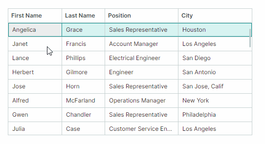
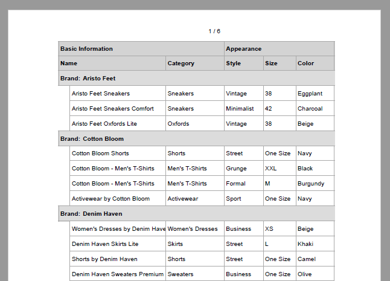
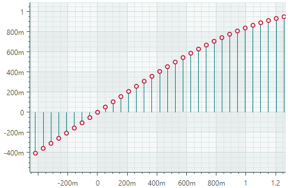
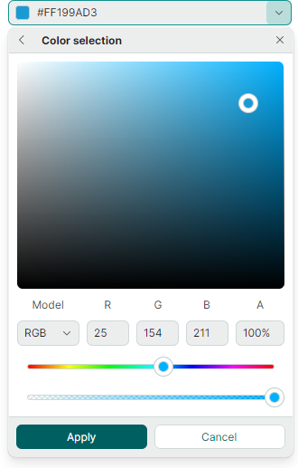

# Version 1.2

## 1.2.102

### DataGrid and TreeList

- Fixed issue: Incorrect data is provided for cell templates during vertical scrolling when using multiple DataTemplates in the same column

### Property Grid

- Fixed issue: A double click on a property with nested properties triggers an infinite loop of row expand/collapse events.
- Fixed issue: A PopupColorEditor in-place editor does not display HEX color values in uppercase.

### Charts

- Fixed issue: ArgumentOutOfRangeException is raised on hovering over a chart when the Axis.WholeMin and Axis.WholeMax properties are set to zero.
- Fixed issue: An incorrect visual range is applied when the MeasureUnit property is set.

### Toolbars and Ribbon

- Fixed issue: The Tag property is lost for items when they are placed in a toolbar's overflow menu.
- Fixed issue: Incorrect text alignment in large buttons.

### Docking UI

- Fixed issue: When hiding a pane in a Tabbed Group, the tab header remains visible. 


## 1.2.96

### Graphics3DControl

- Fixed issue: If a model contains two or more meshes of the `Lines` or `Points` type, Graphics3DControl is not immediately updated when the `MeshGeometry3D.PrimitiveSize` setting is changed.

## 1.2.95

### System Requirements

The Eremex Controls Library now requires Avalonia framework version 11.3.8 or higher. 

### DataGrid and TreeList

- Breaking Change - Drag-and-Drop Event Arguments Updated

    The event arguments for the `StartDrag`, `DragOver`, and `Drop` events have been changed. The reason for this breaking change is deprecation of the system `Avalonia.Input.IDataObject` interface. The `Data` argument of these events is now of the `DragDropData` class (it was of the `IDataObject` interface in previous versions). The `DragDropData` class exposes the same members as the deprecated interface.

- Fixed issue: Cannot change the background of grid rows by applying a style to `DataGridRowControl` objects

### Property Grid

- Fixed issue: An exception is raised when you navigate in an active in-place PopupColorEditor (press the Up and Down Arrow keys) if its popup is open.

### Ribbon

- Fixed issue: Exception is raised when Ribbon is updated if it contains hidden items.

#### MxWindow

- Fixed issue: Unnecessary padding is added to the window in the maximized state.

## 1.2.92

### TreeList - Export to PDF

You can now export the Tree List control directly to a PDF document. The export process follows a WYSIWYG approach, ensuring the generated PDF matches the control's on-screen layout.


The export API allows you to customize various export options, such as column and band header visibility, paper settings, and more.

Related topic:

- [Export](../controls/treelist/export.md)

### Data Grid and Tree List - Copy to Clipboard

The Data Grid and Tree List controls now support the CTRL+C shortcut used to copy the row selection to the clipboard.
The new `CopyToClipboardAsync` method allows you to copy rows in code.

See the following topic for more information:

- [Clipboard](../controls/datagrid/clipboard.md)

### Data Grid and TreeList - Miscellaneous

- The `OnKeyDown` and `OnKeyUp` methods are now virtual.
- Fixed issue: Control freeze when columns with the Auto width have the MinWidth setting.
- Fixed issue: Filter menus in columns do not work with nullable properties.

## Property Grid

- Fixed issue: Issue when binding a row's IsVisible property to a property, and then editing this property.


## Ribbon

- Fixed issue: Ribbon raises an exception when placed inside a ToolbarManager
- Fixed issue: Ribbon allocates space for hidden items

### ComboBoxEditor - Immediate Update of the Editor Value

In multiple selection mode, the ComboBoxEditor contains the OK and Cancel buttons in the dropdown window used to confirm the user selection. If these buttons are hidden, the ComboBoxEditor immediately updates its value as a user checks or unchecks items in the dropdown. If these buttons are visible, the editor's value is updated after the OK button is clicked.

Set the editor's `PopupFooterButtons` property to `None` to hide the OK and Cancel buttons.

## 1.2.77


### Data Grid and Tree List - Column Filters

Column Filter Menus are now available for the Data Grid and Tree List controls.

Hover over any column header to reveal a filter button. Clicking this button opens a filter menu listing the column's unique values. Select any value to instantly filter the column.




- Multi-Column Filtering — You can apply filters to multiple columns simultaneously.
- Filter Panel — When a filter is applied, a dedicated filter panel appears at the bottom of the control. It displays the current filter criteria and provides options to temporarily disable or clear the filter.
- Filtering in Code — Use the new `DataControlBase.FilterString` property to [create custom filtration criteria in code](../controls/datagrid/filter-and-search.md#filter-in-code). This property is supported for the Data Grid, Tree List and Tree View controls.

Related topics:

- [Data Grid - Filter and Search](../controls/datagrid/filter-and-search.md)
- [Tree List - Filter and Search](../controls/treelist/filter-and-search.md)

### Data Grid - Export to PDF

Data Grid now allows you to export data as a PDF document. The PDF export functionality follows the WYSIWYG concept, which retains the layout of grid elements in the output document.



When exporting to PDF, you can customize various settings, including paper kind, page margins, orientation and so on.

Related topic:

- [Export](../controls/datagrid/export.md)

### MxMessageBox - Asynchronous Mode

`MxMessageBox` now includes the [ShowAsync method overloads](../controls/windows-and-dialogs/messagebox.md#showasync-method-overloads). They allow you to display message boxes asynchronously, without blocking the UI thread.

### Control Serialization in Json

To serialize/deserialize Eremex controls you typically use their `SaveLayout` and `RestoreLayout` methods, which employ XML format for serialization. Currently, these methods do not allow you to choose the output format.

For greater control over serialization settings and to use JSON format, use the `SerializationManager.Serialize` and `SerializationManager.Deserialize` methods with a `SerializationSettings` parameter. Set the `SerializationSettings.SerializationMode` property to `Json` to serialize/deserialize controls in this format.

### Docking UI

- The new `DockManager.DockItemContextMenuOpening` event allows you to customize built-in context menus for Dock Panes and Document Panes, and to prevent the context menus from being displayed.

- The `DockManager.Commands` property provides access to all built-in commands (`ICommand` objects) for Dock Panes and Document Panes (for instance, `AutoHide`, `ToggleAutoHide`, `Maximize`, `Minimize`, `NewHorizontalDocumentGroup`, and so on). These commands are invoked from the built-in context menus.

### Ribbon

- Fixed issue: Buttons disappear in Ribbon groups in specific button layouts.

### Disable Transparency and Shadows for Windows and Popups

The new `MxSettings` class stores global settings specific to all Eremex controls in an Avalonia application. This class contains the `MxSettings.EnableWindowTransparency` property, which  manages transparency and shadow visibility for Eremex windows and popups.

To customize the `MxSettings.EnableWindowTransparency` setting, add a `UseEMXServices` method call to the `AppBuilder.Configure` chain as follows:

``` cs
public static AppBuilder BuildAvaloniaApp()
    => AppBuilder.Configure<App>()
        .UsePlatformDetect()
        .WithInterFont()
        .LogToTrace()
        .UseEMXServices(settings => { settings.EnableWindowTransparency = false; });
```


## 1.2.63 (Beta)


### DataGrid and TreeList

#### Column Bands

The DataGrid and TreeList controls now support the Column Bands feature. Bands allow you to visually group columns together and display additional headers above them. The controls support hierarchical bands with an unlimited number of nesting levels.


See the following topics for more information:

- [Data Grid - Bands](../controls/datagrid/bands.md)
- [Tree List - Bands](../controls/treelist/bands.md)


#### Export to Excel Format

You can now export data from the DataGrid and TreeList controls to XLSX format. The export engine allows you to preserve the control's data shaping options in the output XLSX document:

- Row grouping
- Value formatting
- Data sorting


See the following topics to learn more:

- [Data Grid - Export](../controls/datagrid/export.md)
- [Tree List - Export](../controls/treelist/export.md)

#### Template Updates

The following templates for the DataGridControl and TreeListControl have been updated:
  
``` xml
<ControlTheme x:Key="{x:Type mxdg:DataGridControl}" TargetType="mxdg:DataGridControl">
<ControlTheme x:Key="{x:Type mxtl:TreeListControl}" TargetType="mxtl:TreeListControl">
```

Key changes include:

- The ColumnHeaderPanel object in these templates have been replaced with ColumnHeadersControl. The ColumnHeaderPanel object is now nested inside the ColumnHeadersControl's template.
- All members of the DataGridGroupPanelControl class have been migrated to the new DataGridGroupPanelItemsControl class (an ItemsControl descendant). The DataGridGroupPanelControl class now inherits from TemplatedControl. Its template includes an instance of the DataGridGroupPanelItemsControl class.


### TreeView

The new `TreeViewControl.CellWidth` property allows you to control the width of cells in the TreeView control. The default value of the `CellWidth` property is `"*"`, which stretches cells to fill the control's width. 
If cell text is too long, it is trimmed at the right edge, and no horizontal scrollbar appears.

Set the `CellWidth` property to `"Auto"` to automatically adjust the data column width based on cell contents. The horizontal scrollbar appears if the maximum cell content width exceeds the control's width.

### Cartesian Chart

The new Lollipop Series View (`CartesianLollipopSeriesView`) allows you to visualize data using thin lines with markers at the end. The markers indicate individual data points, while the lines connect the markers to a baseline.



The main features include:

- Extending lines (stems) to the horizontal or vertical axis.
- Custom markers in SVG format.

#### Breaking Changes

- Point Series Views and descendants — You now need to use the `{0}` syntax instead of `#{0}` syntax when setting the `MarkerImageCss` property. This change aims to enhance the control's usability.

    The `MarkerImageCss` property in Point Series Views (and descendats) supports [CSS-based styling of SVG elements](https://developer.mozilla.org/en-US/docs/Web/SVG/Reference/Element/style). The `{0}` placeholder allows you to insert the value of the `CartesianLollipopSeriesView.Color` property in the CSS code.

    In previous versions, you needed to prepend the `{0}` placeholder with `#`:

    ``` xml
    <!-- version 1.1 -->
    <mxc:CartesianPointSeriesView Color="orange" MarkerImageCss="circle {{fill:#{0}}}">
    ```

    In version 1.2 and higher, use the `{0}` syntax without the `#` character.

    ``` xml
    <!-- version 1.2 -->
    <mxc:CartesianPointSeriesView Color="orange" MarkerImageCss="circle {{fill:{0}}}">
    ```

    See the following topics for more information:
    
    - [Point Series View Settings](../controls/charts/cartesian-series-views/point-series-view.md#point-series-view-settings)
    - [Example - Create a Lollipop Series View and Use Custom SVG Data Point Markers](../controls/charts/cartesian-series-views/lollipop-series-view.md#example-create-a-lollipop-series-view-and-use-custom-svg-data-point-markers)

- Area Series View and Step Area Series View — Starting with version 1.2, the `Transparency` property's interpretation has been reversed to align with standard graphics conventions. The property now directly controls transparency (not opacity) of filled areas.

    Version 1.2+:
    - `Transparency` set to `0` means fully opaque
    - `Transparency` set to `1` means fully transparent

    Version 1.1:
    - `Transparency` set to `0` means fully transparent
    - `Transparency` set to `1` means fully opaque


### Docking

#### Document Switcher

The Document Switcher is a tool window that shows available dock panes and documents and allows users switch to a specific panel using the keyboard. Users can press CTRL+TAB or CTRL+SHIFT+TAB to show the Document Switcher.


See [Document Switcher](../controls/docking/document-switcher.md) for more details.

#### Miхed Document Layout

The new `DockManager.AllowFreeDocumentLayout` property allows DocumentGroups to be docked side-by-side horizontally and vertically simultaneously. 


If this option is set to `false` (default), DocumentGroups can be docked side-by-side only vertically or horizontally.


#### Specify Contents for FloatGroup Titles

The new `FloatGroup.WindowTitle` and `FloatGroup.WindowIcon` properties allow you to specify a title and icon for floating groups (floating windows). 
See the following topic for more details: [Set a Floating Window's Header and Image](../controls/docking/dock-panes-and-containers.md#set-a-floating-windows-header-and-image).


### Editors

#### ComboBoxEditor

You can use the new `SelectAllItemText` and `ClearValueItemText` properties to specify custom captions for the predefined `(Select All)` and `(None)` items in the editor's popup:

- `(Select All)` item — Selects/deselects all items. Applies to [multiple selection mode](../controls/editors/comboboxeditor.md#select-all-item-in-multiple-selection-mode).
- `(None)` item — Clears the current selection by setting the editor's value to null. Applies to [single selection mode](../controls/editors/comboboxeditor.md#none-item-in-single-selection-mode).

#### PopupEditor and its descendants 

Popup editors now feature the `ShowPopupIfReadOnly` property which allows you to disable popups for read-only editors.

#### ColorEditor and PopupColorEditor

- The Color Selection dialog has been redesigned. It now displays abbreviated names of color components:

    

<!-- TODO
Describe in the main topic + change? the example
articles\controls\datagrid\examples\how-to-prevent-opening-popups-for-read-only-popup-editors.md
 -->

- Color boxes in the `ColorEditor` and `PopupColorEditor` controls now display additional sections with gray squares to indicate the presence of the alpha channel (transparency) in the color.

    


<!-- ### Built-in Icons

The **Eremex.Avalonia.Controls** assembly includes a set of SVG icons that you can use in your applications. In the new version, the following built-in icons have been renamed:

| Old Name | New Name |
| --- | --- |
| SimOne/Chip Add.svg | Simtera/Chip Add.svg |
| SimOne/Chip Cloud Add Copy.svg | Simtera/Chip Cloud Add Copy.svg |
| SimOne/Chip Cloud Add.svg | Simtera/Chip Cloud Add.svg |
| SimOne/Chip Cloud Change.svg | Simtera/Chip Cloud Change.svg |
| SimOne/Chip Cloud Copy.svg | Simtera/Chip Cloud Copy.svg |
| SimOne/Chip Cloud Import.svg | Simtera/Chip Cloud Import.svg |
| SimOne/Chip Cloud.svg | Simtera/Chip Cloud.svg |
| SimOne/Chip Curve.svg | Simtera/Chip Curve.svg |
| SimOne/Chip Import.svg | Simtera/Chip Import.svg |
| SimOne/Chip.svg | Simtera/Chip.svg |
| SimOne/Oscilloscope.svg | Simtera/Oscilloscope.svg |

``` xml
xmlns:mxi="https://schemas.eremexcontrols.net/avalonia/icons"

<Image Source="{x:Static mxi:Simtera.Chip_Cloud_Add_Copy}" />
```

The 'SVG Icons Browser' module in the Demo Center showcases the available icons and demonstrates XAML code for embedding the icons in your projects. -->