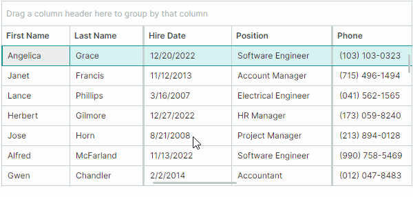
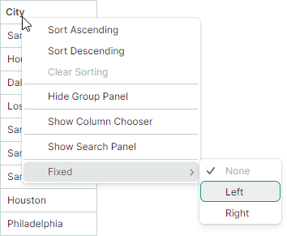
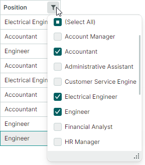
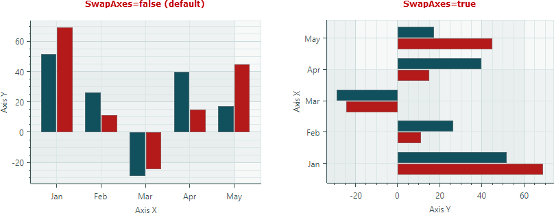
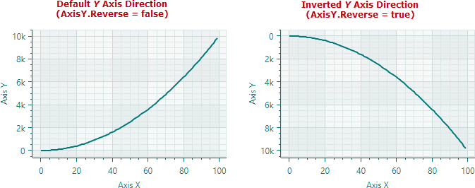

# Version 1.3

## 1.3.69

## Charts

#### Fixed Issues

- An exception is raised if the chart displays `DateTime` values on the _Y_ axis and the `AlwaysShowZeroLevel` option is set to `true`.
- PolarChart and SmithChart — The `CrosshairSeriesLabelMode.None` option has no effect.


## 1.3.62

### DataGrid, TreeList, and TreeView

- DataGrid - The `GetSourceItem` and `GetSourceItemValue` methods are added. They allow you to retrieve data source items and their values using source item indexes.

- DataGrid, TreeList and TreeView - Added the ability to prevent changing focus on a right mouse click.

    When a user right-clicks a row or cell, focus moves to this row/cell. This version adds the `DataControlBase.ProcessPointerPressedOnCell` and `DataControlBase.ProcessPointerPressedOnRow` virtual methods that you can override to prevent row focus changing on a right mouse click. Use the following code to implement this task:

    ``` cs
    public class CustomTreeViewControl : TreeViewControl
    {
        protected override Type StyleKeyOverride => typeof(TreeViewControl);
        protected override void ProcessPointerPressedOnCell(PointerPressedEventArgs e, int visibleRowIndex, ColumnBase? column)
        {
            var pointerProperties = e.GetCurrentPoint(this).Properties;
            if (pointerProperties.IsRightButtonPressed)
                return;
            base.ProcessPointerPressedOnCell(e, visibleRowIndex, column);
        }

        protected override void ProcessPointerPressedOnRow(PointerPressedEventArgs e, int visibleRowIndex)
        {
            var pointerProperties = e.GetCurrentPoint(this).Properties;
            if (pointerProperties.IsRightButtonPressed)
                return;
            base.ProcessPointerPressedOnRow(e, visibleRowIndex);
        }
    }
    ```

- Fixed issue: DataGrid - The `CustomColumnDisplayText` event is raised for values shown in the filter panel when a column's `ColumnFilterMode` property is set to `DisplayText`. This event should not be raised in this case.

- Fixed issue: DataGrid and TreeList - The `CustomUnboundColumnData` event is not raised when a user modifies other row cells.

- Fixed issue: DataGrid and TreeList - A "Layout cycle detected" error when a fixed column has the 'Auto' width and `MinWidth` setting at the same time.

- Fixed issue: DataGrid and TreeList - A memory leak when scrolling the control.

- Fixed issue: DataGrid and TreeList - A popup with filter operators can be opened in the Auto Filter Row if the editor contains an invalid value. 

- Fixed issue: DataGrid and TreeList - Incorrect cell width after updating data and vertical scrolling.

- Fixed issue: DataGrid and TreeList - Filtering via column filter menus does not work if a control contains a column without the `FieldName` property specified.

- Fixed issue: TreeList - If `ExpandNodesOnFiltering` is set to `true`, the control expands nodes when a source triggers a change that does not affect the filter.

### Charts

- Fixed issue: Stacked Area Series Views - When the crosshair label combines all series (`OneForAllSeries` mode), the visual order of the series names in the label is inverted – it does not match the visual order of the filled areas.

### PropertyGrid

- Fixed issue: An exception is raised when selecting a value in an in-place `PopupColorEditor`.


### Docking UI

- Fixed issue: An exception is raised when deserializing a `DockManager` with an auto-hide panel in specific cases.

### Graphics3D Control

- Fixed issue: A selected element is hidden when you disable selection using the `SelectionMode` property.


## 1.3.49

### DataGrid and TreeList

#### Fixed Columns

With the Fixed Columns feature, you can pin columns in the DataGrid and TreeList controls to the left or right edge to keep these columns in view at all times. These columns remain stationary during horizontal scrolling while other columns move normally.



To allow users to pin or unpin columns at runtime, enable the built-in _Fixed_ sub-menu in column header menus:



Related API:

- `ColumnBase.FixedMode`
- `DataGridControl.ShowColumnMenuFixedItem` and `TreeListControl.ShowColumnMenuFixedItem`
- `DataGridControl.ExtendScrollbarToFixedColumns` and `TreeListControl.ExtendScrollbarToFixedColumns`
- `DataGridControl.FixedColumnSeparatorWidth` and `TreeListControl.FixedColumnSeparatorWidth`

Learn more: 

- [Data Grid - Fixed Columns](../controls/datagrid/columns.md#fixed-columns)
- [Tree List - Fixed Columns](../controls/treelist/columns.md#fixed-columns)


#### Show Condition Operators in the Auto Filter Row

The Auto Filter Row has been enhanced to support runtime selection of filter operators in individual cells. When this feature is active, a filter operator icon appears in each Auto Filter Row cell. Users can click this icon to open a dropdown menu and select the desired operator.


Related API:

- `DataGridControl.ShowConditionInAutoFilterRow`
- `TreeListControl.ShowConditionInAutoFilterRow` 
- `ColumnBase.ShowConditionInAutoFilterRow`

Learn more:

- [Data Grid - Enable Runtime Filter Operator Selectors](../controls/datagrid/filter-and-search.md#enable-runtime-filter-operator-selectors)
- [Tree List - Enable Runtime Filter Operator Selectors](../controls/treelist/filter-and-search.md#enable-runtime-filter-operator-selectors)

#### Column Filter Menus - Checked List Mode

Column filter menus now allow you to present their items as a checked list. In Checked List mode, use built-in check boxes to select multiple filter values simultaneously. 



You can enable Checked List display mode for all columns or individual columns, using the following properties:

- `DataGridControl.ColumnFilterPopupMode` and `TreeListControl.ColumnFilterPopupMode`
- `GridColumn.FilterPopupMode` and `TreeListColumn.FilterPopupMode`

Learn more: 

- [Data Grid - Filter Checked List Mode](../controls/datagrid/filter-and-search.md#list-and-checked-list-display-modes)
- [Tree List - Filter Checked List Mode](../controls/treelist/filter-and-search.md#list-and-checked-list-display-modes)


#### Export to Image

The DataGrid and TreeList controls now include the ability to export data to image formats (PNG, JPEG, SVG, and WebP) with pagination. 


Specify a page size and call the new `ExportToImages` method. The export engine automatically splits the source control into pages and saves each as a separate image. The `ExportToImages` method uses the same pagination mechanism as the `ExportToPdf` method.

Learn more:

- [Data Grid - Export to Image Formats](../controls/datagrid/export.md#export-to-image-formats)
- [Tree List - Export to Image Formats](../controls/treelist/export.md#export-to-image-formats)

#### Export to CSV

The DataGrid, TreeList and TreeView controls support data export to CSV format. CSV is a text format in which row values are separated by a specific delimiter (a comma, by default). Use the `ExportToCsv` method to export the control's data. This method's parameters allow you to customize value export mode, the separator character, and more.

- [Data Grid - Export to CSV](../controls/datagrid/export.md#export-to-csv-format)
- [Tree List - Export to CSV](../controls/treelist/export.md#export-to-csv-format)

#### Alphanumeric Sort

The DataGrid, TreeList, and TreeView controls now support alphanumeric sorting in addition to the default alphabetical sort. This algorithm is helpful when columns contain a mix of text and numbers. It arranges strings in a human-friendly, logical order by comparing numbers based on their numerical value.


Use the `DataControlBase.TextSortMode` property exposed by the DataGrid, TreeList and TreeView controls to enable alphanumeric sorting. This property affects sorting for all columns that display text values.

Learn more:

- [DataGrid - Sorting](../controls/datagrid/sorting.md#alphanumeric-sorting)
- [TreeList - Sorting](../controls/treelist/sorting.md#alphanumeric-sorting)


### Charts

#### Stacked Area Views

This release adds two new Views to the CartesianChart control:

- **Stacked Area View** represents a data series as a colored layer. These layers are stacked vertically to show absolute relationships between the data series. At any given point, the height of a layer corresponds to its individual value, while the total height of the entire stack represents the cumulative sum of all series.


- **Full-Stacked Area View (or 100% Stacked Area View)** also renders a data series as a colored layer. However, these Views are used to visualize proportional relationships. Instead of showing absolute values, each layer's height represents its percentage share of the total at that point. The top line always indicates `100%`.


Learn more:

- [Stacked Area Series View](../controls/charts/cartesian-series-views/stacked-area-series-view.md)
- [Full-Stacked Area Series View](../controls/charts/cartesian-series-views/full-stacked-area-series-view.md)


#### Swapping X and Y Axes

The new `CartesianChart.SwapAxes` property allows you to transpose the _X_ and _Y_ axes. Set it to `true` to display _X_ axes vertically, and _Y_ axes horizontally.




Learn more:

- [Swap the X and Y Axes](../controls/charts/cartesian-chart.md#swap-the-x-and-y-axes)

#### Inverting the Axis Direction

The CartesianChart control now includes the `Axis.Reverse` property to change the direction of any axis. When it's set to `true`, the order of axis values is inverted:

- _X_-axis will display values from right-to-left instead of the default left-to-right direction.
- _Y_-axis will display values from top-to-bottom instead of the default bottom-to-top direction.



Learn more:

- [Reverse the Axis Direction](../controls/charts/cartesian-chart.md#reverse-the-axis-direction)


#### Empty Points

CartesianChart and PolarChart now support empty points (data points with undefined values). The chart controls leave visible gaps in series when they encounter empty points.


To specify an empty point, set the data point's value to _double.NaN_, _double.PositiveInfinity_, or _double.NegativeInfinity_. 

Learn more:

- [Empty Points (Gaps)](../controls/charts/cartesian-chart.md#empty-points-gaps)

### Graphics3DControl

#### New API

The new `LookCameraAtScene` method allows you to position and orient the camera to look at the center of the 3D scene from a specified direction.

<code>LookCameraAtScene(Vector3 cameraViewDirection, Vector3 upDirection)</code>


<!-- TODO
check:
from a specific angle???

добавил метод Graphics3DControl.LookCameraAtScene(Vector3 cameraPosition, Vector3 upDirection) - вектора это просто направления, тоесть 1,0,0 тоже самое что 100,0,0

cameraPosition - это точка?
 -->

#### Displaying Axis Names in the Gizmo

The Graphics3DControl's Gizmo now displays the names of the _X_, _Y_, and _Z_ axes.


To render the axis names, three models that represent the letters "X", "Y", and "Z" are added to the `Gizmo`.
The new `Gizmo.Models` and `Gizmo.ModelsSource` properties allow you to specify 3D models to render the Gizmo in a custom manner. These properties replace the old `Gizmo.Model` property, which is now obsolete. 

#### Breaking Change - Paint Theme is Now Required to Render Graphics3DControl

Starting with version 1.3, `Graphics3DControl` and `Gizmo` classes inherit from `Graphics3DControlBase`, which is a descendant of the `TemplatedControl` class. 
Common appearance settings for these controls are now specified by the `Controls3D` paint theme. To ensure correct rendering of the `Graphics3DControl`, you must register this theme in the _App.xaml_ file:

``` xml
<!-- App.xaml file -->
<Application ...
    xmlns:theme3D="clr-namespace:Eremex.AvaloniaUI.Themes.Controls3D;assembly=Eremex.Avalonia.Controls3D"
             >
    <Application.Styles>
        ...
        <theme3D:Controls3DTheme />
    </Application.Styles>
</Application>
```

If the `Controls3D` paint theme is not registered, the `Graphics3DControl` will appear blank.

### Docking

You can now apply resizing constraints to dock items using their `MinWidth`, `MinHeight`, `MaxWidth`, and `MaxHeight` properties.

### SplitContainerControl - Panel Size Constraints

The new  `Panel1MinLength`, `Panel1MaxLength`, `Panel2MinLength`, and `Panel2MaxLength` properties allow you to set resizing constraints for the panels in the `SplitContainerControl`.  Users cannot resize the panels beyond these limits. 

### MxWindow

The new `Header` and `HeaderTemplate` properties allow you to display custom content in a window's title.

### Fixed Issues

- Toolbars & Menus — A bar item's associated dropdown cannot be displayed if the dropdown was previously opened from a bar's overflow menu.
- Docking — The header of an auto-hide item remains visible when the item is hidden.
- Docking - The height of a tab panel's header region is incorrectly calculated when there are many tabs.

### Breaking Changes

- Graphics3DControl — The `Gizmo.Model` property has been deprecated. Use the new `Gizmo.Models` and `Gizmo.ModelsSource` properties instead.
- Editors —  The `IsClearTextButtonVisible` property has been renamed to `IsNullValueButtonVisible`.
- Editors — The `ClearTextCommand` command has been renamed to `SetNullValueCommand` and moved from the `PopupEditor` class to the `ButtonEditor` class.