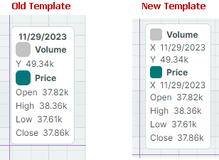

# Version 1.4

## 1.4.38

## DataGrid and TreeList

#### Fixed Issues

- An exception is raised if a drag-and-drop operation is cancelled within a `StartDrag` event handler.
- The object assigned to the `e.Data.DataTransfer` in a `StartDrag` event handler is not accessible in a `DragOver` event handler.
- In `CheckedList` mode, a column filter does not display the caption for the "(Select All)" item.

## Charts

#### Fixed Issues

- When a crosshair is displayed, an exception is raised if the series only contains points with `NaN` values.
- PolarChart — The inner area is not filled when the starting and ending points are equal.
- An exception is raised if the chart displays `DateTime` values on the _Y_ axis and the `AlwaysShowZeroLevel` option is set to `true`.
- PolarChart and SmithChart — The [`CrosshairSeriesLabelMode.None`](../API/Eremex.AvaloniaUI.Charts/CrosshairSeriesLabelMode.md) option has no effect.

## Windows and Message Boxes

#### Fixed Issues

- `MxMessageBox` - An incorrect icon is displayed when the [`MessageBoxIcon`](../API/Eremex.AvaloniaUI.Controls/MessageBoxIcon.md) parameter is set to any value other than `None`, `Question`, or `Warning`.

## 1.4.34

### Avalonia 12 Support

This release brings full support for Avalonia 12 to the Eremex Controls library. Avalonia 12 delivers significant improvements in performance, stability, and platform reliability. This update ensures that the Eremex Controls suite integrates smoothly with the changes introduced in the new version of the Avalonia framework.

For details on breaking changes in Avalonia 12, see:
[https://docs.avaloniaui.net/docs/avalonia12-breaking-changes](https://docs.avaloniaui.net/docs/avalonia12-breaking-changes).

### DataGrid and TreeList

#### Row Drag-and-Drop Enhancements

##### Row Previews

DataGrid and TreeList now show row previews during [drag-and-drop operations](../controls/datagrid/row-drag-and-drop.md), giving you visual feedback as you reorder or move data.

When you drag multiple rows, a row preview shows the number of objects being dragged.

##### Row Drag Handles

This version adds a new drag mode, in which special Drag Handles are used to drag rows. The Drag Handles are displayed in the Row Indicator region to the left of the rows.

Drag Handles simplify cell editor activation when drag-and-drop functionality is enabled. Previously, users initiated row drag-and-drop by clicking and dragging any row cell. This behavior, however, contradicts the requirement (expressed by many) to activate a cell editor on pressing the mouse within the cell. The new Drag Handle-based mode resolves this issue:

- A single click on a cell activates a cell editor, by default.
- To drag rows, use the dedicated row drag handles.

###### Related API

- [`DataGridControl.RowDragMode`](../API/Eremex.AvaloniaUI.Controls.DataGrid/DataGridControl/RowDragMode.md)
- [`DataGridControl.RowIndicatorWidth`](../API/Eremex.AvaloniaUI.Controls.DataGrid/DataGridControl/RowIndicatorWidth.md)
- [`TreeListControl.RowDragMode`](../API/Eremex.AvaloniaUI.Controls.TreeList/TreeListControl/RowDragMode.md)
- [`TreeListControl.RowIndicatorWidth`](../API/Eremex.AvaloniaUI.Controls.TreeList/TreeListControl/RowIndicatorWidth.md)

##### Breaking Change - Drag Rows Between Applications

Starting with version 1.4, to allow rows to be dragged between applications, enable the new `UsePlatformRowDragDrop` property for the control in which drag-and-drop operations start. Note that row previews are not shown during platform-based row drag operations.

Versions prior to v1.4 do not require any additional option to enable row drag-and-drop between applications.

##### Documentation

- [Data Grid - Row Drag-and-Drop](../controls/datagrid/row-drag-and-drop.md)
- [Tree List - Node Drag-and-Drop](../controls/treelist/node-drag-and-drop.md)

#### Column Header Dragging Visual Enhancements

To hide a column, a user can drag its column header a short distance away from the header panel and drop it there. To provide a clear visual cue about this action, the "Hide Column" hint is now displayed above the dragged column header.

Additionally, during a drag operation, a column header's preview now appears semi-transparent with a shadow effect.

#### Best-Fit 

The DataGrid and TreeList controls now support the Best Fit functionality. This feature allows users to automatically resize columns to their ideal minimum width to show cell contents in their entirety.

To apply Best Fit, users can double-click a column header's right edge or select the "Best Fit" command from the column's context menu. Users can also apply Best Fit to all columns at once to ensure all content remains fully visible.

The controls include [`BestFitMode`](../API/Eremex.AvaloniaUI.Controls.DataControl/BestFitMode.md) properties to specify which row values are measured during Best Fit operations:

- `Fast` mode – Measures widths of unique row values. This improves Best Fit performance in most standard scenarios.

- `Full` mode – Measures widths of all row values, including duplicates. This mode is slower than Fast but correctly calculates column widths when cell templates or validation errors are used.

##### Related API

- [`DataGridControl.AllowBestFit`](../API/Eremex.AvaloniaUI.Controls.DataGrid/DataGridControl/AllowBestFit.md)
- [`DataGridControl.BestFitMode`](../API/Eremex.AvaloniaUI.Controls.DataGrid/DataGridControl/BestFitMode.md)
- [`DataGridControl.BestFitMode`](../API/Eremex.AvaloniaUI.Controls.DataGrid/DataGridControl/BestFitMode.md)
- [`DataGridControl.BestFit`](../API/Eremex.AvaloniaUI.Controls.DataGrid/DataGridControl/BestFit.md)
- [`DataGridControl.BestFitAllColumns`](../API/Eremex.AvaloniaUI.Controls.DataGrid/DataGridControl/BestFitAllColumns.md)
- [`GridColumn.AllowBestFit`](../API/Eremex.AvaloniaUI.Controls.DataControl/ColumnBase/AllowBestFit.md)
- [`GridColumn.BestFitMode`](../API/Eremex.AvaloniaUI.Controls.DataControl/ColumnBase/BestFitMode.md)
- [`GridColumn.BestFitMode`](../API/Eremex.AvaloniaUI.Controls.DataControl/ColumnBase/BestFitMode.md)
- [`TreeListControl.AllowBestFit`](../API/Eremex.AvaloniaUI.Controls.TreeList/TreeListControl/AllowBestFit.md)
- [`TreeListControl.BestFitMode`](../API/Eremex.AvaloniaUI.Controls.TreeList/TreeListControl/BestFitMode.md)
- [`TreeListControl.BestFitMode`](../API/Eremex.AvaloniaUI.Controls.TreeList/TreeListControl/BestFitMode.md)
- [`TreeListControl.BestFit`](../API/Eremex.AvaloniaUI.Controls.TreeList/TreeListControl/BestFit.md)
- [`TreeListControl.BestFitAllColumns`](../API/Eremex.AvaloniaUI.Controls.TreeList/TreeListControl/BestFitAllColumns.md)
- [`TreeListColumn.AllowBestFit`](../API/Eremex.AvaloniaUI.Controls.DataControl/ColumnBase/AllowBestFit.md)
- [`TreeListColumn.BestFitMode`](../API/Eremex.AvaloniaUI.Controls.DataControl/ColumnBase/BestFitMode.md)
- [`TreeListColumn.BestFitMode`](../API/Eremex.AvaloniaUI.Controls.DataControl/ColumnBase/BestFitMode.md)

##### Documentation

- [Data Grid - Best Fit](../controls/datagrid/columns.md#best-fit)
- [Tree List - Best Fit](../controls/treelist/columns.md#best-fit)

#### Reset User Changes to Column Width

After a user changes column widths (by dragging or using Best Fit), the _Reset Column Width_ command appears in column context menus. This command resets changes made by users to column widths, restoring original widths applied to columns in XAML or code-behind before user modifications.

##### Related API

- [`DataGridControl.AllowResetColumnWidth`](../API/Eremex.AvaloniaUI.Controls.DataGrid/DataGridControl/AllowResetColumnWidth.md)
- [`DataGridControl.ResetColumnWidth`](../API/Eremex.AvaloniaUI.Controls.DataGrid/DataGridControl/ResetColumnWidth.md)
- [`TreeListControl.AllowResetColumnWidth`](../API/Eremex.AvaloniaUI.Controls.TreeList/TreeListControl/AllowResetColumnWidth.md)
- [`TreeListControl.ResetColumnWidth`](../API/Eremex.AvaloniaUI.Controls.TreeList/TreeListControl/ResetColumnWidth.md)

#### Fixed Issues

- TreeList - `StackOverflowException` is raised when filtering data if [`ExpandNodesOnFiltering`](../API/Eremex.AvaloniaUI.Controls.TreeList/TreeListControlBase/ExpandNodesOnFiltering.md) is `true`.
- TreeList - Active editor in the auto-filter row is closed when the node collection is changed.
- DataGrid and TreeList - The `Cmd+A` shortcut does not work on Mac.

### Cartesian Chart - Crosshair Enhancements

The Cartesian Chart control extends its public API to give you finer control over the behavior and appearance of crosshair labels. 

#### New Crosshair Label Display Mode

The [`CrosshairOptions.SeriesLabelMode`](../API/Eremex.AvaloniaUI.Charts/CrosshairOptions/SeriesLabelMode.md) property specifies whether and how multiple crosshair labels are combined. This property's default value is now `Smart`:

- `Smart` mode — Each series displays its own crosshair label. When labels overlap, they are combined in a single label.
  
  

#### Crosshair Series Sorting

When multiple series are combined in a single crosshair label, you can use the new [`CrosshairOptions.SeriesLabelItemSortMode`](../API/Eremex.AvaloniaUI.Charts/CrosshairOptions/SeriesLabelItemSortMode.md) property to specify the display order of the series in the label:

- `By Series` order —  Sorts series by the order in which these series are added to the [`CartesianChart.Series`](../API/Eremex.AvaloniaUI.Charts/CartesianChart/Series.md) collection.

    

- `By Value` order — Sorts series by their _Y_ values.

    

#### Include Only Series Near the Cursor

The following property allows you to show crosshair labels only for data points near the cursor.

- [`CrosshairOptions.MaxPickDistance`](../API/Eremex.AvaloniaUI.Charts/CrosshairOptions/MaxPickDistance.md) —  Specifies the range within which to search for data points to include in crosshair labels.

    

#### Crosshair Show Delay

- [`CrosshairOptions.SeriesLabelShowDelay`](../API/Eremex.AvaloniaUI.Charts/CrosshairOptions/SeriesLabelShowDelay.md) — Specifies the delay (in milliseconds) before a crosshair series label is displayed.

#### Show and Hide Crosshair API

- `ShowCrosshair(Point position)`
- [`HideCrosshair()`](../API/Eremex.AvaloniaUI.Charts/CartesianChart/HideCrosshair.md)

#### Updated Crosshair Template

The chart control's crosshair template has been revamped to optimize the structure, support the new series sorting feature, and achieve a consistent visual appearance in different scenarios.

The template changes include:

- The [`CrosshairAllSeriesLabelControlData`](../API/Eremex.AvaloniaUI.Charts/CrosshairAllSeriesLabelControlData.md) class now contains the `ObservableCollection<CrosshairSeriesLabelItem> SeriesItems` collection instead of a `CrosshairAllSeriesLabelGroup` collection.
- The `CrosshairAllSeriesLabelGroup` class has been removed.
- The `CrosshairAllSeriesLabelSeriesItem` class has been renamed to [`CrosshairSeriesLabelItem`](../API/Eremex.AvaloniaUI.Charts/CrosshairSeriesLabelItem.md). This class contains information on the series argument and argument prefix.
- The `CrosshairAllSeriesLabelSeriesValueItem` class has been renamed to [`CrosshairSeriesLabelSeriesValueItem`](../API/Eremex.AvaloniaUI.Charts/CrosshairSeriesLabelSeriesValueItem.md).
- The [`CrosshairSingleSeriesLabelControlData`](../API/Eremex.AvaloniaUI.Charts/CrosshairSingleSeriesLabelControlData.md) class no longer inherits from `CrosshairAllSeriesLabelSeriesValueItem`. [`CrosshairSingleSeriesLabelControlData`](../API/Eremex.AvaloniaUI.Charts/CrosshairSingleSeriesLabelControlData.md) now exposes the [`SeriesItem`](../API/Eremex.AvaloniaUI.Charts/CrosshairSingleSeriesLabelControlData/SeriesItem.md) property of type [`CrosshairSeriesLabelItem`](../API/Eremex.AvaloniaUI.Charts/CrosshairSeriesLabelItem.md).

#### Documentation

- [Crosshair](../controls/charts/crosshair.md)

### Docking UI

#### Fixed Issues

- Exception is raised when a floating panel is docked in some cases.
- A dock item is not activated when a menu that has the `OverlayDismissEventPassThrough` property enabled is shown.

### Breaking Changes

- The dependency on the `CommunityToolkit.Mvvm `package has been removed. If your project requires this package, add a reference to `CommunityToolkit.Mvvm` explicitly.
- The [`DataControlCommands`](../API/Eremex.AvaloniaUI.Controls.DataControl/DataControlCommands.md), [`DataGridControlCommands`](../API/Eremex.AvaloniaUI.Controls.DataControl/DataGridControlCommands.md), [`TreeListCommands`](../API/Eremex.AvaloniaUI.Controls.TreeList/TreeListCommands.md), and editor commands now contain `ICommand` instead of CommunityToolkit's `IRelayCommand`.