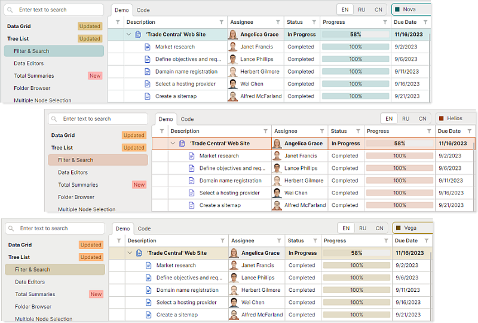
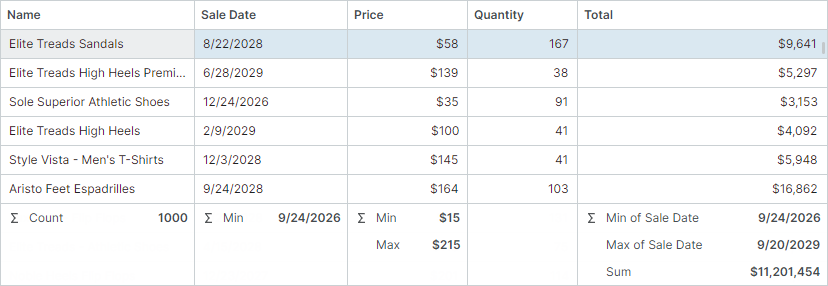
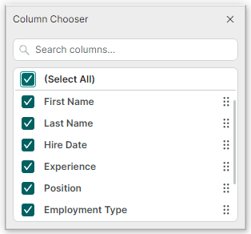
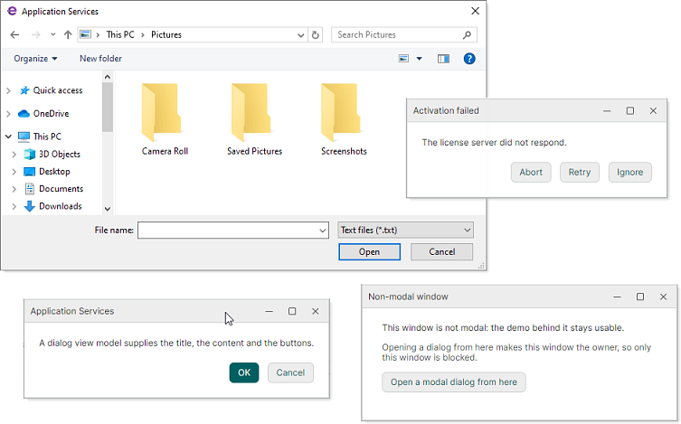
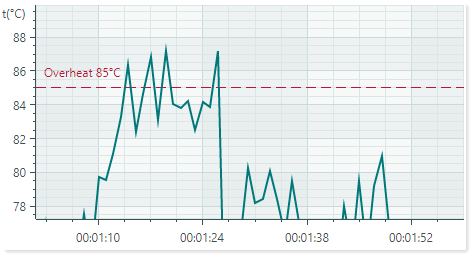
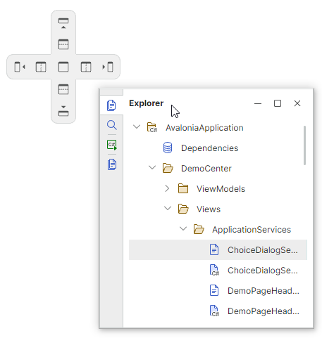

# Version 1.5

## 1.5.53-preview3

### Color Palettes for DeltaDesign Theme

The new version introduces color palettes for the DeltaDesign visual theme. A color palette is a predefined set of colors applied to the base theme, allowing users to quickly switch styling and accent colors.



Applying a palette dynamically updates the color values of key UI elements, including:

- Window, panel, and container backgrounds.
- Editor backgrounds in various states.
- Row and cell backgrounds in data-aware controls.
- Selection highlights, hot-tracked elements, and focused control accents.
- And more.


### DataGrid and TreeList

#### Total Summaries

The DataGrid and TreeList controls can now calculate total summaries against their rows and display the results in a summary footer at the bottom of the control.



- Summary footer — Both controls display a summary footer that shows aggregate values calculated across all rows.
- Built-in summary types — Sum, Min, Max, Count, and Average.
- Multiple summaries per column — Each column can display more than one summary calculated against that column's values.
- Cross-column summaries — You can calculate a summary against one column and display the result in another column's footer cell.
- Runtime summary management — End users can add and remove summaries using a built-in dropdown menu and the Summary Editor dialog.
- Custom summaries — You can handle the `CustomSummary` event to calculate your own aggregate values when the built-in types aren't enough.


#### Row Drag-and-Drop Enhancements

Initially, the DataGrid and TreeList controls prevent rows from being dropped over the empty area (the area below all rows). Starting with v1.5, you can handle the `DragOver` event to allow row drop operations over the empty area. Rows dropped within this area are appended at the end of all rows. 

``` cs 
private void ProductsInStockGrid_DragOver(object sender, DataGridDragEventArgs e)
{
    if (e.DropPosition == DropPosition.EmptyArea)
        e.Effects = Avalonia.Input.DragDropEffects.Move;
}
```

You can also handle the `DragOver` event to forcibly change how rows are inserted when dropped. For example, the following `DragOver` event handler force rows to always append at the end of the control.

``` cs
private void ProductsInStockGrid_DragOver(object sender, DataGridDragEventArgs e)
{
    e.DropPosition = DropPosition.EmptyArea;
    e.Effects = Avalonia.Input.DragDropEffects.Move;
}
```

#### 'Select All' in Column Chooser

The DataGrid and TreeList controls now include the `(Select All)` command in the Column Chooser.

Users now can select or clear all columns in a single action instead of checking each column individually.




### Application Services

This release introduces Application Services — a set of platform-agnostic services for working with windows, dialogs, and application-wide appearance settings directly from your ViewModels, without referencing any Avalonia window type.



You can invoke services from your ViewModel code to:

- Open windows
- Show `Save File` and `Open File` dialogs
- Display message boxes and custom modal dialogs
- Identify the active window
- Customize the settings of the current Eremex visual theme

The services decouple your ViewModels from the UI framework. You access services through well-defined interfaces. The platform-specific work (creating windows, resolving owners, showing dialogs, etc.) is handled internally by the service. 

Available Application Services include:


**User Interaction Services**

| Service | Description |
|---------|---------|
| [`IMessageBoxService`](../API/Eremex.AvaloniaUI.Controls.ApplicationServices/IMessageBoxService.md) | Shows standard message boxes with fixed button sets defined by the [`MessageBoxButtons`](../API/Eremex.AvaloniaUI.Controls/MessageBoxButtons.md) enumeration (Ok, Ok&vert;Cancel, Yes&vert;No&vert;Cancel, Yes&vert;No, Abort&vert;Retry&vert;Ignore, and Retry&vert;Cancel). |
| [`IDialogService`](../API/Eremex.AvaloniaUI.Controls.ApplicationServices/IDialogService.md) | Shows dialogs from ViewModel code, so that a ViewModel can ask the user a question without referencing any window type. A dialog is driven by a _dialog ViewModel_. You can also implement a View to display as the dialog's content. This View is located through the [`ViewLocatorAttribute`](../API/Eremex.AvaloniaUI.Controls.ApplicationServices/ViewLocatorAttribute.md) applied to the dialog ViewModel. |
| [`IChoiceDialogService`](../API/Eremex.AvaloniaUI.Controls.ApplicationServices/IChoiceDialogService.md) | Shows a dialog with an arbitrary set of buttons and returns the result of the pressed one. |
| [`IWindowService`](../API/Eremex.AvaloniaUI.Controls.ApplicationServices/IWindowService.md) | Shows non-modal windows from ViewModel code, so that a ViewModel can open a window without referencing any window type. The counterpart for modal dialogs is [`IDialogService`](../API/Eremex.AvaloniaUI.Controls.ApplicationServices/IDialogService.md). |

**File Services**

| Service | Description |
|---------|---------|
| [`IOpenFileDialogService`](../API/Eremex.AvaloniaUI.Controls.ApplicationServices/IOpenFileDialogService.md) | Shows the platform `Open File` dialog from ViewModel code in sync or async mode. |
| [`ISaveFileDialogService`](../API/Eremex.AvaloniaUI.Controls.ApplicationServices/ISaveFileDialogService.md) | Shows the platform `Save File` dialog from ViewModel code in sync or async mode. |

**Infrastructure Services**

| Service | Description |
|---------|---------|
| [`IWindowsManager`](../API/Eremex.AvaloniaUI.Controls.ApplicationServices/IWindowsManager.md) | Tracks the active window of the application. Dialog services use the [`IWindowsManager`](../API/Eremex.AvaloniaUI.Controls.ApplicationServices/IWindowsManager.md) service to get the default owner for newly created dialogs. |
| [`IAppearanceService`](../API/Eremex.AvaloniaUI.Controls.ApplicationServices/IAppearanceService.md) | Lists visual theme settings and applies the chosen theme variant. |

### Charts

#### Advanced Line Customization with LineStyle

Chart objects now provide advanced options of the [`LineStyle`](../API/Eremex.AvaloniaUI.Charts/LineStyle.md) type for customizing lines. [`LineStyle`](../API/Eremex.AvaloniaUI.Charts/LineStyle.md) exposes properties that give you full control over how lines are rendered. 



These properties include:

- [`Thickness`](../API/Eremex.AvaloniaUI.Charts/LineStyle/Thickness.md) — The stroke thickness.
- [`Dashes`](../API/Eremex.AvaloniaUI.Charts/LineStyle/Dashes.md) — The dash pattern for dashed lines.
- [`DashOffset`](../API/Eremex.AvaloniaUI.Charts/LineStyle/DashOffset.md) — The offset at which the dash pattern starts.
- [`LineCap`](../API/Eremex.AvaloniaUI.Charts/LineStyle/LineCap.md) — The shape used at both ends of a line.
- [`LineJoin`](../API/Eremex.AvaloniaUI.Charts/LineStyle/LineJoin.md) — The join style for the ends of two consecutive lines.
- [`MiterLimit`](../API/Eremex.AvaloniaUI.Charts/LineStyle/MiterLimit.md) — The limit of the thickness of the join on a mitered corner.

New line customization is available for:

- Graph lines in the following series views: all Line and Area Series Views, Lollipop Series View, Range Area Series View, Polar Line and Polar Range Area Series Views, and Smith Line Series View.
- Constant Lines in supported Series Views

    The `ConstantLine.Thickness` property has been deprecated. Use the [`LineStyle.Thickness`](../API/Eremex.AvaloniaUI.Charts/LineStyle/Thickness.md) option instead.

### Docking UI

The [`DockManager`](../API/Eremex.AvaloniaUI.Controls.Docking/DockManager.md) component now provides a new [`CustomizeDockGuide`](../API/Eremex.AvaloniaUI.Controls.Docking/DockManager/CustomizeDockGuide.md) event that allows you to dynamically hide specific dock guides and individual guide items at runtime.




### Editors Library

The SpinEditor control now includes a new `AllowRoundOutOfRangeValue` property that controls whether out-of-range values entered by a user are automatically rounded to the nearest valid value. A range of valid values can be limited using the `Minimum` and `Maximum` properties.

### Breaking Changes

#### DateEditor and SpinEditor - Forced Masked Mode

- The [`DateEditor`](../API/Eremex.AvaloniaUI.Controls.Editors/DateEditor.md) and [`SpinEditor`](../API/Eremex.AvaloniaUI.Controls.Editors/SpinEditor.md) now always work in masked mode — [`MaskType.DateTime`](../API/Eremex.AvaloniaUI.Controls.Editors/MaskType.md) and [`MaskType.Numeric`](../API/Eremex.AvaloniaUI.Controls.Editors/MaskType.md) respectively. It is no longer possible to disable masked mode ([`MaskType.None`](../API/Eremex.AvaloniaUI.Controls.Editors/MaskType.md)) or enable an incompatible mask mode for these editors.

- Docking UI — The `ShowAutoHideExpandButton` property is now obsolte. This property was not supported in previous versions, and not it's deprecated.