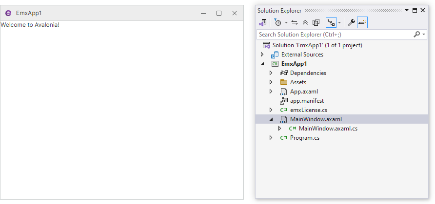
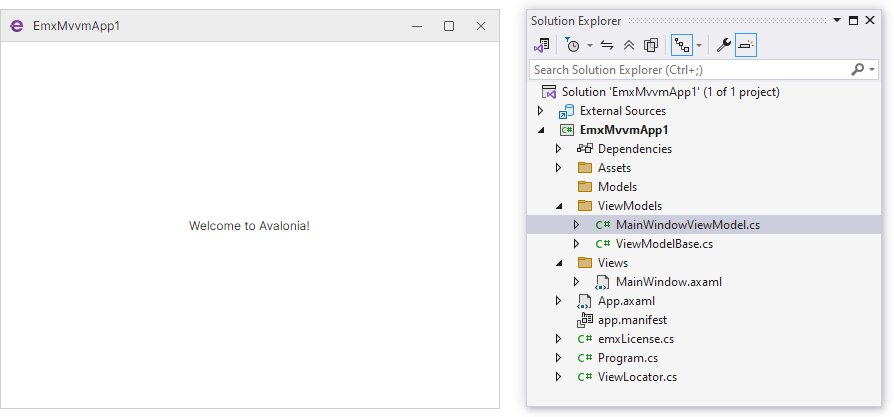
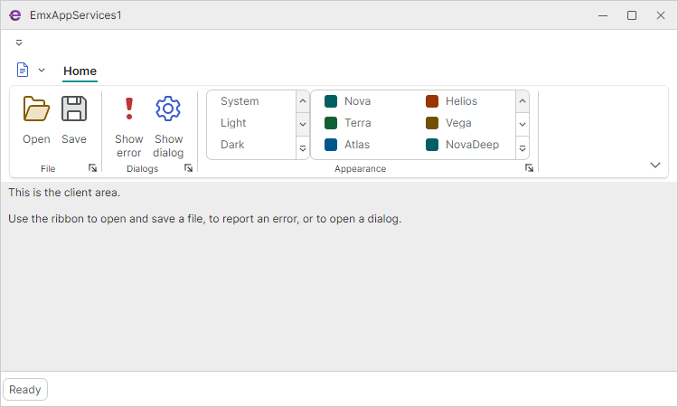
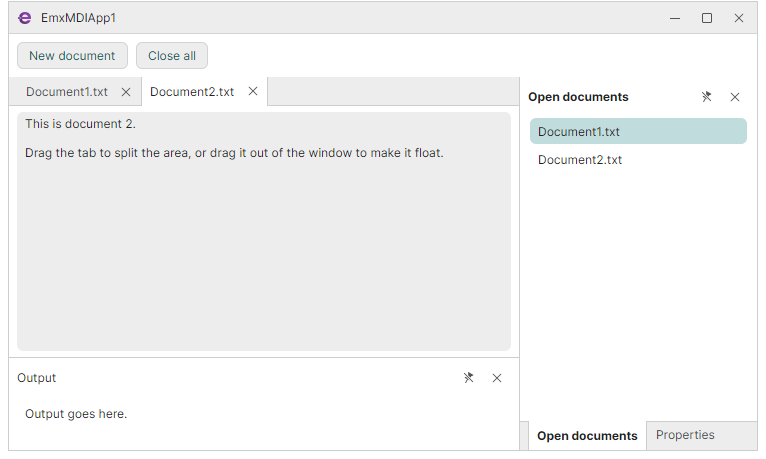
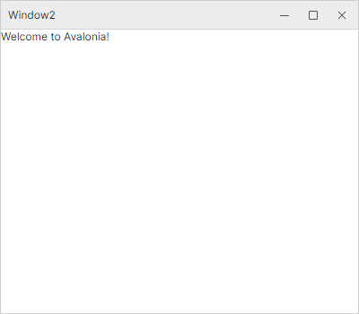

# Project and Project Item Templates

The **Eremex.Avalonia.Templates** [NuGet package](https://www.nuget.org/profiles/EremexControls) contains templates that allow you to quickly create new Avalonia UI projects using the Eremex Controls library, and to add Eremex-based windows to your existing projects.

## Install the Eremex Avalonia Templates

Run the following command:

<code>
dotnet new install Eremex.Avalonia.Templates
</code>

## Update the Eremex Avalonia Templates

To update to the latest version, run the template installation command:

<code>
dotnet new install Eremex.Avalonia.Templates
</code>

## Included Project Templates

All project templates listed below add the required Eremex NuGet packages to the created projects, derive the main window from `MxWindow` for theme support, and register the `DeltaDesign` paint theme.

### Eremex Avalonia .NET App 

An empty desktop application with Eremex NuGet packages.

**Short Name**: `emx.app`

**Create Project Command**: <code>
dotnet new emx.app -n AvaloniaApplication1 
</code>

### Eremex Avalonia .NET MVVM App

An empty MVVM-based application that separates UI and business logic into View and ViewModel layers. 

**Short Name**: `emx.mvvm`

**Create Project Command**: <code>
dotnet new emx.mvvm -n AvaloniaApplication1 
</code>

This application template creates an MVVM-aware Avalonia UI project that references the Eremex Controls library. The template separates the code into the View (_MainWindow_) and ViewModel (_MainWindowViewModel_) layers.

### Eremex Avalonia .NET App with Application Services

An MVVM application that provides ViewModels with service-based access to dialogs, file pickers, and visual theme management.

**Short Name**: `emx.services`

**Create Project Command**: <code>
dotnet new emx.services -n AvaloniaApplication1 
</code>

This template creates an MVVM application that uses Eremex services injected into a View Model to:

- Invoke Open/Save file dialogs
- Show a custom dialog
- Display message boxes
- Provide a theme selector in a Ribbon UI

### Eremex Avalonia .NET MDI App

An application with a tabbed multiple-document (MDI) layout built on the Docking library.

**Short Name**: `emx.mdi`

**Create Project Command**: <code>
dotnet new emx.mdi -n AvaloniaApplication1 
</code>

This template creates an MVVM application with the [`DockManager`](../API/Eremex.AvaloniaUI.Controls.Docking/DockManager.md) component to implement:

- Tabbed multiple document interface (MDI)
- Document creation and closing from the ViewModel

## Included Project Item Templates

### Eremex Avalonia Window

An empty `MxWindow` (a window that supports Eremex visual themes).

**Short Name**: `emx.window`

**Create Project Item Command**: <code>
dotnet new emx.window -n Window2 
</code>

This project item template creates a new `MxWindow`-based Avalonia window. The template only creates two files that define the window: _Window.axaml_ and _Window.axaml.cs_.
