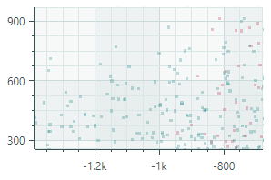
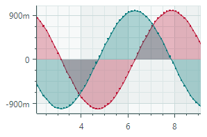
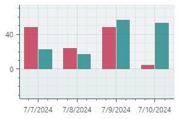
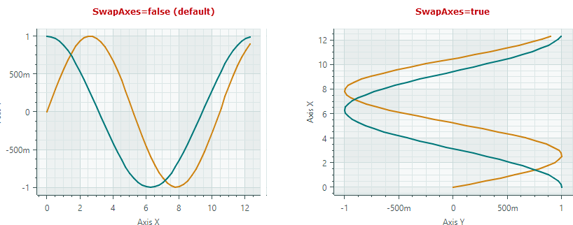
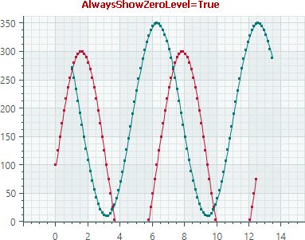
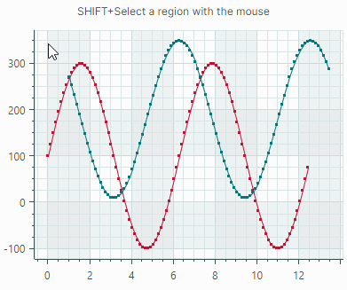
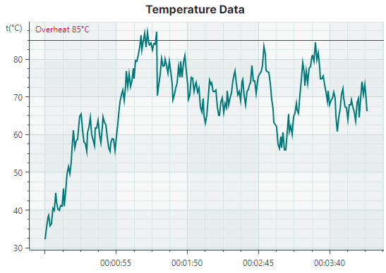

# Cartesian Chart


Контрол `CartesianChart` позволяет создавать диаграммы, используя декартову систему координат. 


Основные возможности контрола включают:
 
- Неограниченное количество серий данных
- Поддерживаемые типы диаграмм (представления): Line, Scatter Line, Point (с поддержкой SVG-маркеров), Area, Step Line, Bar, Candlestick и другие.
- Поддержка нескольких осей
- Взаимная замена осей X и Y
- Инвертирование осей
- Несколько типов осей: числовая (Numeric), дата-время (Date-Time), временной интервал (Time Span), качественная (Qualitative) и логарифмическая (Logarithmic)
- Прокрутка и масштабирование всех осей одновременно
- Прокрутка и масштабирование отдельных осей
- [Crosshair](crosshair.md)
- Высокая производительность при отображении больших объёмов данных
- Визуализация данных в реальном времени
- Полосы (Strips) и постоянные линии (constant lines)
- Пустые точки (разрывы)
- Использование паттерна проектирования MVVM для предоставления данных и настройки параметров диаграммы
- Отображение быстро изменяющихся данных в реальном времени. Используйте специальный адаптер данных для реализации подвижного видового окна (moving viewport)


## Начало работы

- [Начало работы с диаграммами](get-started-with-charts.md)
- [Начало работы с диаграммами — паттерн MVVM](get-started-with-charts-mvvm.md)

## Элементы контрола диаграммы

Основные элементы контрола диаграммы — это серии и оси. 

**Серия (Series)** — предоставляет данные и определяет способ их визуализации. Вы можете отобразить столько серий, сколько нужно, в рамках одного контрола диаграммы. Подробнее см. в разделе [Серии](#серии).

**Оси (Axes)** — типичная декартова диаграмма отображает две оси: ось X и ось Y. Вы также можете добавить дополнительные оси к диаграмме, когда она отображает две или более серии. Каждая серия может быть связана с собственной осью. Подробнее см. в разделе [Оси](#оси).


## Серии 

Серия предоставляет данные для отрисовки контролом диаграммы и задаёт представление серии (визуальное отображение этих данных).

Класс `CartesianSeries` инкапсулирует серию для контрола `CartesianChart`. Чтобы добавить серии в диаграмму, используйте коллекцию `CartesianChart.Series`. Вы также можете заполнить диаграмму сериями, используя паттерн проектирования MVVM. Для этого используйте свойства `CartesianChart.SeriesSource` и `CartesianChart.SeriesTemplate`. Подробнее см. по следующей ссылке: [Начало работы с диаграммами — паттерн MVVM](get-started-with-charts-mvvm.md).


Следующий код определяет одну серию в коллекции `CartesianChart.Series`.

``` xml
<mxc:CartesianChart>
    <mxc:CartesianChart.Series>
        <mxc:CartesianSeries DataAdapter="{Binding Series.DataAdapter}">
            <mxc:CartesianLineSeriesView Color="{Binding Series.Color}" Thickness="2" />
        </mxc:CartesianSeries>
    </mxc:CartesianChart.Series>
    <!-- ... -->
</mxc:CartesianChart>
```


### Данные серии

Вы можете предоставить данные для серий контрола диаграммы с помощью _адаптеров данных (Data Adapters)_. 

``` xml
<mxc:CartesianSeries DataAdapter="{Binding Series.DataAdapter}">
    <!-- ... -->
</mxc:CartesianSeries>
```

Адаптер данных — это объект, реализующий интерфейс `ISeriesDataAdapter`. Обычно вам не нужно реализовывать этот интерфейс вручную. Eremex Charts поставляются с несколькими адаптерами данных для различных типов данных (числовых, дата-время и качественных). Выберите адаптер данных исходя из ваших требований. 

Ниже приведены адаптеры данных, сгруппированные по типу значений _X_:

Числовые значения _X_:

- `SortedNumericDataAdapter`
- `FormulaDataAdapter`
- `ScatterDataAdapter`
- `NumericRangeDataAdapter`

Значения _X_ типа дата и время:

- `SortedDateTimeDataAdapter`
- `DateTimeRangeDataAdapter`
- `SortedTimeSpanDataAdapter`
- `TimeSpanRangeDataAdapter`
- `CandlestickDataAdapter` (для [Candlestick Series View](cartesian-series-views/candlestick-series-view.md))
- `SummaryCandlestickDataAdapter` (для [Candlestick Series View](cartesian-series-views/candlestick-series-view.md))

Качественные значения _X_:

- `QualitativeDataAdapter`
- `QualitativeRangeDataAdapter` 


#### Пустые точки (разрывы)

CartesianChart поддерживает пустые точки. Это точки данных с неопределёнными значениями. Контрол диаграммы оставляет видимые разрывы в серии, когда встречает пустые точки.


Чтобы задать пустую точку данных, установите значение точки данных равным _double.NaN_, _double.PositiveInfinity_ или _double.NegativeInfinity_.

<!-- TODO

Example - simple data adapter with empty points
-->


<!-- TODO

Describe these Data Adapters in more detail
 -->

<!-- TODO
The following example implements a Data Adapter 


The following example implements a Data Adapter 
(numeric data adapter)


``` cs
public partial class CartesianStripsAndConstantLinesViewModel : ChartsPageViewModel
{
    [ObservableProperty] SeriesViewModel series = new() { Color = Color.FromArgb(255, 0, 120, 122), DataAdapter = CreateAdapter() };
    [ObservableProperty] ObservableCollection<ConstantLineViewModel> constantLines = new();
    
    static ISeriesDataAdapter CreateAdapter()
    {
        const int pointsCount = 250;
        
        var random = new Random(0);
        var arguments = new List<TimeSpan>(pointsCount);
        var values = new List<double>(pointsCount);
        double startTemperature = 30;
        for (int i = 0; i < pointsCount; i++) {
            arguments.Add(TimeSpan.FromSeconds(i));
            double temperature = startTemperature + (random.NextDouble() - 0.5) * 10;
            if (temperature > 90)
                temperature -= 20;
            if (temperature < 20)
                temperature += 10;
            values.Add(temperature);
            startTemperature = temperature;
        }
        
        return new SortedTimeSpanDataAdapter(arguments, values);
    }
}
```

 -->

### Видимость серии

Используйте свойство `Series.Visible`, чтобы скрыть серию.

``` cs
chart1.Series[0].Visible = !chart1.Series[0].Visible;
```

### Представления серий 
`CartesianChart` поддерживает несколько представлений серий (типов диаграмм):

<style>

th {
    visibility: collapse;
}
td, th, tr {
   border: none!important;
   vertical-align: top;
}
</style>

| <div style="width:400px"></div> | <div style="width:400px"></div> | 
| --- | --- |
| [Line Series View](cartesian-series-views/line-series-vew.md) (объект `CartesianLineSeriesView`)<br>Отображает точки, соединённые линиями.<br> | [Scatter Line Series View](cartesian-series-views/scatter-line-series-view.md) (объект `CartesianScatterLineSeriesView`)<br>Соединяет точки в том порядке, в котором они расположены в серии данных.<br> |
| [Point Series View](cartesian-series-views/point-series-view.md) (объект `CartesianPointSeriesView`)<br>Отображает отдельные точки.<br> | [Area Series View](cartesian-series-views/area-series-view.md) (объект `CartesianAreaSeriesView`)<br>Соединяет точки линиями и закрашивает области.<br> | 
| [Step Line Series View](cartesian-series-views/step-line-series-view.md) (объект `CartesianStepLineSeriesView`)<br>Соединяет точки горизонтальными и вертикальными отрезками линий.<br> | [Step Area Series View](cartesian-series-views/step-area-series-view.md) (объект `CartesianStepAreaSeriesView`)<br>Соединяет точки горизонтальными и вертикальными отрезками линий и закрашивает области.<br> |
| [Range Area Series View](cartesian-series-views/range-area-series-view.md) (объект `CartesianRangeAreaSeriesView`)<br>Закрашивает область между двумя значениями Y серии данных.<br> | [Stacked Area Series View](cartesian-series-views/stacked-area-series-view.md) (объект `CartesianStackedAreaSeriesView`)<br>Эти представления отрисовывают закрашенные области, наложенные друг на друга, чтобы показать абсолютные соотношения между сериями данных. <br> |
| [Full-Stacked Area Series View](cartesian-series-views/full-stacked-area-series-view.md) (объект `CartesianFullStackedAreaSeriesView`)<br>Эти представления отрисовывают закрашенные области, наложенные друг на друга, чтобы показать пропорциональные соотношения между сериями данных.<br> | [Bar Series View](cartesian-series-views/side-by-side-bar-series-view.md) (объект `CartesianSideBySideBarSeriesView`)<br>Визуализирует данные в виде набора прямоугольных столбцов.<br> |
| [Range Bar Series View](cartesian-series-views/side-by-side-range-bar-series-view.md) (объект `CartesianSideBySideRangeBarSeriesView`)<br>Отрисовывает прямоугольные столбцы между двумя значениями Y серии данных.<br> | [Candlestick Series View](cartesian-series-views/candlestick-series-view.md)<br>(объект `CartesianCandlestickSeriesView`)<br>Финансовая диаграмма, описывающая изменение цены актива. Для каждой точки данных диаграмма отображает набор из четырёх значений: цены открытия (Open), закрытия (Close), максимума (High) и минимума (Low). <br> |
| [Lollipop Series View](cartesian-series-views/lollipop-series-view.md) (объект `CartesianLollipopSeriesView`)<br>Представляет данные в виде точек (маркеров), соединённых с горизонтальной или вертикальной осью тонкими линиями.<br> |  |

Чтобы задать представление для серии, определите соответствующий объект **...SeriesView** в качестве содержимого объекта `CartesianSeries`. В коде используйте свойство `CartesianSeries.View`, чтобы задать представление серии. 

Следующий пример назначает серии представление Line Series View.
``` xml
<mxc:CartesianSeries DataAdapter="{Binding Series.DataAdapter}">
    <mxc:CartesianLineSeriesView Color="{Binding Series.Color}" Thickness="2" />
</mxc:CartesianSeries>
```


## Оси

Контрол `CartesianChart` автоматически создаёт декартовы оси (ось X и ось Y), если вы не определяете их вручную. Если вам нужно настроить оси в XAML, определите объекты `AxisX` и/или `AxisY` в коллекциях `CartesianChart.AxesX`/`CartesianChart.AxesY`, а затем измените параметры этих осей.

``` xml
<mxc:CartesianChart>
    <!-- ... -->

    <mxc:CartesianChart.AxesX>
        <mxc:AxisX ShowTitle="False">
        </mxc:AxisX>
    </mxc:CartesianChart.AxesX>

    <mxc:CartesianChart.AxesY>
        <mxc:AxisY Title="t(°C)" TitlePosition="WithLabels">
            <mxc:AxisYRange AlwaysShowZeroLevel="False" />
        </mxc:AxisY>
    </mxc:CartesianChart.AxesY>
</mxc:CartesianChart>
```

### Взаимная замена осей X и Y

Ориентация осей в контроле Cartesian Chart по умолчанию — горизонтальная для осей _X_ и вертикальная для осей _Y_. Используйте свойство `CartesianChart.SwapAxes`, чтобы поменять оси местами. Это свойство поддерживается для всех типов представлений серий.

Следующие изображения показывают, как свойство `SwapAxes` изменяет расположение осей для линейных диаграмм и столбчатых диаграмм.




### Инвертирование направления оси

Используйте свойство `Axis.Reverse`, чтобы инвертировать направление осей _X_ и _Y_.

- `false` (по умолчанию) — значения увеличиваются слева направо для оси _X_ и снизу вверх для оси _Y_.
- `true` — значения увеличиваются справа налево для оси _X_ и сверху вниз для оси _Y_.


``` xml
<mxc:CartesianChart.AxesY>
    <mxc:AxisY Title="Axis Y" Reverse="True"/>
</mxc:CartesianChart.AxesY>
```

### Диапазон значений оси

Разместите объекты `AxisXRange`/`AxisYRange` в качестве содержимого объектов `AxisX`/`AxisY`, чтобы задать параметры диапазона осей. Объекты `AxisXRange`/`AxisYRange` позволяют настроить общий диапазон значений, видимый диапазон значений, видимость нулевого уровня и т.д.

``` xml
<mxc:CartesianChart.AxesX>
    <mxc:AxisX ShowTitle="False" >
        <mxc:AxisXRange MinSideMargin="0.15" MaxSideMargin="0.15"/>
    </mxc:AxisX>
</mxc:CartesianChart.AxesX>
<mxc:CartesianChart.AxesY>
    <mxc:AxisY Title="Amplitude (dB SPL)">
        <mxc:AxisYRange AlwaysShowZeroLevel="False" />
    </mxc:AxisY>
</mxc:CartesianChart.AxesY>
```

- `AutoCorrectWholeRange` (по умолчанию `true`) — определяет, вычисляется ли общий диапазон оси автоматически на основе данных серии.

  Чтобы задать пользовательский общий диапазон оси, отключите опцию `AutoCorrectWholeRange`, а затем используйте свойства `WholeMin` и `WholeMax`.

- `SynchronizeVisualRange` — определяет, устанавливается ли видимый диапазон оси равным общему диапазону оси при изменении последнего.
- `AlwaysShowZeroLevel` (только для объектов `AxisYRange`) (по умолчанию `true`) — определяет, корректируется ли общий диапазон оси автоматически, чтобы включить нулевой уровень. См. `WholeMax`.

- `WholeMax` — задаёт максимальное значение общего диапазона оси. Свойство `WholeMin` задаёт минимальное значение.
    
    Отключите свойство `AutoCorrectWholeRange`, чтобы использовать свойства `WholeMin` и `WholeMax`. 
    
    Если опция `AlwaysShowZeroLevel` включена (поведение по умолчанию), нулевой уровень принудительно включается в общий диапазон оси.

    #### Пример — Показать и скрыть нулевой уровень

    Рассмотрим следующий пример, в котором свойства `WholeMin` и `WholeMax` задают пользовательские границы общего диапазона оси. Диапазон автоматически включает нулевой уровень, поскольку свойство `AlwaysShowZeroLevel` включено.

    ``` xml
    <mxc:CartesianChart.AxesY>
        <mxc:AxisY ShowTitle="False">
            <mxc:AxisYRange WholeMin="100" WholeMax="350" AutoCorrectWholeRange="False" AlwaysShowZeroLevel="True" />
        </mxc:AxisY>
    </mxc:CartesianChart.AxesY>
    ```
    


    Отключите свойство `AlwaysShowZeroLevel`, чтобы ограничить общий диапазон оси значениями `WholeMin` и `WholeMax`, игнорируя нулевой уровень.

    ``` xml
    <mxc:AxisYRange WholeMin="100" WholeMax="350" AutoCorrectWholeRange="False" AlwaysShowZeroLevel="False" />
    ```

    
    

- `WholeMin` — задаёт минимальное значение общего диапазона оси. Подробнее см. в описании `WholeMax`.
- `VisualMax` — задаёт максимальное значение текущего видимого диапазона оси. Свойство `VisualMin` задаёт минимальное значение.
- `VisualMin` — задаёт минимальное значение текущего видимого диапазона оси.

- `MaxSideMargin` — задаёт величину пустого пространства между крайней правой (или верхней) точкой данных и краем области диаграммы, выраженную как доля от общего диапазона данных. Например, значение 0.1 добавляет отступ, равный 10% диапазона.
    
    Для оси _Y_ свойство `MaxSideMargin` не действует, когда свойство `AlwaysShowZeroLevel` равно `true`, а нулевой уровень отображается у верхнего края. Установите свойство `AlwaysShowZeroLevel` в значение `false`, чтобы устранить эту проблему.

- `MinSideMargin` — задаёт величину пустого пространства между крайней левой (или нижней) точкой данных и краем области диаграммы, выраженную как доля от общего диапазона данных. Например, значение 0.1 добавляет отступ, равный 10% диапазона.

    Для оси _Y_ свойство `MinSideMargin` не действует, когда свойство `AlwaysShowZeroLevel` равно `true`, а нулевой уровень отображается у нижнего края. Установите свойство `AlwaysShowZeroLevel` в значение `false`, чтобы устранить эту проблему.

  

<!-- TODO
AlwaysShowZeroLevel - when to always show
SideMargin - wrong names
SideMargin - percentage, where 0 means no margin, 0.1 means 10% of the total range?

 -->

### Масштаб оси

Масштаб оси определяет тип единиц масштаба и различные параметры отображения оси. На изображении ниже показаны несколько типов масштаба:


Чтобы задать параметры масштаба для осей, используйте свойства `AxisX.ScaleOptions` и `AxisY.ScaleOptions`.

#### Настройка параметров масштаба для оси _X_

Используйте свойство `AxisX.ScaleOptions`, чтобы изменить параметры масштаба оси _X_. 
Это свойство имеет базовый тип `ScaleOptions`. 

Чтобы изменить параметры масштаба, установите свойство `AxisX.ScaleOptions` в один из следующих объектов в зависимости от типа значений _X_ серии: 

- `NumericScaleOptions` — числовой масштаб данных. Используйте этот тип масштаба, если значения _X_, предоставляемые серией, являются числовыми.
    ``` xml
    <mxc:AxisX Title="Frequency">
        <mxc:AxisX.ScaleOptions>
            <mxc:NumericScaleOptions 
                LogarithmicBase="{Binding AxisX.LogarithmicBase}"
                LabelFormatter="{Binding FrequencyFormatter}" />
        </mxc:AxisX.ScaleOptions>
    </mxc:AxisX>
    ```

<!-- TODO
Describe members of the NumericScaleOptions and other classes, such as 
GridSpacing, LabelFormatter
etc
  -->

- `DateTimeScaleOptions` — масштаб данных DateTime. Используйте этот тип масштаба, если значения _X_, предоставляемые серией, являются значениями `DateTime`. Свойство `DateTimeScaleOptions.MeasureUnit` позволяет задать единицу времени (единицу оси) для масштаба оси: `Millisecond`, `Second`, `Minute`, `Hour`, `Day`, `Week`, `Month`, `Quarter` или `Year`

    ``` xml
    <mxc:AxisX ShowTitle="False">
        <mxc:AxisX.ScaleOptions>
            <mxc:DateTimeScaleOptions MeasureUnit="Day" />
        </mxc:AxisX.ScaleOptions>
    </mxc:AxisX>
    ```

- `TimeSpanScaleOptions` — масштаб данных TimeSpan. Используйте этот тип масштаба, если значения _X_, предоставляемые серией, являются значениями `TimeSpan`. Свойство `TimeSpanScaleOptions.MeasureUnit` позволяет задать единицу времени для масштаба оси: `Millisecond`, `Second`, `Minute`, `Hour` или `Day`.

    ``` xml
    <mxc:AxisX>
        <mxc:AxisX.ScaleOptions>
            <mxc:TimeSpanScaleOptions MeasureUnit="Minute" />
        </mxc:AxisX.ScaleOptions>
    </mxc:AxisX>
    ```

- `QualitativeScaleOptions` — качественный масштаб данных. Используйте этот тип масштаба, если значения _X_, предоставляемые серией, являются качественными значениями (текстовыми строками).

    ``` xml
    <mxc:AxisX >
        <mxc:AxisX.ScaleOptions>
            <mxc:QualitativeScaleOptions GridSpacing="1" />
        </mxc:AxisX.ScaleOptions>
    </mxc:AxisX>
    ```

#### Настройка параметров масштаба для оси _Y_

Используйте свойство `AxisY.ScaleOptions`, чтобы изменить параметры масштаба оси _Y_. Это свойство имеет тип `NumericScaleOptions`.

``` xml
<mxc:AxisY Title="Amplitude (dB SPL)">
    <mxc:AxisY.ScaleOptions>
        <mxc:NumericScaleOptions LabelFormatter="{Binding MyCustomLabelFormatter}"/>
    </mxc:AxisY.ScaleOptions>
</mxc:AxisY>
```

#### Форматирование меток осей

Свойство `ScaleOptions.LabelFormatter` позволяет указать объект, форматирующий отображаемые значения оси пользовательским образом. Вы можете реализовать пользовательский форматтер меток на основе функции/выражения с помощью объекта `Eremex.AvaloniaUI.Charts.FuncLabelFormatter`.

В следующем примере реализован пользовательский форматтер меток для значений `DateTime`.


``` xml
<mxc:AxisX Name="salesAxis" Title="Sales">
    <mxc:AxisX.ScaleOptions>
        <mxc:DateTimeScaleOptions MeasureUnit="Month" LabelFormatter="{Binding MonthFormatter}" />
    </mxc:AxisX.ScaleOptions>
</mxc:AxisX>
```

``` cs
public partial class MainWindowViewModel : ViewModelBase
{
    // ...
    [ObservableProperty] FuncLabelFormatter monthFormatter = new(o => String.Format("{0:MMM} {0:yy}", o));
}
```

См. также: [Форматирование значений в метках серий Crosshair](crosshair.md#форматирование-значений-в-метках-серий-crosshair)

### Несколько осей

Типичная декартова диаграмма имеет одну ось _X_ и одну ось _Y_. При необходимости вы можете добавить любое количество дополнительных осей _X_ и _Y_. Это полезно, когда вы отображаете несколько серий и хотите показать собственную ось _X_ и/или _Y_ для каждой серии.


Чтобы связать серию с осью, выполните следующее:

- Установите свойство `Axis.Key` оси в уникальный идентификатор (строку).
- Установите свойство `AxisXKey`/`AxisYKey` серии в значение свойства `Axis.Key`.

 Следующий пример добавляет ось _X_ и связывает её с серией _lineSeries_.


``` xml
<mxc:CartesianSeries Name="lineSeries" DataAdapter="{Binding LineSeries.DataAdapter}"  
  AxisXKey="lineSeriesAxis">
    <mxc:CartesianLineSeriesView Color="{Binding LineSeries.Color}" />
</mxc:CartesianSeries>

<mxc:CartesianChart.AxesX>
    <!-- ... -->
    <mxc:AxisX Position="Far" Title="Expenses"
       Key="lineSeriesAxis">
        <mxc:AxisX.ScaleOptions>
            <mxc:NumericScaleOptions />
        </mxc:AxisX.ScaleOptions>
    </mxc:AxisX>
</mxc:CartesianChart.AxesX>
```

### Прокрутка и масштабирование

Пользователи могут масштабировать и прокручивать всё представление и отдельные оси с помощью мыши. Они также могут выполнять масштабирование в конкретную область или диапазон значений.

#### Прокрутка и масштабирование всех осей одновременно 


#### Прокрутка и масштабирование отдельных осей


#### Масштабирование в конкретную область и диапазон значений оси



Подробнее см. в разделе [Прокрутка и масштабирование в контроле диаграммы](scroll-and-zoom-in-a-chart-control.md)


### Параметры осей

В следующем списке приведены параметры отображения и поведения декартовых осей:

- `ConstantLines` и `ConstantLinesSource` — позволяют отрисовать постоянные линии для конкретных значений. См. [Постоянные линии и полосы](#постоянные-линии-и-полосы).
- `EnableScrolling` — позволяет пользователю прокручивать ось операцией перетаскивания мышью.
- `EnableZooming` — позволяет пользователю масштабировать ось.
- `InterlacingColor` — цвет, используемый для отрисовки чередующихся полос (когда включена опция `ShowInterlacing`).
- `MinorCount` — задаёт количество второстепенных отметок (tickmarks) и линий сетки.
- `Position` — задаёт положение оси. Доступные варианты: `Near` (ось X отображается снизу, ось Y — у левого края диаграммы) и `Far` (ось X отображается сверху, ось Y — у правого края диаграммы).
- `ShowAxisLine` — задаёт видимость линии оси.
- `ShowInterlacing` — определяет, закрашивать ли чередующиеся полосы между основными линиями сетки.
- `ShowLabels` — задаёт видимость меток, соответствующих основным отметкам.
- `ShowMajorGridlines` — задаёт видимость линий сетки, соответствующих основным отметкам.
- `ShowMajorTickmarks` — задаёт видимость основных отметок.
- `ShowMinorGridlines` — задаёт видимость линий сетки, соответствующих второстепенным отметкам.
- `ShowMinorTickmarks` — задаёт видимость второстепенных отметок.
- `ShowTitle` — задаёт видимость заголовка оси (свойство `Title`).
- `Strips` и `StripsSource` — позволяют закрасить диапазоны между конкретными значениями. См. [Постоянные линии и полосы](#постоянные-линии-и-полосы).
- `Thickness` — толщина линии оси.
- `Title` — задаёт заголовок оси.
- `TitlePosition` — задаёт положение заголовка оси.


### Постоянные линии и полосы

Контрол `CartesianChart` включает поддержку постоянных линий и полос. Они позволяют выделять конкретные значения и диапазоны значений вдоль осей.

#### Постоянные линии

Постоянные линии — это вертикальные или горизонтальные линии, отрисовываемые перпендикулярно осям. Они служат визуальными маркерами для выделения конкретных значений вдоль осей. Используйте свойство `Axis.ConstantLines` или `Axis.ConstantLinesSource`, чтобы задать постоянные линии. Каждая постоянная линия инкапсулируется объектом `ConstantLine`.

Следующий код создаёт горизонтальную постоянную линию, обозначающую значение 85 вдоль оси Y.



``` xml
<mxc:CartesianChart.AxesY>
    <mxc:AxisY Title="t(°C)" TitlePosition="WithLabels">
        <mxc:AxisY.ConstantLines>
            <mxc:ConstantLine Title="Overheat 85°C" AxisValue="85" Color="#BD1436"/>
        </mxc:AxisY.ConstantLines>
    </mxc:AxisY>
</mxc:CartesianChart.AxesY>
```

Свойство `Axis.ConstantLinesSource` позволяет инициализировать постоянные линии из коллекции объектов, определённых в View Model. Чтобы создать объекты `ConstantLine` из исходных объектов данных, используйте свойство `Axis.ConstantLineTemplate` для задания шаблона. Пример см. в демонстрации `Strips and Constant Lines`.


##### Настройки постоянной линии

- `ConstantLine.AxisValue` — значение оси, связанное с постоянной линией.
- `ConstantLine.Color` — цвет для отрисовки постоянной линии.
- `ConstantLine.ShowBehind` — определяет, отрисовывать ли постоянную линию под сериями (по умолчанию) или над ними.
- `ConstantLine.ShowTitle` — определяет, показывать (по умолчанию) или скрывать заголовок (см. параметр `Title`).
- `ConstantLine.Thickness` — толщина постоянной линии.
- `ConstantLine.Title` — заголовок, отображаемый рядом с постоянной линией. Параметр `TitlePosition` задаёт положение заголовка.
- `ConstantLine.TitleIndent` — горизонтальное и вертикальное расстояние заголовка от линии.
- `ConstantLine.TitlePosition` — расположение заголовка относительно линии. Доступные варианты: `NearAboveLine`, `NearBelowLine`, `FarAboveLine` и `FarBelowLine`.


#### Постоянные полосы

Постоянные полосы позволяют выделять конкретные диапазоны значений вдоль осей. Как и постоянные линии, полосы отрисовываются перпендикулярно осям. Вы можете задать полосы с помощью свойств `Axis.Strips` и `Axis.StripsSource`. Каждая полоса инкапсулируется объектом `Strip`.

Следующий код создаёт полосу, выделяющую диапазон значений _Y_ от 40 до 65. Полоса закрашена полупрозрачным светло-зелёным цветом. Обратите внимание, что если использовать непрозрачный цвет для полосы, она будет перекрывать линии сетки контрола диаграммы.


``` xml
<mxc:CartesianChart.AxesY>
    <mxc:AxisY Title="t(°C)" TitlePosition="WithLabels">
        <mxc:AxisY.Strips>
            <mxc:Strip AxisValue1="40" AxisValue2="65" Color="#4043C927" />
        </mxc:AxisY.Strips>
    </mxc:AxisY>
</mxc:CartesianChart.AxesY>
```

Свойство `Axis.StripsSource` позволяет инициализировать полосы из коллекции объектов, определённых в View Model. Чтобы создать объекты `Strip` из исходных объектов данных, используйте свойство `Axis.StripTemplate` для задания шаблона.

##### Настройки полосы

- `ConstantLine.AxisValue1` — задаёт первое (начальное или конечное) значение диапазона вдоль оси
- `ConstantLine.AxisValue2` — задаёт второе (конечное или начальное) значение диапазона вдоль оси.
- `ConstantLine.Color` — цвет, используемый для закрашивания полосы.

    !!! tip
    
        Используйте полупрозрачный цвет, чтобы линии сетки были видны под полосой.


## Преобразование между координатами диаграммы и координатами экрана

Иногда может потребоваться преобразовать координаты диаграммы в экранные координаты, и наоборот. Следующие методы позволяют выполнить эту задачу:

- `CartesianChart.DiagramPointToScreenPoint` — преобразует координаты точки диаграммы в экранные координаты. Точка диаграммы адресуется осями _X_ и _Y_, а также значениями вдоль этих осей.
- `CartesianChart.ScreenPointToDiagramPoint` — преобразует экранные координаты в координаты точки в рамках контрола диаграммы. Объект, возвращаемый методом, позволяет получить координаты диаграммы или определить, находятся ли экранные координаты в пределах видового окна контрола.

<br>
<br>

<sup>*</sup> Эта страница переведена с использованием технологий машинного перевода.
