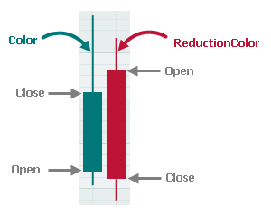
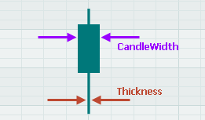

# Candlestick Series View

Используйте Candlestick Series View (`CartesianCandlestickSeriesView`) в контроле `CartesianChart`, чтобы создать финансовую диаграмму, показывающую движение цены актива. Точки данных отображают цены High, Low, Open и Close ценной бумаги за определённый период. 


Каждая точка данных отрисовывается в виде свечи (candle), которая состоит из сплошного бруска и двух "усов" (whiskers), которые могут выходить за пределы бруска. Верхнее и нижнее значения сплошного бруска определяют цены Open и Close, а "усы" задают цены High и Low.


Для закраски свечей используются два цвета. Если цена Close выше цены Open, свеча закрашивается одним цветом. В противном случае свеча закрашивается другим цветом. Например, на изображении выше восходящая свеча закрашена зелёным, а нисходящая — красным. С помощью Candlestick Series View вы можете задать пользовательские цвета для восходящих и нисходящих свечей.

Следующий фрагмент кода из демонстрационного примера диаграммы "Candlestick" создаёт декартову диаграмму, отображающую Candlestick Series View.

``` xml
<mxc:CartesianChart>
    <mxc:CartesianSeries AxisYKey="Price" DataAdapter="{Binding StockData}" SeriesName="Price">
        <mxc:CartesianCandlestickSeriesView Color="#00787A" ReductionColor="#BD1436" />
    </mxc:CartesianSeries>
</mxc:CartesianChart>
```

``` cs
public partial class CartesianCandlestickSeriesViewViewModel : ChartsPageViewModel
{
    [ObservableProperty] CandlestickDataAdapter stockData;
    //...
}
```
<!-- TODO
Необязательны в примере выше?
AxisYKey="Price"
SeriesName="Price"
 -->

## Данные для Candlestick Series View

Данные для любого Cartersian Series View предоставляются с помощью [адаптера данных](../cartesian-chart.md#данные-серии), назначенного свойству `CartesianSeries.DataAdapter`. Адаптер данных предоставляет значения _X_ и _Y_ для диаграммы.

Для Candlestick Series View доступны два адаптера данных:

- `CandlestickDataAdapter`
- `SummaryCandlestickDataAdapter`

Значения _X_ имеют тип DateTime в обоих адаптерах данных. Выберите один из этих адаптеров данных в зависимости от типа имеющихся у вас значений _Y_.

### CandlestickDataAdapter

Когда вы используете объект `CandlestickDataAdapter`, вы предоставляете четыре значения _Y_ типа Double, задающих цены Open, Close, High и Low для каждого аргумента _X_. Вы можете использовать конструктор `CandlestickDataAdapter`, чтобы заполнить адаптер данными.

Следующий код из демонстрационного примера диаграммы "Candlestick" демонстрирует инициализацию объекта `CandlestickDataAdapter`.

``` cs
[ObservableProperty] CandlestickDataAdapter stockData;

public CartesianCandlestickSeriesViewViewModel()
{
    var data = CsvSources.Stock;
    var arguments = new List<DateTime>(data.Count);
    var open = new List<double>(data.Count);
    var high = new List<double>(data.Count);
    var low = new List<double>(data.Count);
    var close = new List<double>(data.Count);
    for (var i = data.Count - 1; i >= 0; i--)
    {
        arguments.Add(data[i].Date);
        open.Add(data[i].Open);
        high.Add(data[i].High);
        low.Add(data[i].Low);
        close.Add(data[i].Close);
    }
    StockData = new CandlestickDataAdapter(arguments, open, high, low, close);
}
```

Объект `CandlestickDataAdapter` требует, чтобы вы задали единицу измерения времени (единицу оси) для оси _X_ с помощью свойства `DateTimeScaleOptions.MeasureUnit`. 

В приведённом ниже фрагменте кода единица оси установлена в `Day`.

``` xml
<mxc:CartesianChart.AxesX>
    <mxc:AxisX ShowTitle="False">
        <mxc:AxisXRange MinSideMargin="0.01" MaxSideMargin="0.01" VisualMax="" />
        <mxc:AxisX.ScaleOptions>
            <mxc:DateTimeScaleOptions MeasureUnit="Day" />
        </mxc:AxisX.ScaleOptions>
    </mxc:AxisX>
</mxc:CartesianChart.AxesX>
```

Аргументы _X_ должны предоставляться адаптеру данных `CandlestickDataAdapter` в соответствии с этой единицей оси. Например, когда единица оси установлена в `Day`, значения _X_ должны задавать отдельные дни.

### SummaryCandlestickDataAdapter

Адаптер `SummaryCandlestickDataAdapter` суммирует предоставленные вами данные и автоматически вычисляет цены Open, Close, High и Low для указанного временного интервала (единицы измерения времени) (например, за секунду, минуту, час, день, неделю и т.д., или кратные величины временного интервала). Например, вы можете предоставлять данные с интервалом в одну секунду и позволить `SummaryCandlestickDataAdapter` автоматически суммировать эти данные, скажем, с интервалом в 5 секунд, минуту или час.

Значения _X_ задают отдельные значения даты-времени. Для каждого значения _X_ предоставьте одно значение _Y_ типа Double.

Чтобы задать временной интервал агрегации, используйте два свойства:

- `SummaryCandlestickDataAdapter.MeasureUnit` — Задаёт базовый временной интервал агрегации (Millisecond, Second, Minute, Hour, Day, Week, Month, Quarter или Year), для которого адаптер данных вычисляет цены Open, Close, High и Low.

- `SummaryCandlestickDataAdapter.MeasureUnitFactor` (целочисленное значение; по умолчанию `1`) — Задаёт множитель для базового временного интервала для вычисления фактического временного интервала. Фактическая длина временного интервала вычисляется по выражению: `MeasureUnit x MeasureUnitFactor`. 

В следующем примере временной интервал устанавливается равным "2 секундам":

``` cs
[ObservableProperty]
SummaryFinancialDataAdapter dataAdapter;

public CartesianSummaryCandlestickViewModel()
{
    int dataCount = 100;
    var xArgs = new List<DateTime>(dataCount);
    var yArgs = new List<double>(dataCount);
    //Populate the xArgs and yArgs lists
    //...
    dataAdapter = new SummaryFinancialDataAdapter(xArgs, yArgs);
    dataAdapter.MeasureUnit = DateTimeUnit.Second;
    dataAdapter.MeasureUnitFactor = 2;
}
```


Классы `CandlestickDataAdapter` и `SummaryCandlestickDataAdapter` предоставляют методы для удаления и добавления точек. Эти методы полезны, когда данные диаграммы необходимо обновлять в реальном времени.

- `Add` — Добавляет новую точку данных в конец массива данных.
- `UpdateValue` — Изменяет точку данных в определённой позиции.
- `RemoveFromStart` — Удаляет указанное количество точек данных с начала.
- `Clear` — Очищает все данные.

## Цвет и толщина свечей

Используйте свойства `Color` и `ReductionColor` объекта `CartesianCandlestickSeriesView`, чтобы задать цвета свечей:

- `CartesianCandlestickSeriesView.Color` — Задаёт цвет для закраски свечей, цена Close которых выше или равна цене Open.
- `CartesianCandlestickSeriesView.ReductionColor` — Задаёт цвет для закраски свечей, цена Close которых ниже цены Open.




Следующие свойства позволяют настроить толщину свечей:

- `CandleWidth` — Значение типа Double, задающее толщину сплошного бруска свечи. Значение свойства `CandleWidth` измеряется в единицах оси. Candlestick Series View использует ось даты-времени. Её единица оси определяется свойством `DateTimeScaleOptions.MeasureUnit`. Например, если свойство `MeasureUnit` установлено в `Day`, единица оси устанавливается равной расстоянию между двумя соседними днями вдоль оси даты-времени. Когда свойство `CandleWidth` установлено в `0.5`, ширина свечи устанавливается равной половине расстояния между двумя соседними днями.

- `Thickness` — Значение типа Double, задающее толщину "усов" свечи. Значение этого свойства измеряется в пикселях.



## Оси

Как и для других представлений серий, вы можете настраивать оси для типа диаграммы Candlestick с помощью свойств `CartesianChart.AxesX` и `CartesianChart.AxesY`. Ось _X_ диаграммы Candlestick отображает значения даты-времени. Чтобы настроить параметры шкалы оси _X_, установите свойство `AxisX.ScaleOptions` в объект `DateTimeScaleOptions`.

Следующий фрагмент кода создаёт контрол `CartesianChart` с представлением серии Candlestick и настраивает оси диаграммы. Полный пример см. в демонстрационном примере диаграммы "Candlestick".

``` xml
<mxc:CartesianChart Grid.Row="1" Classes="DemoChart" x:Name="DemoControl">
    <mxc:CartesianSeries DataAdapter="{Binding StockData}">
        <mxc:CartesianCandlestickSeriesView Color="#00787A" ReductionColor="#BD1436" />
    </mxc:CartesianSeries>

    <mxc:CartesianChart.AxesX>
        <mxc:AxisX ShowTitle="False">
            <mxc:AxisXRange MinSideMargin="0.01" MaxSideMargin="0.01" VisualMax="" />
            <mxc:AxisX.ScaleOptions>
                <mxc:DateTimeScaleOptions MeasureUnit="Day" />
            </mxc:AxisX.ScaleOptions>
        </mxc:AxisX>
    </mxc:CartesianChart.AxesX>
            
    <mxc:CartesianChart.AxesY>
        <mxc:AxisY Title="Price" Position="Far" Key="Price">
            <mxc:AxisYRange AlwaysShowZeroLevel="False" />
        </mxc:AxisY>
    </mxc:CartesianChart.AxesY>
</mxc:CartesianChart>
```

Подробнее о настройке диапазона оси, параметров шкалы и подписей см. в следующем разделе: [Cartesian Chart - Оси](../cartesian-chart.md#оси).

<br>
<br>

<sup>*</sup> Эта страница переведена с использованием технологий машинного перевода.
