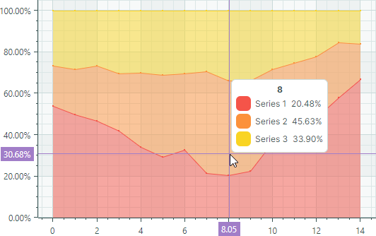
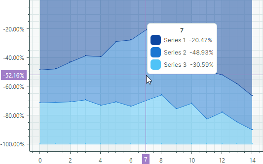

# Full-Stacked Area Series View

Full-Stacked Area Series View (диаграммы 100% Stacked Area) используются для отображения пропорциональных соотношений между двумя и более сериями данных. Каждая серия Full-Stacked Area отрисовывается как закрашенная область, наложенная поверх предыдущей серии Full-Stacked Area. Толщина серии определяется её процентным вкладом в общую сумму. Верхняя линия всегда соответствует `100%`.



Если все серии Full-Stacked Area в контроле диаграммы содержат только отрицательные значения, серии располагаются в направлении отрицательной оси _Y_. В этом случае нижняя линия обозначает `-100%`.



- Используйте Full-Stacked Area Series View, чтобы отображать только положительные или только отрицательные данные в одном контроле диаграммы.
- Если какая-либо серия Full-Stacked Area содержит смесь положительных и отрицательных значений, все отрицательные значения обрабатываются как нули.

Full-Stacked Area Series View инкапсулировано классом `CartesianFullStackedAreaSeriesView`.

## Создание Full-Stacked Area Series View

Обычно представление Full-Stacked Area используется для отображения пропорциональных соотношений между двумя и более сериями данных. Шаги для создания диаграммы Full-Stacked Area включают:

1. Создайте объект `CartesianSeries` для каждой серии данных и добавьте его в коллекцию `CartesianChart.Series`.
2. Установите свойство `CartesianSeries.View` в объект `CartesianFullStackedAreaSeriesView`.
3. Используйте свойство `CartesianSeries.DataAdapter`, чтобы предоставить данные для серии.
4. Отформатируйте значения оси Y как проценты, настроив параметры шкалы оси Y.

    В Full-Stacked Area Series View вычисленные значения оси Y (а значит, и подписи) находятся в диапазоне от 0 до 1. Чтобы отображать эти значения в виде процентов (0%-100%) вдоль оси Y и в подписях перекрестия, установите свойства `ScaleOptions.LabelFormatter` и `ScaleOptions.CrosshairLabelFormatter` в объект `PercentLabelFormatter` (или пользовательский объект `IAxisLabelFormatter`). См. пример ниже.

    


В следующих фрагментах кода показано, как создать диаграмму Full-Stacked Area, состоящую из трёх серий данных, в XAML и code-behind.

``` xml
xmlns:mxc="https://schemas.eremexcontrols.net/avalonia/charts"

<mxc:CartesianChart x:Name="chartControl">
    <mxc:CartesianChart.Series>
        <mxc:CartesianSeries Name="areaSeries1" DataAdapter="{Binding DataAdapter1}" >
            <mxc:CartesianFullStackedAreaSeriesView Color="#ff07575b" 
                                                Transparency="0.5" MarkerSize="3" ShowMarkers="True"/>
        </mxc:CartesianSeries>
        <mxc:CartesianSeries Name="areaSeries2" DataAdapter="{Binding DataAdapter2}" >
            <mxc:CartesianFullStackedAreaSeriesView Color="#ff763626" 
                                                Transparency="0.5" MarkerSize="3" ShowMarkers="True"/>
        </mxc:CartesianSeries>
        <mxc:CartesianSeries Name="areaSeries3" DataAdapter="{Binding DataAdapter3}" >
            <mxc:CartesianFullStackedAreaSeriesView Color="#fffc913a" 
                                                Transparency="0.5" MarkerSize="3" ShowMarkers="True"/>
        </mxc:CartesianSeries>
    </mxc:CartesianChart.Series>

    <!--Format Y values as percentage-->
    <mxc:CartesianChart.AxesY>
        <mxc:AxisY ShowTitle="False">
            <mxc:AxisY.ScaleOptions>
                <mxc:NumericScaleOptions>
                    <mxc:NumericScaleOptions.LabelFormatter>
                        <mxc:PercentLabelFormatter />
                    </mxc:NumericScaleOptions.LabelFormatter>
                    <mxc:NumericScaleOptions.CrosshairLabelFormatter>
                        <mxc:PercentLabelFormatter />
                    </mxc:NumericScaleOptions.CrosshairLabelFormatter>
                </mxc:NumericScaleOptions>
            </mxc:AxisY.ScaleOptions>
        </mxc:AxisY>
    </mxc:CartesianChart.AxesY>
</mxc:CartesianChart>
```

``` cs
double[] args = new double[] { 1, 2, 3, 4, 5 };
double[] values1 = new double[] { 3, 2, 1, 2, 4 };
double[] values2 = new double[] { 1, 2, 1, 2, 2 };
double[] values3 = new double[] { 2, 1, 2, 3, 2 };

CartesianSeries series1 = new CartesianSeries();
series1.DataAdapter = new SortedNumericDataAdapter(args, values1);
series1.View = new CartesianFullStackedAreaSeriesView()
{
    Color = Color.FromUInt32(0xff07575b),
    Transparency = 0.5,
    ShowMarkers = true,
    MarkerSize = 3
};
CartesianSeries series2 = new CartesianSeries();
series2.DataAdapter = new SortedNumericDataAdapter(args, values2);
series2.View = new CartesianFullStackedAreaSeriesView()
{
    Color = Color.FromUInt32(0xff763626),
    Transparency = 0.5,
    ShowMarkers = true,
    MarkerSize = 3
};
CartesianSeries series3 = new CartesianSeries();
series3.DataAdapter = new SortedNumericDataAdapter(args, values3);
series3.View = new CartesianFullStackedAreaSeriesView()
{
    Color = Color.FromUInt32(0xfffc913a),
    Transparency = 0.5,
    ShowMarkers = true,
    MarkerSize = 3
};

AxisY axisY = new AxisY();
axisY.Title = "Income";
// Format Y values as percentage
axisY.ScaleOptions = new NumericScaleOptions() 
{ 
    LabelFormatter = new PercentLabelFormatter(), 
    CrosshairLabelFormatter =  new PercentLabelFormatter() 
};
chartControl.AxesY.Add(axisY);

chartControl.Series.Add(series1);
chartControl.Series.Add(series2);
chartControl.Series.Add(series3);
```

Результат показан ниже:


### Пример - Создание диаграммы Full-Stacked Area с использованием паттерна проектирования MVVM

Следующий пример создаёт три серии типа Full-Stacked Area из модели представления. 

- Свойство `CartesianChart.SeriesSource` привязано к свойству _SeriesCollection_ в модели представления. Эта коллекция является источником объектов _SeriesViewModel_, используемых для инициализации отдельных серий в контроле диаграммы. 

- Свойство `CartesianChart.SeriesTemplate` установлено в шаблон, который создаёт серию (объект `CartesianSeries`) типа Full-Stacked Area из каждого объекта _SeriesViewModel_. Данные серии, заголовок и цвет определяются свойствами _SeriesViewModel.DataAdapter_, _SeriesViewModel.Title_ и _SeriesViewModel.Color_ соответственно.

- Свойства `ScaleOptions.LabelFormatter` и `ScaleOptions.CrosshairLabelFormatter` установлены в объект `PercentLabelFormatter`, чтобы форматировать значения оси Y как проценты.


``` xml
<!-- MainWindow.axaml -->
<mx:MxWindow xmlns="https://github.com/avaloniaui"
             xmlns:x="http://schemas.microsoft.com/winfx/2006/xaml"
             xmlns:vm="using:ChartStackedAreaSeriesViewExample.ViewModels"
             xmlns:d="http://schemas.microsoft.com/expression/blend/2008"
             xmlns:mc="http://schemas.openxmlformats.org/markup-compatibility/2006"
             xmlns:mx="https://schemas.eremexcontrols.net/avalonia"
             xmlns:mxc="https://schemas.eremexcontrols.net/avalonia/charts"
             mc:Ignorable="d" d:DesignWidth="800" d:DesignHeight="450"
             x:Class="ChartStackedAreaSeriesViewExample.Views.MainWindow"
             x:DataType="vm:MainWindowViewModel"
             Icon="/Assets/EMXControls.ico"
             Title="ChartStackedAreaSeriesViewExample">
    <Design.DataContext>
        <vm:MainWindowViewModel/>
    </Design.DataContext>
    <Grid ColumnDefinitions="*" Margin="10">

        <mxc:CartesianChart x:Name="chartControl" BorderThickness="0" SeriesSource="{Binding SeriesCollection}" >
            <mxc:CartesianChart.SeriesTemplate>
                <DataTemplate x:DataType="vm:SeriesViewModel">
                    <mxc:CartesianSeries DataAdapter="{Binding DataAdapter}" SeriesName="{Binding Title}">
                        <mxc:CartesianFullStackedAreaSeriesView
                        Color="{Binding Color}"
                        Transparency="0.5"
                        ShowMarkers="True"
                        MarkerSize="3"
                        Thickness="1" />
                    </mxc:CartesianSeries>
                </DataTemplate>
            </mxc:CartesianChart.SeriesTemplate>
            <mxc:CartesianChart.AxesX>
                <mxc:AxisX Name="xAxis" Title="Months" ShowMinorTickmarks="False" >
                    <mxc:AxisX.ScaleOptions>
                        <mxc:NumericScaleOptions GridSpacing="1" LabelFormatter="{Binding ArgsLabelFormatter}" />
                    </mxc:AxisX.ScaleOptions>
                </mxc:AxisX>
            </mxc:CartesianChart.AxesX>
            <mxc:CartesianChart.AxesY>
                <mxc:AxisY Title="Shipped Orders">
                    <mxc:AxisY.ScaleOptions>
                        <mxc:NumericScaleOptions>
                            <mxc:NumericScaleOptions.LabelFormatter>
                                <mxc:PercentLabelFormatter />
                            </mxc:NumericScaleOptions.LabelFormatter>
                            <mxc:NumericScaleOptions.CrosshairLabelFormatter>
                                <mxc:PercentLabelFormatter />
                            </mxc:NumericScaleOptions.CrosshairLabelFormatter>
                        </mxc:NumericScaleOptions>
                    </mxc:AxisY.ScaleOptions>
                </mxc:AxisY>
            </mxc:CartesianChart.AxesY>
            <mxc:CartesianChart.CrosshairOptions>
                <mxc:CrosshairOptions SeriesLabelMode="OneForAllSeries"/>
            </mxc:CartesianChart.CrosshairOptions>
        </mxc:CartesianChart>
    </Grid>
</mx:MxWindow>
```

``` cs
// MainWindow.axaml.cs
using ChartStackedAreaSeriesViewExample.ViewModels;
using Eremex.AvaloniaUI.Controls.Common;

namespace ChartStackedAreaSeriesViewExample.Views;

public partial class MainWindow : MxWindow
{
    public MainWindow()
    {
        InitializeComponent();
        this.DataContext = new MainWindowViewModel();
    }
}
```

``` cs
// MainWindowViewModel.cs
using Avalonia.Media;
using CommunityToolkit.Mvvm.ComponentModel;
using Eremex.AvaloniaUI.Charts;
using System;
using System.Collections.ObjectModel;

namespace ChartStackedAreaSeriesViewExample.ViewModels;

public partial class MainWindowViewModel : ObservableObject
{
    [ObservableProperty]
    ObservableCollection<SeriesViewModel> seriesCollection = new();

    [ObservableProperty] FuncLabelFormatter argsLabelFormatter = new(o => String.Format("{0:n0}", o));
    public MainWindowViewModel()
    {
        double[] args = new double[] { 1, 2, 3, 4, 5, 6, 7, 8, 9, 10, 11, 12 };
        double[] values1 = new double[] { 10, 15, 20, 18, 10, 8, 12, 14, 15, 20, 17, 20 };
        double[] values2 = new double[] { 10, 5, 5, 10, 20, 20, 17, 15, 20, 25, 27, 30 };
        double[] values3 = new double[] { 15, 10, 15, 25, 20, 22, 15, 17, 20, 20, 15, 20 };

        SeriesCollection.Add(new SeriesViewModel { Title = "Summit Mountain Logistics", Color = Color.FromUInt32(0xFFDB643B), DataAdapter = new SortedNumericDataAdapter(args, values1) });
        SeriesCollection.Add(new SeriesViewModel { Title = "Heartland Distribution", Color = Color.FromUInt32(0xFFEBB443), DataAdapter = new SortedNumericDataAdapter(args, values2) });
        SeriesCollection.Add(new SeriesViewModel { Title = "Intercontinental Dispatch", Color = Color.FromUInt32(0xFF6DA0A4), DataAdapter = new SortedNumericDataAdapter(args, values3) });
    }
}

public partial class SeriesViewModel : ObservableObject
{
    [ObservableProperty] string title;
    [ObservableProperty] Color color;
    [ObservableProperty] ISeriesDataAdapter dataAdapter;
}
```

## Данные для Full-Stacked Area Series View

Вы можете использовать следующие адаптеры данных для предоставления данных для Full-Stacked Area Series View:

Числовые значения _X_:

- `SortedNumericDataAdapter`
- `FormulaDataAdapter`


Значения даты и времени _X_:

- `SortedDateTimeDataAdapter`
- `SortedTimeSpanDataAdapter`

Качественные значения _X_:

- `QualitativeDataAdapter`


## Параметры Full-Stacked Area Series View


- `Color` — Задаёт цвет, используемый для закраски серии.
- `CrosshairMode` — Задаёт, привязывается ли подпись перекрестия к ближайшей точке данных, или отображает интерполированное значение. См. [Отображение точного или интерполированного значения в подписях перекрестия](../crosshair.md#отображение-точного-или-интерполированного-значения-в-метках-серий-crosshair).
- `MarkerImage` — Получает или задаёт изображение, используемое в качестве пользовательских маркеров точек. Если изображение не указано, отображаются стандартные маркеры в форме квадрата. Вы можете использовать экземпляр класса `SvgImage`, чтобы задать SVG-изображение.

    Свойство `MarkerImage` объявлено с атрибутом `[Content]`, что позволяет определить изображение непосредственно между тегами &lt;CartesianFullStackedAreaSeriesView&gt;.

    ``` xml
    <mxc:CartesianFullStackedAreaSeriesView>
        <SvgImage Source="avares://Demo/Assets/circle.svg" />
    </mxc:CartesianFullStackedAreaSeriesView>
    ```

    SVG-файлы содержат предопределённые цвета для SVG-элементов. Чтобы эти цвета соответствовали цвету вашей серии данных, вы можете:
    
    - Вручную отредактировать исходный SVG-файл заранее
    - Использовать свойство `MarkerImageCss`, чтобы динамически настраивать [стили](https://developer.mozilla.org/en-US/docs/Web/SVG/Reference/Element/style) для SVG-элементов. Стили применяются при отрисовке маркеров точек.


- `MarkerImageCss` — Задаёт [CSS-стили](https://developer.mozilla.org/en-US/docs/Web/SVG/Reference/Element/style) для настройки SVG-изображения, заданного свойством `MarkerImage`, во время выполнения. Основной сценарий использования — замена цветов SVG-элементов на цвет серии (`Color`). Включите заполнитель `{0}`, чтобы вставить значение свойства `Color` в CSS-код. 

    Например, когда свойство `MarkerImage` содержит SVG-изображение с элементом circle, следующий CSS-код стилизует `circle` заливкой Orange (используя цвет серии) и границей Dark Red:

    ``` xml
    <mxc:CartesianFullStackedAreaSeriesView Color="orange" MarkerImageCss="circle {{fill:{0};stroke:darkred;}}">
        <SvgImage Source="avares://Demo/Assets/circle.svg" />
    </mxc:CartesianFullStackedAreaSeriesView>
    ```
    
    Смотрите также: [Пример - Создание Lollipop Series View и использование пользовательских SVG-маркеров](lollipop-series-view.md#пример---создание-lollipop-series-view-и-использование-пользовательских-svg-маркеров-точек-данных).


- `MarkerSize` — Задаёт размер маркеров точек.
- `ShowInCrosshair` — Задаёт видимость подписи перекрестия для текущей серии. См. [Настройка подписей перекрестия](../crosshair.md#скрытие-серии-в-crosshair).
- `ShowMarkers` — Включает или отключает маркеры точек.
- `Thickness` — Задаёт толщину линии.
- `Transparency` — Значение от `0` до `1`, задающее уровень прозрачности закрашенных областей:
    - `0` означает полную непрозрачность
    - `1` означает полную прозрачность

<br>
<br>

<sup>*</sup> Эта страница переведена с использованием технологий машинного перевода.
