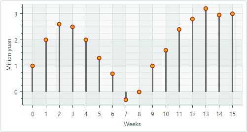

# Lollipop Series View

Lollipop Series View (`CartesianLollipopSeriesView`) визуализирует данные с помощью тонких линий с маркерами на конце. Маркеры обозначают отдельные точки данных, а линии соединяют маркеры с базовой линией (горизонтальной или вертикальной осью). По умолчанию диаграмма Lollipop использует квадратные маркеры, но также поддерживает пользовательские маркеры в формате SVG. На следующем изображении показано Lollipop Series View с круглыми маркерами, загруженными из SVG-файла.


## Создание Lollipop Series View

Чтобы создать Lollipop Series View, добавьте объект `CartesianSeries` в коллекцию `CartesianChart.Series` и инициализируйте свойство `CartesianSeries.View` экземпляром `CartesianLollipopSeriesView`.

Используйте свойство `CartesianSeries.DataAdapter`, чтобы предоставить данные для серии.

В следующем коде показано, как создать Lollipop Series View в XAML и code-behind.


``` xml
xmlns:mxc="https://schemas.eremexcontrols.net/avalonia/charts"

<mxc:CartesianChart x:Name="chartControl">
    <mxc:CartesianSeries DataAdapter="{Binding DataAdapter}">
        <mxc:CartesianLollipopSeriesView Color="YellowGreen"
                                            LineColor="Green"
                                            Thickness="2"
                                            MarkerSize="8"
                                            Orientation="Vertical">
        </mxc:CartesianLollipopSeriesView>
    </mxc:CartesianSeries>
</mxc:CartesianChart>
```

``` cs
using Eremex.AvaloniaUI.Charts;

CartesianSeries series = new CartesianSeries();
chartControl.Series.Add(series);
double[] args = new double[] { -1, 0, 1, 2, 3, 4, 5 };
double[] values = new double[] { 10, 14, 15, 13, 5, 0, -3 };
series.DataAdapter = new SortedNumericDataAdapter(args, values);
series.View = new CartesianLollipopSeriesView()
{
    LineColor = Avalonia.Media.Colors.Green,
    Color = Avalonia.Media.Colors.YellowGreen,
    MarkerSize = 8,
    Thickness = 2,
    Orientation = CartesianLollipopOrientation.Horizontal
};
```

## Пример - Создание Lollipop Series View и использование пользовательских SVG-маркеров точек данных

Следующий пример создаёт Lollipop Series View для визуализации примерных данных, предоставленных объектом `FormulaDataAdapter`. Пример показывает, как использовать SVG-изображение в качестве пользовательских маркеров точек данных и динамически настраивать цвета SVG-элементов так, чтобы они соответствовали цвету серии данных.




1. Указание SVG-изображения в качестве маркеров точек

    Используйте свойство `MarkerImage`, чтобы назначить SVG-изображение в качестве маркеров точек данных. Свойство `MarkerImage` определено с атрибутом `[Content]`, что позволяет указать SVG-изображение как содержимое тега &lt;CartesianLollipopSeriesView&gt;:

    ``` xml
    <mxc:CartesianLollipopSeriesView ...>
        <SvgImage Source="avares://ChartLollipopSeriesView/Assets/circle.svg" />
    </mxc:CartesianLollipopSeriesView>    
    ```

    Файл 'circle.svg' отрисовывает круг с зелёной границей и жёлтой заливкой:

    

    ``` xml
    <!-- part of 'circle.svg' file -->
    <svg ...>
        <circle fill="yellow" stroke="green" stroke-width="10" cx="40" cy="40" r="30"/>
    </svg>
    ```

    Следующий шаг показывает, как переопределить эти цвета динамически, не изменяя исходный SVG-файл.

2. Применение цвета серии к SVG-элементам 

    Lollipop Series View (как и любой потомок [Point Series View](point-series-view.md)) 
    поддерживает свойство `MarkerImageCss`, которое включает [CSS-стилизацию SVG на основе стилей](https://developer.mozilla.org/en-US/docs/Web/SVG/Reference/Element/style). Это свойство позволяет настраивать стили отдельных SVG-элементов во время выполнения. Например, CSS-код может применить цвет серии к отдельным SVG-элементам.

    ``` xml
    <mxc:CartesianLollipopSeriesView 
        Color="Orange"
        MarkerImageCss="circle {{fill:{0};stroke:darkred;}}"
    >
    ```

    Приведённый выше CSS-код настраивает стиль SVG-объекта `circle`. Новый стиль закрашивает границу цветом Dark Red, а заливает круг цветом серии данных. 
     
     - Заполнитель `{0}` — Вставляет значение свойства `CartesianLollipopSeriesView.Color`.

    Результат показан ниже:

    

    
3. Установка размера маркеров точек

    Используйте свойство `MarkerSize`, чтобы настроить размер маркеров точек.

Полный код:

``` xml
<!-- MainWindow.axaml -->
<mx:MxWindow xmlns="https://github.com/avaloniaui"
        xmlns:x="http://schemas.microsoft.com/winfx/2006/xaml"
        xmlns:vm="using:ChartLollipopSeriesView.ViewModels"
        xmlns:d="http://schemas.microsoft.com/expression/blend/2008"
        xmlns:mc="http://schemas.openxmlformats.org/markup-compatibility/2006"
        xmlns:mx="https://schemas.eremexcontrols.net/avalonia"
        xmlns:mxc="https://schemas.eremexcontrols.net/avalonia/charts"
        mc:Ignorable="d" d:DesignWidth="800" d:DesignHeight="450"
        x:Class="ChartLollipopSeriesView.Views.MainWindow"
        x:DataType="vm:MainWindowViewModel"
        Icon="/Assets/EMXControls.ico"
        Title="ChartLollipopSeriesView">

    <Design.DataContext>
        <!-- This only sets the DataContext for the previewer in an IDE,
             to set the actual DataContext for runtime, set the DataContext property in code (look at App.axaml.cs) -->
        <vm:MainWindowViewModel/>
    </Design.DataContext>

    <mxc:CartesianChart x:Name="chartControl">
        <mxc:CartesianChart.Series>
            <mxc:CartesianSeries Name="lollipopSeries1" 
                                 DataAdapter="{Binding PointSeriesVM1.DataAdapter}" 
                                 SeriesName="Income"
                                 >
                <mxc:CartesianLollipopSeriesView Color="Orange"
                                                 LineColor="Dimgray"
                                                 LineThickness="3"
                                                 MarkerSize="10"
                                                 MarkerImageCss="circle {{fill:{0};stroke:darkred;}}"
                                                 >
                    <SvgImage Source="avares://ChartLollipopSeriesView/Assets/circle.svg" />
                </mxc:CartesianLollipopSeriesView>
            </mxc:CartesianSeries>
        </mxc:CartesianChart.Series>
        <mxc:CartesianChart.AxesX>
            <mxc:AxisX Title="Weeks" MinorCount="0" ShowMinorGridlines="False">
                <mxc:AxisX.ScaleOptions>
                    <mxc:NumericScaleOptions GridSpacing="1" />
                </mxc:AxisX.ScaleOptions>
            </mxc:AxisX>
        </mxc:CartesianChart.AxesX>
        <mxc:CartesianChart.AxesY>
            <mxc:AxisY Title="Million yuan"/>
        </mxc:CartesianChart.AxesY>
    </mxc:CartesianChart>
</mx:MxWindow>
```

``` cs
// MainWindowViewModel.cs
using CommunityToolkit.Mvvm.ComponentModel;
using Eremex.AvaloniaUI.Charts;
using System;
using System.Collections.Generic;

namespace ChartLollipopSeriesView.ViewModels
{
    public partial class MainWindowViewModel : ViewModelBase
    {
        static double[] values = new double[] { 1, 2, 2.6, 2.5, 2, 1.3, 0.7, -0.3, 0, 1, 1.6, 2.4, 2.8, 3.2, 2.95, 3 };
        static double MyFunc(double argument) => values[(int)argument % values.Length];

        [ObservableProperty] SeriesViewModel pointSeriesVM1;

        public MainWindowViewModel()
        {
            PointSeriesVM1 = new()
            {
                DataAdapter = new FormulaDataAdapter(0, 1, values.Length, MyFunc)
            };
        }
    }

    public partial class SeriesViewModel : ObservableObject
    {
        [ObservableProperty] ISeriesDataAdapter dataAdapter;
    }
}
```

``` xml
<!-- circle.svg image -->
<svg viewBox="0 0 80 80" width="80" height="80" xmlns="http://www.w3.org/2000/svg">
<g>
<title>Layer 1</title>
<circle fill="yellow" stroke="green" stroke-opacity="1" stroke-width="10" cx="40" cy="40" id="svg_1" r="30"/>
</g>
</svg>
```


## Данные для Lollipop Series View

Вы можете использовать следующие адаптеры данных для предоставления данных для Lollipop Series View:

Числовые значения _X_:

- `FormulaDataAdapter`
- `ScatterDataAdapter`
- `SortedNumericDataAdapter`

Значения даты и времени _X_:

- `SortedDateTimeDataAdapter`
- `SortedTimeSpanDataAdapter`


Качественные значения _X_:

- `QualitativeDataAdapter`

## Параметры Lollipop Series View


- `Color` — Задаёт цвет, используемый для закраски маркеров точек.
- `LineColor` — Задаёт цвет, используемый для закраски линий.
- `LineThickness` — Задаёт толщину линии.
- `LineOrientation` — Задаёт направление линий.

    - `Vertical` — Линии продлеваются вертикально от маркеров точек к оси _X_.

        


    - `Horizontal` — Линии продлеваются горизонтально от маркеров точек к оси _Y_.

        


- `MarkerImage` — Получает или задаёт изображение, используемое в качестве пользовательских маркеров точек. Если изображение не указано, отображаются стандартные маркеры в форме квадрата. Вы можете использовать экземпляр класса `SvgImage`, чтобы задать SVG-изображение.

    Свойство `MarkerImage` объявлено с атрибутом `[Content]`, что позволяет определить изображение непосредственно между тегами &lt;CartesianLollipopSeriesView&gt;.

    ``` xml
    <mxc:CartesianLollipopSeriesView>
        <SvgImage Source="avares://ChartLollipopSeriesView/Assets/circle.svg" />
    </mxc:CartesianLollipopSeriesView>
    ```

    SVG-файлы содержат предопределённые цвета для SVG-элементов. Чтобы эти цвета соответствовали цвету вашей серии данных, вы можете:
    
    - Вручную отредактировать исходный SVG-файл заранее
    - Использовать свойство `MarkerImageCss`, чтобы динамически настраивать [стили](https://developer.mozilla.org/en-US/docs/Web/SVG/Reference/Element/style) для SVG-элементов. Стили применяются при отрисовке маркеров точек.

- `MarkerImageCss` — Задаёт [CSS-стили](https://developer.mozilla.org/en-US/docs/Web/SVG/Reference/Element/style) для настройки SVG-изображения, заданного свойством `CartesianLollipopSeriesView.MarkerImage`, во время выполнения. Основной сценарий использования — замена цветов SVG-элементов на цвет серии (`CartesianLollipopSeriesView.Color`). Включите заполнитель `{0}`, чтобы вставить значение свойства `CartesianLollipopSeriesView.Color` в CSS-код. 

    Например, когда свойство `MarkerImage` содержит SVG-изображение с элементом circle, следующий CSS-код стилизует `circle` заливкой Orange (используя цвет серии) и границей Dark Red:

    ``` xml
    <mxc:CartesianLollipopSeriesView Color="orange" MarkerImageCss="circle {{fill:{0};stroke:darkred;}}">
        <SvgImage Source="avares://ChartLollipopSeriesView/Assets/circle.svg" />
    </mxc:CartesianLollipopSeriesView>
    ```

    

    **Полный код**: [Пример - Создание Lollipop Series View и использование пользовательских SVG-маркеров](#пример---создание-lollipop-series-view-и-использование-пользовательских-svg-маркеров-точек-данных).

- `MarkerSize` — Задаёт размер маркеров точек в пикселях.
- `ShowInCrosshair` — Задаёт видимость подписи перекрестия для текущей серии. См. [Настройка подписей перекрестия](../crosshair.md#скрытие-серии-в-crosshair).

<br>
<br>

<sup>*</sup> Эта страница переведена с использованием технологий машинного перевода.
