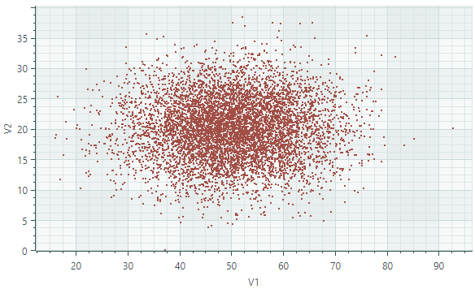

# Point Series View

Point Series View (`CartesianPointSeriesView`) отображает отдельные точки. Каждая точка задаётся значениями X и Y. На следующем изображении показан пример `CartesianPointSeriesView`, отображающего две серии рассеянных точек, каждая из которых закрашена своим цветом.


## Создание Point Series View

Чтобы создать Point Series View, добавьте объект `CartesianSeries` в коллекцию `CartesianChart.Series` и инициализируйте `CartesianSeries.View` экземпляром `CartesianPointSeriesView`.

В следующем коде показано, как создать Point Series View в XAML и code-behind.

``` xml
<mxc:CartesianChart x:Name="chartControl">
    <mxc:CartesianChart.Series>
        <mxc:CartesianSeries Name="pointSeries1" DataAdapter="{Binding DataAdapter}" >
            <mxc:CartesianPointSeriesView Color="Red" MarkerSize="2"/>
        </mxc:CartesianSeries>
    </mxc:CartesianChart.Series>
</mxc:CartesianChart>
```

``` cs
CartesianSeries series = new CartesianSeries();
chartControl.Series.Add(series);
double[] args = new double[] {3,2,1,2,3,4,5,4 };
double[] values = new double[] { -1,0,1,2,3,2,1,0 };
// Use ScatterDataAdapter since points are not sorted by the X coordinate
series.DataAdapter = new ScatterDataAdapter(args, values);
series.View = new CartesianPointSeriesView()
{
    Color = Avalonia.Media.Colors.Blue,
    MarkerSize = 4,
};
```

## Пример - Использование Point Series View для отображения кластера точек

В этом примере Point Series View используется для отображения точек, случайно рассеянных вдоль числовых осей X и Y. Точки в исходной серии данных не отсортированы по координате _X_. Чтобы предоставить неотсортированные точки для представления серии, используется адаптер `ScatterDataAdapter`. 



``` xml
<mx:MxWindow xmlns="https://github.com/avaloniaui"
        xmlns:x="http://schemas.microsoft.com/winfx/2006/xaml"
        xmlns:vm="using:ChartPointSeriesView.ViewModels"
        xmlns:d="http://schemas.microsoft.com/expression/blend/2008"
        xmlns:mc="http://schemas.openxmlformats.org/markup-compatibility/2006"
        xmlns:mx="https://schemas.eremexcontrols.net/avalonia"
        xmlns:mxc="https://schemas.eremexcontrols.net/avalonia/charts"
        mc:Ignorable="d" d:DesignWidth="800" d:DesignHeight="450"
        x:Class="ChartPointSeriesView.Views.MainWindow"
        x:DataType="vm:MainWindowViewModel"
        Icon="/Assets/EMXControls.ico"
        Title="ChartPointSeriesView"
        Width="600" Height="400">

    <Design.DataContext>
        <vm:MainWindowViewModel/>
    </Design.DataContext>

    <mxc:CartesianChart x:Name="chartControl">
        <mxc:CartesianChart.Series>
            <mxc:CartesianSeries Name="pointSeries1" DataAdapter="{Binding PointSeriesVM1.DataAdapter}" >
                <mxc:CartesianPointSeriesView Color="{Binding PointSeriesVM1.Color}" MarkerSize="2"/>
            </mxc:CartesianSeries>
        </mxc:CartesianChart.Series>
        <mxc:CartesianChart.AxesX>
            <mxc:AxisX Name="xAxis" Title="V1" />
        </mxc:CartesianChart.AxesX>
        <mxc:CartesianChart.AxesY>
            <mxc:AxisY Title="V2"/>
        </mxc:CartesianChart.AxesY>
    </mxc:CartesianChart>
</mx:MxWindow>
```

``` cs
using CommunityToolkit.Mvvm.ComponentModel;
using Eremex.AvaloniaUI.Charts;
using System.Collections.Generic;
using System;
using Avalonia.Media;
using Avalonia;

namespace ChartPointSeriesView.ViewModels;

public partial class MainWindowViewModel : ViewModelBase
{
    [ObservableProperty] SeriesViewModel pointSeriesVM1;

    public MainWindowViewModel()
    {
        PointSeriesVM1 = new()
        {
            Color = Color.FromUInt32(0xffa24f46),
            DataAdapter = GenerateRandomData()
        };
    }

    private static Random random = new Random();
    private static double GenerateNormalValue(double mean, double stdDev)
    {
        double u1 = 1.0 - random.NextDouble(); 
        double u2 = 1.0 - random.NextDouble();
        double randStdNormal = Math.Sqrt(-2.0 * Math.Log(u1)) * Math.Sin(2.0 * Math.PI * u2);
        return mean + stdDev * randStdNormal;
    }

    public static ScatterDataAdapter GenerateRandomData()
    {
        int count = 7000;
        double xMean= 50, xStdDev= 10, yMean = 20, yStdDev = 5;
        List<double> args = new List<double>();
        List<double> values = new List<double>();
        for(int i = 0; i < count; i++)
        {
            double x = GenerateNormalValue(xMean, xStdDev);
            double y = GenerateNormalValue(yMean, yStdDev);
            args.Add(x);
            values.Add(y);
        }
        return new ScatterDataAdapter(args, values);
    }
}

public partial class SeriesViewModel : ObservableObject
{
    [ObservableProperty] Color color;
    [ObservableProperty] ScatterDataAdapter dataAdapter;
}
```

## Данные для Point Series View

Вы можете использовать следующие адаптеры данных для предоставления данных для Point Series View:

Числовые значения _X_:

- `FormulaDataAdapter`
- `ScatterDataAdapter`
- `SortedNumericDataAdapter`

Значения даты и времени _X_:

- `SortedDateTimeDataAdapter`
- `SortedTimeSpanDataAdapter`


Качественные значения _X_:

- `QualitativeDataAdapter`


## Параметры Point Series View

- `Color` — Задаёт цвет, используемый для закраски серии.
- `MarkerImage` — Получает или задаёт изображение, используемое в качестве пользовательских маркеров точек. Если изображение не указано, отображаются стандартные маркеры в форме квадрата. Вы можете использовать экземпляр класса `SvgImage`, чтобы задать SVG-изображение.

    Свойство `MarkerImage` объявлено с атрибутом `[Content]`, что позволяет определить изображение непосредственно между тегами &lt;CartesianPointSeriesView&gt;.

    ``` xml
    <mxc:CartesianPointSeriesView>
        <SvgImage Source="avares://Demo/Assets/circle.svg" />
    </mxc:CartesianPointSeriesView>
    ```

    SVG-файлы содержат предопределённые цвета для SVG-элементов. Чтобы эти цвета соответствовали цвету вашей серии данных, вы можете:
    
    - Вручную отредактировать исходный SVG-файл заранее
    - Использовать свойство `MarkerImageCss`, чтобы динамически настраивать [стили](https://developer.mozilla.org/en-US/docs/Web/SVG/Reference/Element/style) для SVG-элементов. Стили применяются при отрисовке маркеров точек.

- `MarkerImageCss` — Задаёт [CSS-стили](https://developer.mozilla.org/en-US/docs/Web/SVG/Reference/Element/style) для настройки SVG-изображения, заданного свойством `MarkerImage`, во время выполнения. Основной сценарий использования — замена цветов SVG-элементов на цвет серии (`Color`). Включите заполнитель `{0}`, чтобы вставить значение свойства `Color` в CSS-код. 

    Например, когда свойство `MarkerImage` содержит SVG-изображение с элементом circle, следующий CSS-код стилизует `circle` заливкой Orange (используя цвет серии) и границей Dark Red:

    ``` xml
    <mxc:CartesianPointSeriesView Color="orange" MarkerImageCss="circle {{fill:{0};stroke:darkred;}}">
        <SvgImage Source="avares://Demo/Assets/circle.svg" />
    </mxc:CartesianPointSeriesView>
    ```
    
    Смотрите также: [Пример - Создание Lollipop Series View и использование пользовательских SVG-маркеров](lollipop-series-view.md#пример---создание-lollipop-series-view-и-использование-пользовательских-svg-маркеров-точек-данных).

- `MarkerSize` — Задаёт размер маркеров точек.
- `ShowInCrosshair` — Задаёт видимость подписи перекрестия для текущей серии. См. [Настройка подписей перекрестия](../crosshair.md#скрытие-серии-в-crosshair).

<br>
<br>

<sup>*</sup> Эта страница переведена с использованием технологий машинного перевода.
