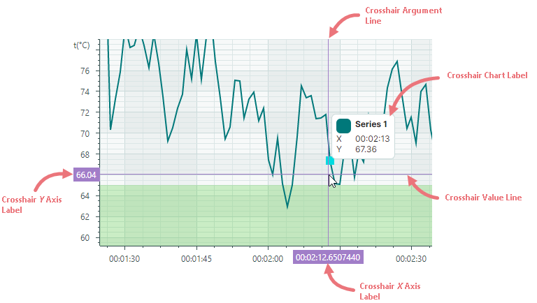
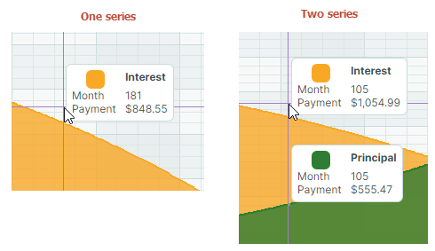
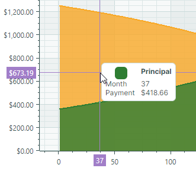
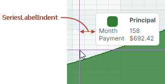
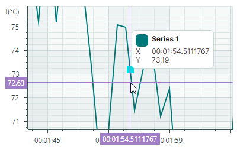
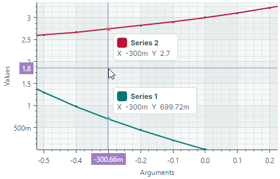
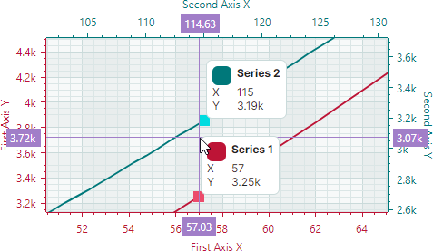
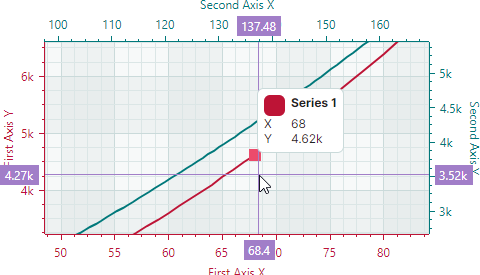
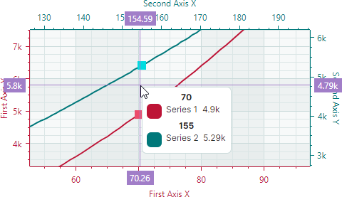
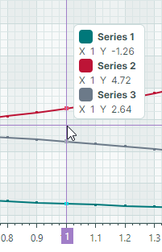

# Crosshair


Контрол Cartesian Chart включает функцию Crosshair, которая позволяет видеть точные значения серий в текущей позиции курсора. Отображаемый в виде пары горизонтальной и вертикальной линий, Crosshair следует за указателем мыши при перемещении над областью диаграммы. Он показывает метку серии (или несколько меток для нескольких серий), отображающую значение серии, и выделяет текущие координаты _X_ и _Y_ на осях.




Чтобы настроить параметры отображения Crosshair или отключить эту функцию, инициализируйте свойство `CartesianChart.CrosshairOptions` экземпляром класса `Eremex.AvaloniaUI.Charts.CrosshairOptions`. Затем используйте свойства класса `CrosshairOptions`, чтобы настроить параметры Crosshair по мере необходимости.


## Отключение Crosshair

Свойство `CrosshairOptions.ShowCrosshair` позволяет отключить Crosshair.

``` xml
<mxc:CartesianChart x:Name="chartControl1" >
    <mxc:CartesianChart.CrosshairOptions>
        <mxc:CrosshairOptions ShowCrosshair="False"/>
    </mxc:CartesianChart.CrosshairOptions>
    <!-- ... -->
</mxc:CartesianChart>
```

## Отключение отдельных линий и меток осей Crosshair

Свойства `CrosshairOptions.ShowArgumentLine` и `CrosshairOptions.ShowValueLine` можно использовать, чтобы скрыть вертикальную и горизонтальную линии Crosshair соответственно. Чтобы предотвратить отображение меток Crosshair для осей _X_ и _Y_, используйте свойства `CrosshairOptions.ShowArgumentLabel` и `CrosshairOptions.ShowValueLabel`.

Следующий пример скрывает вертикальную линию Crosshair и метку для оси _X_:


``` xml
<mxc:CartesianChart x:Name="chartControl1" >
    <mxc:CartesianChart.CrosshairOptions>
        <mxc:CrosshairOptions ShowArgumentLabel="False" ShowValueLabel="False"/>
    </mxc:CartesianChart.CrosshairOptions>
    <!-- ... -->
</mxc:CartesianChart>
```

## Настройка меток серий Crosshair

Метки серий Crosshair отображают имена и текущие значения серий.



### Форматирование значений в метках серий Crosshair

Значения, отображаемые в метках Crosshair, изначально используют форматы по умолчанию:


Чтобы отформатировать эти значения пользовательским образом, создайте объект-форматтер и назначьте его свойству `Axis.ScaleOptions.CrosshairLabelFormatter`. Значения осей можно [форматировать](cartesian-chart.md#форматирование-меток-осей) аналогичным образом (см. свойство `Axis.ScaleOptions.LabelFormatter`). 

Вы можете реализовать пользовательский форматтер меток на основе функции/выражения с помощью объекта `Eremex.AvaloniaUI.Charts.FuncLabelFormatter`.

Следующий пример создаёт объект-форматтер, который форматирует числовые значения как валюту. Этот форматтер используется для форматирования значений оси _Y_ и значений в метке серии Crosshair.


``` xml
<mxc:CartesianChart.AxesY>
    <mxc:AxisY Title="Payment">
        <mxc:AxisY.ScaleOptions>
            <mxc:NumericScaleOptions
                CrosshairLabelFormatter="{Binding CurrencyFormatter}"
                LabelFormatter="{Binding CurrencyFormatter}"/>
        </mxc:AxisY.ScaleOptions>
    </mxc:AxisY>
</mxc:CartesianChart.AxesY>
```

``` cs
public partial class MainViewModel : ViewModelBase 
{
[ObservableProperty] 
FuncLabelFormatter currencyFormatter = new(o => String.Format("{0:c}", o));
}
```


<!-- 
TODO
### Change the Template of Crosshair Series Labels 

-->


### Скрытие серии в Crosshair

Свойство `CrosshairSeriesViewBase.ShowInCrosshair` представления серии определяет видимость этой серии в метке Crosshair.

<!-- TODO
Add an image of the crosshair chart label, as many other topics refer to this section
 -->

Следующий код определяет две серии (_Interest_ и _Principal_). Для первой серии свойство `ShowInCrosshair` установлено в значение `false`, чтобы скрыть её в Crosshair:


``` xml
<mxc:CartesianChart.Series>
    <mxc:CartesianSeries DataAdapter="{Binding InterestSeriesDataAdapter}" SeriesName="Interest">
        <mxc:CartesianAreaSeriesView Color="#F9A825" Transparency="0.2" 
          MarkerSize="2" ShowMarkers="True"
          ShowInCrosshair="False" />
    </mxc:CartesianSeries>

    <mxc:CartesianSeries DataAdapter="{Binding PrincipalSeriesDataAdapter}" SeriesName="Principal">
        <mxc:CartesianAreaSeriesView Color="#2E7D32" Transparency="0.2" MarkerSize="2" ShowMarkers="True" />
    </mxc:CartesianSeries>
</mxc:CartesianChart.Series>
```



### Горизонтальный отступ метки серии Crosshair

Свойство `CrosshairOptions.SeriesLabelIndent` позволяет настроить горизонтальное расстояние между меткой серии Crosshair и вертикальной линией Crosshair. Значение по умолчанию — 2.



``` xml
<mxc:CartesianChart.CrosshairOptions>
    <mxc:CrosshairOptions SeriesLabelIndent="30"/>
</mxc:CartesianChart.CrosshairOptions>
```


### Отображение точного или интерполированного значения в метках серий Crosshair

Cartesian Chart поддерживает серии, состоящие из отсортированных дискретных точек данных. Для таких серий линии Crosshair не всегда пересекают точки данных, а чаще отображаются между ними. 
Вы можете использовать свойство `CartesianSortedLineSeriesView.CrosshairMode`, чтобы задать, привязывается ли метка Crosshair к ближайшей точке данных или отображает интерполированное значение. Доступны следующие варианты:

- `CrosshairSeriesMode.Point` — метка Crosshair привязывается к ближайшей точке данных и отображает её значение.
  
  

- `CrosshairSeriesMode.Interpolate` — метка серии Crosshair отображает интерполированное значение точки в месте пересечения вертикальной линии Crosshair с диаграммой.

  

Следующий код показывает, как настроить параметр `CrosshairMode`:

``` xml
<mxc:CartesianChart.Series>
    <mxc:CartesianSeries DataAdapter="{Binding Series.DataAdapter}">
        <mxc:CartesianLineSeriesView Color="{Binding Series.Color}" Thickness="2" CrosshairMode="Interpolate"/>
    </mxc:CartesianSeries>
</mxc:CartesianChart.Series>

```

### Настройка меток Crosshair для нескольких серий

#### Режим отображения меток

Когда Cartesian Chart содержит несколько серий, Crosshair отображает метку для каждой серии:



Свойство `CrosshairOptions.SeriesLabelMode` определяет, объединяются ли метки нескольких серий, и каким образом. Доступны следующие варианты:

- `CrosshairSeriesLabelMode.Smart` (по умолчанию) — каждая серия отображает собственную метку Crosshair. Когда метки перекрываются, они объединяются в одну.
  
  


- `CrosshairSeriesLabelMode.ForEachSeries` — каждая серия отображает собственную метку Crosshair. В этом режиме метки могут перекрываться.
  
  

- `CrosshairSeriesLabelMode.ForNearestSeries` — метка Crosshair отображается только для серии, ближайшей к курсору.
  
  

- `CrosshairSeriesLabelMode.OneForAllSeries` — Crosshair отображает единую метку, объединяющую информацию по всем сериям.

  

Следующий пример включает единую метку Crosshair при наличии нескольких серий.

``` xml
<mxc:CartesianChart.CrosshairOptions>
    <mxc:CrosshairOptions SeriesLabelMode="OneForAllSeries"/>
</mxc:CartesianChart.CrosshairOptions>
```

#### Сортировка серий

Когда несколько серий объединены в одну метку Crosshair, вы можете использовать свойство `CrosshairOptions.SeriesLabelItemSortMode`, чтобы задать порядок отображения серий в метке. Это свойство может принимать следующие значения:

- `CrosshairSeriesLabelItemSortMode.BySeries` (по умолчанию) — сортирует серии в порядке их добавления в коллекцию `CartesianChart.Series`.

    

- `CrosshairSeriesLabelItemSortMode.ByValue` — сортирует серии по их значениям _Y_.

    

## Задержка отображения

Используйте свойство `CrosshairOptions.SeriesLabelShowDelay`, чтобы задать задержку (в миллисекундах) перед отображением метки серии Crosshair.

## Включение только серий, близких к курсору

По умолчанию линейные диаграммы отображают метки Crosshair для всех серий, имеющих точки данных при текущем значении аргумента.


Контрол диаграммы позволяет ограничить метки Crosshair сериями, близкими к курсору. Используйте свойство `CrosshairOptions.MaxPickDistance`, чтобы задать диапазон, в пределах которого выполняется поиск точек данных для включения в метки Crosshair. Для обычных линейных диаграмм свойство `MaxPickDistance` задаёт максимальное вертикальное расстояние (в пикселях) вверх или вниз.


На изображении выше только точки данных из _Series 1_ и _Series 3_ находятся в пределах диапазона, ограниченного пользовательским значением `MaxPickDistance`. Точка данных из _Series 2_ (красная линия) выходит за пределы этого диапазона и не отображается.


Для [представлений Scatter Line](cartesian-series-views/scatter-line-series-view.md) свойство `MaxPickDistance` задаёт радиус круговой области вокруг курсора, в пределах которой выполняется поиск точек данных.

!!! Tip

    Чтобы отобразить метку Crosshair только для серии, ближайшей к курсору, установите свойство `CrosshairOptions.SeriesLabelMode` в значение `ForNearestSeries`. См. [Режим отображения меток](#режим-отображения-меток).


## Настройка линий и меток Crosshair на осях _X_ и _Y_

Объект `CrosshairOptions` контрола диаграммы содержит набор свойств, позволяющих изменить визуальные параметры линий Crosshair, метки оси _X_ и метки оси _Y_.

- `ArgumentColor` — цвет фона меток оси _X_ Crosshair.
- `ArgumentLineThickness` — толщина линии аргумента Crosshair.
- `ArgumentTextColor` — цвет текста (переднего плана) меток оси _X_ Crosshair.
- `ValueColor` — цвет фона меток оси _Y_ Crosshair.
- `ValueLineThickness` — толщина линии значения Crosshair.
- `ValueTextColor` — цвет текста (переднего плана) меток оси _Y_ Crosshair.

Следующий код XAML демонстрирует, как настроить эти параметры для примера контрола диаграммы. Толщина линии Crosshair установлена равной 3. Метки Crosshair имеют серый фон, но разные цвета текста: жёлтый для меток оси _X_ и голубой для меток оси _Y_.


``` xml
<mxc:CartesianChart ...>
    <mxc:CartesianChart.CrosshairOptions>
        <mxc:CrosshairOptions 
            ArgumentColor="Gray" ArgumentTextColor="Yellow" ArgumentLineThickness="3"
            ValueColor="Gray" ValueTextColor="Cyan" ValueLineThickness="3" />
    </mxc:CartesianChart.CrosshairOptions>
</mxc:CartesianChart>
```

<br>
<br>

<sup>*</sup> Эта страница переведена с использованием технологий машинного перевода.
