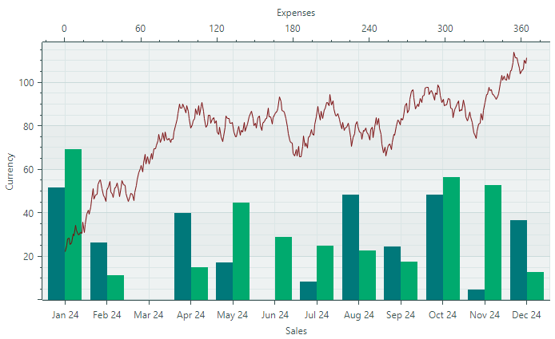
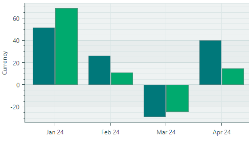

# Начало работы с диаграммами

Этот учебник показывает, как отобразить три серии данных в контроле `CartesianChart`, используя представления Bar и Line series views.



Сначала мы определим данные для контрола диаграммы (в объектах View Model), а затем привяжем контрол диаграммы к этим данным.

Далее мы определим и настроим оси по умолчанию, а также покажем, как добавить дополнительную ось X и связать её с конкретной серией.

## Определение View Model для серии

Начните с создания View Model для одной серии. 

``` cs
using Eremex.AvaloniaUI.Charts;

public partial class SeriesViewModel : ObservableObject
{
    [ObservableProperty] Color color;
    [ObservableProperty] ISeriesDataAdapter dataAdapter;
}
```

Класс _SeriesViewModel_ предоставляет два свойства, задающих цвет и данные серии.

Данные для серий контрола диаграммы предоставляются с помощью объектов _Data Adapter_. 
Eremex Charts поддерживают несколько адаптеров данных для различных типов данных (числовых, дата-время и качественных). В этом учебнике мы будем использовать два адаптера данных:

- `SortedNumericDataAdapter` — предоставляет пары (числовое значение X, числовое значение Y), отсортированные по значениям X.
- `SortedDateTimeDataAdapter` — предоставляет пары (значение X типа DateTime, числовое значение Y), отсортированные по значениям X.

Эти адаптеры данных инициализируются в главной View Model.

Информацию о других адаптерах данных см. в разделе [Cartesian Chart](cartesian-chart.md).

## Определение главной View Model

Создайте класс _MainWindowViewModel_, инкапсулирующий главную View Model окна. Экземпляр _MainWindowViewModel_ будет назначен свойству `DataContext` окна (и контрола диаграммы).

Добавьте в класс _MainWindowViewModel_ три свойства типа _SeriesViewModel_. Они описывают три серии данных в целевом контроле диаграммы.

``` cs
public partial class MainWindowViewModel : ViewModelBase
{
    [ObservableProperty] SeriesViewModel barSeries1; 
    [ObservableProperty] SeriesViewModel barSeries2; 
    [ObservableProperty] SeriesViewModel lineSeries;
}
```

Инициализируйте эти объекты в конструкторе View Model и укажите цвета и адаптеры данных для серий. 

``` cs
public partial class MainWindowViewModel : ViewModelBase
{
    public MainWindowViewModel()
    {
        //Init data
        var random = new Random(4);
        var random2 = new Random(0);

        var startDate = new DateTime(DateTime.Now.Year, 1, 1);
        SortedDateTimeDataAdapter barSeries1DataAdapter = new();
        SortedDateTimeDataAdapter barSeries2DataAdapter = new();
        SortedNumericDataAdapter lineSeriesDataAdapter = new();
        for (int i = 0; i < 12; i++)
        {
            var argument = startDate.AddMonths(i);
            barSeries1DataAdapter.Add(argument, random.NextDouble() * 100 - 30);
            barSeries2DataAdapter.Add(argument, random.NextDouble() * 100 - 30);
        }
        double startValue = 20;
        for (int i = 0; i < 365; i++)
        {
            var argument = i;
            var value = startValue + (random2.NextDouble() - 0.5) * 10;
            lineSeriesDataAdapter.Add(argument, value);
            startValue = value;
        }
        // Create data series
        BarSeries1 = new() { Color = Color.FromArgb(255, 0, 120, 122), DataAdapter = barSeries1DataAdapter };
        BarSeries2 = new() { Color = Color.FromArgb(255, 0, 170, 110), DataAdapter = barSeries2DataAdapter };
        LineSeries = new() { Color = Color.FromArgb(255, 120, 10, 12), DataAdapter = lineSeriesDataAdapter };
    }

    [ObservableProperty] SeriesViewModel barSeries1; 
    [ObservableProperty] SeriesViewModel barSeries2; 
    [ObservableProperty] SeriesViewModel lineSeries;
}
```

Адаптеры данных заполняются случайными данными:

- Объекты `SortedDateTimeDataAdapter` заполняются 12 точками, соответствующими 12 месяцам года. Значения _X_ объектов `SortedDateTimeDataAdapter` имеют тип `DateTime`.

- Объект `SortedNumericDataAdapter` заполняется 365 точками, соответствующими дням года. Значения _X_ объекта `SortedNumericDataAdapter` являются числовыми.


## Создание контрола Cartesian Chart

Убедитесь, что DataContext окна и контрола диаграммы установлен в объект _MainWindowViewModel_.


Откройте XAML-файл MainWindow и определите контрол `CartersianChart` с двумя сериями следующим образом:

``` xml
xmlns:mxc="https://schemas.eremexcontrols.net/avalonia/charts"             

<mxc:CartesianChart>
    <mxc:CartesianChart.Series>
        <mxc:CartesianSeries Name="barSeries1" DataAdapter="{Binding BarSeries1.DataAdapter}" >
        </mxc:CartesianSeries>

        <mxc:CartesianSeries Name="barSeries2" DataAdapter="{Binding BarSeries2.DataAdapter}" >
        </mxc:CartesianSeries>
    </mxc:CartesianChart.Series>
</mxc:CartesianChart>
```

Этот код добавляет две серии (объекты `CartesianSeries`) в коллекцию `CartesianChart.Series` и привязывает их к соответствующим адаптерам данных в главной View Model.

### Задание представления серии (Series View)

**Представление серии (series view)** определяет визуальное отображение и настройки серии. Cartesian Chart поддерживает несколько представлений серий: Line, Scatter Line, Range Area, Bar, Range Bar и т.д. Подробнее см. в разделе [Cartesian Chart](cartesian-chart.md).

Применим представление Bar к серии. Для этого определите объект `CartesianSideBySideBarSeriesView` в качестве содержимого объекта `CartesianSeries`. 

``` xml
<mxc:CartesianChart>
    <mxc:CartesianChart.Series>
        <mxc:CartesianSeries Name="barSeries1" DataAdapter="{Binding BarSeries1.DataAdapter}" >
            <mxc:CartesianSideBySideBarSeriesView Color="{Binding BarSeries1.Color}" />
        </mxc:CartesianSeries>
        <mxc:CartesianSeries Name="barSeries2" DataAdapter="{Binding BarSeries2.DataAdapter}" >
            <mxc:CartesianSideBySideBarSeriesView Color="{Binding BarSeries2.Color}" />
        </mxc:CartesianSeries>
    </mxc:CartesianChart.Series>
</mxc:CartesianChart>
```

`CartesianSideBySideBarSeriesView` отображает точки в виде прямоугольных столбцов:


Настройка `Color` представления серии позволяет указать цвет отрисовки соответствующей серии.


## Создание и настройка осей по умолчанию

Cartesian Chart может автоматически создавать оси для базовых данных. Может потребоваться вручную определить оси _X_ и _Y_, если вы хотите настроить параметры осей (например, задать заголовок и параметры масштаба). 

Чтобы определить оси, добавьте объекты `AxisX` и/или `AxisY` в коллекции `CartesianChart.AxesX`/`CartesianChart.AxesY`:

``` xml
<mxc:CartesianChart>
    <!-- ... -->
    <mxc:CartesianChart.AxesX>
        <mxc:AxisX Name="salesAxis" Title="Sales">
            <mxc:AxisX.ScaleOptions>
                <mxc:DateTimeScaleOptions MeasureUnit="Month" />
            </mxc:AxisX.ScaleOptions>
        </mxc:AxisX>
    </mxc:CartesianChart.AxesX>

    <mxc:CartesianChart.AxesY>
        <mxc:AxisY Title="Currency"/>
    </mxc:CartesianChart.AxesY>
</mxc:CartesianChart>
```

Приведённый выше код создаёт оси _X_ и _Y_ и задаёт для них заголовки. 

Поскольку исходные точки данных представляют значения для отдельных месяцев, к горизонтальной оси дата-время применяется единица времени `Month` (с помощью свойства `AxisX.ScaleOptions`). 

Если вы запустите приложение сейчас, вы увидите следующий результат:


## Добавление дополнительной серии и оси _X_

Вы можете добавить в контрол диаграммы столько серий, сколько нужно. Эти серии могут использовать как оси по умолчанию, так и собственные оси. 

Добавим Line Series и ось для неё в диаграмму. 

Сначала создайте новый объект `CartesianSeries` в коллекции `CartesianChart.Series` и привяжите его к объекту _LineSeries.DataAdapter_, определённому в View Model.

``` xml
<mxc:CartesianChart>
    <mxc:CartesianChart.Series>
        <!-- ... -->
        <mxc:CartesianSeries Name="lineSeries" DataAdapter="{Binding LineSeries.DataAdapter}" >
        </mxc:CartesianSeries> 
    </mxc:CartesianChart.Series>
</mxc:CartesianChart>
```

### Задание представления Line Series View

Чтобы применить представление Line Series View к этой серии, определите объект `CartesianLineSeriesView` в качестве содержимого серии:

``` xml
<mxc:CartesianSeries Name="lineSeries" DataAdapter="{Binding LineSeries.DataAdapter}" >
    <mxc:CartesianLineSeriesView Color="{Binding LineSeries.Color}" />
</mxc:CartesianSeries> 
```

`CartesianLineSeriesView` — это представление серии, соединяющее точки линиями:


Как и для любого представления серии, вы можете использовать свойство `CartesianLineSeriesView.Color`, чтобы задать цвет отрисовки серии.

### Задание собственной оси для Line Series

Значения _X_ серии Line имеют числовой тип, в то время как существующая горизонтальная ось отображает значения `DateTime`. Таким образом, для серии Line требуется дополнительная числовая ось. 

Определите новую числовую ось _X_ в коллекции `CartesianChart.AxesX`.

``` xml
<mxc:CartesianChart.AxesX>
    <!-- ... -->
    <mxc:AxisX Position="Far" Title="Expenses">
        <mxc:AxisX.ScaleOptions>
            <mxc:NumericScaleOptions />
        </mxc:AxisX.ScaleOptions>
    </mxc:AxisX>
</mxc:CartesianChart.AxesX>
```


Свойство `Position` оси установлено в значение `Far`, чтобы отобразить ось у края, противоположного положению по умолчанию. Для горизонтальной оси значение `Far` соответствует верхнему краю диаграммы. Для вертикальной оси значение `Far` размещает ось у правого края диаграммы.

Теперь нужно связать серию Line с её осью. Это достигается указанием идентификатора оси (уникального строкового значения). Задайте одно и то же значение свойству `Key` оси и свойству `CartesianSeries.AxisXKey`/`CartesianSeries.AxisYKey` серии. 

В этом учебнике укажите идентификатор _"lineSeriesAxis"_ для серии и оси следующим образом:

``` xml
<mxc:CartesianSeries Name="lineSeries" DataAdapter="{Binding LineSeries.DataAdapter}"  
  AxisXKey="lineSeriesAxis">
    <mxc:CartesianLineSeriesView Color="{Binding LineSeries.Color}" />
</mxc:CartesianSeries>

<mxc:CartesianChart.AxesX>
    <!-- ... -->
    <mxc:AxisX Position="Far" Title="Expenses"
       Key="lineSeriesAxis">
        <mxc:AxisX.ScaleOptions>
            <mxc:NumericScaleOptions />
        </mxc:AxisX.ScaleOptions>
    </mxc:AxisX>
</mxc:CartesianChart.AxesX>
```

Вы можете запустить приложение, чтобы увидеть контрол диаграммы, отображающий три серии:


## Создание пользовательского форматирования меток

`CartesianChart` форматирует метки для основных отметок (tickmarks) на основе параметров масштабирования оси. На следующем изображении показано форматирование меток, когда к оси _X_ применена единица времени `Month`:


Свойство `ScaleOptions.LabelFormatter` оси позволяет изменить формат отображения меток. Вы можете использовать класс `Eremex.AvaloniaUI.Charts.FuncLabelFormatter` в качестве форматтера меток, либо создать собственный форматтер, реализовав интерфейс `IAxisLabelFormatter`.

Мы используем класс `FuncLabelFormatter`, чтобы создать короткие метки для значений дата-время оси _X_. В главной View Model реализуйте свойство типа `FuncLabelFormatter`, которое форматирует метки определённым образом. В XAML привяжите параметр `ScaleOptions.LabelFormatter` оси к этому форматтеру.



``` xml
<mxc:AxisX Name="salesAxis" Title="Sales">
    <mxc:AxisX.ScaleOptions>
        <mxc:DateTimeScaleOptions MeasureUnit="Month" LabelFormatter="{Binding MonthFormatter}" />
    </mxc:AxisX.ScaleOptions>
</mxc:AxisX>
```

``` cs
public partial class MainWindowViewModel : ViewModelBase
{
    // ...
    [ObservableProperty] FuncLabelFormatter monthFormatter = new(o => String.Format("{0:MMM} {0:yy}", o));
}
```

## Результат

Теперь вы можете запустить приложение, чтобы увидеть результат этого учебника. Контрол `CartesianChart` отображает три серии данных с использованием представлений Bar и Line series views. Серия Line связана с собственной осью _X_, отображаемой в верхней части диаграммы. 


## Полный код

``` xml
<mx:MxWindow xmlns="https://github.com/avaloniaui"
        xmlns:x="http://schemas.microsoft.com/winfx/2006/xaml"
        xmlns:vm="using:EremexChartsSample.ViewModels"
        xmlns:d="http://schemas.microsoft.com/expression/blend/2008"
        xmlns:mc="http://schemas.openxmlformats.org/markup-compatibility/2006"
        xmlns:mx="https://schemas.eremexcontrols.net/avalonia"
        xmlns:mxc="https://schemas.eremexcontrols.net/avalonia/charts"             
        mc:Ignorable="d" d:DesignWidth="800" d:DesignHeight="450"
        x:Class="EremexChartsSample.Views.MainWindow"
        x:DataType="vm:MainWindowViewModel"
        
        Title="EremexChartsSample">

    <Design.DataContext>
        <!-- This only sets the DataContext for the previewer in an IDE,
             to set the actual DataContext for runtime, set the DataContext property in code (look at App.axaml.cs) -->
        <vm:MainWindowViewModel/>
    </Design.DataContext>

    <mxc:CartesianChart Name="chart1">
        <mxc:CartesianChart.Series>
            <mxc:CartesianSeries Name="barSeries1" DataAdapter="{Binding BarSeries1.DataAdapter}" >
                <mxc:CartesianSideBySideBarSeriesView Color="{Binding BarSeries1.Color}" BarWidth="1" />
            </mxc:CartesianSeries>
            <mxc:CartesianSeries Name="barSeries2" DataAdapter="{Binding BarSeries2.DataAdapter}" >
                <mxc:CartesianSideBySideBarSeriesView Color="{Binding BarSeries2.Color}" />
            </mxc:CartesianSeries>
            <mxc:CartesianSeries Name="lineSeries" DataAdapter="{Binding LineSeries.DataAdapter}"  AxisXKey="lineSeriesAxis" >
                <mxc:CartesianLineSeriesView Color="{Binding LineSeries.Color}" />
            </mxc:CartesianSeries>
        </mxc:CartesianChart.Series>

        <mxc:CartesianChart.AxesX>
            <mxc:AxisX Name="salesAxis" Title="Sales">
                <mxc:AxisX.ScaleOptions>
                    <mxc:DateTimeScaleOptions MeasureUnit="Month" LabelFormatter="{Binding MonthFormatter}" />
                </mxc:AxisX.ScaleOptions>
            </mxc:AxisX>
            <mxc:AxisX Key="lineSeriesAxis" Position="Far" Title="Expenses">
                <mxc:AxisX.ScaleOptions>
                    <mxc:NumericScaleOptions />
                </mxc:AxisX.ScaleOptions>
            </mxc:AxisX>
        </mxc:CartesianChart.AxesX>

        <mxc:CartesianChart.AxesY>
            <mxc:AxisY Title="Currency"/>
        </mxc:CartesianChart.AxesY>
            
    </mxc:CartesianChart>
</mx:MxWindow>
```

``` cs
using Avalonia.Media;
using CommunityToolkit.Mvvm.ComponentModel;
using Eremex.AvaloniaUI.Charts;
using System;

namespace EremexChartsSample.ViewModels;

public partial class MainWindowViewModel : ViewModelBase
{
    public MainWindowViewModel()
    {
        //Init data
        var random = new Random(4);
        var random2 = new Random(0);

        var startDate = new DateTime(DateTime.Now.Year, 1, 1);
        SortedDateTimeDataAdapter barSeries1DataAdapter = new();
        SortedDateTimeDataAdapter barSeries2DataAdapter = new();
        SortedNumericDataAdapter lineSeriesDataAdapter = new();
        for (int i = 0; i < 12; i++)
        {
            var argument = startDate.AddMonths(i);
            barSeries1DataAdapter.Add(argument, random.NextDouble() * 100 - 30);
            barSeries2DataAdapter.Add(argument, random.NextDouble() * 100 - 30);

        }

        double startValue = 20;
        for (int i = 0; i < 365; i++)
        {
            var argument = i;
            var value = startValue + (random2.NextDouble() - 0.5) * 10;
            lineSeriesDataAdapter.Add(argument, value);
            startValue = value;
        }

        // Create data series
        BarSeries1 = new() { Color = Color.FromArgb(255, 0, 120, 122), DataAdapter = barSeries1DataAdapter };
        BarSeries2 = new() { Color = Color.FromArgb(255, 0, 170, 110), DataAdapter = barSeries2DataAdapter };
        LineSeries = new() { Color = Color.FromArgb(255, 120, 10, 12), DataAdapter = lineSeriesDataAdapter };
    }

    [ObservableProperty] SeriesViewModel barSeries1; 
    [ObservableProperty] SeriesViewModel barSeries2; 
    [ObservableProperty] SeriesViewModel lineSeries;

    [ObservableProperty] CustomLabelFormatter monthFormatter = new(o => String.Format("{0:MMM} {0:yy}", o));
}

public partial class SeriesViewModel : ObservableObject
{
    [ObservableProperty] Color color;
    [ObservableProperty] ISeriesDataAdapter dataAdapter;
}

public class CustomLabelFormatter : IAxisLabelFormatter
{
    readonly Func<object, string> formatFunc;

    public CustomLabelFormatter(Func<object, string> formatFunc)
    {
        this.formatFunc = formatFunc;
    }
    public string Format(object value) => 
        formatFunc(value);
}
```

<br>
<br>

<sup>*</sup> Эта страница переведена с использованием технологий машинного перевода.
