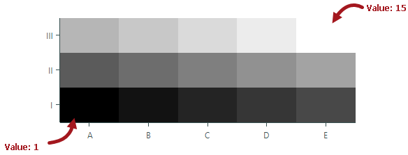
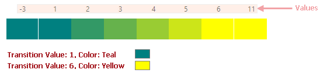
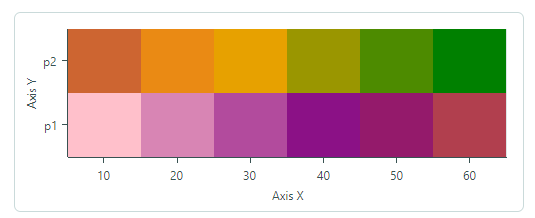
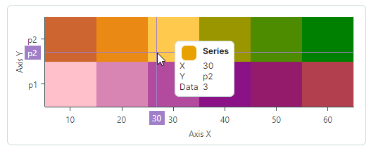
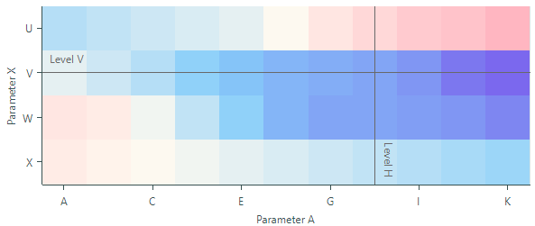

# Heatmap

Контрол Heatmap (`Eremex.AvaloniaUI.Charts.Heatmap`) позволяет создавать двумерную [тепловую карту](https://en.wikipedia.org/wiki/Heat_map) — диаграмму, которая визуализирует данные с помощью цвета. 
Контрол закрашивает каждую точку данных внутри двумерной "карты" цветом, соответствующим значению в этой точке.

Контрол Heatmap является потомком `Eremex.AvaloniaUI.Charts.ChartControl` — базового класса для всех контролов диаграмм, включая `CartersianChart` и `PolarChart`. Таким образом, он наследует специфичную функциональность, общую для всех контролов диаграмм. Возможности контрола Heatmap включают:

- Пользовательское кодирование цвета
- Раскраску в оттенках серого
- Настройку осей X и Y
- Перекрестие 
- Полосы и постоянные линии
- Прокрутку и масштабирование с помощью мыши и клавиатуры
- Экспорт результата раскраски данных в растровое изображение


## Демонстрационное приложение

Обратитесь к демонстрационному приложению Eremex Controls Demo, чтобы увидеть примеры, демонстрирующие возможности контрола Heatmap в действии.

## Начало работы с контролом Heatmap

Чтобы настроить контрол Heatmap, [предоставьте данные](#предоставление-данных) контролу и [укажите поставщика цвета](#раскраска-значений-точек-данных), который раскрашивает значения точек данных согласно определённой логике. Вы также можете настроить оси для отображения значений осей и, например, постоянных линий.

Обратите внимание, что оси _X_ и _Y_ в контроле Heatmap являются качественными. Аргументы этих осей имеют строковый тип.
Значения точек данных внутри "карты" имеют тип Double.


## Предоставление данных

Установите свойство `Heatmap.DataAdapter` в объект `Eremex.AvaloniaUI.Charts.HeatmapDataAdapter`, чтобы предоставить данные контролу Heatmap. 
Класс `HeatmapDataAdapter` содержит следующие основные свойства, которые необходимо инициализировать:

``` cs
public class HeatmapDataAdapter : ISeriesDataAdapter
{
    public IList<string> XArguments;
    public IList<string> YArguments;
    public double[,] Values;
    //...
}
```

- `XArguments` — Список строк, задающих аргументы оси _X_. Аргументы _X_ должны быть уникальными.
- `YArguments` — Список строк, задающих аргументы оси _Y_. Аргументы _Y_ должны быть уникальными.
- `Values` — Двумерный массив значений типа Double. 
    
    Ширина и высота массива `Values` должны соответствовать количеству элементов в списках `XArguments` и `YArguments` соответственно.
    
    Массив `Values` может содержать значение `Double.NaN` для отдельных точек. Такие точки не отрисовываются контролом Heatmap, и пользователь видит фон контрола через эти точки.

    Строки массива `Values` отрисовываются контролом Heatmap снизу вверх.
    Первая строка массива `Values` отрисовывается внизу, а последняя строка — вверху. Подробности см. в примере ниже.

Используйте следующие методы, чтобы обновить данные контрола Heatmap во время выполнения:

- `HeatmapDataAdapter.UpdateValues(double[,] newValues)` — Обновляет текущие значения (`HeatmapDataAdapter.Values`) значениями, указанными параметром `newValues` метода. Количество столбцов и строк в массиве `newValues` должно соответствовать количеству столбцов и строк в массиве `HeatmapDataAdapter.Values`.
- `HeatmapDataAdapter.UpdateXArguments(IList<string> newArguments)` — Обновляет текущие аргументы _X_ (`HeatmapDataAdapter.XArguments`) новыми аргументами. Количество элементов в списке `newArguments` должно соответствовать количеству элементов в списке `HeatmapDataAdapter.XArguments`. Аргументы _X_ должны быть уникальными.
- `HeatmapDataAdapter.UpdateYArguments(IList<string> newArguments)` — Обновляет текущие аргументы _Y_ (`HeatmapDataAdapter.YArguments`) новыми аргументами. Количество элементов в списке `newArguments` должно соответствовать количеству элементов в списке `HeatmapDataAdapter.YArguments`. Аргументы _Y_ должны быть уникальными.

### Пример - Предоставление данных и использование отрисовки по умолчанию

Следующий пример предоставляет примерные данные контролу Heatmap. 
Данные представляют собой двумерный массив, состоящий из трёх строк и пяти столбцов.

Поставщик цвета контрола по умолчанию (`HeatmapGrayscaleColorProvider`) представляет минимальное значение чёрным цветом, а максимальное значение — белым. Остальные значения окрашиваются в пропорциональные оттенки серого.



``` cs
//Create an array that contains 3 rows with 5 values in each row
double[,] values = new double[,] 
{
    {1, 2, 3, 4, 5}, // values rendered at the bottom
    {6, 7, 8, 9, 10},
    {11, 12, 13, 14, 15}, // values rendered at the top
};
List<string> xArgs = new List<string>() { "A", "B", "C", "D", "E" };
List<string> yArgs = new List<string>() { "I", "II", "III" };

HeatmapDataAdapter dataAdapter = new HeatmapDataAdapter(xArgs, yArgs, values);
heatMap1.DataAdapter = dataAdapter;
```


## Раскраска значений точек данных

Поставщики цвета используются для раскраски точек данных в контроле Heatmap. Для каждой точки данных контрол запрашивает у поставщика цвета (свойство `Heatmap.ColorProvider`) цвет для конкретного значения.

Доступны следующие поставщики цвета:

- `HeatmapGrayscaleColorProvider` (по умолчанию) — Позволяет раскрашивать значения в оттенках серого.
- `HeatmapRangeColorProvider` — Позволяет раскрашивать точки данных пользовательским способом, связывая пользовательские цвета с конкретными значениями.


При необходимости вы можете создать собственный поставщик цвета, реализовав интерфейс `IHeatmapColorProvider`.

## Раскраска в оттенках серого

Контрол Heatmap по умолчанию использует раскраску точек данных в оттенках серого. Раскраска в оттенках серого реализована классом `HeatmapGrayscaleColorProvider`. Чтобы использовать этот поставщик цвета, вы можете оставить свойство `Heatmap.ColorProvider` неназначенным, либо явно установить свойство `Heatmap.ColorProvider` в объект `HeatmapGrayscaleColorProvider`.

Объект `HeatmapGrayscaleColorProvider` отрисовывает минимальное значение среди всех точек данных чёрным цветом, а максимальное значение — белым. Остальные значения, лежащие между минимальным и максимальным значениями, отрисовываются в пропорциональных оттенках серого.

### Пример - Раскраска в оттенках серого

Следующий пример привязывает контрол Heatmap к примерным данным и отрисовывает точки данных с помощью поставщика цвета по умолчанию (`HeatmapGrayscaleColorProvider`). Код также показывает, как изменить заголовки осей.


```xml
xmlns:mxc="https://schemas.eremexcontrols.net/avalonia/charts"

<mxc:Heatmap DataAdapter="{Binding DataAdapter}">
    <mxc:Heatmap.AxisX>
        <mxc:HeatmapAxisX Title="Parameter A">
        </mxc:HeatmapAxisX>
    </mxc:Heatmap.AxisX>
    <mxc:Heatmap.AxisY>
        <mxc:HeatmapAxisY Title="Parameter B">
        </mxc:HeatmapAxisY>
    </mxc:Heatmap.AxisY>
</mxc:Heatmap>
```

```cs
public partial class MainWindowViewModel : ViewModelBase
{
    [ObservableProperty]
    HeatmapDataAdapter dataAdapter;

    public MainWindowViewModel()
    {
        double[,] values = new double[,]
        {
            {148, 169, 185, 199, 213, 223, 228, 233}, // values rendered at the bottom
            {161, 182, 196, 207, 216, 222, 224, 223},
            {162, 181, 191, 198, 205, 208, 208, 205},
            {150, 163, 172, 177, 179, 177, 174, 168},
            {126, 132, 136, 142, 143, 140, 135, 127},
            {95, 97, 101, 105, 107, 104, 101, 98} // values rendered at the top
        };

        List<string> xArgs = new List<string>() { "1", "2", "3", "4", "5", "6", "7", "8" };
        List<string> yArgs = new List<string>() { "10", "20", "30", "40", "50", "60"};

        dataAdapter = new HeatmapDataAdapter(xArgs, yArgs, values);
    }
}
```


## Пользовательская раскраска

Чтобы раскрашивать точки данных в контроле Heatmap пользовательским способом, назначьте объект `HeatmapRangeColorProvider` свойству `Heatmap.ColorProvider`. `HeatmapRangeColorProvider` позволяет связывать пользовательские цвета с конкретными значениями (переходными значениями). Для вычисления цветов значений, лежащих между двумя переходными значениями, `HeatmapRangeColorProvider` использует градиент между цветами, назначенными этим переходным значениям.

При указании переходных значений вы можете задавать абсолютные или нормализованные величины.

На следующем изображении показано, как `HeatmapRangeColorProvider` строит цветовые градиенты между примерными абсолютными переходными значениями. В этом примере определены три переходных значения:

- Значение 1 связано с цветом Teal
- Значение 6 связано с цветом Yellow
- Значение 10 связано с цветом Purple


### Пример - Пользовательская раскраска

Следующий пример использует `HeatmapRangeColorProvider`, чтобы раскрасить точки данных контрола Heatmap согласно пользовательским правилам раскраски. Код задаёт цвета для представления абсолютных переходных значений: 95, 110, 150, 210 и 233.
Цвета для остальных значений вычисляются согласно градиенту между цветами, назначенными соседним переходным значениям.


``` xml
xmlns:mxc="https://schemas.eremexcontrols.net/avalonia/charts"

<mxc:Heatmap DataAdapter="{Binding DataAdapter}" ColorProvider="{Binding ColorProvider}">
    <mxc:Heatmap.AxisX>
        <mxc:HeatmapAxisX Title="Parameter A">
        </mxc:HeatmapAxisX>
    </mxc:Heatmap.AxisX>
    <mxc:Heatmap.AxisY>
        <mxc:HeatmapAxisY Title="Parameter B">
        </mxc:HeatmapAxisY>
    </mxc:Heatmap.AxisY>
</mxc:Heatmap>
```

``` cs
public partial class MainWindowViewModel : ViewModelBase
{
    [ObservableProperty]
    HeatmapDataAdapter dataAdapter;

    [ObservableProperty]
    HeatmapRangeColorProvider colorProvider = new HeatmapRangeColorProvider();

    public MainWindowViewModel()
    {
        HeatmapRangeStop[] colorRanges = new HeatmapRangeStop[]
        {
            new() { Value = 95, Color = Color.FromRgb(0,102,101) },
            new() { Value = 110, Color = Color.FromRgb(1,210,207) },
            new() { Value = 150, Color = Color.FromRgb(0,155,105)},
            new() { Value = 210, Color = Color.FromRgb(81,206,68)},
            new() { Value = 233, Color = Color.FromRgb(213,248,0) }
        };
        colorProvider.AddRange(colorRanges);

        double[,] values = new double[,]
        {
            {148, 169, 185, 199, 213, 223, 228, 233}, // values rendered at the bottom
            {161, 182, 196, 207, 216, 222, 224, 223},
            {162, 181, 191, 198, 205, 208, 208, 205},
            {150, 163, 172, 177, 179, 177, 174, 168},
            {126, 132, 136, 142, 143, 140, 135, 127},
            {95, 97, 101, 105, 107, 104, 101, 98}    // values rendered at the top
        };

        List<string> xArgs = new List<string>() { "1", "2", "3", "4", "5", "6", "7", "8" };
        List<string> yArgs = new List<string>() { "10", "20", "30", "40", "50", "60"};

        dataAdapter = new HeatmapDataAdapter(xArgs, yArgs, values);
    }
}
```

### Цвета для значений за пределами граничных переходных значений

Как правило, объект `HeatmapRangeColorProvider` должен включать цвета для минимального и максимального значений всего диапазона значений. Это гарантирует, что цветовые градиенты, построенные объектом `HeatmapRangeColorProvider`, охватывают все значения, предоставленные контролу Heatmap.
В противном случае значения за пределами граничных переходных значений окрашиваются теми же цветами, что и граничные переходные значения.

На следующем изображении показано, как `HeatmapRangeColorProvider` вычисляет цвета, когда определённые значения выходят за пределы минимального и максимального переходных значений.



### Нормализованные переходные значения

Если вы не знаете минимальное и максимальное абсолютные значения всего диапазона данных, вы можете задать переходные значения с помощью нормализованных величин. Установите свойство `HeatmapRangeColorProvider.IsNormalizedValues` в `true`, чтобы включить нормализацию значений для объекта `HeatmapRangeColorProvider`. В этом режиме указывайте переходные значения в диапазоне от `0` до `1`, где `0` и `1` представляют минимальное и максимальное значения соответственно. Нормализованное значение `0.5` представляет абсолютное значение в середине диапазона данных (`minimum + (maximum-minimum)/2`).


#### Пример - Раскраска точек данных, если минимальное и максимальное значения заранее неизвестны

Следующий пример использует объект `HeatmapRangeColorProvider` для раскраски точек данных с помощью нормализованных переходных значений. Свойство `HeatmapRangeColorProvider.IsNormalizedValues` установлено в `true`, чтобы включить нормализацию значений. Переходные значения указаны в нормализованных величинах: 0, 0.3, 0.7 и 1, где значения 0 и 1 представляют минимальное и максимальное значения диапазона данных.



``` cs
double[,] values = new double[,]
{
    {-5, -4, -3, -2, -1, 0}, // values rendered at the bottom
    {1, 2, 3, 4, 5, 6}       // values rendered at the top
};

List<string> xArgs = new List<string>();

for (int i=1; i <= values.GetLength(1); i++)
{
    xArgs.Add((i*10).ToString());
}

List<string> yArgs = new List<string>() { "p1", "p2" };


HeatmapRangeColorProvider colorProvider = new HeatmapRangeColorProvider();
colorProvider.IsNormalizedValues = true;
HeatmapRangeStop[] colorRanges = new HeatmapRangeStop[]
{
    new() { Value = 0, Color = Colors.Pink },
    new() { Value = 0.3, Color = Colors.Purple},
    new() { Value = 0.7, Color = Colors.Orange },
    new() { Value = 1, Color = Colors.Green},
};
colorProvider.AddRange(colorRanges);

heatmap.ColorProvider = colorProvider;
heatmap.DataAdapter = new HeatmapDataAdapter(xArgs, yArgs, values);
```

## Оси

Контрол Heatmap содержит две оси, _X_ и _Y_. Аргументы для этих осей предоставляются при вызове конструктора `HeatmapDataAdapter`, параметрами `xArguments` и `yArguments`.

``` cs
double[,] values = new double[,] 
{
    {1, 2, 3, 4, 5}, // values rendered at the bottom
    {6, 7, 8, 9, 10},
    {11, 12, 13, 14, 15}, // values rendered at the top
};
List<string> xArgs = new List<string>() { "A", "B", "C", "D", "E" };
List<string> yArgs = new List<string>() { "I", "II", "III" };
//...
HeatmapDataAdapter dataAdapter = new HeatmapDataAdapter(xArgs, yArgs, values);
heatmap.DataAdapter = dataAdapter;
```

- Оси контрола являются качественными, что означает, что их значения имеют строковый тип.
- Количество элементов в списке `yArguments` должно соответствовать количеству строк в двумерном массиве данных (`HeatmapDataAdapter.Values`).
- Количество элементов в списке `xArguments` должно соответствовать количеству столбцов в двумерном массиве данных (`HeatmapDataAdapter.Values`).

Вы можете настроить параметры осей, указав объекты `Heatmap.AxisX` и `Heatmap.AxisY`.

Следующий код задаёт заголовки для осей.

``` xml
xmlns:mxc="https://schemas.eremexcontrols.net/avalonia/charts"

<mxc:Heatmap ...>
    <mxc:Heatmap.AxisX>
        <mxc:HeatmapAxisX Title="Axis X">
        </mxc:HeatmapAxisX>
    </mxc:Heatmap.AxisX>
    <mxc:Heatmap.AxisY>
        <mxc:HeatmapAxisY Title="Axis Y">
        </mxc:HeatmapAxisY>
    </mxc:Heatmap.AxisY>
</mxc:Heatmap>
```


### Шкала оси

Вы можете использовать свойства `AxisX.ScaleOptions` и `AxisY.ScaleOptions`, чтобы настроить параметры отображения осей. Эти свойства имеют тип `QualitativeScaleOptions`.

Следующий пример устанавливает параметр шкалы `GridSpacing` в 2, чтобы отображать каждую вторую подпись и основную отметку, пропуская подписи и отметки между ними.


``` xml
<mxc:HeatmapAxisX >
    <mxc:HeatmapAxisX.ScaleOptions>
        <mxc:QualitativeScaleOptions GridSpacing="2" />
    </mxc:HeatmapAxisX.ScaleOptions>
</mxc:HeatmapAxisX>
```


#### Форматирование подписей осей

Свойство `ScaleOptions.LabelFormatter` позволяет указать объект, который форматирует отображаемые значения оси пользовательским способом. Вы можете реализовать пользовательский форматтер подписей на основе функции/выражения с помощью объекта `Eremex.AvaloniaUI.Charts.FuncLabelFormatter`.

Следующий пример реализует пользовательский форматтер подписей для значений оси.


``` xml
<mxc:Heatmap Grid.Row="1" Name="heatmap">
    <mxc:Heatmap.AxisX>
        <mxc:HeatmapAxisX Title="Parameter A">
            <mxc:HeatmapAxisX.ScaleOptions>
                <mxc:QualitativeScaleOptions LabelFormatter="{Binding CustomLabelFormatter}" />
            </mxc:HeatmapAxisX.ScaleOptions>
        </mxc:HeatmapAxisX>
    </mxc:Heatmap.AxisX>
</mxc:Heatmap>
```

``` cs
public partial class MainWindowViewModel : ViewModelBase
{
    // ...
    [ObservableProperty] FuncLabelFormatter customLabelFormatter = new(o => String.Format("val: {0}", o));
}
```


### Параметры осей

Следующий список суммирует параметры отображения и поведения осей контрола Heatmap:

- `ConstantLines` и `ConstantLinesSource` — Позволяют закрашивать постоянные линии для конкретных значений. См. [Постоянные линии и полосы](#постоянные-линии-и-полосы).
- `EnableZooming` —  Позволяет пользователю масштабировать ось с помощью колеса мыши и клавиатуры.
- `EnableScrolling` —  Позволяет пользователю прокручивать ось с помощью перетаскивания мышью и сочетаний клавиш.
- `InterlacingColor` - Цвет, используемый для закраски чередующихся полос (когда включён параметр `ShowInterlacing`).
- `MinorCount` — Задаёт количество вспомогательных отметок и линий сетки.
- `Position` — Задаёт положение оси. Доступные варианты: `Near` (ось X отображается внизу, а ось Y — у левого края диаграммы) и `Far` (ось X отображается вверху, а ось Y — у правого края диаграммы).
- `ShowAxisLine` — Задаёт видимость линии оси.
- `ShowInterlacing` — Задаёт, закрашивать ли чередующиеся полосы между основными линиями сетки. Подробнее см. `ShowMajorGridlines`.
- `ShowLabels` — Задаёт видимость подписей, соответствующих основным отметкам.
- `ShowMajorGridlines` — Задаёт видимость линий сетки, соответствующих основным отметкам. Основные и вспомогательные линии сетки отображаются позади закрашенных точек данных. Линии сетки видны в следующих случаях:
    
    - в позициях, где точки данных отрисовываются полупрозрачными цветами.
    - в позициях, где точки данных не отрисовываются (например, когда значение точки данных равно `Double.NaN`).
    
- `ShowMajorTickmarks` — Задаёт видимость основных отметок.
- `ShowMinorGridlines` — Задаёт видимость линий сетки, соответствующих вспомогательным отметкам. Подробнее см. `ShowMajorGridlines`.
- `ShowMinorTickmarks` — Задаёт видимость вспомогательных отметок.
- `ShowTitle` — Задаёт видимость заголовка оси (свойство `Title`).
- `Strips` и `StripsSource` — Позволяют закрашивать диапазоны между конкретными значениями. См. [Постоянные линии и полосы](#постоянные-линии-и-полосы).
- `Thickness` — Толщина линии оси.
- `Title` — Получает или задаёт заголовок оси.
- `TitlePosition` — Получает или задаёт положение заголовка оси.


## Перекрестие

Перекрестие — это пара тонких вертикальной и горизонтальной линий (линии аргумента и значения), позволяющих пользователю видеть точные значения осей и точек данных в текущей позиции курсора. Перекрестие появляется при наведении на область данных и следует за указателем мыши.



Используйте свойство `Heatmap.CrosshairOptions`, чтобы настроить параметры отображения перекрестия или отключить эту функцию. 

### Отключение перекрестия

Свойство `CrosshairOptions.ShowCrosshair` позволяет отключить перекрестие.

``` xml
<mxc:Heatmap x:Name="heatmap1" >
    <mxc:Heatmap.CrosshairOptions>
        <mxc:CrosshairOptions ShowCrosshair="False" />
    </mxc:Heatmap.CrosshairOptions>
    <!-- ... -->
</mxc:Heatmap>
```

## Постоянные линии и полосы

Контрол Heatmap позволяет использовать постоянные линии и полосы для обозначения конкретных значений и диапазонов значений для горизонтальной и вертикальной осей.

### Постоянные линии

Постоянная линия — это линия, проведённая перпендикулярно оси, которая обозначает конкретное значение оси. Чтобы создать постоянные линии, используйте коллекцию `ConstantLines` или источник `ConstantLinesSource` объектов `HeatmapAxisX` и `HeatmapAxisY`.

Следующий пример создаёт постоянные линии для осей _X_ и _Y_, чтобы обозначить значения осей "H" и "V" соответственно.



``` xml
<mxc:Heatmap Name="heatmap">
    <mxc:Heatmap.AxisX>
        <mxc:HeatmapAxisX Title="Parameter A">
            <mxc:HeatmapAxisX.ConstantLines>
                <mxc:ConstantLine AxisValue="H" ShowTitle="True" Title="Level H" Color="DimGray" ShowBehind="False" />
            </mxc:HeatmapAxisX.ConstantLines>
        </mxc:HeatmapAxisX>
    </mxc:Heatmap.AxisX>
    <mxc:Heatmap.AxisY>
        <mxc:HeatmapAxisY Title="Parameter X">
            <mxc:HeatmapAxisY.ConstantLines>
                <mxc:ConstantLine AxisValue="V" ShowTitle="True" Title="Level V" Color="DimGray" ShowBehind="False" />
            </mxc:HeatmapAxisY.ConstantLines>
        </mxc:HeatmapAxisY>
    </mxc:Heatmap.AxisY>            
</mxc:Heatmap>
```

Установите параметр `ConstantLine.ShowBehind` в `false`, чтобы рисовать постоянные линии поверх закрашенных точек данных. В противном случае они рисуются позади точек данных и видны в следующих случаях:
    
- в позициях, где точки данных отрисовываются полупрозрачными цветами.
- в позициях, где точки данных не отрисовываются (например, когда значение точки данных равно `Double.NaN`).

### Полосы

Полоса — это расширение постоянной линии. Полосы используются для выделения диапазонов значений оси. Они всегда отображаются позади закрашенных точек данных.

Чтобы создать полосы, используйте коллекцию `Strips` или источник `StripsSource` объектов `HeatmapAxisX` и `HeatmapAxisY`.

``` xml
<mxc:Heatmap.AxisY>
    <mxc:HeatmapAxisY Title="Parameter">
        <mxc:HeatmapAxisY.Strips>
            <mxc:Strip AxisValue1="W" AxisValue2="V" Color="Gray" />
        </mxc:HeatmapAxisY.Strips>
    </mxc:HeatmapAxisY>
</mxc:Heatmap.AxisY>
```

Полосы видны в следующих случаях:
    
- в позициях, где точки данных отрисовываются полупрозрачными цветами.
- в позициях, где точки данных не отрисовываются (например, когда значение точки данных равно `Double.NaN`).


## Прокрутка и масштабирование

### Разрешение операций прокрутки и масштабирования

Операции прокрутки и масштабирования включены по умолчанию. Следующие параметры позволяют отключить эти операции для осей _X_ и/или _Y_:

- `Axis.EnableZooming`
- `Axis.EnableScrolling`

``` xml
<!-- Disable scroll and zoom operations for the X axis -->
<mxc:Heatmap.AxisX>
    <mxc:HeatmapAxisX EnableZooming="False" EnableScrolling="False"/>
</mxc:Heatmap.AxisX>
<!-- Disable scroll and zoom operations for the Y axis -->
<mxc:Heatmap.AxisY>
    <mxc:HeatmapAxisY EnableZooming="False" EnableScrolling="False"/>
</mxc:Heatmap.AxisY>
```


### Прокрутка и масштабирование пользователем

#### Прокрутка тепловой карты (осей _X_ и _Y_ одновременно)

- Перетащите область данных мышью

    или

- Нажмите Ctrl+СТРЕЛКА для прокрутки с клавиатуры.

<!-- TODO
Make animations for scrolling and zooming features, like in Charts
 -->


#### Масштабирование тепловой карты

- Прокрутите колесо мыши над областью данных

    или

- Нажмите Ctrl+«+» для увеличения масштаба и Ctrl+«-» для уменьшения.


#### Прокрутка оси _X_ или _Y_

- Перетаскивайте мышью в области соответствующей оси. 

#### Масштабирование оси _X_ или _Y_

- Прокрутите колесо мыши в области соответствующей оси.


#### Масштабирование в конкретную область

- Нажмите и удерживайте SHIFT в области данных, затем перетащите, чтобы выделить нужный прямоугольник.

#### Масштабирование в диапазон значений оси

- Нажмите и удерживайте SHIFT в области оси, затем перетащите, чтобы выделить нужный диапазон.


### Экспорт

Вы можете использовать метод `Heatmap.Export`, чтобы экспортировать отрисовку контрола в объект `WriteableBitmap`. Результирующее растровое изображение содержит закрашенные точки данных. Размер изображения соответствует размеру данных контрола Heatmap, заданному массивом `Heatmap.DataAdapter.Values`.

Следующий пример сохраняет отрисовку контрола Heatmap в файл изображения.

``` cs
WriteableBitmap bitmap = heatmap.Export();
bitmap.Save("exported-heatmap.png");
```

<br>
<br>

<sup>*</sup> Эта страница переведена с использованием технологий машинного перевода.
