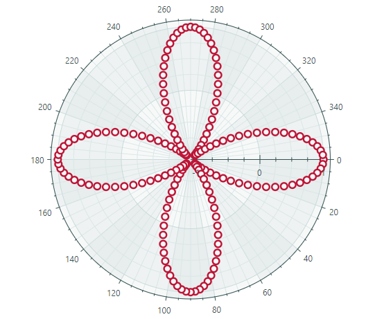

# Charts

Библиотека контролов Eremex для Avalonia UI включает мощные контролы для построения графиков, которые помогают визуализировать данные в виде 2D-диаграмм. Отрисовка графики в контролах Chart оптимизирована для отображения больших объёмов данных. Контролы сохраняют высокую производительность даже когда серии содержат миллионы точек.

## CartesianChart

[CartesianChart](cartesian-chart.md) позволяет строить диаграмму в декартовой системе координат.

### Возможности

- Неограниченное количество серий данных в рамках одной диаграммы
- Поддержка нескольких осей
- Взаимная замена осей X и Y
- Инвертирование осей
- Несколько типов осей: числовая (Numeric), дата-время (Date-Time), временной интервал (Time Span), качественная (Qualitative) и логарифмическая (Logarithmic)
- Прокрутка и масштабирование всех осей одновременно
- Прокрутка и масштабирование отдельных осей
- Высокая производительность при отображении больших объёмов данных
- Визуализация данных в реальном времени
- Crosshair
- Полосы (Strips) и постоянные линии (constant lines)
- Использование паттерна проектирования MVVM для предоставления данных и настройки параметров диаграммы
- Отображение быстро изменяющихся данных в реальном времени. Используйте специальный адаптер данных для реализации подвижного видового окна (moving viewport)

### Типы серий

* Line Series View
* Scatter Line Series View
* Point Series View (с поддержкой SVG-маркеров)
* Area Series View
* Step Line Series View
* Step Area Series View
* Range Area Series View
* Stacked Area Series View *
* Full-Stacked Area Series View *
* Bar Series View
* Range Bar Series View 
* Candlestick Series View
* Lollipop Series View

Дополнительную информацию см. в следующих разделах:

- [Cartesian Chart](cartesian-chart.md)
- [Начало работы с диаграммами](get-started-with-charts.md)
- [Начало работы с диаграммами — паттерн MVVM](get-started-with-charts-mvvm.md)

## Heatmap

Позволяет создать двумерную [тепловую карту](https://en.wikipedia.org/wiki/Heat_map) — диаграмму, которая визуализирует данные с помощью закрашенных цветом квадратов.

### Возможности

- Настраиваемое цветовое кодирование
- Раскраска в оттенках серого
- Настройка осей X и Y
- Crosshair 
- Полосы (Strips) и постоянные линии (constant lines)
- Прокрутка и масштабирование с помощью мыши и клавиатуры
- Экспорт результата цветовой раскраски данных в растровое изображение

Дополнительную информацию см. в следующем разделе:

- [Heatmap](heatmap.md)

## PolarChart

Строит диаграмму в полярной системе координат.

### Возможности

- Crosshair
- Полосы (Strips) и постоянные линии (constant lines)
- Использование паттерна проектирования MVVM для предоставления данных и настройки параметров диаграммы
- Направление развёртки и начальный угол (для оси X)

### Типы серий

- Point Series View
- Line Series View
- Scatter Line Series View
- Area Series View
- Range Area Series View

## SmithChart

Позволяет создать диаграмму Смита (Smith chart).

### Возможности

- Crosshair
- Использование паттерна проектирования MVVM для предоставления данных и настройки параметров диаграммы

### Типы серий

- Point Series View
- Scatter Line Series View

 
 

* Эта страница переведена с использованием технологий машинного перевода.
