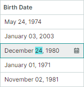
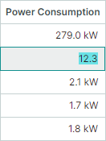
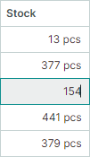

# Cells

Ячейки таблицы используются для отображения и редактирования значений строк. Они формируются на пересечении [строк](rows.md) и [колонок](columns.md). Хотя ячейки отображают данные, их поведение и внешний вид (например, редакторы для встроенного редактирования и настройки форматирования) обычно определяются свойствами родительских колонок. В этом разделе описано, как управлять содержимым ячеек и получать его, а также как настраивать внешний вид ячеек.

## Format Cell Values

DataGrid позволяет отображать значения ячеек с использованием стандартных и пользовательских форматов. Например, вы можете форматировать числовые значения как валюту, процент, целое или дробное число и т. д. Значение DateTime может быть представлено в кратком формате даты, полном формате даты, только в формате времени и т. п.

Доступны следующие подходы для форматирования значений ячеек:

- [Использование маски ввода](#use-masked-input)
- [Задание формата отображения](#set-a-display-format)

- [Настройка отображаемого текста ячеек с помощью события](#customize-display-text-of-cells)


### Use Masked Input

Редакторы Eremex позволяют использовать [маски](../editors/masks/index.md) для ограничения ввода данных и форматирования числовых и дата-временных значений. Маски поддерживаются как для отдельных редакторов, так и для редакторов, встроенных в контролы-контейнеры (DataGrid, TreeList, PropertyGrid и т. д.).


*Применимо к*: ячейкам в режиме отображения и редактирования. Чтобы маски не применялись в режиме отображения (когда редактирование ячейки неактивно), отключите свойство редактора `MaskUseAsDisplayFormat`.

*Шаги*:

1. Назначьте колонке [встроенный редактор](data-editing/index.md) Eremex. 
2. Установите свойство редактора `MaskType` в значение `MaskType.Numeric` или `MaskType.DateTime`, чтобы применить маску к числовым или дата-временным значениям соответственно.
3. Установите свойство редактора `Mask` в требуемую маску. Информацию о спецификаторах масок смотрите в следующих разделах:

    - [Числовые маски](../editors/masks/numeric-masks.md)
    - [Маски даты и времени](../editors/masks/date-time-masks.md)


#### Пример - Пользовательское форматирование значений даты и времени с помощью масок

Следующий пример назначает колонке редактор DateEditor и применяет пользовательскую маску даты-времени ("MMMM dd, yyyy"). Эта маска форматирует значения ячеек в режимах редактирования и отображения, как показано на изображении ниже:



``` xml
<mxdg:GridColumn FieldName="BirthDate" Width="*" MinWidth="80">
	<mxdg:GridColumn.EditorProperties>
		<mxe:DateEditorProperties MaskType="DateTime" Mask="MMMM dd, yyyy"/>
	</mxdg:GridColumn.EditorProperties>
</mxdg:GridColumn>
```


### Set a Display Format

Вы можете использовать стандартные и пользовательские спецификаторы формата для форматирования значений ячеек в режиме отображения. 
    
*Применимо к*: ячейкам в режиме отображения.

*Ограничения*: форматы отображения не применяются в режиме редактирования и не ограничивают пользовательский ввод. Например, пользователи по-прежнему могут вводить буквы в числовых колонках, использующих текстовые редакторы. Чтобы форматировать значения в режимах отображения и редактирования и ограничивать ввод данных, используйте специализированные редакторы (SpinEditor для числовых значений, DateEditor для значений даты и времени) или применяйте маски к текстовому редактору.

*Шаги*:

1. Назначьте колонке [встроенный редактор](data-editing/index.md) Eremex. 
2. Задайте формат отображения редактора с помощью его свойства `DisplayFormatString`.
3. Для редакторов, использующих маски для форматирования отображаемого значения, отключите свойство редактора `MaskUseAsDisplayFormat`. Например, DateEditor и SpinEditor по умолчанию используют маски для форматирования значений в режиме отображения. Поэтому для применения формата отображения, заданного свойством `DisplayFormatString`, для этих редакторов необходимо отключить свойство `MaskUseAsDisplayFormat`.

    Описание всех форматов отображения можно найти в документации .NET:

    - [Стандартные строки числового формата](https://learn.microsoft.com/en-us/dotnet/standard/base-types/standard-numeric-format-strings)
    - [Пользовательские строки числового формата](https://learn.microsoft.com/en-us/dotnet/standard/base-types/custom-numeric-format-strings)
    - [Стандартные строки формата даты и времени](https://learn.microsoft.com/en-us/dotnet/standard/base-types/standard-date-and-time-format-strings)
    - [Пользовательские строки формата даты и времени](https://learn.microsoft.com/en-us/dotnet/standard/base-types/custom-date-and-time-format-strings)

#### Пример - Различное форматирование значений даты и времени в режимах отображения и редактирования

Следующий пример назначает колонке встроенный редактор DateEditor и использует его настройки для применения разного форматирования значений в режимах отображения и редактирования:

- Свойство `DisplayFormatString` установлено в значение 'd'. Эта настройка применяет краткий формат даты к значениям в режиме отображения. Чтобы свойство `DisplayFormatString` вступило в силу, свойство `MaskUseAsDisplayFormat` отключено.
- Свойство `Mask` установлено в значение 'g'. Этот формат включает полный формат даты-времени с длинным временем в режиме редактирования.


``` xml
<mxdg:GridColumn FieldName="OrderDate" Width="3*" BandName="AdditionalInformation" >
	<mxdg:GridColumn.EditorProperties>
		<mxe:DateEditorProperties DisplayFormatString="d" Mask="g" MaskUseAsDisplayFormat="False" />
	</mxdg:GridColumn.EditorProperties>
</mxdg:GridColumn>
```

#### Пример - Форматирование значений как валюты

Следующий пример назначает колонке встроенный редактор TextEditor и устанавливает свойство редактора `DisplayFormatString` в строку "c". Этот формат отображает значения ячеек как валюту, когда ячейки находятся в режиме отображения:


``` xml
<mxdg:GridColumn FieldName="Price" Width="2*">
    <mxdg:GridColumn.EditorProperties>
        <mxe:TextEditorProperties DisplayFormatString="c" />
    </mxdg:GridColumn.EditorProperties>
</mxdg:GridColumn>
```

#### Пример - Пользовательское форматирование дробных значений 

Приведённый ниже код назначает колонке встроенный редактор TextEditor и устанавливает свойство `DisplayFormatString` в строку "{}{0:F1} kW". Этот формат отображает дробные значения с одним знаком после запятой и добавляет суффикс "kW" к результату. Когда ячейка находится в режиме редактирования, формат отображения не применяется. Строка "{}" является экранирующим токеном, который позволяет XAML-парсеру трактовать строку, начинающуюся с открывающей фигурной скобки ("{"), как обычный текст, а не как расширение разметки.



``` xml
<mxdg:GridColumn FieldName="PowerConsumption" Width="1.2*" >
    <mxdg:GridColumn.EditorProperties>
        <mxe:TextEditorProperties DisplayFormatString="{}{0:F1} kW" />
    </mxdg:GridColumn.EditorProperties>
</mxdg:GridColumn>
```


### Format Display Values Using an Event

*Применимо к*: ячейкам в режиме отображения

Если ни один формат отображения, ни маска не отвечают вашим требованиям, вы можете обработать событие `CustomColumnDisplayText`, чтобы форматировать значения ячеек произвольным образом. Это событие позволяет заменить стандартное текстовое представление значений в ячейках и [фильтрах колонок](filter-and-search.md#фильтры-колонок). Чтобы предоставить пользовательский отображаемый текст для строк группировки, обработайте событие `DataGridControl.CustomGroupValueDisplayText`.

При изменении отображаемого текста ячейки исходные значения ячейки не изменяются.

#### Пример - Пользовательское форматирование значений ячеек с помощью события CustomColumnDisplayText

Следующий обработчик события `CustomColumnDisplayText` добавляет строку "pcs" после значений ячеек в колонке "Stock". Пользовательские значения отображения, предоставленные с помощью этого события, игнорируются, когда ячейки редактируются.



``` cs
using Eremex.AvaloniaUI.Controls.DataGrid;

private void DataGrid_CustomColumnDisplayText(object sender, DataGridCustomColumnDisplayTextEventArgs e)
{
    if (e.Column.FieldName == "Stock")
        e.DisplayText = string.Format("{0} pcs", e.Value);
}
```

## Value Alignment

Выравнивание содержимого ячеек по горизонтали по умолчанию зависит от типа данных ячейки:

- Числовые значения выравниваются по правому краю.
- Логические значения (флажки) выравниваются по центру.
- Остальные значения выравниваются по левому краю.

По вертикали значения ячеек по умолчанию выравниваются по центру.

Чтобы настроить выравнивание значений в ячейках по горизонтали или вертикали, выполните следующие действия:

1. Назначьте колонке [встроенный редактор](data-editing/index.md) Eremex. 
2. Используйте свойство редактора `HorizontalContentAlignment`, чтобы задать горизонтальное выравнивание.
2. Используйте свойство редактора `VerticalContentAlignment`, чтобы задать вертикальное выравнивание.

### Пример - Выравнивание значений и заголовка колонки по центру

Следующий код выравнивает по центру значения и заголовок колонки _Hire Date_. Чтобы выровнять значения ячеек, код назначает этой колонке встроенный редактор `DateEditor` и устанавливает свойство редактора `HorizontalContentAlignment` в значение `Center`.
Для выравнивания содержимого заголовка колонки используется свойство колонки `HorizontalContentAlignment`.


``` xml
<mxdg:GridColumn FieldName="HireDate" Width="*" MinWidth="80" HeaderHorizontalAlignment="Center">
	<mxdg:GridColumn.EditorProperties>
		<mxe:DateEditorProperties HorizontalContentAlignment="Center"/>
	</mxdg:GridColumn.EditorProperties>
</mxdg:GridColumn>
```

## Multi-line Text and Text Wrapping in Cells

Чтобы отображать многострочный текст в ячейках, выполните следующие действия:

1. Назначьте колонке [встроенный редактор](data-editing/index.md) TextEditor (или его наследника). 
2. Используйте свойство редактора `TextWrapping`, чтобы включить перенос текста.

Когда перенос текста включён, высота строк автоматически подстраивается, чтобы полностью отобразить содержимое ячеек.

### Пример - Включение переноса текста в ячейках

Следующий код назначает колонке текстовый редактор и включает для него перенос текста.


``` xml
<mxdg:GridColumn FieldName="Notes" Width="*" MinWidth="80">
    <mxdg:GridColumn.EditorProperties>
        <mxe:TextEditorProperties TextWrapping="Wrap"/>
    </mxdg:GridColumn.EditorProperties>
</mxdg:GridColumn>
``` 

 

## Provide Data for Cells

Ячейки в DataGrid принадлежат либо связанным (bound), либо несвязанным (unbound) колонкам. 

[Связанные колонки](data-binding/index.md) привязаны к полям (свойствам) исходного источника данных контрола. Свойство `GridColumn.FieldName` таких колонок устанавливается в имя поля, существующего в источнике данных.
Ячейки связанных колонок получают значения из соответствующих полей источника данных.

[Несвязанные колонки](data-binding/unbound-columns.md) (также называемые вычисляемыми колонками) позволяют отображать (и при необходимости редактировать) значения, отсутствующие в источнике данных. Например, вы можете создать доступную только для чтения несвязанную колонку, отображающую значения, вычисленные на основе нескольких других полей. Значения для несвязанных колонок предоставляются с помощью события `CustomUnboundColumnData`. Вы также можете создавать редактируемые несвязанные колонки. В этом случае обработчик события `CustomUnboundColumnData` также должен сохранять данные, введённые пользователями (например, вы можете сохранить их в кэше или в источнике данных).
 
Несвязанные колонки можно использовать для настройки отображаемого текста ячеек. Информацию о других способах настройки отображаемого текста смотрите в разделе [Настройка отображаемого текста ячеек](#customize-display-text-of-cells).


### Пример — Создание вычисляемой колонки 

Следующий пример создаёт несвязанную колонку _Year Total_. Обработчик события `CustomUnboundColumnData` вычисляет значения этой колонки как сумму полей Quarter1, Quarter2, Quarter3 и Quarter4.


``` xml
<!-- MainWindow.axaml -->
xmlns:mxdg="https://schemas.eremexcontrols.net/avalonia/datagrid"
xmlns:mxe="https://schemas.eremexcontrols.net/avalonia/editors"
xmlns:sys="clr-namespace:System;assembly=System.Runtime"

<mxdg:DataGridControl Name="dataGrid1" Margin="10" BorderThickness="1"
                        ItemsSource="{Binding Revenues}"
                        CustomUnboundColumnData="dataGrid1_CustomUnboundColumnData" >
    <mxdg:DataGridControl.Columns>
        <mxdg:GridColumn FieldName="Description" Width="*" />
        <mxdg:GridColumn FieldName="Quarter1" Width="*">
            <mxdg:GridColumn.EditorProperties>
                <mxe:TextEditorProperties MaskType="Numeric" Mask="c0"/>
            </mxdg:GridColumn.EditorProperties>
        </mxdg:GridColumn>
        <mxdg:GridColumn FieldName="Quarter2" Width="*">
            <mxdg:GridColumn.EditorProperties>
                <mxe:TextEditorProperties MaskType="Numeric" Mask="c0"/>
            </mxdg:GridColumn.EditorProperties>
        </mxdg:GridColumn>
        <mxdg:GridColumn FieldName="Quarter3" Width="*">
            <mxdg:GridColumn.EditorProperties>
                <mxe:TextEditorProperties MaskType="Numeric" Mask="c0"/>
            </mxdg:GridColumn.EditorProperties>
        </mxdg:GridColumn>
        <mxdg:GridColumn FieldName="Quarter4" Width="*">
            <mxdg:GridColumn.EditorProperties>
                <mxe:TextEditorProperties MaskType="Numeric" Mask="c0"/>
            </mxdg:GridColumn.EditorProperties>
        </mxdg:GridColumn>
        <mxdg:GridColumn Name="colYearTotal" FieldName="YearTotal"
                            Width="*" ReadOnly="True" UnboundDataType="{x:Type sys:Decimal}" >
            <mxdg:GridColumn.EditorProperties>
                    <mxe:TextEditorProperties DisplayFormatString="c0"/>
                </mxdg:GridColumn.EditorProperties>
            </mxdg:GridColumn>
    </mxdg:DataGridControl.Columns>
</mxdg:DataGridControl>
```

``` cs
// MainWindow.axaml.cs
private void dataGrid1_CustomUnboundColumnData(object? sender, DataGridUnboundColumnDataEventArgs e)
{
    if (e.IsGettingData && e.Column.FieldName == "YearTotal")
    {
        RevenueViewModel rec = e.Item as RevenueViewModel;
        if (rec != null)
        {
            e.Value = rec.Quarter1 + rec.Quarter2 + rec.Quarter3 + rec.Quarter4;
        }
    }
}
```

``` cs
// MainWindowViewModel.cs
public partial class MainWindowViewModel : ObservableObject
{
    [ObservableProperty]
    List<RevenueViewModel> revenues;

    public MainWindowViewModel()
    {
        revenues = new List<RevenueViewModel>
            {
                new() { Description = "2025 Revenue", Quarter1 = 1250000m, Quarter2 = 1425000m, Quarter3 = 1680000m, Quarter4 = 1950000m },
                new() { Description = "2026 Revenue", Quarter1 = 1100000m, Quarter2 = 1250000m, Quarter3 = 1450000m, Quarter4 = 1750000m },
                new() { Description = "2027 Revenue", Quarter1 = 950000m, Quarter2 = 1050000m, Quarter3 = 1200000m, Quarter4 = 1400000m },
            };
    }
}

public partial class RevenueViewModel : ObservableObject
{
    [ObservableProperty]
    private string description;

    [ObservableProperty]
    private decimal quarter1;

    [ObservableProperty]
    private decimal quarter2;

    [ObservableProperty]
    private decimal quarter3;

    [ObservableProperty]
    private decimal quarter4;
}
```

Дополнительную информацию смотрите в следующем разделе: [Unbound Columns](data-binding/unbound-columns.md).


## Customize Display Text of Cells

Вы можете обработать событие `CustomColumnDisplayText`, чтобы настроить отображаемый текст конкретных ячеек. Это событие влияет только на отображаемый текст, но не на значения редактирования ячейки. 

Событие `CustomColumnDisplayText` также позволяет изменять текстовое представление значений ячеек в фильтрах колонок и на панели фильтра. Когда событие `CustomColumnDisplayText` возникает для значений на панели фильтра, параметр события `SourceItemIndex` возвращает `-1`. Чтобы предоставить пользовательский отображаемый текст для строк группировки, обработайте событие `DataGridControl.CustomGroupValueDisplayText`.

Если отображаемый текст ячейки зависит от значений других полей/свойств источника данных, вы можете получить эти значения полей с помощью методов DataGridControl (`DataGridControl.GetSourceItem` и `DataGridControl.GetSourceItemValue`) и методов вашего источника данных.

### Пример - Изменение отображаемого текста ячеек с помощью события

Следующий пример обрабатывает событие `CustomColumnDisplayText`, чтобы изменить отображаемый текст значений колонки _HireDate_.

Таблица в текущем примере отображает коллекцию объектов _EmployeeInfo_. Поле _EmployeeInfo.HireDate_ указывает дату приёма сотрудника на работу. Поле _EmployeeInfo.Experience_ указывает общее количество лет стажа сотрудника. Исходный макет показан ниже:


Обработчик события `CustomColumnDisplayText` предоставляет пользовательский отображаемый текст для значений _HireDate_. Вместо значений даты-времени колонка _HireDate_ будет отображать количество лет работы от даты приёма до сегодняшнего дня, за которым следует общее количество лет стажа (значение колонки _Experience_). Заголовки колонок _HireDate_ и _Experience_ заменяются на "Company Work Experience" и "Total Work Experience" соответственно.


``` xml
<!-- MainWindow.axaml -->
xmlns:data="clr-n4amespace:AppEmployees.ViewModels"
xmlns:mxdg="https://schemas.eremexcontrols.net/avalonia/datagrid"
xmlns:mxe="https://schemas.eremexcontrols.net/avalonia/editors"

<mxdg:DataGridControl x:Name="dataGrid" ItemsSource="{Binding Employees}" BorderThickness="1" Margin="10">
    <mxdg:GridColumn FieldName="FirstName" Width="*" MinWidth="80"/>
    <mxdg:GridColumn FieldName="LastName" Width="*" MinWidth="80"/>

    <mxdg:GridColumn FieldName="HireDate" Width="*" MinWidth="170" AllowEditing="False"/>
    <mxdg:GridColumn FieldName="Experience" Width="*" MinWidth="170" />

    <mxdg:GridColumn FieldName="Position" Width="*" MinWidth="100">
        <mxdg:GridColumn.EditorProperties>
            <mxe:ComboBoxEditorProperties ItemsSource="{Binding Source={x:Static data:MainWindowViewModel.Positions}}" IsTextEditable="False"/>
        </mxdg:GridColumn.EditorProperties>
    </mxdg:GridColumn>
</mxdg:DataGridControl>
```

```cs
// MainWindow.axaml.cs

public partial class MainWindow : MxWindow
{
    public MainWindow()
    {
        InitializeComponent();
        GridColumn colHireDate = dataGrid.Columns["HireDate"];
        GridColumn colExperience = dataGrid.Columns["Experience"];
        colExperience.Header = "Total Work Experience";
        colHireDate.Header = "Company Work Experience";
        colHireDate.ColumnFilterMode = Eremex.AvaloniaUI.Controls.DataControl.ColumnFilterMode.DisplayText;
        colHireDate.SortMode = Eremex.AvaloniaUI.Controls.DataControl.SortMode.DisplayText;
        dataGrid.CustomColumnDisplayText += DataGrid_CustomColumnDisplayText;
    }

    private void DataGrid_CustomColumnDisplayText(object sender, Eremex.AvaloniaUI.Controls.DataGrid.DataGridCustomColumnDisplayTextEventArgs e)
    {
        if (e.Column.FieldName != "HireDate")
            return;
        // Get the currently processed value of the HireDate column.
        DateTime hireDate = (DateTime)e.Value;
        // Calculate the number of days from the hire date till today.
        int workingDays = (int)(DateTime.Now - hireDate).TotalDays;
        // Calculate the number of years from the hire date till today.
        int workingYears = (int)workingDays / 365;

        // Supply custom display text for HireDate values shown in the filter panel.
        if (e.SourceItemIndex < 0)
        {
            e.DisplayText = String.Format($"{workingYears} years");
            return;
        }
        // Get the value of the Experience field.
        int totalWorkExperience = (int)dataGrid.GetSourceItemValue(e.SourceItemIndex, "Experience");
        // Supply custom display text for HireDate values.
        e.DisplayText = String.Format($"{workingYears} years ({totalWorkExperience} total)");
    }
}
```

``` cs
using CommunityToolkit.Mvvm.ComponentModel;

public partial class MainWindowViewModel : ObservableObject
{
    [ObservableProperty]
    IList<EmployeeInfo> employees;

    public MainWindowViewModel() {
        Employees = GenerateEmployeeInfo();
    }
    //...
}
public partial class EmployeeInfo : ObservableObject
{
    [ObservableProperty]
    public string firstName;
    [ObservableProperty]
    public string lastName;
    [ObservableProperty]
    public DateTime hireDate;
    [ObservableProperty]
    public int experience;
    [ObservableProperty]
    public string position;
    [ObservableProperty]
}
```

## Get and Set Row Values in Code


DataGrid предоставляет методы для получения и установки значений в отдельных ячейках, а также для работы с исходными объектами данных.

### Work with Cell Values

Следующие методы работают с ячейками, адресуемыми по строке и колонке (или имени поля).
Эти методы используют индексы строк для идентификации строк. Индексы строк отражают порядок строк в контроле, 
идентифицируя как видимые, так и скрытые (внутри свёрнутых групп) строки.
Подробнее об идентификации строк смотрите в разделе: [Идентификация и получение строк](rows.md#идентификация-и-получение-строк).

| Метод | Описание |
|--------|-------------|
| `GetCellValue` | Возвращает значение редактирования (исходное значение), хранящееся в конкретной ячейке. |
| `SetCellValue` | Устанавливает новое значение в конкретной ячейке. |
| `GetCellDisplayText` | Возвращает отформатированный отображаемый текст ячейки, который может отличаться от значения редактирования из-за форматирования колонки или пользовательского обработчика события `CustomColumnDisplayText`. |

**Примеры:**

```csharp
// Get the 'Price' field value from the first visible row
decimal price = (decimal)dataGrid.GetCellValue(0, "Price");

// Set a new value for the 'Status' column in the focused row 
dataGrid.SetCellValue(dataGrid.FocusedRowIndex, "Status", "Approved");

// Get the formatted display text (e.g., "$100.00" instead of 100)
string displayPrice = dataGrid.GetCellDisplayText(0, "Price");
```

### Work with Underlying Data Objects

DataGrid включает методы, позволяющие получить исходный объект строки (бизнес-объект) и изменить его свойства. Используйте следующие члены для получения исходных элементов:

| Член | Описание |
|--------|-------------|
| `DataControlBase.FocusedItem` | Возвращает исходный объект для текущей сфокусированной строки. |
| `GetSourceItem` | Возвращает исходный объект по его индексу в источнике данных. |
| `GetSourceItemValue` | Возвращает значение конкретного поля в источнике данных по указанному индексу. |
| `GetSourceItemByRowIndex` | Возвращает исходный объект по индексу строки. |
| `GetSourceItemByVisibleRowIndex` | Возвращает исходный объект по видимому индексу строки. |

Пояснения о разных типах индексов строк смотрите в разделе [Идентификация и получение строк](rows.md#идентификация-и-получение-строк).

#### Примеры

```csharp
// Example 1: Update the focused item's property
EmployeeInfo emp = dataGrid.FocusedItem as EmployeeInfo;
if (emp != null)
{
    emp.HiredDate = DateTime.Today;
}

// Example 2: Retrieve and modify an item by a row's visible index
var item = dataGrid.GetSourceItemByVisibleRowIndex(2) as Product;
if (item != null)
{
    item.UnitsInStock--;
}
```


## Cell In-place Editors

Встроенные редакторы ячеек служат двум целям:

- Управление отображением значений, когда редактирование неактивно, включая [настройки форматирования](#format-cell-values) и [выравнивание значений](#value-alignment).
- Предоставление средств для изменения значений в режиме редактирования.


По умолчанию DataGrid использует редакторы EMX для отображения и редактирования значений распространённых типов данных. Например, значения типа double отображаются с помощью встроенного редактора `SpinEditor`, логические значения — с помощью контрола `CheckEditor` и т. д.

Вы можете явно назначать редакторы колонкам/ячейкам, используя следующие подходы:

1. Указание редакторов EMX с помощью свойства `GridColumn.EditorProperties`.
2. Указание редакторов EMX с помощью свойства `GridColumn.CellTemplate`.
3. Указание пользовательских редакторов с помощью свойства `GridColumn.CellTemplate`.

Первый подход (`GridColumn.EditorProperties`) является предпочтительным, так как он предоставляет следующие преимущества:

- Встроенные редакторы EMX и DataGrid используют одну и ту же визуальную тему, обеспечивая синхронизированные настройки внешнего вида.
- DataGrid может корректно получать отображаемый текст из ячеек и экспортировать его в различные форматы (XLSX, PDF, изображения и т. д.). При использовании шаблонов ячеек ячейки экспортируются пустыми.
- Высокая производительность при инициализации, отображении и прокрутке. Контрол имитирует внешний вид редактора в режиме отображения; фактический редактор создаётся только при начале редактирования и уничтожается по его завершении.


Чтобы указать встроенный редактор EMX с помощью свойства `GridColumn.EditorProperties`, выполните следующие действия:

1. Установите свойство `GridColumn.EditorProperties` в один из следующих наследников класса `BaseEditorProperties`, соответствующий требуемому типу редактора:

    - `ButtonEditorProperties` — соответствует контролу `ButtonEditor` и содержит специфичные для него настройки.
    - `CheckEditorProperties` — соответствует контролу `CheckEditor` и содержит специфичные для него настройки.
    - `ComboBoxEditorProperties` — соответствует контролу `ComboBoxEditor` и содержит специфичные для него настройки.
    - `DateEditorProperties` — соответствует контролу `DateEditor` и содержит специфичные для него настройки.
    - `HyperlinkEditorProperties` — соответствует контролу `HyperlinkEditor` и содержит специфичные для него настройки.
    - `MemoEditorProperties` — соответствует контролу `MemoEditor` и содержит специфичные для него настройки.
    - `PopupColorEditorProperties` — соответствует контролу `PopupColorEditor` и содержит специфичные для него настройки.
    - `SegmentedEditorProperties` — соответствует контролу `SegmentedEditor` и содержит специфичные для него настройки.
    - `SpinEditorProperties` — соответствует контролу `SpinEditor` и содержит специфичные для него настройки.
    - `TextEditorProperties` — соответствует контролу `TextEditor` и содержит специфичные для него настройки.

2. Измените настройки указанного объекта-наследника `BaseEditorProperties`.

### Пример - Назначение контрола ComboBoxEditor колонке

Следующий пример назначает колонке редактор `ComboBoxEditor`, устанавливая свойство `GridColumn.EditorProperties` в объект `ComboBoxEditorProperties`. Свойство `ComboBoxEditorProperties.ItemsSource` задаёт источник элементов, отображаемых в выпадающем списке редактора combobox.


``` xml
<mxdg:GridColumn FieldName="Position" Width="*" MinWidth="150">
	<mxdg:GridColumn.EditorProperties>
		<mxe:ComboBoxEditorProperties ItemsSource="{Binding Source={x:Static data:EmployeesData.Positions}}" IsTextEditable="False"/>
	</mxdg:GridColumn.EditorProperties>
</mxdg:GridColumn>
```

Дополнительную информацию смотрите в разделе: [Редактирование данных](data-editing/index.md).


## Make Cells Read-Only (Copyable)

Вы можете сделать ячейки колонки доступными только для чтения, при этом разрешив пользователям копировать значения ячеек. Для этого:

- Установите свойство колонки `ReadOnly` в значение `true`.
- Оставьте свойство колонки `AllowEditing` со значением `true` (по умолчанию).

``` xml
<mxdg:GridColumn FieldName="FirstName" ReadOnly="True"/>
```


## Make Cells Non-Editable (Prevent Copying)


### Entire Grid

Чтобы сделать всю таблицу нередактируемой, установите свойство контрола `AllowEditing` в значение `false`.

``` xml
<mxdg:DataGridControl x:Name="dataGrid" AllowEditing="False">
```

### Specific Columns

Чтобы сделать все ячейки конкретной колонки нередактируемыми, используйте один из следующих подходов:

- Установите свойство колонки `AllowEditing` в значение `false`.

    ``` xml
    <mxdg:GridColumn FieldName="HireDate" AllowEditing="False"/>
    ```

    

- Установите свойство колонки `AllowFocus` в значение `false`. Эта настройка запрещает колонке получать фокус.

### Specific Cells

Чтобы сделать отдельные ячейки нередактируемыми, обработайте событие `ShowingEditor`. Это событие возникает, когда редактор ячейки собирается активироваться. Установите параметр события `Cancel` в значение `true`, чтобы предотвратить активацию редактора ячейки.

``` cs
private void DataGrid_ShowingEditor(object sender, DataGridShowingEditorEventArgs e)
{
    DataGridControl grid = sender as DataGridControl;
    // Your condition to prevent cell editor activation
    if(grid.FocusedRowIndex == 0) 
        e.Cancel = true;
}
```


<!-- 

## Display Images in Cells 

## Customize Appearance of Cells

-->

<br>
<br>

<sup>*</sup> Эта страница переведена с использованием технологий машинного перевода.
