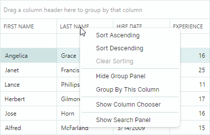
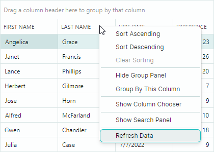
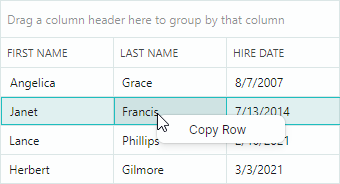
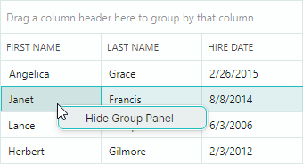

## Контекстные меню

Data Grid поддерживает встроенные контекстные меню для определённых элементов. Этот раздел показывает, как заменять и изменять эти меню, а также отображать пользовательские всплывающие меню для элементов Data Grid, у которых нет встроенных контекстных меню.

## Встроенное контекстное меню заголовка колонки

Правый клик по заголовку колонки отображает встроенное меню заголовка колонки. Меню содержит команды для сортировки и группировки данных, отображения панели поиска и отображения средства выбора колонок.



Свойство `DataGridControl.ColumnMenu` позволяет получить доступ к этому меню и настроить его.

Чтобы заменить меню по умолчанию, назначьте свойству `DataGridControl.ColumnMenu` объект `Eremex.AvaloniaUI.Controls.Bars.PopupMenu`.

Чтобы настроить существующее меню заголовка колонки (добавить новые элементы или удалить элементы по умолчанию), обратитесь к меню после его инициализации (например, в обработчике события `Initialized` вашего DataGrid), а затем измените меню.

### Data Context

Свойство `DataContext` меню заголовка колонки и его элементов (объектов `ToolbarButtonItem`) указывает на объект `GridColumn`, для которого было вызвано меню.

### Пример - Как заменить меню заголовка колонки по умолчанию

Следующий код создаёт пользовательское меню заголовка колонки, содержащее пункт меню _Copy Column_. Код привязывает пункт меню к команде _CopyColumnDataCommand_, определённой в ViewModel.


Обратите внимание на инициализацию свойств `Command` и `CommandParameter` для пункта меню в коде ниже. Выражение `CommandParameter="{Binding FieldName}"` задаёт привязку к свойству `FieldName` объекта `DataContext` пункта меню (`GridColumn.FieldName`).

`DataContext` объекта `GridColumn` совпадает с `DataContext` Data Grid (в этом примере — объект _ViewModel_). Это позволяет получить доступ к View Model и её команде _CopyColumnCommand_ с помощью выражения: `Command="{Binding DataContext.CopyColumnCommand}"`.

``` xml
xmlns:mxdg="https://schemas.eremexcontrols.net/avalonia/datagrid"
xmlns:mxe="https://schemas.eremexcontrols.net/avalonia/editors"
xmlns:mxb="https://schemas.eremexcontrols.net/avalonia/bars"

<mxdg:DataGridControl Name="dataGrid1">
    <mxdg:DataGridControl.ColumnMenu>
        <mxb:PopupMenu>
            <mxb:ToolbarButtonItem
                Header="Copy Column"
                Command="{Binding DataContext.CopyColumnCommand}"
                CommandParameter="{Binding FieldName}">
            </mxb:ToolbarButtonItem>
        </mxb:PopupMenu>
    </mxdg:DataGridControl.ColumnMenu>
</mxdg:DataGridControl>
```
``` csharp
public MainView()
{
    DataContext = new ViewModel();
}

public partial class ViewModel : ObservableObject
{
    [RelayCommand]
    void CopyColumn(string fieldName)
    {
        //...
    }
}
```

### Пример - Как изменить существующее меню заголовка колонки

Следующий пример добавляет пользовательскую команду в меню заголовка колонки по умолчанию.

Пример обрабатывает событие `DataGridControl.Initialized`, чтобы получить доступ к меню заголовка колонки по умолчанию после его инициализации, и добавляет в меню команду _Refresh Data_.



``` xml
xmlns:mxdg="https://schemas.eremexcontrols.net/avalonia/datagrid"
xmlns:mxe="https://schemas.eremexcontrols.net/avalonia/editors"
xmlns:mxb="https://schemas.eremexcontrols.net/avalonia/bars"

<mxdg:DataGridControl Name="dataGrid1" Initialized="OnInitialized">
    ...
</mxdg:DataGridControl>
```
``` csharp
using Eremex.AvaloniaUI.Controls.Bars;

private void OnInitialized(object sender, System.EventArgs e)
{
    ToolbarButtonItem btn1 = new ToolbarButtonItem();
    btn1.Header = "Refresh Data";
    btn1.ShowSeparator = true;
    btn1.Command = new RelayCommand<DataGridControl>(UpdateDataGrid);
    btn1.CommandParameter = dataGrid1;
    dataGrid1.ColumnMenu.Items.Add(btn1);
}

[RelayCommand]
void UpdateDataGrid(DataGridControl dataGrid)
{
    //...
}
```


## Контекстное меню ячеек строки

Data Grid поддерживает встроенное контекстное меню для ячеек строк (см. свойство `DataGridControlBase.RowCellMenu`). Изначально это меню пустое и поэтому скрыто. Чтобы отобразить контекстное меню ячеек строки, заполните его элементами в XAML или в code-behind.

### Data Context

`DataContext` контекстного меню ячеек строки и его элементов содержит объект `Eremex.AvaloniaUI.Controls.DataControl.Visuals.CellData`, который позволяет получить доступ к контекстно-зависимой информации:

- `CellData.DataControl` — Возвращает контейнерный контрол (`DataGridControl`), для которого вызвано меню.
- `CellData.Row` — Возвращает базовый объект данных строки, по которой был выполнен клик.

### Пример - Как отобразить одинаковые команды контекстного меню для всех строк

Следующий пример добавляет команду "_Copy Row_" в контекстное меню ячеек строки (`DataGridControlBase.RowCellMenu`) для всех строк.



Приведённый ниже код XAML назначает всплывающее меню свойству `DataGridControl.RowCellMenu`. Всплывающее меню содержит один элемент (`ToolbarButtonItem`), привязанный к команде _CopyRowCommand_, определённой в View Model (`DataContext` Data Grid).

``` xml
xmlns:mxdg="https://schemas.eremexcontrols.net/avalonia/datagrid"
xmlns:mxe="https://schemas.eremexcontrols.net/avalonia/editors"
xmlns:mxb="https://schemas.eremexcontrols.net/avalonia/bars"

<mxdg:DataGridControl Name="dataGrid1">
    <mxdg:DataGridControl.RowCellMenu>
        <mxb:PopupMenu>
            <mxb:PopupMenu.Items>
                <mxb:ToolbarButtonItem Header="Copy Row"
                 Command="{Binding DataControl.DataContext.CopyRowCommand}"
                 CommandParameter="{Binding Row}"/>
            </mxb:PopupMenu.Items>
        </mxb:PopupMenu>
    </mxdg:DataGridControl.RowCellMenu>
</mxdg:DataGridControl>
```
``` csharp
public partial class MainView : UserControl
{
    ViewModel viewModel = new ViewModel();
    public MainView()
    {
        DataContext = viewModel;
        InitializeComponent();
    }
}

public partial class ViewModel : ObservableObject
{
    public ViewModel() { }
    [RelayCommand]
    void CopyRow(object row)
    {
        //...
    }
}
```

### Пример - Как отобразить разные команды контекстного меню для разных строк

В этом примере контрол Data Grid отображает список объектов _Employee_. Пример инициализирует контекстное меню для строк (`DataGridControlBase.RowCellMenu`) и отображает разные пункты меню для разных строк данных.


Контекстное меню отображает пункт меню _Show Working Hours_ для строк, относящихся к сотрудникам с частичной занятостью (свойство _Employee.IsPartTime_ возвращает _true_).

Контекстное меню отображает пункт меню _Open Contract Details_ для строк, относящихся к подрядчикам (свойство _Employee.IsContract_ возвращает _true_).

Приведённый ниже код XAML добавляет в контекстное меню два элемента ("_Show Working Hours_" и "_Open Contract Details_"). Видимость этих элементов динамически управляется свойствами бизнес-объекта _IsPartTime_ и _IsContract_.

``` xml
xmlns:mxdg="https://schemas.eremexcontrols.net/avalonia/datagrid"
xmlns:mxb="https://schemas.eremexcontrols.net/avalonia/bars"

<mxdg:DataGridControl Name="dataGrid1" AutoGenerateColumns="True" ItemsSource="{Binding Employees}">
    <mxdg:DataGridControl.RowCellMenu>
        <mxb:PopupMenu>
            <mxb:PopupMenu.Items>
                <mxb:ToolbarButtonItem
                    Header="Show Working Hours"
                    Command="{Binding DataControl.DataContext.ShowWorkingHoursCommand}"
                    CommandParameter="{Binding Row}"
                    Glyph="{SvgImage 'avares://AvaloniaApplication3/Assets/time.svg'}"
                    GlyphSize="20,20"
                    IsVisible="{Binding Row.IsPartTime}">
                </mxb:ToolbarButtonItem>
                <mxb:ToolbarButtonItem
                    Header="Open Contract Details"
                    Command="{Binding DataControl.DataContext.OpenContractDetailsCommand}"
                    CommandParameter="{Binding Row}"
                    Glyph="{SvgImage 'avares://AvaloniaApplication3/Assets/details.svg'}"
                    GlyphSize="20,20"
                    IsVisible="{Binding Row.IsContract}"
                    >
                </mxb:ToolbarButtonItem>
            </mxb:PopupMenu.Items>
        </mxb:PopupMenu>
    </mxdg:DataGridControl.RowCellMenu>
</mxdg:DataGridControl>
```
``` csharp
public partial class MainView : UserControl
{
    MainViewModel viewModel = new MainViewModel();

    public MainView()
    {
        DataContext = viewModel;

        viewModel.Employees.Add(new Employee() { 
            Name = "Herbert McGill", EmploymentType=EmploymentType.FullTime, 
            Position= "Customer Service" 
        });
        viewModel.Employees.Add(new Employee() { 
            Name = "Cora Gilmore", EmploymentType = EmploymentType.PartTime, 
            Position = "Accountant" 
        });
        viewModel.Employees.Add(new Employee() { 
            Name = "Earl Case", EmploymentType = EmploymentType.PartTime, 
            Position = "Software Engineer" 
        });
        viewModel.Employees.Add(new Employee() { 
            Name = "Julius Howell", EmploymentType = EmploymentType.Contract, 
            Position = "Financial Analyst" 
        });
        viewModel.Employees.Add(new Employee() { 
            Name = "Trevor Cameron", EmploymentType = EmploymentType.Contract, 
            Position = "Accountant" 
        });
        viewModel.Employees.Add(new Employee() { 
            Name = "Lon Monroe", EmploymentType = EmploymentType.FullTime, 
            Position = "Management" 
        });

        InitializeComponent();
    }
}

public partial class MainViewModel : ViewModelBase
{
    public MainViewModel() { }

    public ObservableCollection<Employee> Employees { get; } = new();

    [RelayCommand]
    void OpenContractDetails(Employee emp)
    {
        if(emp.EmploymentType == EmploymentType.Contract)
        {
            //...
        }
    }

    [RelayCommand]
    void ShowWorkingHours(Employee emp)
    {
        if(emp.EmploymentType == EmploymentType.PartTime)
        {
            //...
        }
    }
}

public partial class Employee : ObservableObject
{
    [ObservableProperty]
    public string name = "";

    [ObservableProperty]
    public string position = "";

    [ObservableProperty]
    public EmploymentType employmentType;

    [Browsable(false)]
    public bool IsContract => EmploymentType == EmploymentType.Contract;

    [Browsable(false)]
    public bool IsPartTime => EmploymentType == EmploymentType.PartTime;
}

public enum EmploymentType
{
    [Display(Name = "Full Time")]
    FullTime,
    [Display(Name = "Part Time")]
    PartTime,
    Contract
}
```


### Пример - Как генерировать команды контекстного меню из ViewModel

В этом примере показано, как заполнить контекстное меню ячеек строки контрола DataGrid элементами, определёнными в ViewModel.


Контекстное меню ячеек строки (`DataGridControl.RowCellMenu`) заполняется элементами (объектами `ToolbarButtonItem`) из источника элементов, указанного коллекцией `PopupMenu.ItemsSource`. В этом примере свойство `PopupMenu.ItemsSource` привязано к коллекции _MenuItems_, определённой в главной View Model, с помощью следующего выражения привязки:

``` xml
<mxb:PopupMenu ItemsSource="{Binding DataControl.DataContext.MenuItems}">
```

Когда `PopupMenu` отображается для ячейки DataGrid, `DataContext` меню содержит объект `Eremex.AvaloniaUI.Controls.DataControl.Visuals.CellData`. Объект `CellData` предоставляет свойство `DataControl`, которое позволяет получить доступ к контролу, для которого отображается меню.
Главная View Model назначена свойству `DataContext` контрола. Таким образом, синтаксис `DataControl.DataContext.MenuItems` ссылается на коллекцию _MenuItems_, определённую в главной View Model.

Объект `CellData` также содержит другие свойства, позволяющие получить доступ к информации, связанной с ячейкой (колонка, объект строки и т. д.).

Элементы меню инициализируются с помощью стилей. `DataContext` элементов меню — это элементы коллекции `PopupMenu.ItemsSource`. В этом примере свойство `PopupMenu.ItemsSource` хранит коллекцию объектов _MenuItemViewModel_. Следующий фрагмент привязывает свойства `ToolbarButtonItem.Header` и `ToolbarButtonItem.Command` к свойствам _MenuItemViewModel.Header_ и _MenuItemViewModel.Command_ соответственно.

``` xml
<mxb:PopupMenu.Styles>
    <Style Selector="mxb|ToolbarButtonItem">
        <Setter Property="Header" Value="{Binding Header}"/>
        <Setter Property="Command" Value="{Binding Command}"  />
    </Style>
</mxb:PopupMenu.Styles>
```

Команде `ToolbarButtonItem` требуется информация о строке, по которой был выполнен правый клик. Чтобы передать команде строку данных, код XAML устанавливает свойство `ToolbarButtonItem.CommandParameter` следующим образом:

``` xml
xmlns:mxvis="clr-namespace:Eremex.AvaloniaUI.Controls.DataControl.Visuals;
 assembly=Eremex.Avalonia.Controls"

<mxb:PopupMenu.Styles>
    <Style Selector="mxb|ToolbarButtonItem">
        ...
        <Setter Property="CommandParameter" 
         Value="{Binding $parent[mxvis:CellControl].DataContext.Row}"  />
    </Style>
</mxb:PopupMenu.Styles>
```

Здесь выражение `$parent[mxvis:CellControl]` проходит по логическому дереву, чтобы найти объект `CellControl` (он является родителем `DataContext` объекта `ToolbarButtonItem`). Объект `CellControl.DataContext` содержит объект `Eremex.AvaloniaUI.Controls.DataControl.Visuals.CellData`, который позволяет получить доступ к строке данных через свойство `CellData.Row`.

Полный код приведён ниже.

``` xml
xmlns:mxdg="https://schemas.eremexcontrols.net/avalonia/datagrid"
xmlns:mxb="https://schemas.eremexcontrols.net/avalonia/bars"
xmlns:mxvis="clr-namespace:Eremex.AvaloniaUI.Controls.DataControl.Visuals;
 assembly=Eremex.Avalonia.Controls"

<mxdg:DataGridControl Name="dataGrid1" AutoGenerateColumns="True" ItemsSource="{Binding Employees}">
    <mxdg:DataGridControl.RowCellMenu>
        <mxb:PopupMenu ItemsSource="{Binding DataControl.DataContext.MenuItems}">
            <mxb:PopupMenu.Styles>
                <Style Selector="mxb|ToolbarButtonItem">
                    <Setter Property="Header" Value="{Binding Header}"/>
                    <Setter Property="Command" Value="{Binding Command }"  />
                    <Setter Property="CommandParameter" 
                     Value="{Binding $parent[mxvis:CellControl].DataContext.Row}"  />
                </Style>
            </mxb:PopupMenu.Styles>
        </mxb:PopupMenu>
    </mxdg:DataGridControl.RowCellMenu>
</mxdg:DataGridControl>
```
``` csharp
public partial class MainView : UserControl
{
    MainViewModel viewModel = new MainViewModel();

    public MainView()
    {
        DataContext = viewModel;

        viewModel.Employees.Add(new Employee() { 
            Name = "Herbert McGill", EmploymentType=EmploymentType.FullTime, 
            Position= "Customer Service" 
        });
        viewModel.Employees.Add(new Employee() { 
            Name = "Cora Gilmore", EmploymentType = EmploymentType.PartTime, 
            Position = "Accountant" 
        });
        viewModel.Employees.Add(new Employee() { 
            Name = "Earl Case", EmploymentType = EmploymentType.PartTime, 
            Position = "Software Engineer" 
        });

        InitializeComponent();
    }
}

public partial class MainViewModel : ViewModelBase
{
    public ObservableCollection<Employee> Employees { get; } = new();

    public MainViewModel()
    {
        MenuItemViewModel menuItem1 = new MenuItemViewModel();
        menuItem1.Header = "Copy Row";
        menuItem1.Command = new RelayCommand<object>(CopyRow);
        MenuItems.Add(menuItem1);

        MenuItemViewModel menuItem2 = new MenuItemViewModel();
        menuItem2.Header = "Delete Row";
        menuItem2.Command = new RelayCommand<object>(DeleteRow);
        MenuItems.Add(menuItem2);

    }

    public ObservableCollection<MenuItemViewModel> MenuItems { get; } = new();

    [RelayCommand]
    void CopyRow(object row)
    {
        //...
    }
    [RelayCommand]
    void DeleteRow(object row)
    {
        //...
    }
}

public partial class MenuItemViewModel : ObservableObject
{
    [ObservableProperty]
    string? header;

    [ObservableProperty]
    ICommand? command;
}

public partial class Employee : ObservableObject
{
    [ObservableProperty]
    public string name = "";

    [ObservableProperty]
    public string position = "";

    [ObservableProperty]
    public EmploymentType employmentType;

    [Browsable(false)]
    public bool IsContract => EmploymentType == EmploymentType.Contract;

    [Browsable(false)]
    public bool IsPartTime => EmploymentType == EmploymentType.PartTime;
}

public enum EmploymentType
{
    [Display(Name = "Full Time")]
    FullTime,
    [Display(Name = "Part Time")]
    PartTime,
    Contract
}
```

## Настройка меню при отображении

Вы можете обрабатывать событие `PopupMenu.Opening`, чтобы динамически настраивать контекстные меню DataGrid. Событие возникает, когда `PopupMenu` собирается отобразиться.

## Пример - Как отобразить контекстное меню для первой колонки

Следующий пример назначает пустой `PopupMenu` свойству `DataGridControlBase.RowCellMenu`, а затем обрабатывает событие `PopupMenu.Opening`, чтобы заполнить меню элементами, когда пользователь щёлкает правой кнопкой мыши по ячейкам в первом видимой колонке DataGrid. Меню остаётся пустым (и, следовательно, не отображается), когда пользователь щёлкает правой кнопкой мыши в других колонках.

Созданное меню содержит флажок "_Show/Hide Group Panel_", который переключает видимость панели группировки DataGrid (свойство `DataGridControlBase.ShowGroupPanel`).



``` xml
<mxdg:DataGridControl Name="dataGrid1" ...>
    <mxdg:DataGridControl.RowCellMenu>
        <mxb:PopupMenu Opening="RowCellMenuOpening"/>
    </mxdg:DataGridControl.RowCellMenu>
</mxdg:DataGridControl>
```
``` csharp
using Eremex.AvaloniaUI.Controls.DataControl.Visuals;

void RowCellMenuOpening(object sender, CancelEventArgs e)
{
    if (sender == null) return;
    PopupMenu menu = sender as PopupMenu;
    menu.Items.Clear();

    CellData cellData = menu.DataContext as CellData;
    DataGridControl control = cellData.DataControl as DataGridControl;
    GridColumn column = cellData.Column as GridColumn;
    //// Access the underlying data row, when required.
    //object dataRow = cellData.Row;

    if(column.VisibleIndex == 0)
    {
        ToolbarCheckItem btn1 = new ToolbarCheckItem();
        btn1.IsChecked = control.ShowGroupPanel;
        btn1.Header = (control.ShowGroupPanel) ? "Hide Group Panel" : "Show Group Panel";
        btn1.Command = new RelayCommand<DataGridControl>(ShowGroupPanelCommand);
        btn1.CommandParameter = control;
        menu.Items.Add(btn1);
    }
}

[RelayCommand]
void ShowGroupPanelCommand(DataGridControl dataGrid)
{
    dataGrid.ShowGroupPanel = !dataGrid.ShowGroupPanel;
}
```

## Отображение контекстного меню для контролов с помощью присоединённого свойства ToolbarManager

Компонент `Eremex.AvaloniaUI.Controls.Bars.ToolbarManager` предоставляет присоединённое свойство `ContextPopup`, которое позволяет назначить контекстное меню любому контролу, включая DataGrid. Это контекстное меню отображается для областей DataGrid, у которых нет контекстных меню по умолчанию, а также для областей с пустыми меню по умолчанию.

### Пример - Как назначить контекстное меню с помощью присоединённого свойства _ToolbarManager.ContextPopup_

Следующий код использует присоединённое свойство `ToolbarManager.ContextPopup`, чтобы задать контекстное меню для контрола DataGrid. Меню содержит пункт-флажок _Show Column Header Panel_/_Hide Column Header Panel_, который переключает видимость параметра `DataGridControl.ShowColumnHeaders`.


``` xml
<mxdg:DataGridControl Name="dataGrid1">
    <mxdg:DataGridControl.Styles>
        <Style Selector="mxdg|DataGridControl">
            <Setter Property="mxb:ToolbarManager.ContextPopup" >
                <Template>
                    <mxb:PopupMenu Tag="dataGrid1">
                        <mxb:ToolbarCheckItem Header="Show Column Header Panel" 
                         IsChecked="{Binding $parent[mxdg:DataGridControl].ShowColumnHeaders, Mode=TwoWay}" 
                         IsVisible="{Binding !$parent[mxdg:DataGridControl].ShowColumnHeaders}"/>
                        <mxb:ToolbarCheckItem Header="Hide Column Header Panel" 
                         IsChecked="{Binding $parent[mxdg:DataGridControl].ShowColumnHeaders, Mode=TwoWay}" 
                         IsVisible="{Binding $parent[mxdg:DataGridControl].ShowColumnHeaders}"/>
                    </mxb:PopupMenu>
                </Template>
            </Setter>
        </Style>
    </mxdg:DataGridControl.Styles>
</mxdg:DataGridControl>
```

<br>
<br>

<sup>*</sup> Эта страница переведена с использованием технологий машинного перевода.
