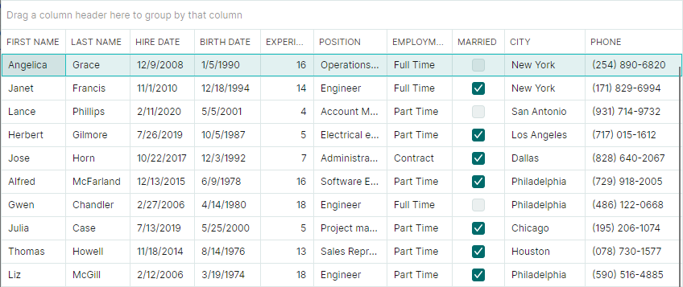
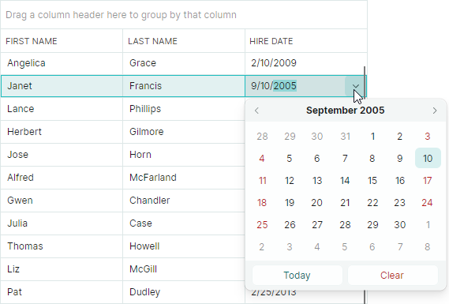

# Привязка данных

Унаследованное свойство `DataControlBase.ItemsSource` позволяет привязать DataGrid к источнику данных (например, к коллекции бизнес-объектов). После привязки контрол получает элементы из источника данных и отображает их в виде [строк](../rows.md).

DataGrid отображает поля источника данных (свойства бизнес-объекта) в виде [колонок](../columns.md). Если колонка не создана, строки не отображают данные.
Колонки, связанные с существующими полями источника данных, называются связанными колонками (bound columns). Их свойства `GridColumn.FieldName` устанавливаются равными именам полей, существующих в источнике данных.

Вы также можете создавать [несвязанные колонки](unbound-columns.md) (также называемые вычисляемыми колонками), чтобы отображать (или редактировать и отображать) значения, которых нет в источнике данных.

## Автоматическая генерация колонок

Включите опцию `DataGridControl.AutoGenerateColumns`, чтобы автоматически генерировать колонки для всех свойств/полей источника данных при инициализации DataGrid во время выполнения. Если опция `AutoGenerateColumns` отключена, метод `PopulateColumns` позволяет вызвать автоматическую генерацию колонок из кода.

При автоматической генерации колонки контрол DataGrid вызывает два события, которые вы можете обработать, чтобы отменить генерацию колонки или настроить её свойства:

- `DataGridControl.AutoGeneratingColumn` — Вызывается, когда колонка должна быть добавлена в коллекцию `DataGridControl.Columns`. Используйте это событие, чтобы предотвратить добавление колонки в грид или настроить её свойства.
- `DataGridControl.AutoGeneratedColumns` — Вызывается после завершения автоматической генерации всех колонок.

## Пример - Привязка DataGrid и автоматическая генерация колонок

Следующий код привязывает DataGrid к коллекции объектов _EmployeeInfo_ и включает свойство `AutoGenerateColumns`, чтобы автоматически сгенерировать колонки для всех публичных свойств, предоставляемых классом _EmployeeInfo_.



``` xml
xmlns:mxdg="https://schemas.eremexcontrols.net/avalonia/datagrid"
...
<mxdg:DataGridControl x:Name="dataGrid" ItemsSource="{Binding Employees}" 
 AutoGenerateColumns="True" BorderThickness="1,1">
</mxdg:DataGridControl>
```
``` cs
public partial class MainViewModel : ViewModelBase
{
    [ObservableProperty]
    IList<EmployeeInfo> employees;

    public MainViewModel()
    {
        //Generate sample data.
        Employees = EmployeesData.GenerateEmployeeInfo();
    }
}

public class EmployeeInfo
{
    public string FirstName { get; set; }
    public string LastName { get; set; }
    public DateTime BirthDate { get; set; }
    public DateTime HiredAt { get; set; }
    public int Experience { get; set; }
    public string Position { get; set; }
    public EmploymentType EmploymentType { get; set; }
    public bool Married { get; set; }
    public string City { get; set; }
    public string Phone { get; set; }
}
```


## Отображение конкретного набора колонок в DataGrid

Если вам нужно отобразить конкретный набор полей/свойств в DataGrid, вы можете выполнить одно из следующих действий:

- Автоматически сгенерировать колонки, а затем вручную получить доступ к ненужным колонкам в коллекции `DataGridControl.Columns` и удалить их. Вы также можете скрыть ненужные колонки с помощью опции `GridColumn.IsVisible`.

- Скрыть определённые свойства на уровне источника данных, а затем использовать автоматическую генерацию колонок. Чтобы предотвратить генерацию колонок для определённых свойств бизнес-объекта, примените атрибут `Browsable` или `Display(AutoGenerateField)` к свойствам источника. Подробнее смотрите в следующем разделе: [Колонки](../columns.md).

- Создать колонки грида вручную.

## Создание колонок вручную

Вы можете вручную создавать колонки (связанные или несвязанные) в коллекции `DataGridControl.Columns`. Колонки в контроле DataGrid инкапсулируются классом `GridColumn`. При создании колонки инициализируйте свойство `GridColumn.FieldName`, чтобы привязать колонку к публичному свойству/полю в связанном источнике данных.

Установите опцию `DataGridControl.AutoGenerateColumns` в значение `false`, чтобы отображать только созданные колонки и предотвратить автоматическую генерацию других колонок.

Подробнее смотрите в разделах [Колонки](../columns.md) и [Несвязанные колонки](unbound-columns.md).

## Пример - Привязка DataGrid и ручная генерация колонок

Приведённый ниже код создаёт три колонки в коллекции `DataGridControl.Columns`. Для колонки "HIRE DATE" используется встроенный редактор `DateEditor`, отображающий значения колонки.



``` xml
xmlns:mxdg="https://schemas.eremexcontrols.net/avalonia/datagrid"
xmlns:mxe="https://schemas.eremexcontrols.net/avalonia/editors"
...
<mxdg:DataGridControl x:Name="dataGrid" ItemsSource="{Binding Employees}" 
 AutoGenerateColumns="False" BorderThickness="1,1">
    <mxdg:GridColumn FieldName="FirstName" Width="*" MinWidth="80"/>
    <mxdg:GridColumn FieldName="LastName" Width="*" MinWidth="80"/>
    <mxdg:GridColumn FieldName="HiredAt" Header="Hire Date" Width="*" MinWidth="80">
        <mxdg:GridColumn.EditorProperties>
            <mxe:DateEditorProperties/>
        </mxdg:GridColumn.EditorProperties>
    </mxdg:GridColumn>
</mxdg:DataGridControl>
```
``` cs
public partial class MainViewModel : ViewModelBase
{
    [ObservableProperty]
    IList<EmployeeInfo> employees;

    public MainViewModel()
    {
        Employees = EmployeesData.GenerateEmployeeInfo();
    }
}
public class EmployeeInfo
{
    public string FirstName { get; set; }
    public string LastName { get; set; }
    public DateTime BirthDate { get; set; }
    public DateTime HiredAt { get; set; }
    public int Experience { get; set; }
    public string Position { get; set; }
    public EmploymentType EmploymentType { get; set; }
    public bool Married { get; set; }
    public string City { get; set; }
    public string Phone { get; set; }
}
```

## Связанный API

### Свойства

- `DataGridControl.Columns` — Коллекция колонок грида.
- `DataGridControl.AutoGenerateColumns` — Определяет, генерирует ли DataGrid автоматически колонки для публичных свойств/полей, предоставляемых источником данных во время выполнения.
- `GridColumn.FieldName` — Задаёт имя поля/свойства, к которому привязана колонка.

### Методы

- `PopulateColumns` — Генерирует колонки для публичных полей/свойств, предоставляемых связанным источником данных.

### События

- `DataGridControl.AutoGeneratingColumn` — Вызывается, когда колонка должна быть добавлена в коллекцию `DataGridControl.Columns`. Используйте это событие, чтобы предотвратить добавление колонки в грид или настроить её свойства.
- `DataGridControl.AutoGeneratedColumns` — Вызывается после завершения автоматической генерации всех колонок.

# Смотрите также
- [Колонки](../columns.md)
- [Несвязанные колонки](unbound-columns.md)
- [Редактирование данных](../data-editing/index.md)

<br>
<br>

<sup>*</sup> Эта страница переведена с использованием технологий машинного перевода.
