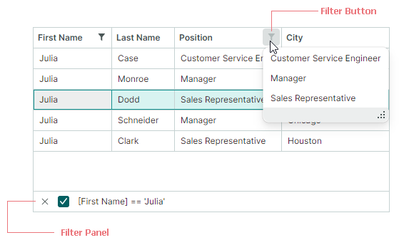
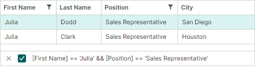

# Фильтрация и поиск

Data Grid поддерживает функции фильтрации и поиска данных, которые позволяют находить строки, содержащие определённый текст.

## Фильтры колонок

Пользователи могут фильтровать колонки грида с помощью меню фильтра. 
Чтобы открыть меню фильтра для колонки, наведите курсор мыши на заголовок колонки, пока не появится кнопка фильтра, а затем нажмите её. Открывшееся меню фильтра содержит все уникальные значения этой колонки. Выберите элемент в меню фильтра, чтобы отфильтровать колонку по этому значению.


Пользователи могут фильтровать грид по нескольким колонкам одновременно. Фильтры, применённые к нескольким колонкам, объединяются оператором AND.


### Режимы отображения 'List' и 'Checked List'

Меню фильтра может отображать элементы (значения колонки), используя один из двух режимов отображения:

- `List` (по умолчанию) — обычный список, позволяющий выбрать только один элемент за раз.

    


- `CheckedList` — список с флажками, позволяющий пользователям выбирать несколько элементов одновременно.

    


Вы можете задать режим отображения меню фильтра глобально для всех колонок или для отдельных колонок, используя следующие свойства:

- `DataGridControl.ColumnFilterPopupMode` (значение по умолчанию — `List`) — определяет режим отображения по умолчанию для меню фильтра всех колонок. Эта настройка применяется к колонкам, у которых свойство `GridColumn.FilterPopupMode` имеет значение `null`.

- `GridColumn.FilterPopupMode` (значение по умолчанию — `null`) — определяет режим отображения меню фильтра для отдельных колонок. Если задано, это свойство переопределяет глобальную настройку (`DataGridControl.ColumnFilterPopupMode`).

В следующем примере режим отображения `CheckedList` применяется ко всем колонкам, а режим `List` — к колонке _City_.

``` cs
dataGrid.ColumnFilterPopupMode = Eremex.AvaloniaUI.Controls.DataControl.FilterPopupMode.CheckedList;
dataGrid.Columns["City"].FilterPopupMode = Eremex.AvaloniaUI.Controls.DataControl.FilterPopupMode.List;
```


### Панель фильтра

После применения фильтра внизу появляется панель фильтра. Она отображает текущие применённые критерии фильтрации и позволяет временно отключать и очищать фильтр.



Чтобы узнать, как фильтровать данные программно, см. следующий раздел:

- [Фильтрация в коде](#фильтрация-в-коде)


### Связанный API

**Члены контрола DataGrid**

- `AllowColumnFiltering` — определяет, разрешены ли кнопки фильтра для всех колонок. Вы можете использовать свойство колонки `ColumnBase.AllowColumnFiltering`, чтобы переопределить глобальную настройку для отдельных колонок.

    Например, чтобы отключить кнопки фильтра для всех колонок, кроме одного, установите свойство `DataGridControl.AllowColumnFiltering` в `false`, а для целевой колонки свойство `ColumnBase.AllowColumnFiltering` — в `true`.

- `ColumnFilterButtonDisplayMode` — определяет, всегда ли видны кнопки фильтра или они появляются только при наведении курсора мыши на заголовок колонки (по умолчанию).

- `ColumnFilterPopupMode` — определяет режим отображения по умолчанию (`List` или `CheckedList`) для меню фильтра всех колонок. Используйте свойство колонки `FilterPopupMode`, чтобы переопределить эту настройку для отдельных колонок.

- Событие `CustomColumnDisplayText` — позволяет предоставить пользовательский отображаемый текст для значений колонки, в том числе в меню фильтра и на панели фильтра. Когда событие `CustomColumnDisplayText` возникает для значений на панели фильтра, параметр `SourceItemIndex` этого события возвращает `-1`.

- `FilterPanelText` — возвращает текстовое представление фильтра, отображаемое на панели фильтра.

- `FilterPanelDisplayMode` — определяет режим видимости панели фильтра. Доступные варианты: 

    - `Auto` (по умолчанию) — панель фильтра появляется, когда фильтр применяется к любой колонке.
    - `Never` — панель фильтра всегда скрыта.

- `FilterString` — определяет критерии фильтрации, применённые к контролу. Вы можете использовать это свойство для [построения фильтра в коде](#фильтрация-в-коде).

- `IsFilterEnabled` — определяет, активен ли фильтр.

- `IsFilterPanelVisible` — возвращает, отображается ли в данный момент панель фильтра.


**Члены колонки**

 - `ColumnBase.AllowColumnFiltering` — определяет, разрешена ли кнопка фильтра для текущей колонки. Чтобы включить или отключить кнопки фильтра для всех колонок, см. настройку `DataGridControl.AllowColumnFiltering`. Параметр `ColumnBase.AllowColumnFiltering` позволяет переопределить настройку `DataGridControl.AllowColumnFiltering` для отдельных колонок.
 - `ColumnBase.ColumnFilterMode` — определяет способ фильтрации данных колонки. Доступные варианты:

    - `Value` (по умолчанию) — данные колонки фильтруются по исходным значениям.
    - `DisplayText` — данные колонки фильтруются по отображаемому тексту ячейки.

<!-- TODO 
Example for ColumnFilterMode.DisplayText.
-->

- `ColumnBase.FilterPopupMode` — определяет режим отображения меню фильтра (`List` или `CheckedList`) для отдельных колонок. Если задано, это свойство переопределяет свойство `ColumnFilterPopupMode` контрола.

 - `ColumnBase.IsFiltered` — возвращает, применён ли фильтр к текущей колонке.
 - `ColumnBase.RoundDateTimeForColumnFilter` — определяет, следует ли игнорировать временную часть значений DateTime при построении фильтров для колонок, отображающих значения DateTime. Это свойство действует для фильтров, созданных с помощью меню фильтра колонок и [строки автофильтра](#строка-автофильтра).

<!-- TODO
Add screenshots for RoundDateTimeForColumnFilter
 -->
 

## Панель поиска

Панель поиска помогает пользователю быстро находить строки по содержащимся в них данным. Когда пользователь вводит текст в панели поиска, контрол Data Grid отображает строки, содержащие введённый текст.


- Функция поиска регистронезависима.
- Для поиска данных используется оператор сравнения **Contains** (содержит).
- Поиск данных выполняется по всем колонкам.

Установите свойство контрола `SearchPanelDisplayMode` (унаследованное от класса `DataControlBase`) в одно из следующих значений, чтобы включить панель поиска:

- `SearchPanelDisplayMode.Always` — контрол постоянно отображает панель поиска.
- `SearchPanelDisplayMode.HotKey` — контрол отображает панель поиска, когда пользователь нажимает горячую клавишу CTRL+F. Клавиша ESC очищает панель поиска. Повторное нажатие ESC закрывает панель. Пользователь также может активировать панель поиска из контекстного меню заголовка колонки.


### Связанный API

- `DataControlBase.IsSearchPanelVisible` — возвращает, отображается ли в данный момент панель поиска.
- `DataControlBase.SearchPanelHighlightResults` — определяет, следует ли подсвечивать искомый текст в найденных строках. Значение свойства по умолчанию — `true`.
- `DataControlBase.SearchText` — определяет текст поиска. Вы можете присвоить значение этому свойству, чтобы отфильтровать контрол программно. Эта функция фильтрации поддерживается, даже если панель поиска скрыта или отключена (свойство `SearchPanelDisplayMode` установлено в `SearchPanelDisplayMode.Never`).
- `DataControlBase.ShowSearchPanelCloseButton` — позволяет скрыть встроенную кнопку закрытия панели поиска.

### Пример
Следующий код включает панель поиска. Свойство `SearchText` используется для задания текста поиска.

``` csharp
dataGrid.SearchPanelDisplayMode = SearchPanelDisplayMode.Always;
dataGrid.SearchText = "search";
```

## Строка автофильтра

Строка автофильтра — это специальная строка, отображаемая над всеми строками грида. Она позволяет пользователю вводить текст в её ячейках для фильтрации данных по соответствующим колонкам.


- Функция фильтрации регистронезависима.

### Включение строки автофильтра

Установите свойство `DataGridControl.ShowAutoFilterRow` в `true`.


### Включение селекторов оператора фильтра во время выполнения

Вы можете разрешить пользователям выбирать логику фильтрации для ячеек строки автофильтра во время выполнения. Когда эта функция активна, в каждой ячейке строки автофильтра появляется значок оператора фильтра. Пользователи могут нажать этот значок, чтобы открыть выпадающее меню и выбрать нужный оператор.


Используйте следующие свойства для включения селекторов оператора фильтра:

- `DataGridControl.ShowConditionInAutoFilterRow` (по умолчанию `false`) — определяет видимость селекторов оператора фильтра по умолчанию для всех ячеек (колонок) строки автофильтра. 
- `ColumnBase.ShowConditionInAutoFilterRow` — включает или отключает селектор оператора фильтра для отдельной колонки. Это свойство переопределяет настройку `DataGridControl.ShowConditionInAutoFilterRow`.

### Задание операторов фильтра в коде

Используйте свойство `ColumnBase.AutoFilterCondition`, чтобы программно задать операторы фильтра для отдельных ячеек (колонок) строки автофильтра. Поддерживаются следующие операторы фильтра:

- `Contains` (применим к строковым значениям) — значения строки должны содержать введённый текст.
- `Default` — режим по умолчанию. 

    - `Default` эквивалентен опции `Contains` для типов данных String и Object. 
    - `Default` эквивалентен опции `Equals` для остальных типов данных.

- `DoesNotContain` (применим к строковым значениям) — значения строки не должны содержать введённый текст. 
- `DoesNotEqual` — значения строки в целевой колонке не должны совпадать с введённым значением.
- `EndsWith` (применим к строковым значениям) — значения строки должны заканчиваться введённым текстом. 
- `Equals` — значения строки должны совпадать с введённым значением.
- `Greater` — значения строки должны быть больше введённого значения.
- `GreaterOrEqual` — значения строки должны быть больше либо равны введённому значению.
- `Less` — значения строки должны быть меньше введённого значения.
- `LessOrEqual` — значения строки должны быть меньше либо равны введённому значению.
- `StartsWith` (применим к строковым значениям) — значения строки должны начинаться с введённого текста. 

### Задание значений фильтра

Свойство `ColumnBase.AutoFilterValue` позволяет задать значение для конкретной ячейки строки автофильтра в коде. Вы можете использовать свойство `ColumnBase.AutoFilterValue` для фильтрации Data Grid, даже если строка автофильтра скрыта.

### Пример

Следующий код активирует строку автофильтра и отображает строки, у которых значения в колонке 'Name' начинаются с "M".

``` csharp
using Eremex.AvaloniaUI.Controls.DataControl;
using Eremex.AvaloniaUI.Controls.DataGrid;

dataGrid1.ShowAutoFilterRow = true;
GridColumn colName = dataGrid1.Columns["Name"];
colName.AutoFilterCondition = AutoFilterCondition.StartsWith;
colName.AutoFilterValue = "M";
```

## Динамическая фильтрация строк с помощью события

Вы можете обрабатывать событие `CustomRowFilter`, чтобы скрывать определённые строки на основе пользовательского условия. 

Событие `CustomRowFilter` возникает для каждого элемента в привязанном источнике данных в следующих случаях:

- Изменяется источник данных контрола.
- Строки контрола фильтруются (например, с помощью панели поиска и строки автофильтра).
- Вызывается метод `RefreshData` контрола.

Используйте параметр события `SourceItemIndex`, чтобы идентифицировать текущий обрабатываемый элемент. Чтобы скрыть соответствующую строку, установите параметр события `Visible` в `false`.

### Пример — фильтрация строк с помощью события

В следующем примере контрол Data Grid отображает список объектов _EmployeeInfo_. Событие `CustomRowFilter` обрабатывается для реализации пользовательской фильтрации строк. Строки скрываются в соответствии со значением свойства _EmployeeInfo.EmploymentType_.

Предполагается, что пример содержит кнопку-переключатель "Enable Filter", которая включает и отключает пользовательскую фильтрацию. При нажатии этой кнопки обработчик события `ToggleButton.IsCheckedChanged` вызывает метод `RefreshData`, чтобы обновить строки грида и повторно вызвать событие `CustomRowFilter`.

``` xml
<ToggleButton Name="btnEnableFilter" Content="Enable Filter" IsCheckedChanged="BtnEnableFilter_IsCheckedChanged" />

<mxdg:DataGridControl x:Name="dataGrid" Grid.Row="1" ItemsSource="{Binding Employees}" 
    CustomRowFilter="DataGrid_CustomRowFilter">
<!-- ... -->
```

``` cs
using Eremex.AvaloniaUI.Controls.DataGrid;

private void BtnEnableFilter_IsCheckedChanged(object sender, Avalonia.Interactivity.RoutedEventArgs e)
{
    dataGrid.RefreshData();
}

private void DataGrid_CustomRowFilter(object sender, DataGridCustomRowFilterEventArgs e)
{
    bool filterEnabled = btnEnableFilter.IsChecked == true;
    if (!filterEnabled)
        return;
    DataGridControl grid = sender as DataGridControl;
    IList<EmployeeInfo> dataSource = grid.ItemsSource as IList<EmployeeInfo>;
    EmployeeInfo employee = dataSource[e.SourceItemIndex];
    e.Visible = employee.EmploymentType != EmploymentType.Contract;
}
```


## Фильтрация в коде

Начиная с версии 1.2, вы можете использовать свойство `DataGridControl.FilterString`, чтобы фильтровать данные контрола в коде.

``` cs
dataGrid.FilterString = "[FirstName] = 'Julia' && [Position] = 'Sales Representative'";
```



Строка фильтра состоит из отдельных выражений фильтра, объединённых [логическими операторами (AND или OR)](#логические-операторы).


### Очистка и отключение фильтра

- Чтобы очистить фильтр, установите свойство `FilterString` в `null` или пустую строку.
- Чтобы временно отключить фильтр, используйте свойство `DataControlBase.IsFilterEnabled`.

### Указание колонок

В строке фильтра колонки должны указываться по их именам полей, заключённым в квадратные скобки. Примеры:

- `[FirstName]`
- `[Position]`

### Указание констант

- Числовые константы должны указываться с использованием стандартных числовых форматов. Примеры: 

    - `500`, `0`
    - `10.314`, `.5` 
    - `12.0m`/`12.0M`, `12d`/`12D`, `12f`/`12F`
    - `-32.5`

- Строковые константы должны быть заключены в одинарные кавычки (`'`). Чтобы вставить `'` как литерал, используйте обозначение `''`. Примеры: 

    - `'Research and Development'`
    - `'Clair de lune'`
    - `'O''Neil'`

- Константы DateTime и DateTimeOffset должны быть заключены в символы `#` и указываться с использованием инвариантной культуры. Примеры:

    - `#2018-03-22#`
    - `#2018-03-22 13:18:51#`
    - `#2018-03-22 13:18:51.94944#`

- Константы DateOnly и TimeOnly должны быть заключены между строками `#!` и `!#`. Примеры:

    - `#!2026-01-01!#`
    - `#!12:23:45!#`

- Логические константы:
    - `true`, `True` или `TRUE` 
    - `false`, `False` или `FALSE`


### Логические операторы

Вы можете использовать следующие логические операторы для объединения отдельных выражений в строке фильтра:

- `&&`, `and`, `And` или `AND`
- `||`, `or`, `Or` или `OR`

``` cs
dataGrid.FilterString = "[Price] < 5 OR [Price] > 15";
```

### Операторы и функции

В следующей таблице перечислены доступные операторы и функции для построения выражений фильтра:

| Операторы и функции | Описание | Пример |
| --- | --- | --- |
| `=` или `==` | Равно | `[Price] = 500` |
| `!=` или `<>` | Не равно | `[Price] != 500` |
| `<` | Меньше чем | `[Price] < 700` |
| `>` | Больше чем | `[Price] > 600` |
| `<=` | Меньше либо равно | `[Price] <= 600` |
| `>=` | Больше либо равно | `[Price] >= 800` |
| `is null` | Выбирает значения null | `[Region] is null` |
| `is not null` | Выбирает значения, не равные null | `[Region] is not null` |
| `IsNull` | Выбирает значения null | `IsNull([Region])` |
| `IsNullOrEmpty` | Выбирает значения null и пустые строки | `IsNullOrEmpty([Region])` |
| `In` | Выбирает элементы, имеющие любое из указанных значений. | `[City] In ('Beijing', 'Shenzhen', 'Chengdu')` |
| `Contains` | Выбирает элементы, содержащие указанную строку. Оператор Contains регистронезависим. | `Contains([Name], 'lan')` |
| `StartsWith` | Выбирает элементы, начинающиеся с указанной строки. Оператор StartsWith регистронезависим. | `StartsWith([Product], 'CPU')` |
| `EndsWith` | Выбирает элементы, заканчивающиеся указанной строкой. Оператор EndsWith регистронезависим. | `EndsWith([Product], '9950X')` |
| `!`, `not`, `Not` или `NOT` | Оператор отрицания | `!Contains([Maker], 'amd')` |

### Расширенные выражения фильтра

Вы можете использовать класс `Eremex.AvaloniaUI.Controls.Data.Filtering.ExprStringBuilder`, чтобы создавать расширенные критерии фильтрации. Эти критерии фильтрации могут включать операции над операндами, вызовы поддерживаемых функций и многое другое. Для построения критериев фильтрации используйте члены класса `ExprStringBuilder`.

Чтобы получить строку фильтра, вызовите метод `ToString` результирующего объекта `ExprStringBuilder`. Затем вы можете присвоить эту строку фильтра свойству `DataControlBase.FilterString` целевого контрола.


``` cs
// [Price] * [Stock] > 5000m
// Note: All operands ([Price], [Stock] and '5000') must be of the same data type (e.g., decimal). Otherwise, the control will fail to evaluate the expression.
var filter = ExprStringBuilder.Property("Price").Multiply(ExprStringBuilder.Property("Stock")).GreaterThanValue(5000m);
var filterString = filter.ToString();
control.FilterString = filterString;
```

!!! Important

    В настоящее время операнды выражения (типы данных колонок и константы) должны быть одного типа данных. Использование разных типов данных (например, decimal и integer) в одном выражении в настоящее время не поддерживается.


``` cs 
// [PropertyA] IN (([PropertyB] + 2m) % 3.0, 'ABC', null)
var filterString = ExprStringBuilder.Property("PropertyA").In(ExprStringBuilder.Property("PropertyB").AddValue(2m) .ModuloValue(3d), ExprStringBuilder.Constant("ABC"), ExprStringBuilder.Null()).ToString();
control.FilterString = filterString;
```

### Указание значений перечисления

Чтобы указать значения перечисления в строке фильтра, необходимо построить критерии фильтрации с использованием класса `Eremex.AvaloniaUI.Controls.Data.Filtering.ExprStringBuilder`.
Метод `ExprStringBuilder.ToString` позволяет получить строку фильтра, которую можно присвоить свойству `FilterString` целевого контрола.

Также необходимо зарегистрировать тип перечисления с помощью метода `EnumProcessingHelper.RegisterEnum`, прежде чем присваивать строку фильтра целевому контролу.

#### Примеры — использование значений перечисления в выражениях фильтра

В следующих двух примерах создаются выражения фильтра для колонки _EmploymentType_. Эта колонка отображает значения перечисления _EmploymentKind_.

``` cs
public enum EmploymentKind
{
    [Display(Name = "Full Time")]
    FullTime,
    [Display(Name = "Part Time")]
    PartTime,
    Contract
}
```
##### Пример 1

В приведённом ниже выражении используется функция `ExprStringBuilder.EqualValue` для выбора строк, у которых колонка _EmploymentType_ равна _EmploymentKind.Contract_.
Обратите внимание на метод `EnumProcessingHelper.RegisterEnum`, используемый для регистрации перечисления _EmploymentKind_.

``` cs
using Eremex.AvaloniaUI.Controls.Data.Filtering;

EnumProcessingHelper.RegisterEnum(typeof(EmploymentKind));

// [EmploymentType] = 'Contract'
var filterString1 = ExprStringBuilder.Property("EmploymentType").EqualValue(EmploymentKind.Contract).ToString();
control.FilterString = filterString1;
```


##### Пример 2

В следующем выражении используется функция `ExprStringBuilder.InValues` для создания оператора _In_. Это выражение проверяет, равна ли колонка _EmploymentType_ значению _EmploymentKind.FullTime_ или _EmploymentKind.PartTime_.

``` cs
// [EmploymentType] IN ('FullTime', 'PartTime')
var filterString2 = ExprStringBuilder.Property("EmploymentType").InValues(EmploymentKind.FullTime, EmploymentKind.PartTime).ToString();
control.FilterString = filterString2;
```


<br>
<br>

<sup>*</sup> Эта страница переведена с использованием технологий машинного перевода.
